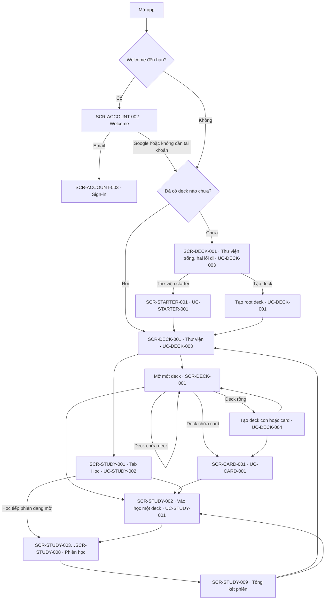

# Điều hướng toàn app

Điều hướng ở cấp app: shell và các tab, hành vi Back, deep link, guard, và các tuyến do hệ thống
mở. Một cạnh bắt đầu từ một control của màn hình **không** viết ở đây: nó là dòng `Navigate to:`
trong screen spec của màn đó (`docs/screens/spec/`), và đồ thị đầy đủ được sinh ở
[`_generated/navigation-graph.md`](_generated/navigation-graph.md). Route của từng màn nằm ở
[`screens/SCREEN_CATALOG.md`](screens/SCREEN_CATALOG.md). Tài liệu này chỉ dùng ID của màn (SCR) và
use case (UC); khi nó lệch với một UC hay một screen spec, UC và screen spec thắng.

## Root navigation

App có một root navigator. Bên trong nó là shell bốn tab; mỗi tab giữ stack riêng của mình.

- **Dưới shell** (giữ thanh tab): các cấp Thư viện SCR-DECK-001 và SCR-CARD-001, SCR-CARD-002,
  SCR-CARD-003, SCR-CARD-004, SCR-SRS-001, SCR-SEARCH-001, SCR-STUDY-002 (tab Thư viện);
  SCR-STUDY-001 (tab Học); SCR-PROGRESS-001 ở cả hai cấp (tab Tiến độ); SCR-SETTINGS-002 (tab Cài
  đặt).
- **Trên root navigator** (che shell, không có thanh tab): SCR-TRASH-001, SCR-STARTER-001,
  SCR-TAG-001, SCR-TRANSFER-001 và SCR-SETTINGS-001 mở từ tab Thư viện; SCR-SETTINGS-003,
  SCR-SETTINGS-004, SCR-REMINDER-001, SCR-ACCOUNT-001, SCR-ACCOUNT-003, SCR-ACCOUNT-004,
  SCR-ACCOUNT-005, SCR-ACCOUNT-006 và SCR-MONITORING-001 mở từ tab Cài đặt.
- **Ngoài shell**: SCR-ACCOUNT-002 (Welcome) và phiên học `/study/session/:sessionId`
  (SCR-STUDY-003, SCR-STUDY-004, SCR-STUDY-005, SCR-STUDY-006, SCR-STUDY-007, SCR-STUDY-008 theo
  chế độ của phiên, rồi SCR-STUDY-009: mỗi phiên là một route, màn tổng kết nằm trong route đó). Bản build debug có
  thêm component gallery ở `/gallery`, mở từ app bar của SCR-SETTINGS-002; bản release không đăng ký
  route này.
- SCR-TRANSFER-002 không có route: đó là một sheet mở trên màn đang đứng.
- Lớp chuyển tiếp tài khoản (SCR-ACCOUNT-003) không phải route: nó nằm phía trên router, che cả app
  khi một lần đổi tài khoản, đăng xuất, xoá tài khoản hay bỏ tài khoản bị từ chối đang chạy.

## Shell and tabs

Bốn destination, thứ tự cố định: **Thư viện** (`/decks`, SCR-DECK-001) · **Học** (`/study`,
SCR-STUDY-001) · **Tiến độ** (`/progress`, SCR-PROGRESS-001) · **Cài đặt** (`/settings`,
SCR-SETTINGS-002).

- Trên điện thoại là thanh tab dưới đáy; từ chiều rộng của navigation rail trở lên (tablet, màn
  ngang) là rail chạy hết chiều cao bên trái, và nội dung của tab được đo theo phần còn lại.
- Mỗi tab giữ stack và vị trí cuộn của nó khi chuyển tab.
- Chạm lại tab đang mở đưa tab đó về màn gốc.
- Thư viện starter, Tags, Trash và tìm kiếm là luồng con của tab Thư viện, không phải tab riêng.
- Không có tab tài khoản: tài khoản nằm trong SCR-SETTINGS-002.

## Back behaviour

- **System Back và back trên app bar** làm cùng một việc: bỏ màn trên cùng của stack đang đứng.
  Một cấp deck (SCR-DECK-001) hay một cấp tiến độ (SCR-PROGRESS-001) là một trang, nên Back lùi đúng
  một cấp; breadcrumb về thẳng cấp được chọn (nếu deck đó không có trên stack, ví dụ mở từ tìm
  kiếm, nó được đẩy lên trên gốc).
- **Ở màn gốc của một tab**, system Back rời app như mọi app Android. Welcome (SCR-ACCOUNT-002) không
  có nút back; Back ở đó cũng rời app.
- **Màn mở bằng `go`** thay vì `push` thay stack của tab đích, nên Back về màn gốc của tab đó: ví dụ
  "Details" của thông báo đồng bộ trên SCR-STUDY-001 mở SCR-ACCOUNT-001 trong tab Cài đặt, và Back
  về SCR-SETTINGS-002.
- **Modal** (dialog, bottom sheet): Back, chạm scrim hay kéo xuống đóng modal và không ghi gì — trừ
  khi modal đang chạy một thao tác, khi đó nó giữ lại cho tới khi có kết quả (ví dụ sheet vai trò
  của SCR-ACCOUNT-006, dialog reset của SCR-SETTINGS-002).
- **Thay đổi chưa lưu**: màn soạn thảo (SCR-CARD-002, SCR-CARD-003) hỏi trước khi bỏ bản nháp;
  screen spec của từng màn nói chi tiết.
- **Phiên học** (SCR-STUDY-003…SCR-STUDY-008): system Back và nút đóng mở dialog thoát; dừng thì
  tới tổng kết (SCR-STUDY-009). Khi phiên đã kết thúc, Back là Xong và về deck của phiên
  (SCR-DECK-001). Phiên bị vô hiệu hay deck không còn thì app tự rời về deck, hoặc về Thư viện
  (UC-STUDY-001).
- **Lớp chuyển tiếp tài khoản** nhận Back trước router: Back chỉ lùi từ bước nhập mã về form đăng
  nhập bên trong lớp, và không làm lộ app bên dưới.

## Deep links

- Mọi route trong [`SCREEN_CATALOG.md`](screens/SCREEN_CATALOG.md) mở được trực tiếp; app khởi động
  ở `/decks` (SCR-DECK-001) khi không có đích nào khác.
- Một location không dẫn tới đâu mở màn "không tìm thấy": không có chữ lỗi kỹ thuật, và một lối duy
  nhất về Thư viện (SCR-DECK-001).
- `/decks/search?q=…` mở SCR-SEARCH-001 với từ khoá đã điền (SCR-TAG-001 dùng nó để tìm thẻ theo
  tag).
- `/settings/sign-in?mode=link|reauth&from=…` và `/settings/sign-in/code?mode=…&email=…&from=…` mở
  SCR-ACCOUNT-003 và SCR-ACCOUNT-004. Một `from` ở ngoài app (có scheme, có host, hay bắt đầu bằng
  `//`) bị bỏ qua và thay bằng đích mặc định.
- `/settings/monitoring/:logId?local=1` mở chi tiết một log còn trên thiết bị (SCR-MONITORING-001).
- `/welcome?from=…` giữ location mà Welcome đứng thay; cùng luật bỏ qua `from` ngoài app, mặc định
  là Thư viện.

## Guards

Đăng nhập là tuỳ chọn, nên router chỉ có các luật sau (chạy lại mỗi khi cờ Welcome hay trạng thái
tài khoản đổi):

- **Welcome**: trên bản build đăng nhập được, khi Welcome chưa được trả lời, mọi location mở
  SCR-ACCOUNT-002 trước, giữ location gốc trong `from`.
- **Gắn tài khoản**: thiết bị đã có tài khoản thì `/settings/sign-in` ở chế độ `link` chuyển sang
  SCR-ACCOUNT-005.
- **Trang tài khoản**: trên thiết bị ẩn danh, `/settings/account` chuyển về SCR-SETTINGS-002. Trong
  lúc khởi động hay một chuyển tiếp, không có gì bị chuyển hướng.
- **Chỉ admin**: SCR-MONITORING-001 (cả danh sách lẫn chi tiết, kể cả log trên thiết bị) và
  SCR-ACCOUNT-006 nằm sau cổng admin. Người không phải admin mở bằng deep link thấy "Only an admin
  can see this" trước khi bất cứ gì được đọc; server vẫn từ chối các lời gọi của họ. Các hàng mở
  chúng trong SCR-SETTINGS-002 chỉ hiện cho admin, và không hiện trên bản build không có server.
- **Khôi phục**: một chuyển tiếp tài khoản còn dở từ lần chạy trước được đi tiếp lúc khởi động,
  dưới lớp chuyển tiếp, trước khi app nhận thao tác.

## Boot and system routing

- **Khởi động**: theme và ngôn ngữ đã lưu được đọc trước khung hình đầu, rồi cờ Welcome. App mở ở
  SCR-DECK-001 — hoặc SCR-ACCOUNT-002 khi Welcome đến hạn. Khởi động không chờ mạng.
- **Không mở được dữ liệu**: không có màn lỗi khởi động riêng. Màn đầu tiên đọc dữ liệu hiện trạng
  thái lỗi của chính nó, nói rõ và có nút thử lại — với cold start là trạng thái `root_error` của
  SCR-DECK-001 — không bao giờ là màn trắng (UC-STARTER-001 E1).
- **Notification nhắc học**: chạm vào notification — khi app đang chạy hay khi chính nó mở app — đưa
  tới tab Học (SCR-STUDY-001); không phiên nào được mở thay cho người dùng (UC-REMINDER-001).
- **Phiên còn mở từ hôm trước** được đóng lúc khởi động trước khi bất cứ màn nào mời học tiếp nó
  (UC-STUDY-002).

## Master flows

Hành trình từ lúc mở app tới lúc vào một phiên học. Nhãn là rút gọn để đọc được; UC và screen spec
là bản gốc.

Vòng `H --> H` là cố ý: deck lồng nhiều cấp và mỗi cấp lại là "mở một deck"; SCR-DECK-001 là một màn
đệ quy, không phải hai màn cho root và cho deck con.
