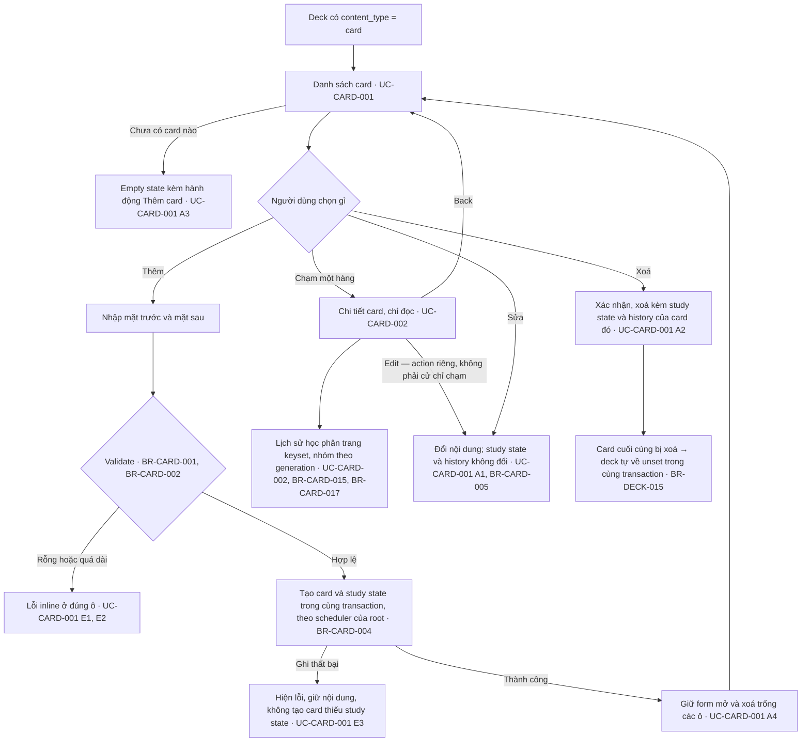

# Card — UI

Màn hình, điều hướng và validation dùng chung nhiều UC của feature. Hành vi riêng của từng UC nằm trong file UC.

## Điều hướng card

Điểm vào là một deck đã có `content_type = 'card'` (BR-DECK-009). Card **đầu tiên** của
một deck `unset` không đi qua đây — nó được tạo ở UC-DECK-004 và chính nó xác lập
`content_type`.

**`J` đổi nghĩa của một lần chạm, và đó là cạnh dễ nhớ sai thứ hai ở đây.** Chạm
một hàng ở chế độ thường mở **chi tiết chỉ đọc**, không mở editor; đường tới
`H` đi qua một action `Edit` tường minh. Trong chế độ chọn nhiều thì chạm vẫn
chỉ là chọn/bỏ chọn và **không** có đường nào tới `J` (BR-CARD-020).

**`I1` là cạnh dễ vẽ sai nhất trong tài liệu này.** Xoá hết card **không** đưa
deck về `unset`; muốn đổi loại phải qua nhánh `H` ở mục 3, và đó là một hành động
do hệ thống tự duy trì cùng mutation direct children (BR-DECK-015).

**Card cũng mang cờ, tag và ba trường phụ (BR-CARD-009, BR-TAG-001, BR-TAG-002, BR-CARD-003), theo cùng luồng
Thêm/Sửa ở trên.**

> ⚠️ OPEN QUESTION: đoạn giải thích `I1` nói "Xoá hết card **không** đưa deck về `unset`", nhưng chính nút `I1` của sơ đồ và BR-DECK-015 nói card cuối bị xoá thì deck tự về `unset` trong cùng transaction. Nguồn: `product/master-flow.md` §4. (Plan OQ-17)

## Validation

| Trường | Rule | Message hiển thị | Enforced by |
|---|---|---|---|
| Card.front | không rỗng sau trim | "Mặt trước không được để trống" | rule |
| Card.back | không rỗng sau trim | "Mặt sau không được để trống" | rule |
| Card.front | ≤ 60 ký tự (BR-CARD-002) | "Mặt trước tối đa 60 ký tự" | rule |
| Card.back | ≤ 240 ký tự (BR-CARD-002) | "Mặt sau tối đa 240 ký tự" | rule |
| Card.example / hint / pronunciation | ≤ 240 ký tự (BR-CARD-003) | "Tối đa 240 ký tự" | rule |

Toàn bộ enforce ở tầng nghiệp vụ vì chưa có server. Khi có backend, server validate lại — client validation là trải nghiệm, không phải bảo mật.

> ⚠️ OPEN QUESTION: 2 dòng validation trên không trích BR nào trong nguồn: `Card.front` không rỗng sau trim; `Card.back` không rỗng sau trim. (Plan Q5)

## Edge case chưa gắn BR

| Case | Expected behaviour |
|---|---|
| Nội dung card rất dài (2000 ký tự) | Cuộn được trong vùng card, không tràn, không cắt mất |

> ⚠️ OPEN QUESTION: 1 dòng edge case trên không trích BR nào trong nguồn. (Plan Q5)

> ⚠️ OPEN QUESTION: dòng "Nội dung card rất dài (2000 ký tự)" dùng giới hạn 2000 cũ; BR-CARD-002 hiện giới hạn mặt trước 60 và mặt sau 240 ký tự (lý do đổi số ghi ở BR-CARD-002). Nguồn: `business-rules/card.md` mục Edge cases. (Plan OQ-18)
