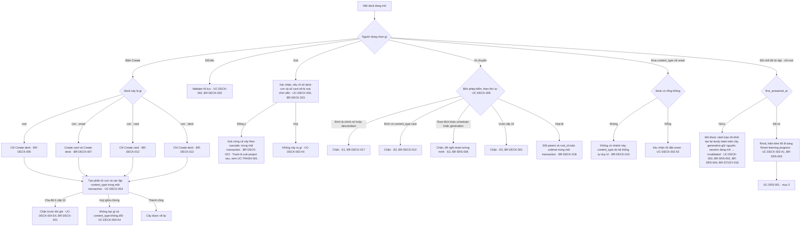

# Deck — UI

Màn hình, điều hướng và validation dùng chung nhiều UC của feature deck. Hành vi
riêng của từng UC nằm trong file UC.

## Điều hướng trên cây deck

Mọi thao tác trên cây deck. Điểm vào là một deck bất kỳ đang mở.

**Nhánh `I` là chỗ hai đối tượng gặp nhau.** Chế độ ôn tập là thuộc tính của deck
nhưng bị khoá bởi một sự kiện của review, nên đường thoát duy nhất khi đã khoá
nằm ở mục 5. Ẩn nó đi thay vì hiện trạng thái khoá là điều BR-SRS-003 cấm.

**`I1` và `I3` là hai thao tác, không phải một thao tác với hai cách gọi.** Cả hai
ghi scheduler và khởi tạo lại toàn cây; chỉ `I3` tiêu một generation, vì chỉ nó
vứt đi một chu kỳ học. Cho `I1` chạy qua Reset sẽ đánh số lịch sử rỗng thành "đã
bị thay thế" và bắt người dùng xác nhận một cảnh báo phá huỷ về thứ không tồn tại
(BR-SRS-002, UC-DECK-002).

**Ai đặt khoá ở `I`:** chính lần một thẻ hoàn tất chuỗi học mới, trong cùng
transaction với lần hoàn tất đó (mục 5, bước 10–11 của UC-STUDY-001; BR-SRS-003, BR-STUDY-053).
Không thao tác nào của deck ghi cột này.

> ⚠️ OPEN QUESTION: nhánh `H` của sơ đồ ("Đưa content_type về unset" → "Rỗng → Xác nhận rồi đặt unset · UC-DECK-002 A3") mâu thuẫn với BR-DECK-015 ("Người dùng MUST NOT có thao tác reset `content_type` thủ công"); BR-DECK-014 cho phép thao tác đó đã deprecated. Ngoài ra UC-DECK-002 A3 là "Huỷ xác nhận xoá" và A4 là "Xác nhận đúng chế độ deck đang chạy", nhưng sơ đồ gắn nhãn huỷ xoá (`F2`) là A4 và reset thủ công (`H2`) là A3. Nguồn: `product/master-flow.md` §3 · `business-rules/deck.md` BR-DECK-014, BR-DECK-015 · `use-cases/deck.md` UC-DECK-002. (Plan OQ-15)

## Validation

| Trường | Rule | Message hiển thị | Enforced by |
|---|---|---|---|
| Deck.name | không rỗng sau trim | "Tên deck không được để trống" | rule |
| Deck.name | ≤ 200 ký tự | "Tên deck tối đa 200 ký tự" | rule |
| Deck.move | đích không phải chính nó hoặc descendant | "Không thể di chuyển deck vào chính nó" | rule |
| Deck.create (sub-deck) | cấp của deck mới ≤ 10 (BR-DECK-001) | "Deck đã ở độ sâu tối đa (10 cấp)" | store |
| Deck.move | cấp đích + chiều cao subtree nguồn ≤ 10 (BR-DECK-001) | "Di chuyển vào đây sẽ vượt độ sâu tối đa (10 cấp)" | store |

Toàn bộ enforce ở tầng nghiệp vụ vì chưa có server. Khi có backend, server validate lại — client validation là trải nghiệm, không phải bảo mật.

> ⚠️ OPEN QUESTION: ba dòng `Deck.name` (không rỗng, ≤ 200 ký tự) và `Deck.move` (đích không phải chính nó hoặc descendant) không trích BR nào trong nguồn; nội dung trùng ý với BR-DECK-020 và BR-DECK-017 nhưng nguồn không gắn. (Plan Q5)

## Edge case chưa gắn BR

| Case | Expected behaviour |
|---|---|
| Deck rỗng (0 card) | Empty state với hành động phù hợp `content_type`; không vào được phiên nào |

> ⚠️ OPEN QUESTION: dòng edge case trên không trích BR nào trong nguồn (`business-rules/deck.md` mục Edge cases). (Plan Q5)
