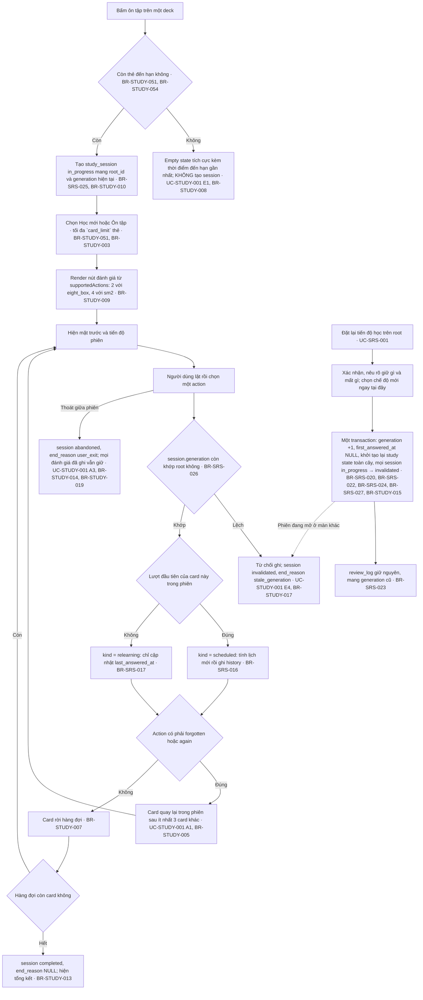

# Study session — UI

Màn hình, điều hướng và validation dùng chung nhiều UC của feature. Hành vi riêng của từng UC nằm trong file UC.

## Điều hướng phiên học và ôn tập

Hai UC dùng chung một đối tượng: phiên ôn tập (UC-STUDY-001) và việc đặt lại tiến độ học
(UC-SRS-001). Chúng nằm chung mục vì generation là thứ nối chúng — và là thứ khiến một
phiên đang mở có thể bị vô hiệu hoá từ màn khác.

**Cạnh nét đứt `T -.-> H1` là lý do hai UC này ở chung một mục.** Reset chạy ở màn
hình A làm mọi phiên đang mở ở màn hình B hết hiệu lực; người dùng ở B chỉ biết
điều đó khi bấm đánh giá lần tiếp theo. Đọc riêng UC-STUDY-001 hoặc riêng UC-SRS-001 đều không
thấy được cạnh này.
