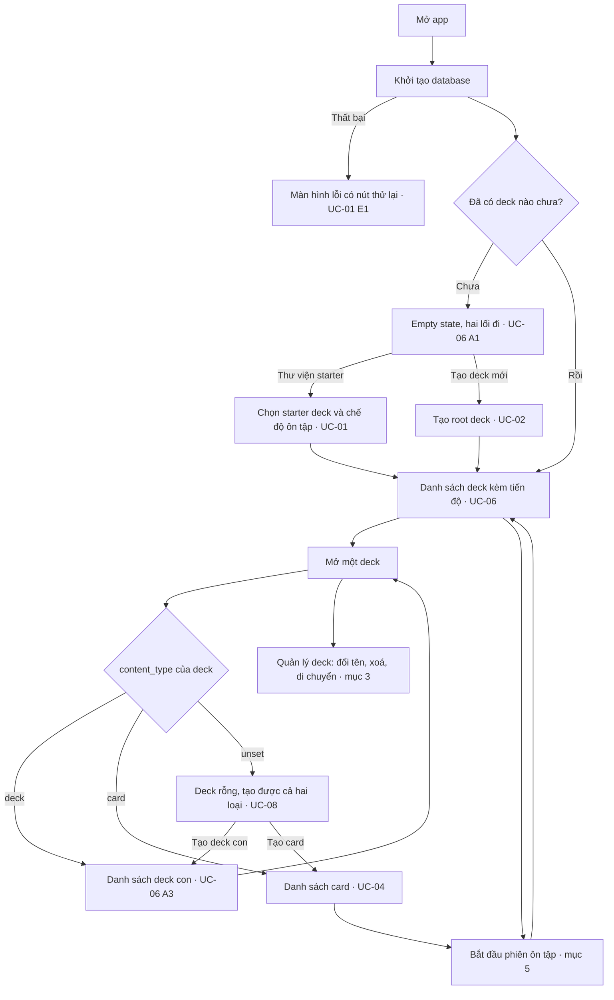
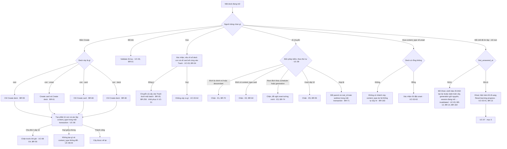
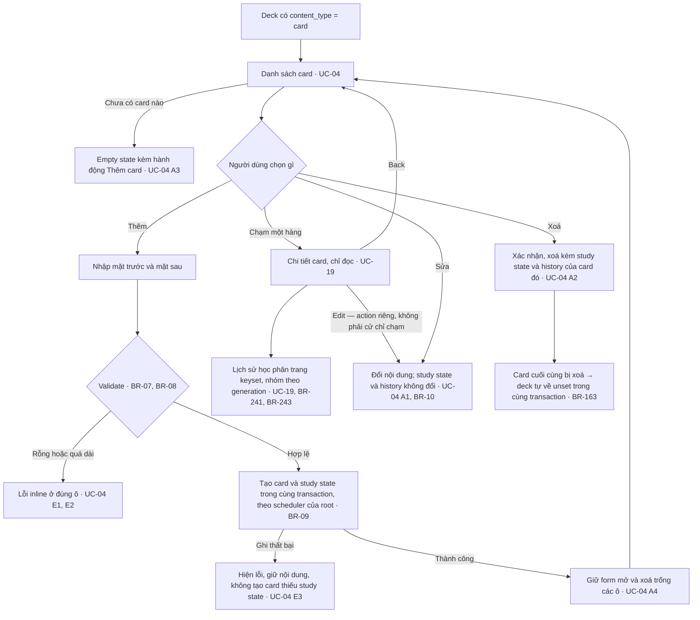
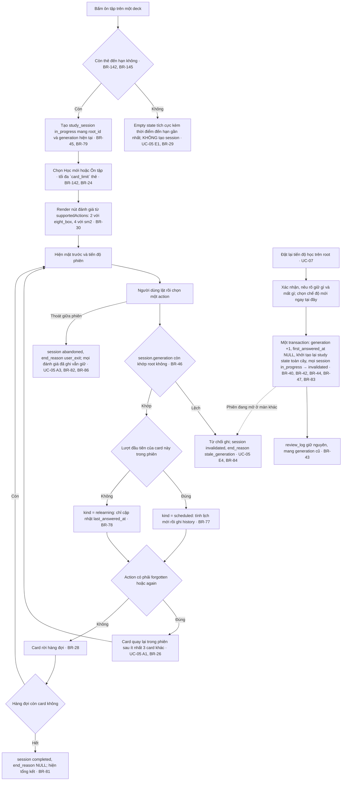

# Master flow — memox (MVP)

| | |
|---|---|
| **Status** | active |
| **Purpose** | Cho thấy các use case nối vào nhau thành hành trình nào, thứ mà đọc từng UC riêng lẻ không thấy được |
| **Scope** | Đồ thị chuyển tiếp giữa UC-01…UC-20 và phân loại UC-01…UC-22 theo đối tượng nghiệp vụ. Ngoài phạm vi: nội dung của từng UC, mọi luật nghiệp vụ, và mọi chi tiết màn hình |
| **Source of truth for** | Đồ thị chuyển tiếp giữa các UC · điểm vào của từng luồng · đối tượng nghiệp vụ của từng UC |
| **Depends on** | `document-conventions.md`, `product.md`, `business-rules.md`, `use-cases.md` |
| **Updated by** | `docs/superpowers/plans/2026-09-23-docs-v8-reset.md` — V8 reset: gỡ trạng thái triển khai và tham chiếu V7 |
| **Last updated** | 2026-09-23 |

---

## 1. Tài liệu này là gì, và không là gì

`use-cases.md` đặc tả **từng** UC đầy đủ chín mục. Nó cố ý không vẽ đồ thị nối
chúng lại, nên câu "sau khi tạo deck xong thì người dùng đi đâu" không có chỗ nào
trả lời — mỗi UC tự mô tả mình và im lặng về những UC bên cạnh.

Tài liệu này chỉ giữ **các cạnh của đồ thị đó**. Mọi đỉnh đều trỏ về một UC hoặc
một BR bằng ID.

**MUST NOT** đọc sơ đồ ở đây như một đặc tả. Theo `document-conventions.md` §5,
luật nghiệp vụ sống ở `business-rules.md` và luồng sống ở `use-cases.md`; nhãn
trong sơ đồ là **rút gọn để đọc được**, không phải bản gốc. Khi sơ đồ và UC/BR
mâu thuẫn, **UC/BR thắng**, và sơ đồ sai là một defect phải sửa.

**Tách theo đối tượng, không theo hành động.** Mục 3–5 chia theo *deck*, *card*,
*review* — không có mục riêng cho "tạo deck" hay "xoá deck". Một tài liệu cho mỗi
hành động sẽ nhân số file theo số nút bấm, và phần lớn chúng sẽ chỉ có một sơ đồ
ba đỉnh.

---

## 2. Master flow — toàn app

Hành trình từ lúc mở app tới lúc vào được một phiên ôn tập. Nhánh nào đi sâu vào
một đối tượng thì dừng ở đó và tiếp tục ở mục tương ứng.

**`J --> H` là vòng lặp cố ý.** Deck lồng tới 10 cấp (BR-55) và một cấp bất kỳ
lại là "mở một deck" của cấp trên nó; màn hình là **một** màn đệ quy chứ không
phải hai màn khác nhau cho root và cho deck con.

---

## 3. Deck

Mọi thao tác trên cây deck. Điểm vào là một deck bất kỳ đang mở.

**Nhánh `I` là chỗ hai đối tượng gặp nhau.** Chế độ ôn tập là thuộc tính của deck
nhưng bị khoá bởi một sự kiện của review, nên đường thoát duy nhất khi đã khoá
nằm ở mục 5. Ẩn nó đi thay vì hiện trạng thái khoá là điều BR-13 cấm.

**`I1` và `I3` là hai thao tác, không phải một thao tác với hai cách gọi.** Cả hai
ghi scheduler và khởi tạo lại toàn cây; chỉ `I3` tiêu một generation, vì chỉ nó
vứt đi một chu kỳ học. Cho `I1` chạy qua Reset sẽ đánh số lịch sử rỗng thành "đã
bị thay thế" và bắt người dùng xác nhận một cảnh báo phá huỷ về thứ không tồn tại
(BR-12, UC-03).

**Ai đặt khoá ở `I`:** chính lần một thẻ hoàn tất chuỗi học mới, trong cùng
transaction với lần hoàn tất đó (mục 5, bước 10–11 của UC-05; BR-13, BR-144).
Không thao tác nào của deck ghi cột này.

---

## 4. Card

Điểm vào là một deck đã có `content_type = 'card'` (BR-63). Card **đầu tiên** của
một deck `unset` không đi qua đây — nó được tạo ở UC-08 và chính nó xác lập
`content_type`.

**`J` đổi nghĩa của một lần chạm, và đó là cạnh dễ nhớ sai thứ hai ở đây.** Chạm
một hàng ở chế độ thường mở **chi tiết chỉ đọc**, không mở editor; đường tới
`H` đi qua một action `Edit` tường minh. Trong chế độ chọn nhiều thì chạm vẫn
chỉ là chọn/bỏ chọn và **không** có đường nào tới `J` (BR-246).

**`I1` là cạnh dễ vẽ sai nhất trong tài liệu này.** Xoá hết card **không** đưa
deck về `unset`; muốn đổi loại phải qua nhánh `H` ở mục 3, và đó là một hành động
do hệ thống tự duy trì cùng mutation direct children (BR-163).

**Card cũng mang cờ, tag và ba trường phụ (BR-92…BR-95), theo cùng luồng
Thêm/Sửa ở trên.**

---

## 5. Review

Hai UC dùng chung một đối tượng: phiên ôn tập (UC-05) và việc đặt lại tiến độ học
(UC-07). Chúng nằm chung mục vì generation là thứ nối chúng — và là thứ khiến một
phiên đang mở có thể bị vô hiệu hoá từ màn khác.

**Cạnh nét đứt `T -.-> H1` là lý do hai UC này ở chung một mục.** Reset chạy ở màn
hình A làm mọi phiên đang mở ở màn hình B hết hiệu lực; người dùng ở B chỉ biết
điều đó khi bấm đánh giá lần tiếp theo. Đọc riêng UC-05 hoặc riêng UC-07 đều không
thấy được cạnh này.

---

## 6. UC theo đối tượng nghiệp vụ

Phân loại 22 UC theo đối tượng nghiệp vụ. Mục 2–5 chỉ vẽ sơ đồ cho UC-01…UC-09,
UC-19 và UC-21; bảng dưới đây phủ toàn bộ, kể cả UC-10…UC-18, UC-20 và UC-22
vốn không có sơ đồ riêng trong tài liệu này.

| UC | Đối tượng |
|---|---|
| UC-01 | deck |
| UC-02 | deck |
| UC-03 | deck |
| UC-04 | card |
| UC-05 | review |
| UC-06 | deck |
| UC-07 | review |
| UC-08 | deck |
| UC-09 | deck |
| UC-10 | card |
| UC-11 | card |
| UC-12 | progress |
| UC-13 | progress |
| UC-14 | review |
| UC-15 | review |
| UC-16 | settings |
| UC-17 | settings |
| UC-18 | card |
| UC-19 | card |
| UC-20 | search |
| UC-21 | trash |
| UC-22 | deck |
