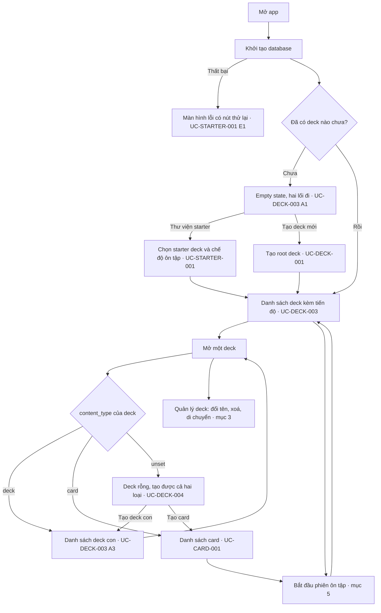

# Điều hướng toàn app

Điều hướng và hành trình dùng chung toàn app. Sơ đồ điều hướng riêng của từng
feature nằm ở `ui.md` của feature đó: [deck](../../features/deck/ui.md),
[card](../../features/card/ui.md), [study](../../features/study/ui.md).

## Điều hướng top-level

App dùng đúng **bốn** destination ở bottom navigation, thứ tự cố định:
**Thư viện (Library) · Học (Study) · Tiến độ (Progress) · Cài đặt (Settings)**.
Nhãn tab đầu là "Thư viện" — cả cây deck, thẻ bên trong và luồng starter —
trong khi branch nội bộ và màn hình gốc của nó vẫn là Decks.

- Cold start mở Decks (UC-DECK-003).
- **Progress** (UC-PROGRESS-001, UC-PROGRESS-002): streak, hôm nay và bảy ngày gần nhất đọc từ
  lịch sử học thật, rồi bên dưới là hai khoảng 7/30 ngày, bảng tổng và một
  hàng cho mỗi deck với drill-down xuống từng cấp. **Settings** (UC-SETTINGS-001,
  BR-SETTINGS-001…BR-SETTINGS-008): mặc định học, theme và ngôn ngữ; nhắc học hằng ngày (UC-REMINDER-001)
  nằm trong branch Settings.
- Thư viện starter (M6) là child flow bên trong tab Thư viện (branch Decks), không phải tab riêng.
- Không có tab Profile chừng nào chưa có auth/profile domain — nhất quán với
  "Đăng nhập / tài khoản" ở Explicitly out of MVP.

> ⚠️ OPEN QUESTION: `superpowers/specs/2026-09-21-memox-v8-foundation-design.md` §10 liệt kê "Top-level navigation destinations, progress screen content" là câu hỏi mở của product definition (sub-project 2), trong khi mục trên đã chốt bốn destination. (Plan OQ-3)

## Primary business flows

1. **Tạo nội dung**: mở app → tạo deck → thêm card → deck xuất hiện trong danh
   sách với số card đến hạn.
2. **Ôn tập** (luồng chính, chạy hằng ngày): mở app → thấy deck có card đến hạn
   → vào phiên ôn → xem mặt trước → lật → tự đánh giá → card được xếp lịch lại →
   hết card đến hạn → tổng kết phiên.

Luồng 2 là vertical slice đầu tiên nên xây, vì nó chạm vào toàn bộ chiều sâu
kiến trúc: Drift query có index theo hạn ôn, business logic SRS thuần Dart tách
khỏi UI, state matrix đầy đủ ở màn hình (kể cả empty — "hôm nay không còn gì để
ôn", là trạng thái người dùng gặp thường xuyên nhất sau vài tuần).

## Sơ đồ là gì, và không là gì

`../use-cases/` đặc tả **từng** UC đầy đủ chín mục. Nó cố ý không vẽ đồ thị nối
chúng lại, nên câu "sau khi tạo deck xong thì người dùng đi đâu" không có chỗ nào
trả lời — mỗi UC tự mô tả mình và im lặng về những UC bên cạnh.

Tài liệu này chỉ giữ **các cạnh của đồ thị đó**. Mọi đỉnh đều trỏ về một UC hoặc
một BR bằng ID.

**MUST NOT** đọc sơ đồ ở đây như một đặc tả. Theo `../document-conventions.md` §5,
luật nghiệp vụ sống ở `../business-rules/` và luồng sống ở `../use-cases/`; nhãn
trong sơ đồ là **rút gọn để đọc được**, không phải bản gốc. Khi sơ đồ và UC/BR
mâu thuẫn, **UC/BR thắng**, và sơ đồ sai là một defect phải sửa.

**Tách theo đối tượng, không theo hành động.** Mục 3–5 chia theo *deck*, *card*,
*review* — không có mục riêng cho "tạo deck" hay "xoá deck". Một tài liệu cho mỗi
hành động sẽ nhân số file theo số nút bấm, và phần lớn chúng sẽ chỉ có một sơ đồ
ba đỉnh.

## Master flow — toàn app

Hành trình từ lúc mở app tới lúc vào được một phiên ôn tập. Nhánh nào đi sâu vào
một đối tượng thì dừng ở đó và tiếp tục ở mục tương ứng.

**`J --> H` là vòng lặp cố ý.** Deck lồng tới 10 cấp (BR-DECK-001) và một cấp bất kỳ
lại là "mở một deck" của cấp trên nó; màn hình là **một** màn đệ quy chứ không
phải hai màn khác nhau cho root và cho deck con.

## UC theo đối tượng nghiệp vụ

Phân loại 22 UC theo đối tượng nghiệp vụ. Mục 2–5 chỉ vẽ sơ đồ cho các UC quanh deck, card, review và Trash (mục 2–5); bảng dưới đây phủ toàn bộ 22 UC, kể cả những UC
vốn không có sơ đồ riêng trong tài liệu này.

| UC | Đối tượng |
|---|---|
| UC-STARTER-001 | deck |
| UC-DECK-001 | deck |
| UC-DECK-002 | deck |
| UC-CARD-001 | card |
| UC-STUDY-001 | review |
| UC-DECK-003 | deck |
| UC-SRS-001 | review |
| UC-DECK-004 | deck |
| UC-DECK-005 | deck |
| UC-TRANSFER-001 | card |
| UC-TRANSFER-002 | card |
| UC-PROGRESS-001 | progress |
| UC-PROGRESS-002 | progress |
| UC-STUDY-002 | review |
| UC-STUDY-003 | review |
| UC-SETTINGS-001 | settings |
| UC-REMINDER-001 | settings |
| UC-TAG-001 | card |
| UC-CARD-002 | card |
| UC-SEARCH-001 | search |
| UC-TRASH-001 | trash |
| UC-DECK-006 | deck |
