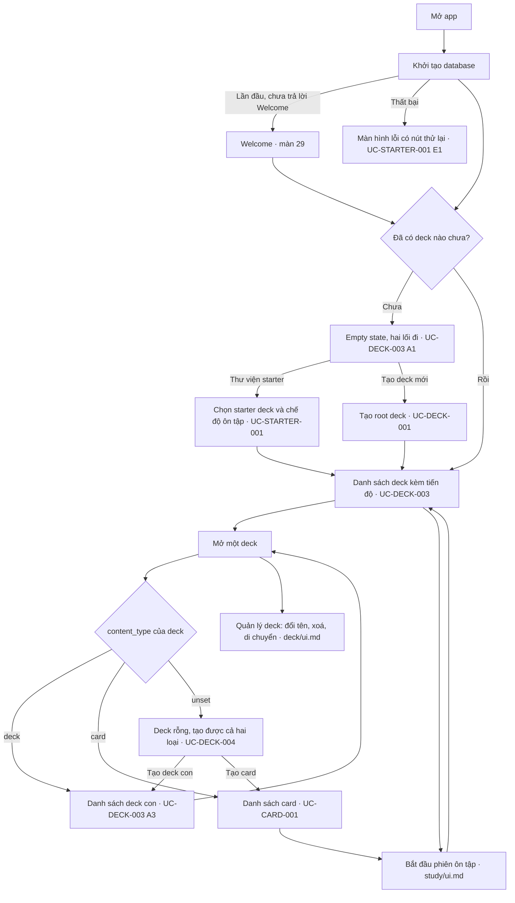

# Điều hướng toàn app

Điều hướng và hành trình dùng chung toàn app. Sơ đồ điều hướng riêng của từng
feature nằm ở `ui.md` của feature đó: [deck](../../features/deck/ui.md),
[card](../../features/card/ui.md), [study](../../features/study/ui.md).

## Điều hướng top-level

App dùng đúng **bốn** destination ở bottom navigation, thứ tự cố định:
**Thư viện (Library) · Học (Study) · Tiến độ (Progress) · Cài đặt (Settings)**.
Nhãn tab đầu là "Thư viện" — cả cây deck, thẻ bên trong và luồng starter —
trong khi branch nội bộ và màn hình gốc của nó vẫn là Decks.

- Cold start mở Decks (UC-DECK-003).
- **Progress** (UC-PROGRESS-001, UC-PROGRESS-002): streak, hôm nay và bảy ngày gần nhất đọc từ
  lịch sử học thật, rồi bên dưới là hai khoảng 7/30 ngày, bảng tổng và một
  hàng cho mỗi deck với drill-down xuống từng cấp. **Settings** (UC-SETTINGS-001,
  BR-SETTINGS-001…BR-SETTINGS-010): tab là một hub (màn 23) chỉ gồm các hàng điều hướng; mặc
  định học ở màn 23a (`/settings/study`), các công cụ admin ở màn 23b (`/settings/admin`, chỉ
  admin thấy); theme và ngôn ngữ có trang riêng; nhắc học hằng ngày (UC-REMINDER-001)
  nằm trong branch Settings: màn 24 ở `/settings/reminder`, trên root navigator như Theme
  và Language, Back về màn 23.
- Thư viện starter (M6) là child flow bên trong tab Thư viện (branch Decks), không phải tab riêng.
- Tài khoản không có tab riêng; mọi màn của nó nằm trong branch Settings, trên root
  navigator: đồng bộ (màn 27, `/settings/sync`), đăng nhập và mã (màn 30–31,
  `/settings/sign-in`), tài khoản (màn 32, `/settings/account`), và hai màn chỉ admin
  thấy: Users (màn 33, `/settings/users`) và Monitoring (màn 28, `/settings/monitoring`).
- Đăng nhập là tuỳ chọn. Redirect duy nhất về tài khoản (`lib/app/router/account_redirect.dart`):
  Welcome (màn 29, `/welcome`) mở trước mọi màn cho tới khi được trả lời, rồi đưa người
  dùng về đúng chỗ đã mở; máy đã có tài khoản không vào luồng gắn tài khoản mà sang
  màn 32; máy ẩn danh không mở được màn 32.

## Primary business flows

1. **Tạo nội dung**: mở app → tạo deck → thêm card → deck xuất hiện trong danh
   sách với số card đến hạn.
2. **Ôn tập** (luồng chính, chạy hằng ngày): mở app → thấy deck có card đến hạn
   → vào phiên ôn → xem mặt trước → lật → tự đánh giá → card được xếp lịch lại →
   hết card đến hạn → tổng kết phiên.

Luồng 2 là vertical slice đầu tiên nên xây, vì nó chạm vào toàn bộ chiều sâu
kiến trúc: Drift query có index theo hạn ôn, business logic SRS thuần Dart tách
khỏi UI, state matrix đầy đủ ở màn hình (kể cả empty — "hôm nay không còn gì để
ôn", là trạng thái người dùng gặp thường xuyên nhất sau vài tuần).

## Sơ đồ là gì, và không là gì

`features/*/usecases/` đặc tả **từng** UC. Nó cố ý không vẽ đồ thị nối
chúng lại, nên câu "sau khi tạo deck xong thì người dùng đi đâu" không có chỗ nào
trả lời — mỗi UC tự mô tả mình và im lặng về những UC bên cạnh.

Tài liệu này chỉ giữ **các cạnh của đồ thị đó**. Mọi đỉnh đều trỏ về một UC hoặc
một BR bằng ID.

**MUST NOT** đọc sơ đồ ở đây như một đặc tả. Theo mục "X viết ở đâu" của [`README.md`](../../README.md),
luật nghiệp vụ sống ở `features/*/rules/` và luồng sống ở `features/*/usecases/`; nhãn
trong sơ đồ là **rút gọn để đọc được**, không phải bản gốc. Khi sơ đồ và UC/BR
mâu thuẫn, **UC/BR thắng**, và sơ đồ sai là một defect phải sửa.

**Tách theo đối tượng, không theo hành động.** Sơ đồ chia theo *deck*, *card*,
*review* — không có mục riêng cho "tạo deck" hay "xoá deck". Một tài liệu cho mỗi
hành động sẽ nhân số file theo số nút bấm, và phần lớn chúng sẽ chỉ có một sơ đồ
ba đỉnh.

## Master flow — toàn app

Hành trình từ lúc mở app tới lúc vào được một phiên ôn tập. Nhánh nào đi sâu vào
một đối tượng thì dừng ở đó và tiếp tục ở `ui.md` của feature đó.

```mermaid
flowchart TD
    A["Mở app"] --> B["Khởi tạo database"]
    B -->|"Lần đầu, chưa trả lời Welcome"| W["Welcome · màn 29"]
    W --> C
    B -->|"Thất bại"| B1["Màn hình lỗi có nút thử lại · UC-STARTER-001 E1"]
    B --> C{"Đã có deck nào chưa?"}

    C -->|"Chưa"| D["Empty state, hai lối đi · UC-DECK-003 A1"]
    D -->|"Thư viện starter"| E["Chọn starter deck và chế độ ôn tập · UC-STARTER-001"]
    D -->|"Tạo deck mới"| F["Tạo root deck · UC-DECK-001"]

    C -->|"Rồi"| G["Danh sách deck kèm tiến độ · UC-DECK-003"]
    E --> G
    F --> G

    G --> H["Mở một deck"]
    H --> I{"content_type của deck"}
    I -->|"deck"| J["Danh sách deck con · UC-DECK-003 A3"]
    I -->|"card"| K["Danh sách card · UC-CARD-001"]
    I -->|"unset"| L["Deck rỗng, tạo được cả hai loại · UC-DECK-004"]

    J --> H
    L -->|"Tạo deck con"| J
    L -->|"Tạo card"| K

    H --> M["Quản lý deck: đổi tên, xoá, di chuyển · deck/ui.md"]
    G --> N["Bắt đầu phiên ôn tập · study/ui.md"]
    K --> N
    N --> G
```

**`J --> H` là vòng lặp cố ý.** Deck lồng tới 10 cấp (BR-DECK-001) và một cấp bất kỳ
lại là "mở một deck" của cấp trên nó; màn hình là **một** màn đệ quy chứ không
phải hai màn khác nhau cho root và cho deck con.

## UC theo đối tượng nghiệp vụ

Phân loại 22 UC theo đối tượng nghiệp vụ. Sơ đồ riêng chỉ có cho deck, card và
review (`ui.md` của từng feature); bảng dưới đây phủ toàn bộ 22 UC.

| UC | Đối tượng |
|---|---|
| UC-STARTER-001 | deck |
| UC-DECK-001 | deck |
| UC-DECK-002 | deck |
| UC-CARD-001 | card |
| UC-STUDY-001 | review |
| UC-DECK-003 | deck |
| UC-SRS-001 | review |
| UC-DECK-004 | deck |
| UC-DECK-005 | deck |
| UC-TRANSFER-001 | card |
| UC-TRANSFER-002 | card |
| UC-PROGRESS-001 | progress |
| UC-PROGRESS-002 | progress |
| UC-STUDY-002 | review |
| UC-STUDY-003 | review |
| UC-SETTINGS-001 | settings |
| UC-REMINDER-001 | settings |
| UC-TAG-001 | card |
| UC-CARD-002 | card |
| UC-SEARCH-001 | search |
| UC-TRASH-001 | trash |
| UC-DECK-006 | deck |
