<!-- Hand-written screen handoff. Not generated by tools/docs/split_handoff.py. -->

# 02 · Review algorithm & reset

`/decks/deck/:deckId/algorithm`, root decks only (BR-DECK-025). Replaces the scheduler
sheet. UC-DECK-002 (change scheduler), UC-SRS-001 (reset learning progress).

## Layout

| Region | Widget | Design |
|---|---|---|
| App bar, breadcrumb | `MxAppBar`, `MxBreadcrumb` | Back, "Review algorithm"; Library › root › Review algorithm. |
| Lock strip | `MxCard` + `MxIconTile` | Unlocked: hero ground, open lock on primary, "Can still be changed" / "Locks once the first card finishes learning." Locked: warning-soft ground, lock on warning, "Locked · cycle {n}" / "The first card finished learning on {date}. Only a reset opens a new cycle." The lock is named in words, not colour alone. |
| ALGORITHM | `MxListSectionHeader`, `MxCard` of two `MxOptionRow`s | The current algorithm selected; both disabled when locked. |
| Note | `MxNote` | Unlocked: "Switching re-initialises every card's schedule in this tree and closes any open study session. Choosing the current algorithm changes nothing." Locked (lock icon): "To change the algorithm now, reset learning progress below and choose the algorithm for the new cycle." |
| START OVER | `MxListSectionHeader`, `MxCard`, `MxButton` (outline) | "Reset learning progress" / "Every card in this tree becomes new and a new cycle begins. You choose the algorithm for it. Decks, cards, tags and past history are kept." / "Reset learning progress…". |

Algorithm descriptions:

- **Eight boxes:** "Remembered → one box up (1 · 2 · 4 · 8 · 16 · 32 · 64 · 128 days). Forgotten → back to box 1. Forgiving of long breaks. Review modes: match, guess, recall, fill."
- **SM-2:** "Intervals adapt to how well you recall each card; you grade yourself again · hard · good · easy. One review mode: self-assess."

## States

| State | Light | Dark | V8 |
|---|---|---|---|
| locked | 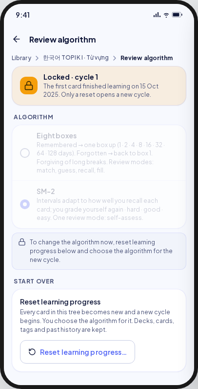 | 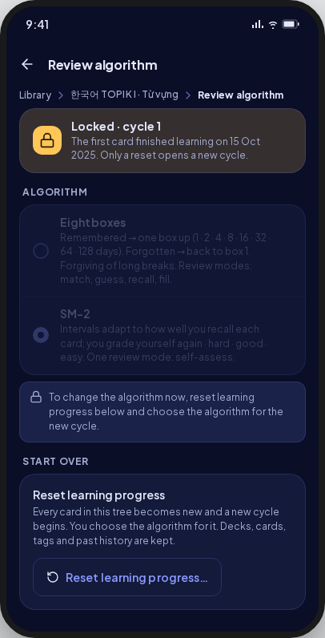 | As drawn; date from `firstAnsweredAt`, local time. |
| unlocked | 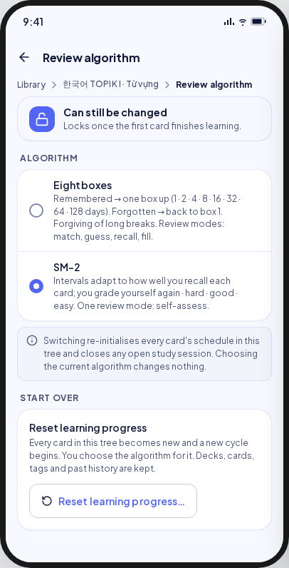 | 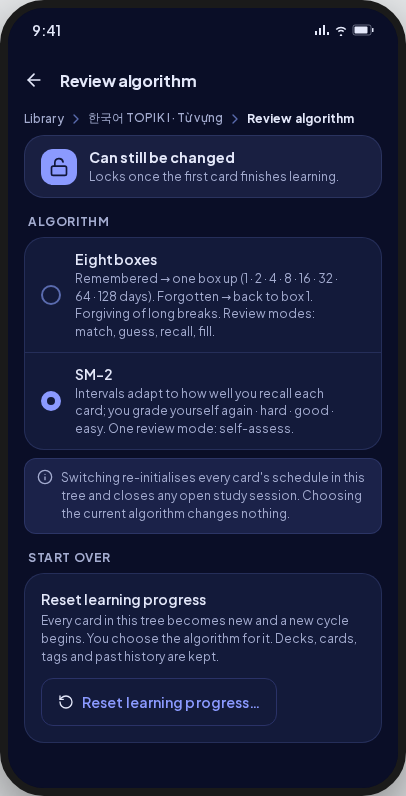 | As drawn. |
| switching | 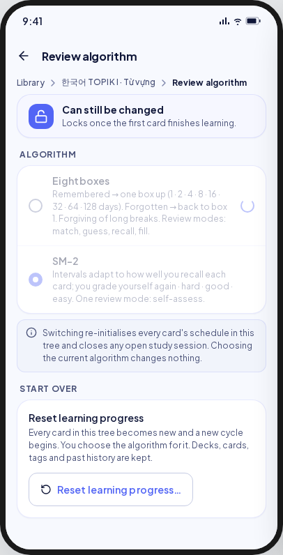 | 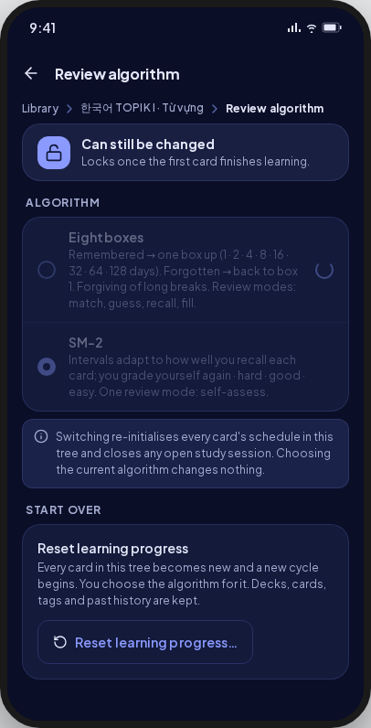 | Reached **after** the confirmation dialog (deviation). |
| switched | 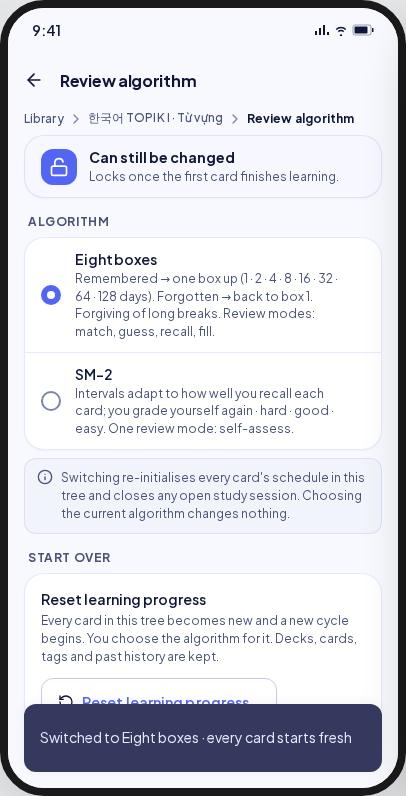 | 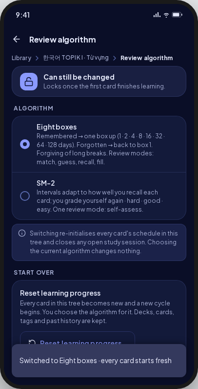 | Snackbar "Switched to {algorithm} · every card starts fresh". |
| switchFailed | 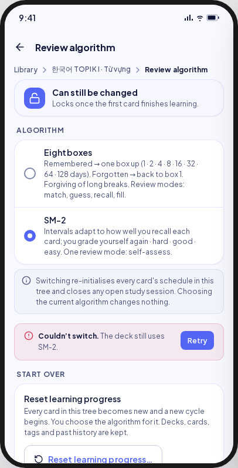 | 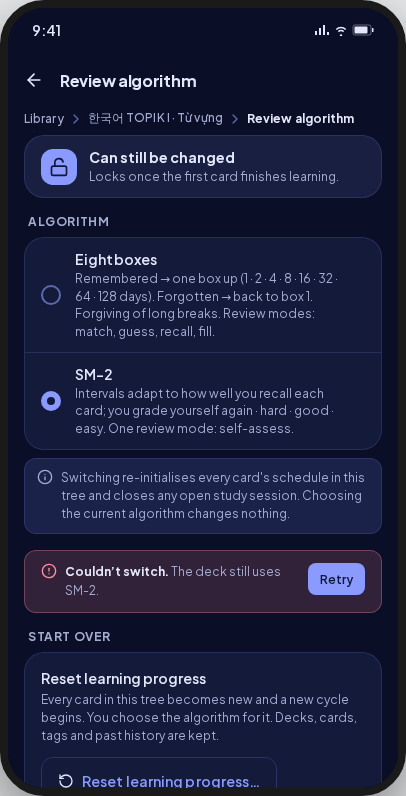 | Danger banner with Retry (UC-DECK-002 E2). |
| resetConfirm | 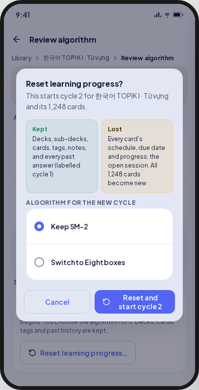 | 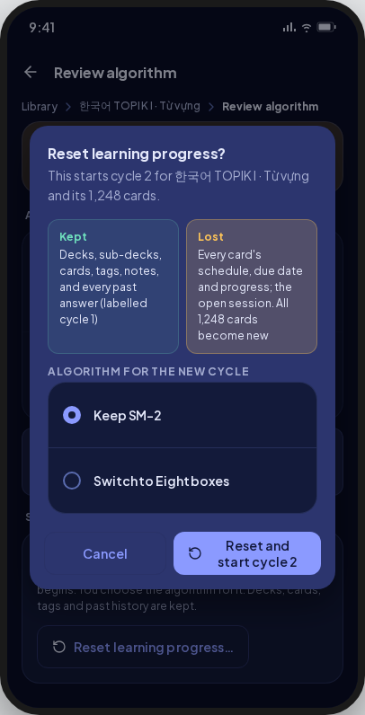 | "Kept" in `statusMasteredInk` (spec A10); "the open session" only when a session is open. |
| resetting | 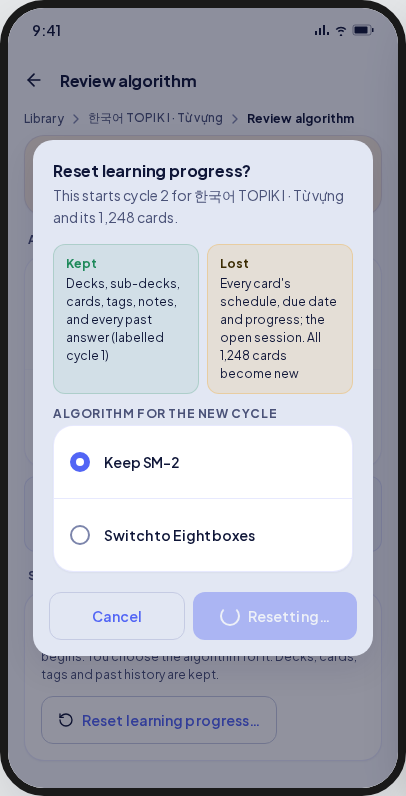 | 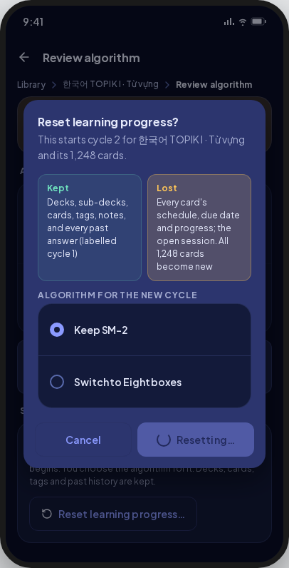 | As drawn. |
| resetDone | 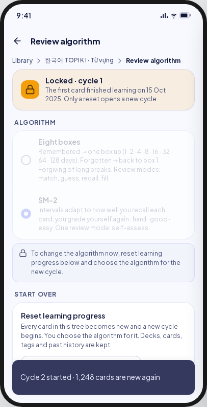 | 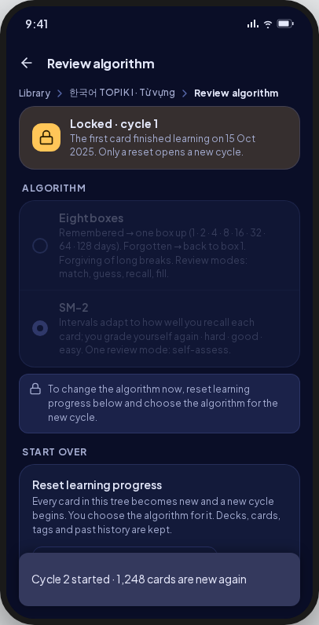 | Then the unlocked state. |
| nothingToLose | 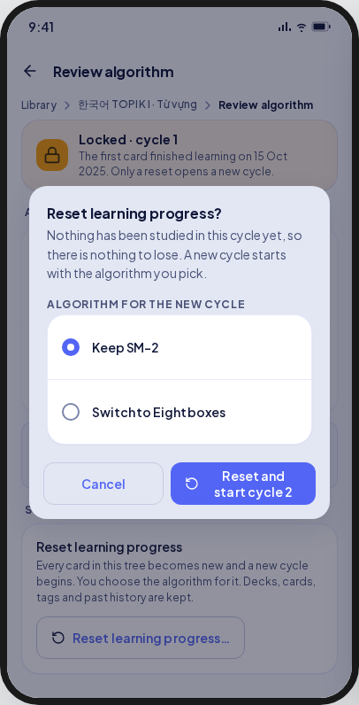 | 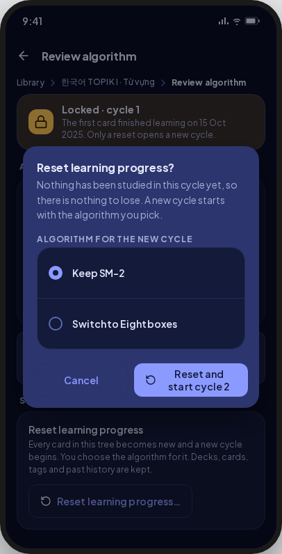 | When `hasProgressToLose` is false (UC-SRS-001 A2). |

Not in the artifact, required by V8:

- **Switch confirmation:** `MxDialog`, non-destructive: "Switch to {algorithm}?" / "Every card's schedule in this tree starts over and any open study session closes. No history is lost." / Cancel · Switch (UC-DECK-002 steps 3–4).
- **Refused because the tree just locked:** the locked state and the reason (UC-DECK-002 E4).
- **Loading, load error, not a root or gone:** skeleton, `MxErrorState`, the not-found state of screen 01.

## Reset dialog copy

- Title "Reset learning progress?"
- With progress: "This starts cycle {n+1} for {deck} and its {count} cards."
  - Kept: "Decks, sub-decks, cards, tags, notes, and every past answer (labelled cycle {n})"
  - Lost: "Every card's schedule, due date and progress; the open session. All {count} cards become new"
- Nothing to lose: "Nothing has been studied in this cycle yet, so there is nothing to lose. A new cycle starts with the algorithm you pick."
- "Algorithm for the new cycle": "Keep {current}" · "Switch to {other}"
- Buttons: "Cancel" · "Reset and start cycle {n+1}" · "Resetting…"
- Done: "Cycle {n+1} started · {count} cards are new again"
- Switch failed: "Couldn’t switch." "The deck still uses {algorithm}." · "Retry"

## Deviations

| Artifact | V8 | Wins |
|---|---|---|
| A tap on the other algorithm switches at once | A confirmation dialog first | UC-DECK-002 steps 3–4 |
| "Kept" coloured with the mastery token | `statusMasteredInk`, 4.5:1 | Spec A10, WCAG 2.2 AA |
| Refused because the tree just locked: a message on the screen | The locked state from the stream, and the reason as a snackbar | Ruling D-L1 |
