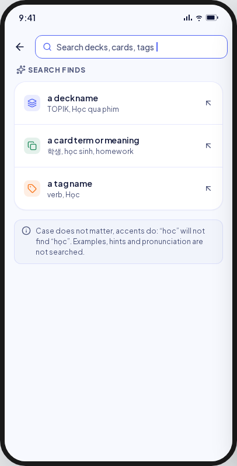
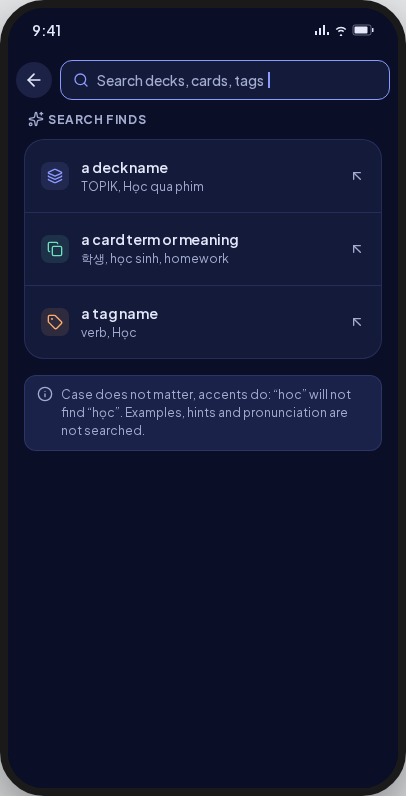
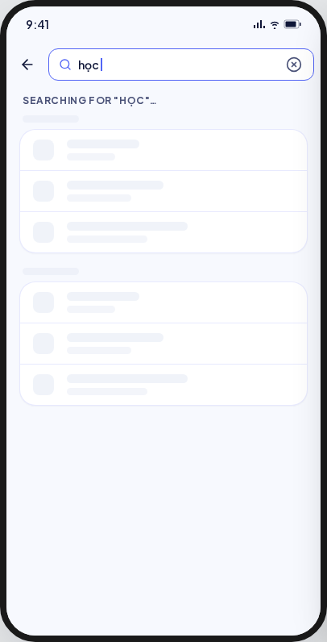
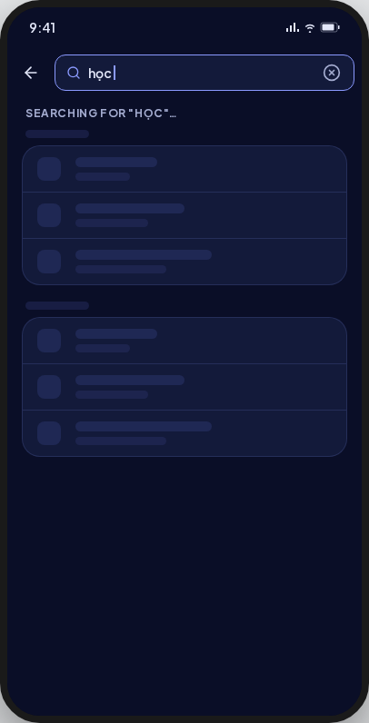
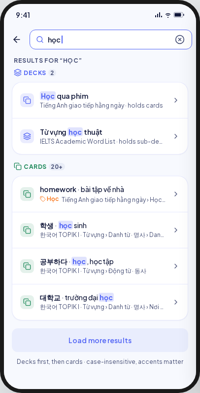
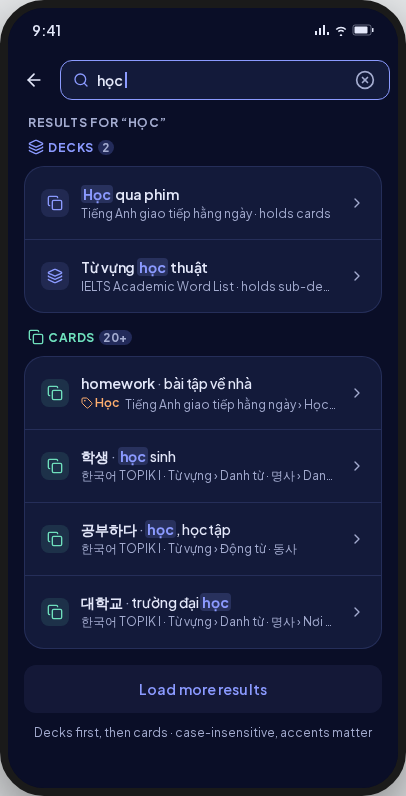
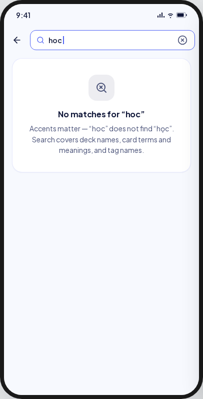
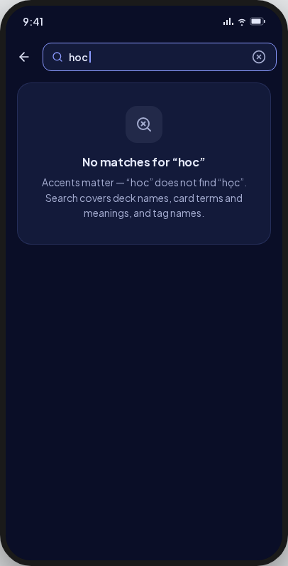
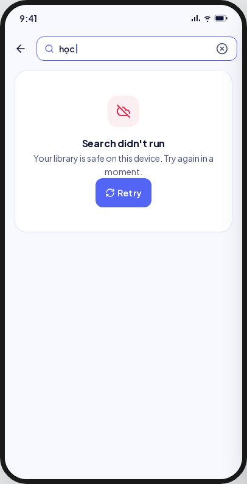
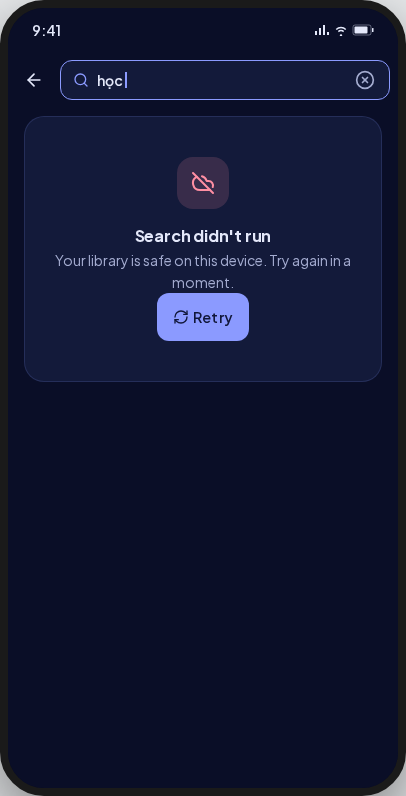

<!-- Hand-written screen handoff. Not generated by tools/docs/split_handoff.py. -->

# 04 · Library search

`/decks/search`. UC-SEARCH-001, decks only until BE-A8.

## Layout

| Region | Widget | Design |
|---|---|---|
| App bar | `MxAppBar` with its title-widget slot | Back, then `MxSearchField` (focused on entry). No title. |
| Empty query | label, `MxCard` of `MxListRow`s, `MxNote` | No query runs (BR-SEARCH-003). "SEARCH FINDS"; one hint row "a deck name" / "TOPIK, Học qua phim"; note "Case does not matter, accents do: “hoc” will not find “học”." |
| Searching | label, `MxSkeleton` | "Searching for “{query}”…", skeleton rows. |
| Results | label, group header, `MxCard` of `MxListRow`s | "Results for “{query}”"; group **Decks** (layers glyph, primary title, count pill); each row: tile by content type, name with the match emphasised, "{path} · holds cards" or "· holds sub-decks", chevron. |
| No results | `MxEmptyState` (neutral, compact) | "No matches for “{query}”" / "Accents matter — “hoc” does not find “học”. Search covers deck names." |
| Error | `MxErrorState` | "Search didn't run" / "Your library is safe on this device. Try again in a moment." |

## States

| State | Light | Dark | V8 |
|---|---|---|---|
| emptyQuery |  |  | Only the deck hint row; the note names deck names only. |
| loading |  |  | One skeleton group. |
| results |  |  | The Decks group only. |
| noResults |  |  | Body names deck names only. |
| error |  |  | As drawn. |

## Pending

| Element | Shown as | Waits for |
|---|---|---|
| Cards group, tag names on card rows | absent | BE-A8 |
| "Load more results" | absent | BE-A8 (BR-SEARCH-007) |
| Hint rows "a card term or meaning", "a tag name" | absent | BE-A8 |
| Footer "Decks first, then cards · case-insensitive, accents matter" | absent | BE-A8 |

A search hint must not promise a match the backend cannot make, so these are absent
rather than disabled.

## Deviations

| Artifact | V8 | Wins |
|---|---|---|
| Searches decks, cards and tags | Decks only | Spec A11; UI-base debt row 74 |
| Match emphasised in primary 700 with a tinted mark | `rowTitleMatch` (primary, 700), no background mark | Guard: no per-site decoration of text |
