<!-- Hand-written screen handoff. Not generated by tools/docs/split_handoff.py. -->

# 05 · Tags

The tag catalog: every tag of the library with its active cards, narrowed by a search,
each renamed, merged or deleted from its actions. UC-TAG-001; BR-TAG-001…011; spec
[2026-09-27-tags-starter-ui-design.md](../../../superpowers/specs/2026-09-27-tags-starter-ui-design.md)
(FE-B2). The card list's tag filter is on screen 07.

## Entry points

- **The Library's app bar:** the tag action pushes `/decks/tags`, full screen on the root
  navigator, with no bottom bar (D2, D5).

## Layout

| Region | Widget | Design |
|---|---|---|
| App bar | `MxAppBar` (content) | Back and "Tags". |
| Search | `MxSearchField` | "Search tags". It narrows the catalog with the fold the store writes and searches with (BR-TAG-003): `ĐỘNG TỪ` finds `động từ`. |
| Header | `MxListSectionHeader` | "{n} tags", "No tags" or "No matches", with "A→Z" as plain text: there is one order, and nothing to tap (critique P2b). |
| Rows | `MxSection` + `MxListRow` | A tag tile, the name (one line, ellipsis), "{n} cards" and ⋮ ("Actions for {tag}"). While the tag's write runs, ⋮ is a spinner and the row cannot be tapped. |
| Action sheet | `MxBottomSheet` + `MxTagChip` + `MxActionSheetCommandRow` ×3 | The chip "{tag} · {n}" and "Tag actions"; "Find cards with this tag" / "Search the library for “{tag}”"; "Rename tag" / "Renaming onto an existing name merges the two"; "Delete tag" / "Removes it from {n} cards · the cards stay" (destructive). |
| Rename dialog | `MxDialog` + `MxTextField` + `MxSheetActions` | "Rename tag", "Renaming updates every card that uses “{tag}”.", the overline "NEW NAME", the field prefilled, "Tag names are case-insensitive."; Cancel / Rename. The name rules are checked as it is typed; what the rename would do is read 250 ms after the name stops changing (D8). Rename is off while the name is unchanged. |
| Delete dialog | `MxDialog` + `MxCard` (success) + `MxSheetActions` | "Delete this tag?", "“{tag}” is removed from {n} cards and disappears from the catalog. Tags are not kept in Trash.", the note "No card is deleted, hidden or changed — all {n} cards stay exactly where they are."; Cancel / "Remove from {n} cards" (destructive). |

"Find cards with this tag" opens the Library search on the tag's name (D11). The search
lives in the Library branch, under the shell, so Back from it returns to the Library,
not to Tags (plan C4).

## States

| State | Light | Dark | V8 |
|---|---|---|---|
| loaded | 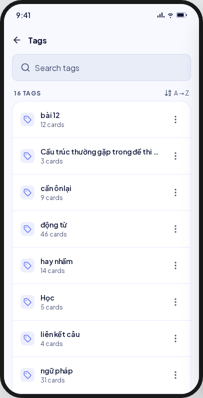 | 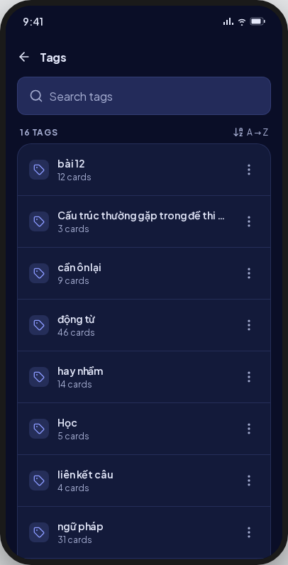 | Tags in the store's folded order (BR-TAG-003; UI-base row 137); no sort glyph. |
| loading | 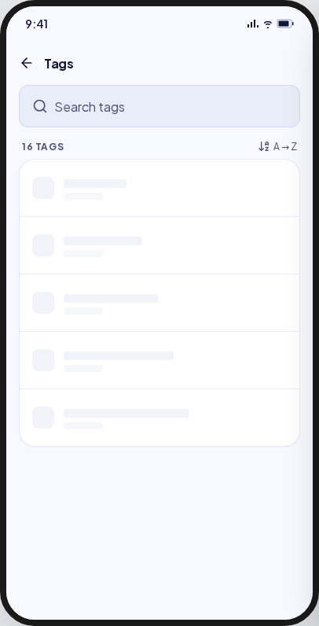 | 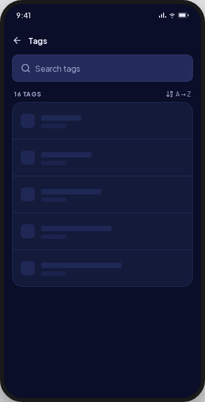 | The search, then skeleton rows (UI-base row 125). |
| empty | 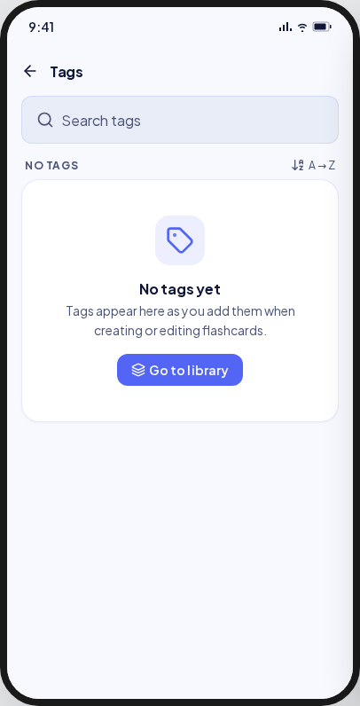 | 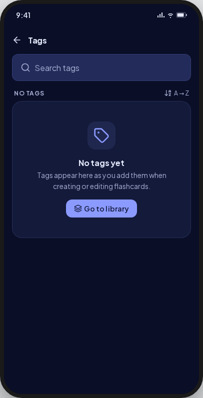 | As drawn; "Go to library" goes back. |
| searchEmpty | 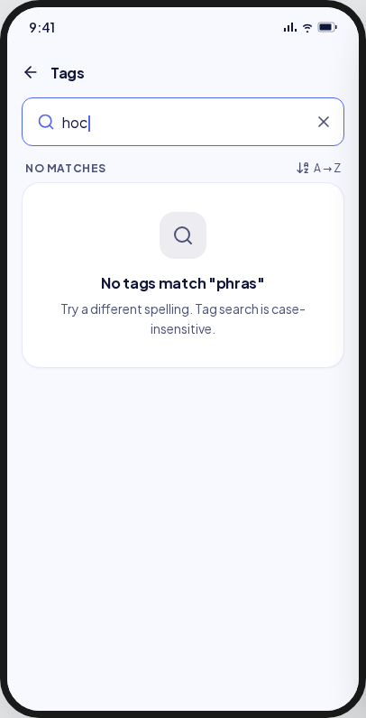 | 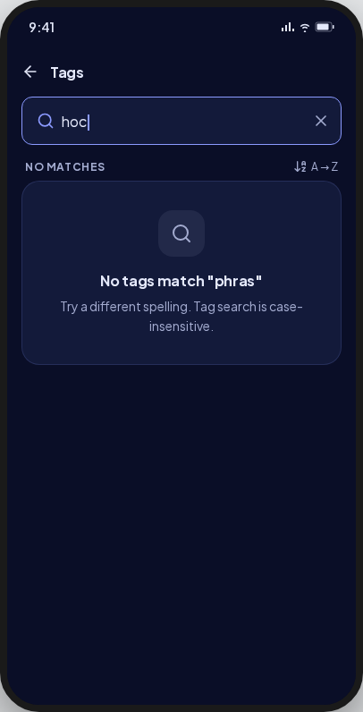 | "No tags match “{term}”" (A6), distinct from "No tags yet". |
| sheet | 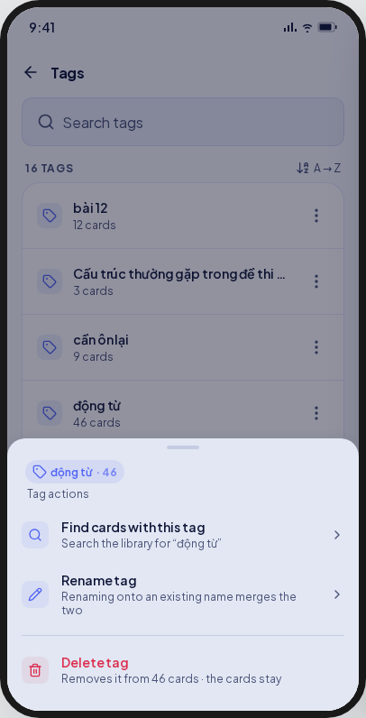 | 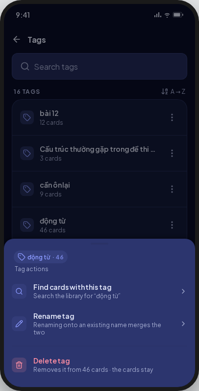 | As drawn. |
| rename | 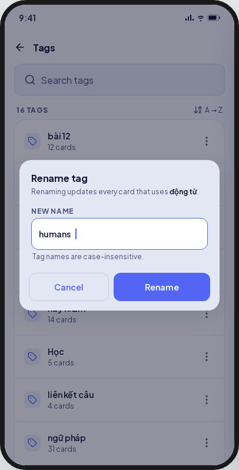 | 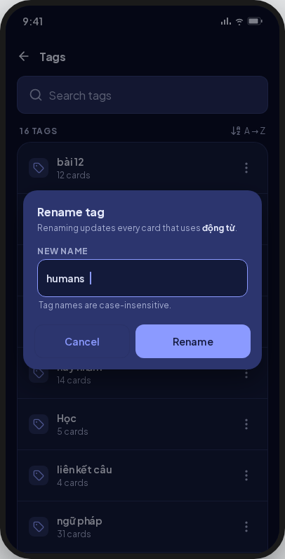 | The tag's name in quotes, not bold. |
| renameMerge | 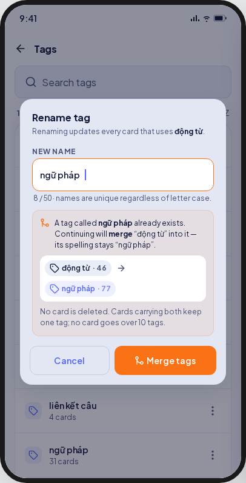 | 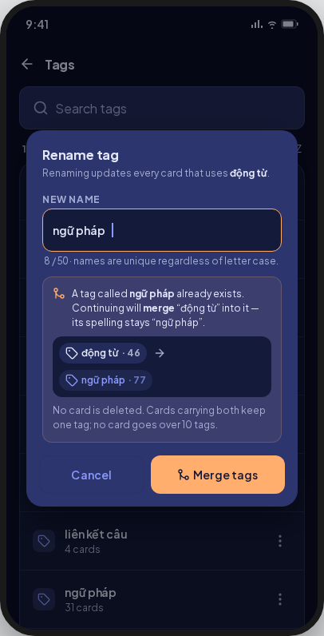 | "{len} / 50 · names are unique regardless of letter case.", the warning panel, the chips `{source} · {n}` → `{target} · {union}` (the union, BE-B2 D6), and "Merge tags" in the warning tone, amber with dark ink (D15; UI-base row 134). A merge that no longer plans the same way when written (`mergeNotConfirmed`) opens the dialog again on the name typed. |
| nameTooLong | 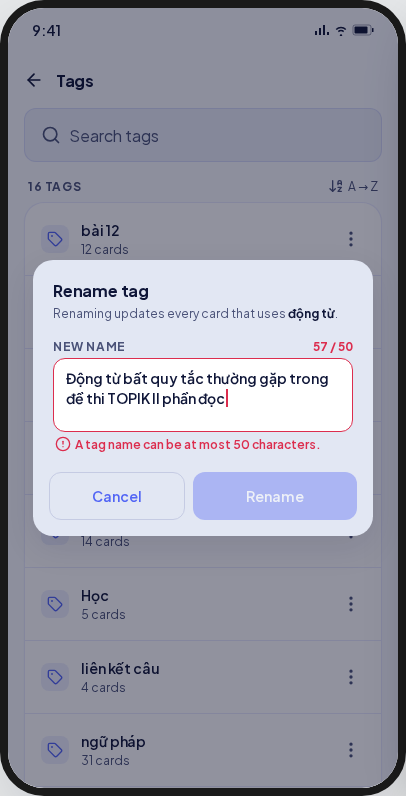 | 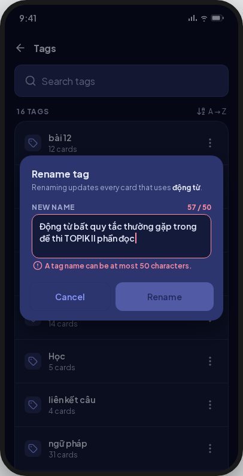 | The counter "{len} / 50" in the error ink, "A tag name can be at most 50 characters." under the field, Rename off. The field keeps one line. A blank name and a control character show their own messages (E2). |
| del | 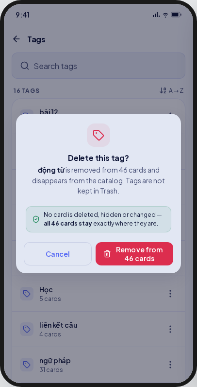 | 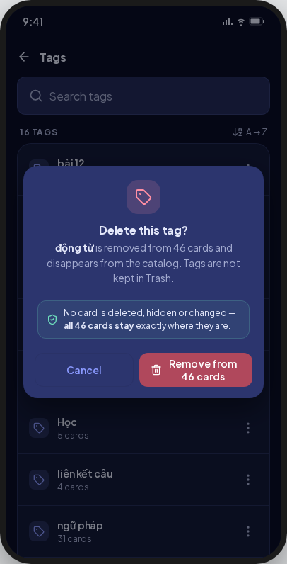 | No glyph over the title; the text is left-aligned; the buttons stack when "Remove from {n} cards" cannot keep its line (UI-base row 139). |
| busy | 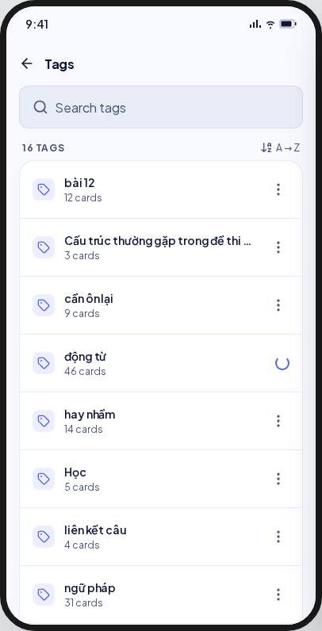 | 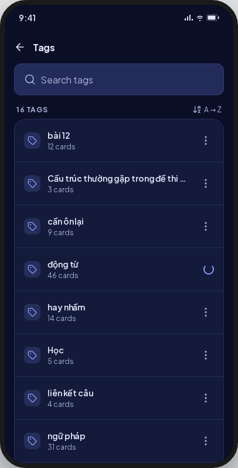 | As drawn. |
| opError | 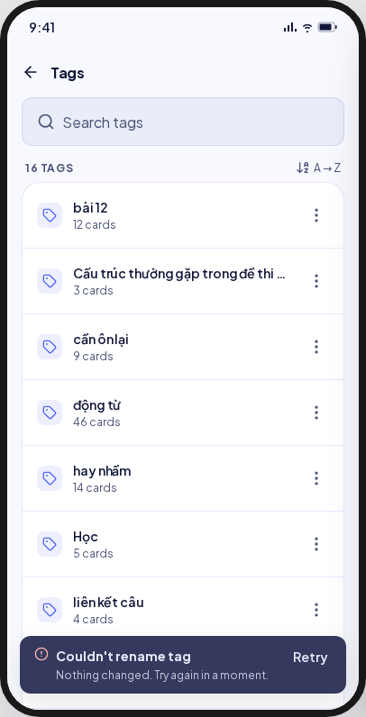 | 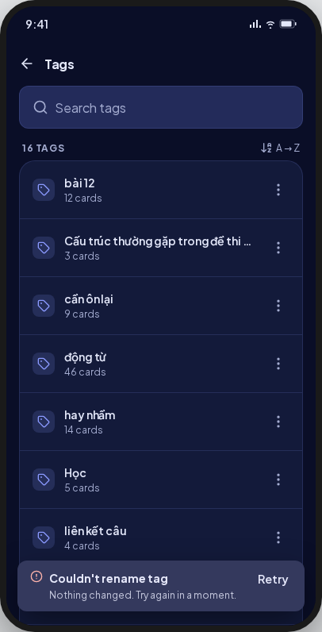 | One sentence, "Couldn't rename tag. Nothing changed — try again in a moment." (or delete), with Retry, which runs the same write (UI-base row 138). |
| tagGone | 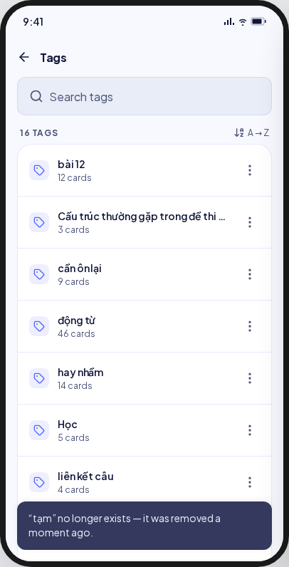 | 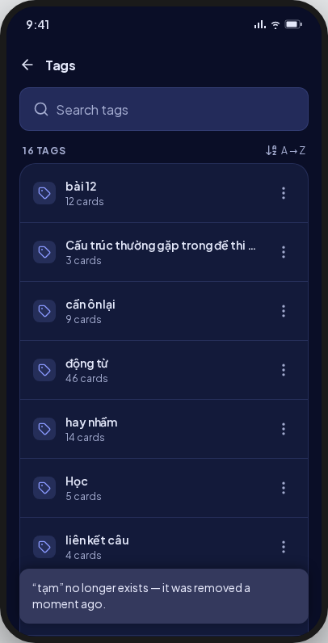 | As drawn (E3), from an action or from the rename dialog, which closes when its plan finds the tag gone. |
| read error | — | — | **V8 addition (E1, D10):** `MxErrorState` "Couldn't load tags" with Retry. |

Goldens: `test/features/tags/presentation/goldens/tags_{loaded,loading,empty,search_empty,sheet,rename,rename_merge,name_too_long,del,busy,op_error,tag_gone,read_error}_{light,dark}.png`.

## Deviations

| Artifact | V8 | Wins |
|---|---|---|
| "Merge tags" orange with white text (about 2.8:1) | The warning role with its ink | AA; D15 |
| The target chip counts the sum (46 + 31 = 77) | The union of both tags' cards | BE-B2 D6; D8 |
| A sort glyph beside "A→Z" | Plain text | One order (BR-TAG-003); critique P2b |
| Diacritics folded in the order (động từ after cần ôn lại) | The store's folded order | BR-TAG-003 |
| Tag names in bold in the dialogs | In quotes | No per-site text styling |
| A tag glyph over "Delete this tag?", centred text | No glyph, left-aligned | `MxDialog` has no glyph slot |
| Toasts with a bold title line | One sentence | `MxSnackbarContent` has one message |
| No read error | `MxErrorState` with Retry | UC-TAG-001 E1; D10 |

## Copy

"Tags" · "Search tags" · "{n} tags" · "No tags" · "No matches" · "A→Z" · "{n} cards" ·
"Actions for {tag}" · "No tags yet" · "Tags appear here as you add them when creating or
editing flashcards." · "Go to library" · "No tags match “{term}”" · "Try a different
spelling. Tag search is case-insensitive." · "Couldn't load tags" · "Tag actions" · "Find
cards with this tag" · "Search the library for “{tag}”" · "Rename tag" · "Renaming onto
an existing name merges the two" · "Delete tag" · "Removes it from {n} cards · the cards
stay" · "Renaming updates every card that uses “{tag}”." · "New name" · "Tag names are
case-insensitive." · "{len} / {max}" · "{len} / {max} · names are unique regardless of
letter case." · "A tag name can be at most {max} characters." · "Rename" · "Merge tags" ·
"A tag called “{target}” already exists. Continuing will merge “{source}” into it — its
spelling stays “{target}”." · "No card is deleted. Cards carrying both keep one tag; no
card goes over 10 tags." · "Delete this tag?" · "“{tag}” is removed from {n} cards and
disappears from the catalog. Tags are not kept in Trash." · "No card is deleted, hidden
or changed — all {n} cards stay exactly where they are." · "Remove from {n} cards" ·
"Couldn't rename tag. Nothing changed — try again in a moment." · "Couldn't delete tag.
Nothing changed — try again in a moment." · "“{tag}” no longer exists — it was removed a
moment ago."
