<!-- Hand-written screen handoff. Not generated by tools/docs/split_handoff.py. -->

# 06 · Trash

Everything deleted in the last 30 days, newest first. Each entry can be restored to a
place the person picks, or deleted for good. UC-TRASH-001; spec
[2026-09-26-trash-ui-design.md](../../../superpowers/specs/2026-09-26-trash-ui-design.md)
§6.

## Entry points

- **The Library's app bar:** the Trash icon, beside Coming soon (D1).
- **Toasts:** the toast after several cards move to the Trash, and every refused Undo,
  both through "Open Trash" (D4, UC-TRASH-001 E3).
- **Gone states:** the "no longer here" states of an open deck, the card editor and the
  card detail, through "Open Trash" (D11).

The Trash is a full-screen task on the root navigator, `/decks/trash`, with no bottom
bar (D2). Opening it runs the auto-purge, as the app's start and every resume do (D5).

## Layout

| Region | Widget | Design |
|---|---|---|
| App bar | `MxAppBar` | Back, "Trash" and "Select" (a compact secondary `MxButton`; hidden when the Trash is empty). While selecting: close, then "Select entries", "{n} cards selected" or "{n} decks selected". |
| Note | `MxNote` (history icon) | "Kept for 30 days from deletion, then removed automatically. Restoring asks where the item should go." Hidden while selecting. |
| Filters | `MxFilterChip` × 3 | All · Cards · Decks, each with its count (A6). Hidden while selecting. |
| Header | `MxListSectionHeader` | "{n} entries · newest first"; while selecting, "{n} of {m} cards" or "decks". |
| Rows | `MxCard` + `MxRowInk` per entry | The kind's tile (a checkbox while selecting). The name ("front · back" for a card), and the time left on the right: a warning `MxBadge` under 3 days, grey text otherwise. Then "Card · deleted {ago}" or "Deck · {n} sub-decks · {m} cards · deleted {ago}" (up to two lines), then "Was in {path}" or "Was in Top level", 8 apart. Then `⋮`. While selecting, an entry of the other kind is dimmed to 0.38. The row is one TalkBack node with every fact (D15). |
| Kind lock | `MxNote` | "Cards and decks can't be selected together." |
| Blocked purge | `MxInlineBanner` (warning) | One per batch the last purge skipped (D6). |
| Bar | `MxFooterBar` + `MxActionPair` | While selecting: "Restore ({n})" (primary) · "Delete ({n})" (destructive), side by side, stacked when a label cannot fit. Both are disabled until a pick. |
| Actions | `MxBottomSheet` + `MxActionSheetCommandRow` × 2 | The name and "{kind} · deleted {ago} · was in {deck}"; "Restore…" / "Choose which deck it goes to"; "Delete permanently" / "Cannot be undone · history lost" (destructive). |
| Restore | `MxDeckPickerSheet` | "Restore “{name}” to…" or "Restore {n} cards/decks to…", the rule, then the targets as paths, or the single "Top level" for top-level decks. With no target: "Nowhere to restore right now", why, and OK. |
| Delete for good | `MxDialog` + `MxSheetActions.custom` | "Delete {n} cards permanently?", "They disappear for good, together with their study history. This cannot be undone.", "Keep in Trash" (primary, focused) · "Delete {n}" (destructive, spinning while it runs). |
| Toasts | `MxSnackbar` | "“{name}” restored to {deck}" / "{n} entries restored to {deck}"; "{n} cards deleted permanently". |

## States

| State | Light | Dark | V8 |
|---|---|---|---|
| all | 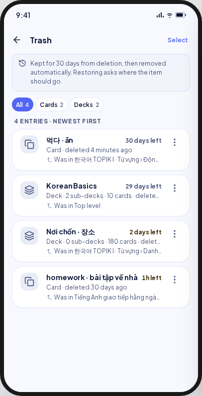 | 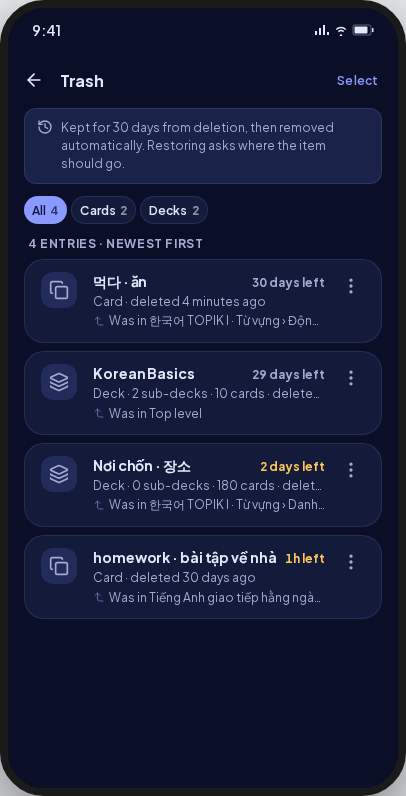 | As drawn; the tile is tinted, and "Was in" has no glyph. |
| cards | 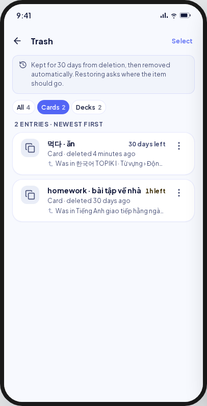 | 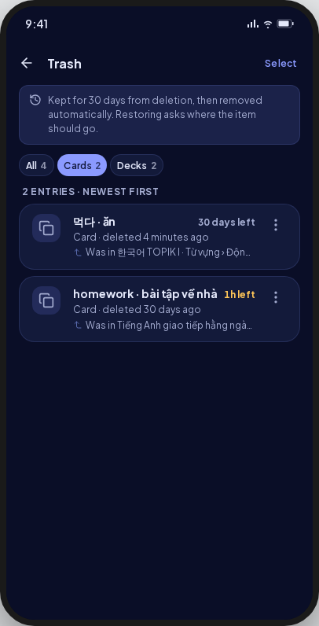 | As drawn. |
| decks | 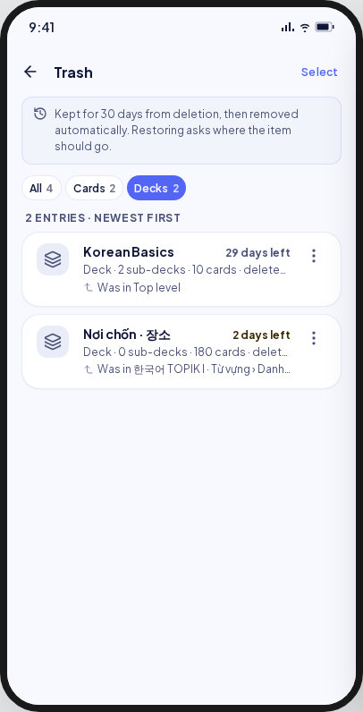 | 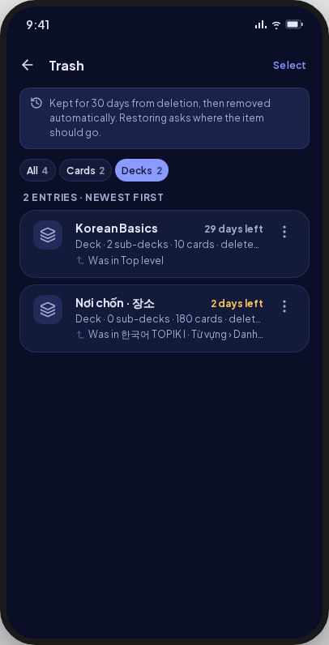 | As drawn. |
| actions | 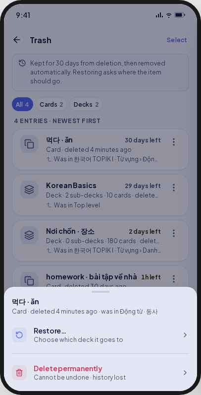 | 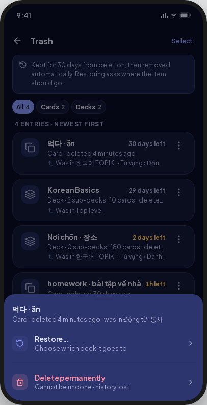 | As drawn; a row tap opens it too. |
| restoreTarget | 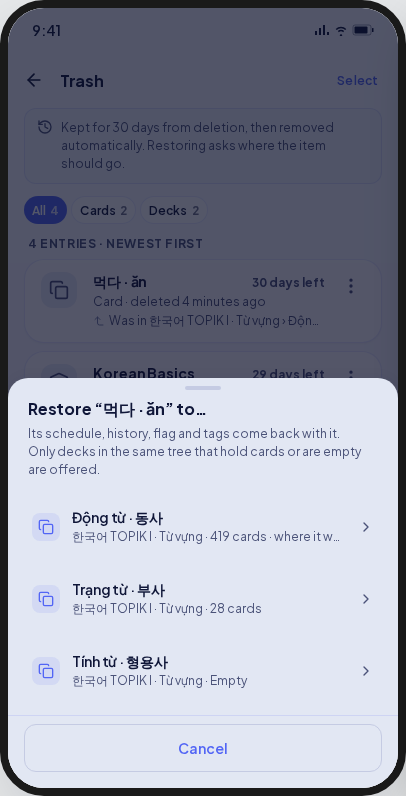 | 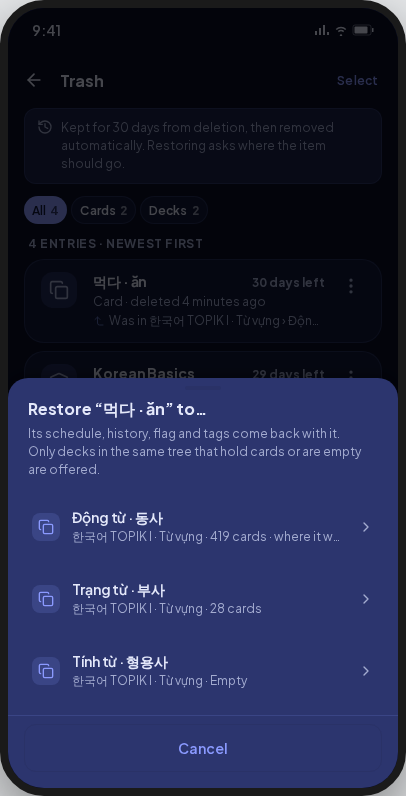 | Targets read as paths, without counts or "where it was". |
| noTarget | 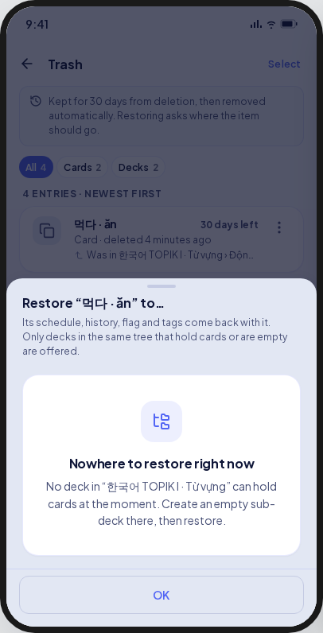 | 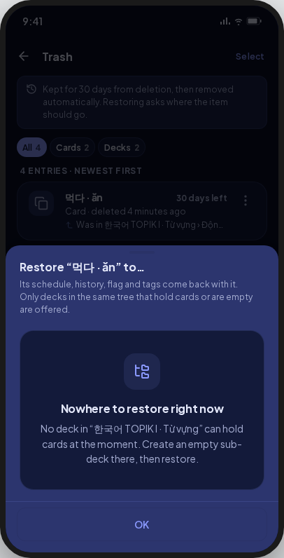 | As the move sheets draw it: the neutral folder, and a filled OK. |
| restored | 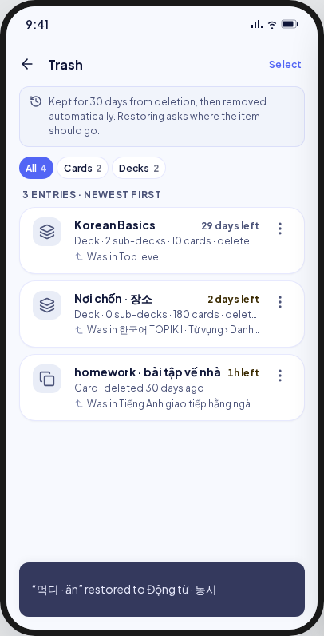 | 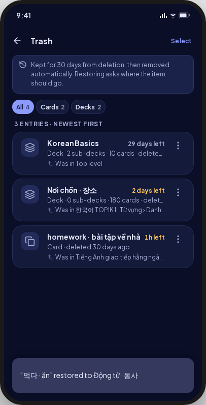 | As drawn. |
| undoRefused | 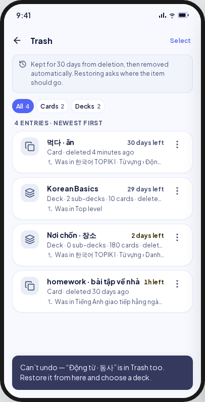 | 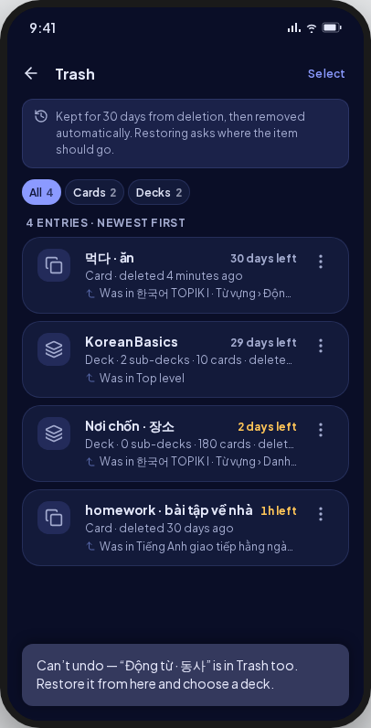 | Shown where the item was deleted, with Open Trash (UI-base row 109). |
| selection | 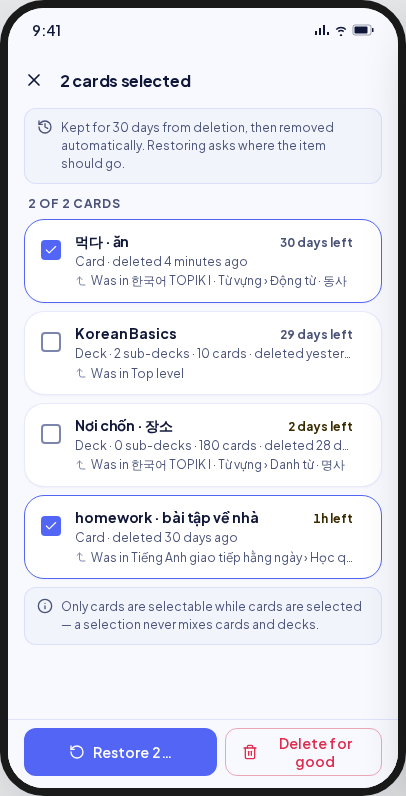 | 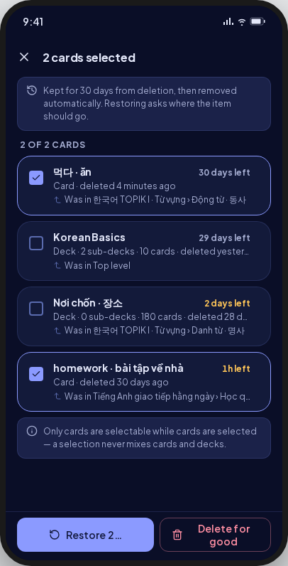 | **Deviation:** "Restore ({n})" · "Delete ({n})" as a filled destructive button, the note hidden, the other kind dimmed (owner 2026-09-26). |
| purgeConfirm | 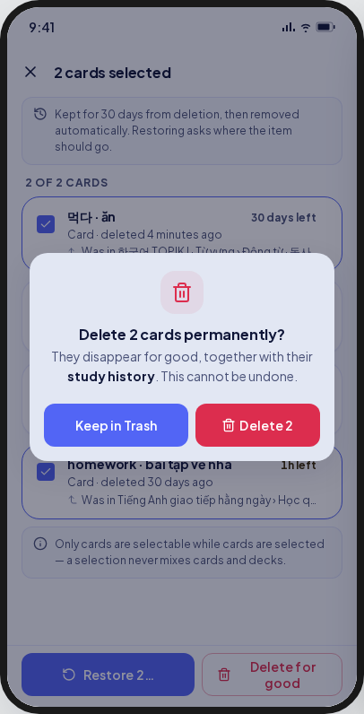 | 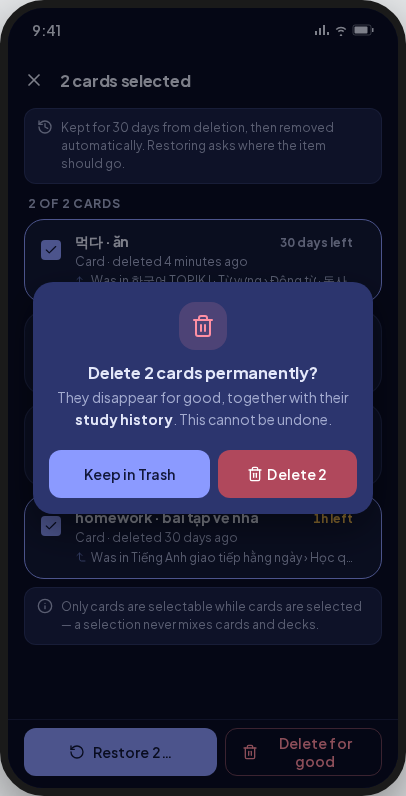 | No glyph, left-aligned (UI-base row 108). |
| purged | 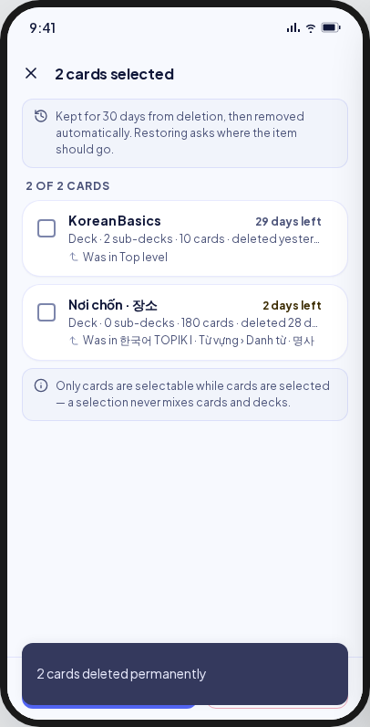 | 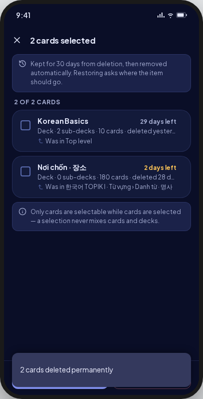 | As drawn. |
| youngerInside | 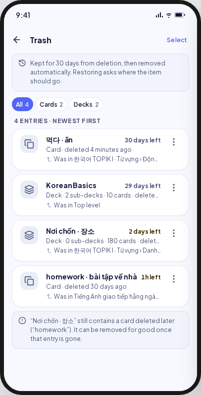 | 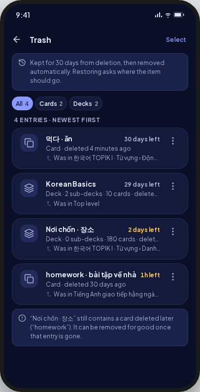 | **Deviation:** "deleted earlier", in a warning banner (D6). |
| empty | 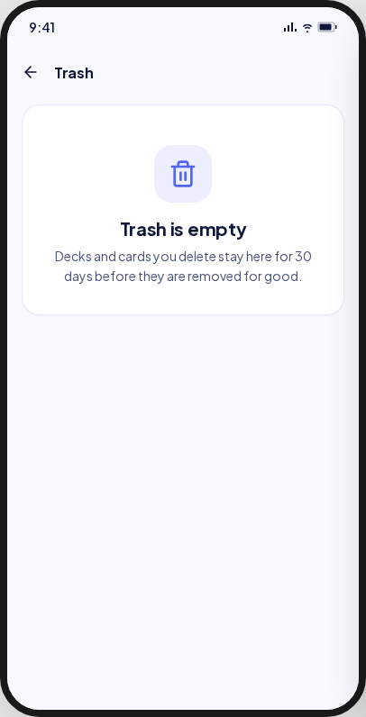 | 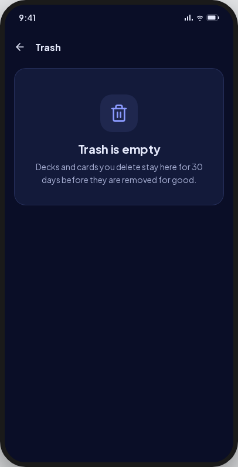 | As drawn. |
| loading | 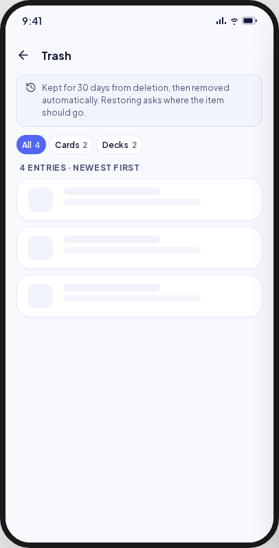 | 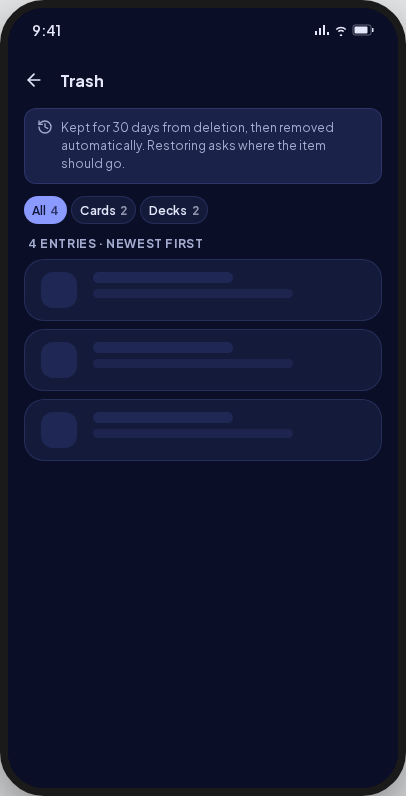 | Skeleton rows. |
| error | 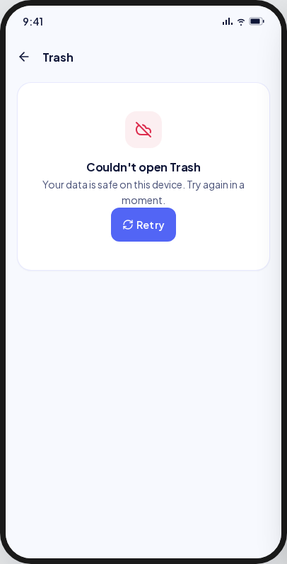 | 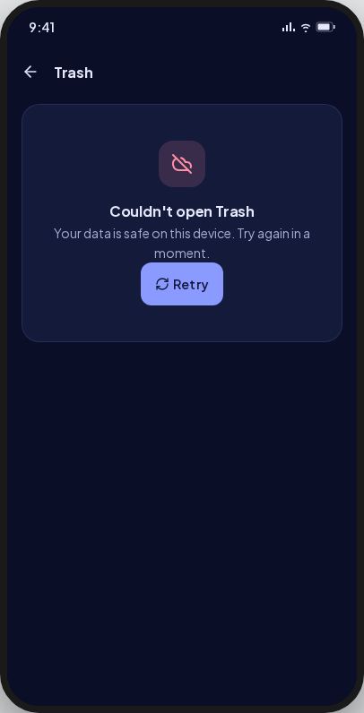 | The app's local-first body, "Nothing was lost. Try again in a moment." |

Goldens: `test/features/trash/presentation/goldens/trash_{all,actions,restore_target,no_target,selection,purge_confirm,purge_blocked,empty,error}_{light,dark}.png`.

## Deviations

| Artifact | V8 | Wins |
|---|---|---|
| "“X” still contains a card deleted later" | "“X” still contains an entry deleted earlier (“Y”)", in a warning banner, one per blocked batch | Invariant 36 (spec D6) |
| A restore target with its name, path, card count and "where it was" | The path, as the move sheets show targets | `CardMoveTarget` and `DeckMoveTarget` carry no counts (ruling P3-L8) |
| A card's restore sheet only | A deck's sheet with its own rule, and "Top level" for a top-level deck | BR-TRASH-006 |
| "Select" as a text link | A compact secondary `MxButton` | Ruling E-L3 |
| A neutral grey kind tile; "Was in" after a corner glyph | The tinted `MxIconTile`; the text alone | The shared tile's tones; no per-site glyph ink |
| "Delete for good" as a red outline | A filled destructive `MxButton` | `MxButton` has no destructive outline |
| noTarget's tree glyph in a tinted tile, and an outline OK | The neutral folder, and a filled OK | `MxDeckPickerSheet`'s empty state, shared with the move sheets (ruling O11) |
| A refusal inside the restore sheet | The sheet closes and the refusal is a toast; the list follows the store | As the move sheets (spec §6) |
| "Restore {n}…" · "Delete for good" | "Restore ({n})" · "Delete ({n})": the "…" read as truncation, and "Delete for good" did not fit half the bar | Owner, 2026-09-26 (UI refinements phase 2) |
| The time left in warning ink under 3 days | A warning `MxBadge`: the dark ink read as plain text | Owner, 2026-09-26 |
| The meta line on one line, ellipsized; lines 4 apart | Up to two lines; lines 8 apart | Owner, 2026-09-26 |
| The note shown while selecting; the other kind at full strength; a two-clause kind lock | The note hidden while selecting; the other kind dimmed to 0.38; "Cards and decks can't be selected together." | Owner, 2026-09-26; BR-TRASH-011 needs no note |

## Copy

- Header: "Trash" · "Select" · "Kept for 30 days from deletion, then removed automatically. Restoring asks where the item should go." · "All" · "Cards" · "Decks" · "{n} entries · newest first".
- Row: "Card · deleted {ago}" · "Deck · {n} sub-decks · {m} cards · deleted {ago}" · "just now" / "{n} minutes ago" / "{n} hours ago" / "yesterday" / "{n} days ago" · "{n} days left" · "{n}h left" · "Was in {path}" · "Top level" · "Actions for {name}".
- Actions: "Restore…" · "Choose which deck it goes to" · "Delete permanently" · "Cannot be undone · history lost".
- Restore: "Restore “{name}” to…" · "Its schedule, history, flag and tags come back with it. Only decks in the same tree that hold cards or are empty are offered." · "Nowhere to restore right now" · "No deck in “{root}” can hold cards at the moment. Create an empty sub-deck there, then restore." · "“{name}” restored to {deck}".
- Selection: "Select entries" · "{n} cards selected" · "{n} of {m} cards" · "Cards and decks can't be selected together." · "Restore ({n})" · "Delete ({n})" · "Clear selection".
- Delete for good: "Delete {n} cards permanently?" · "They disappear for good, together with their study history. This cannot be undone." · "Keep in Trash" · "Delete {n}" · "{n} cards deleted permanently".
- Empty and error: "Trash is empty" · "Decks and cards you delete stay here for 30 days before they are removed for good." · "Couldn't open Trash".
