<!-- Hand-written screen handoff. Not generated by tools/docs/split_handoff.py. -->

# 07 · Card list

An open deck whose content type is `card`: the card section of `DeckLevelScreen`
(Library spec D8). UC-CARD-001, UC-CARD-002.

## Layout

| Region | Widget | Design |
|---|---|---|
| App bar | `MxAppBar`, injected by `app/` (spec A14) | Back, deck name, search action, `⋮`. Selecting: close, "{n} selected", "Select all {count}". |
| Breadcrumb | `MxBreadcrumb` | Library › ancestors › deck; hidden while selecting. |
| Search | `MxSearchField` | Revealed by the search action; closing it clears the term. Hidden while selecting; its term stays and returns with it. |
| Summary card | `MxCard` (hero) + `MxMasteryDonut` + `MxWorkloadBreakdownLine` | "DECK PROGRESS · {algorithm}", "{n} of {total} cards mastered", overdue · today · new, the four-state bar and its legend (New · Beginning · Reviewing · Mastered). "Study this deck · {n} due" (primary block `MxButton`; "Study this deck" when only new cards wait) opens the Study Entry, screen 14 (FE-A6 D10); hidden when the deck holds no card to study. Hidden while selecting. |
| Filters | `MxFilterChip` | All · Due · New · Flagged with counts; the Tags filter waits under Coming soon (FE-B2). |
| Header | `MxListSectionHeader` + `MxChipTrigger` | "Showing {n} of {total}" (selecting: "{n} of {total} selected"); sort "Newest first ⌄" / "Due first ⌄". |
| Rows | card surface per row, 8 apart | Status dot (checkbox while selecting); front 16/700 and back 12, one line each; uppercase status label in its ink, up to two `MxTagChip`s and "+{n}"; trailing flag in the warning colour (E-L2) and the due chip, an `MxBadge` (E-L4): "New", "Due today", "In {n}d", "{n}d overdue". The status label, tags and "+{n}" wrap at large text. Rows build as they scroll into view (E-L5). |
| Bulk bar | `MxFooterBar` with four icon buttons | Move · Flag · Tag · Delete; Export waits under Coming soon (FE-B3). |
| FAB | `MxFab` | "New card" (#33); hidden while selecting. |

## Deck action sheet (`⋮`)

Study · Rename · Move to another deck · Delete. Study opens the Study Entry, screen 14
(FE-A6 D10); Import and Export wait under Coming soon (spec A4; FE-B3).

## States

| State | Light | Dark | V8 |
|---|---|---|---|
| loaded | 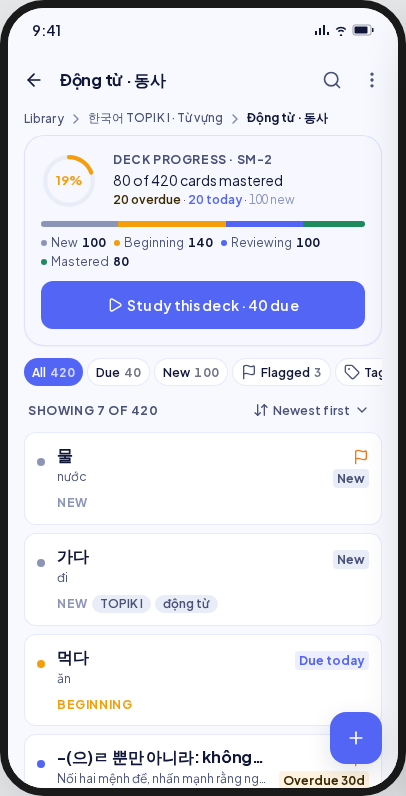 | 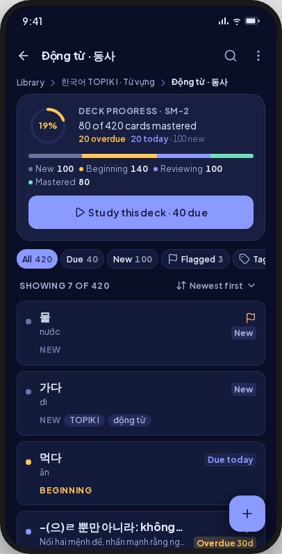 | As drawn, without the Tags chip (Coming soon). |
| empty | 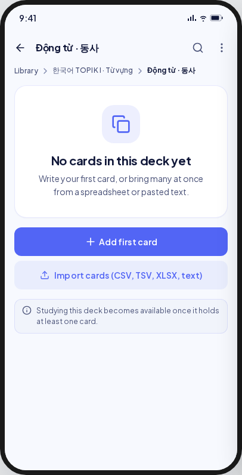 | 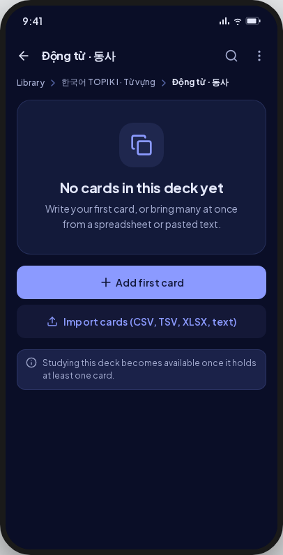 | The deck is unset again (E-L1): screen 01's unset state. |
| searchEmpty | 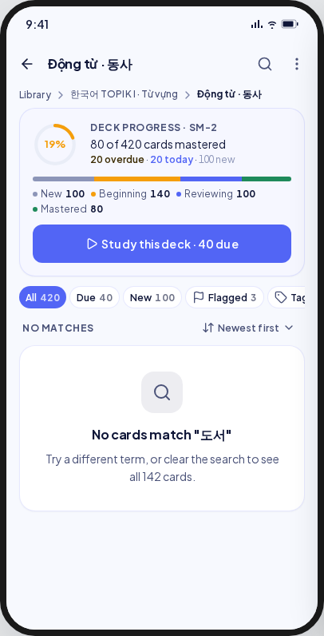 | 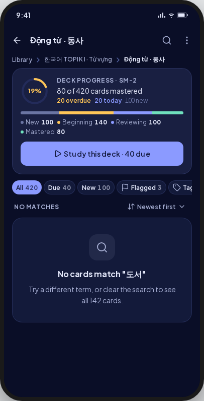 | As drawn. |
| loading | 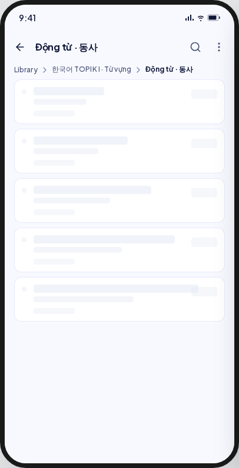 | 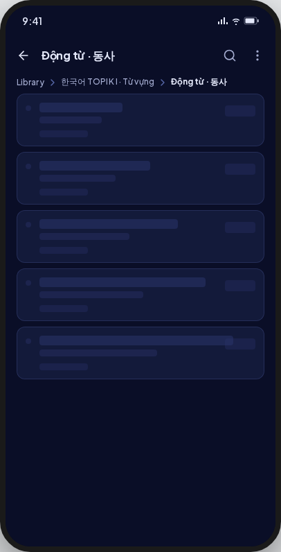 | As drawn. |
| error | 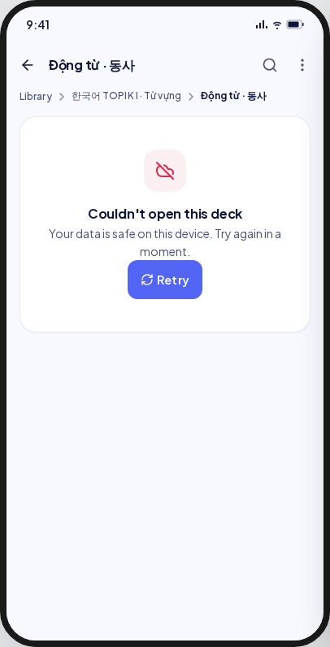 | 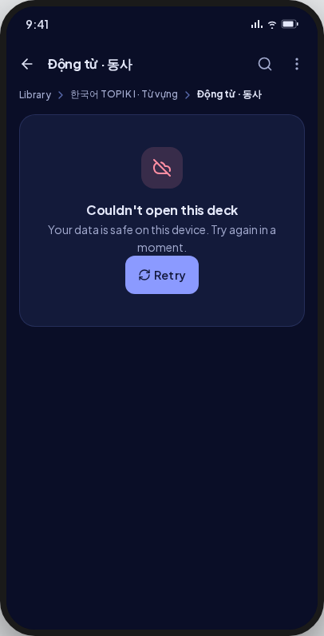 | As drawn. |
| notFound | 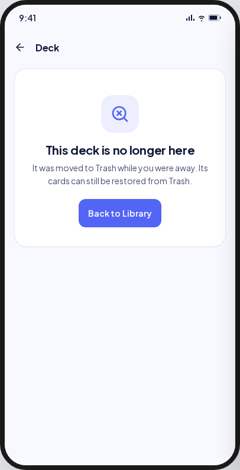 | 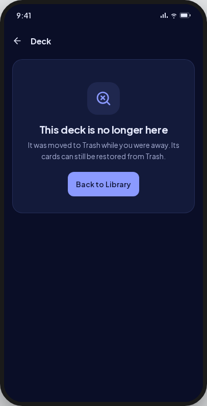 | As screen 01 deckNotFound. |
| deckActions | 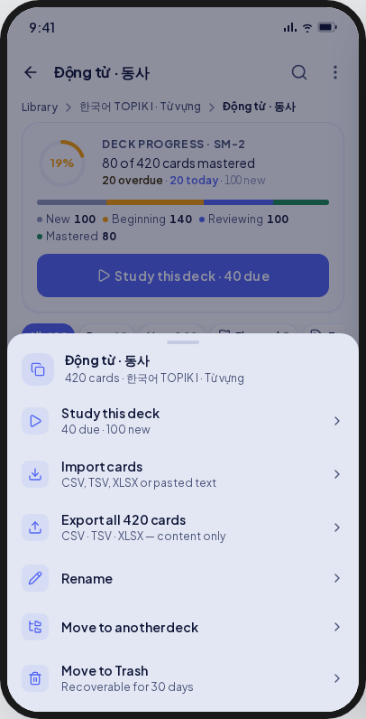 | 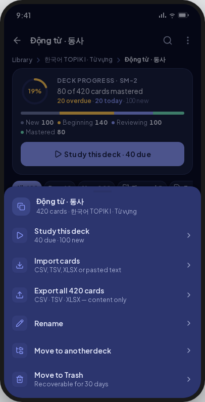 | Delete replaces Move to Trash. |
| selection | 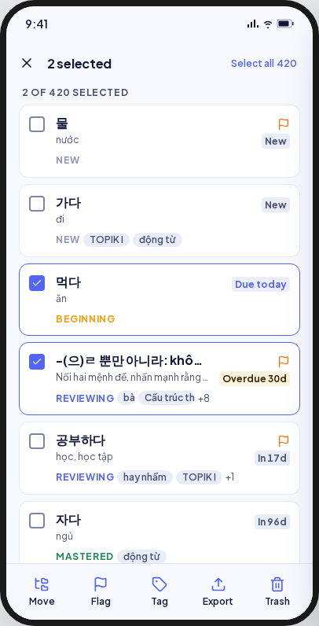 | 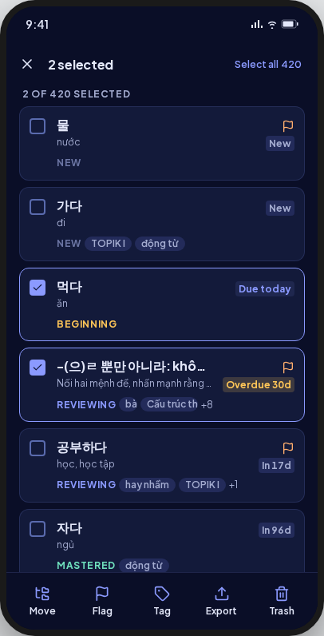 | Long-press selects (BR-CARD-020). The app bar carries close, "{n} selected" and "Select all {n}" (A14). |
| moveTargets | 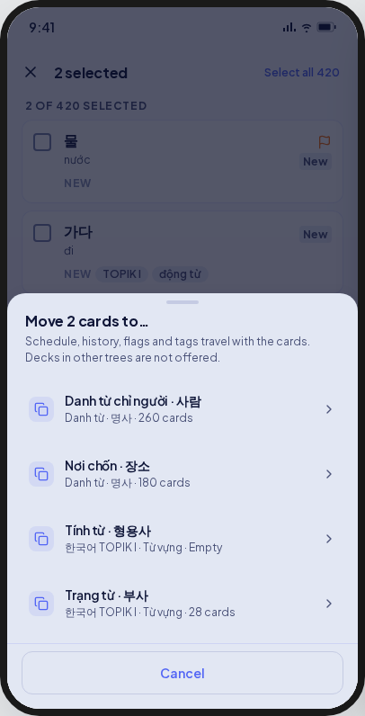 | 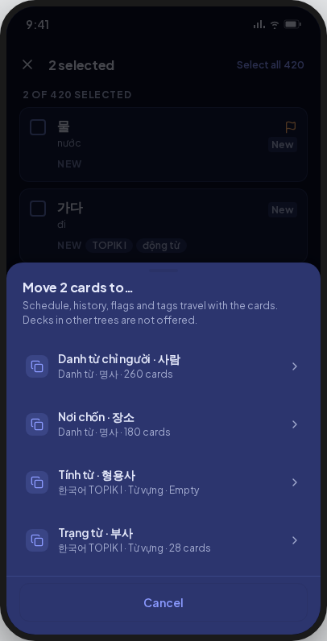 | As drawn. |
| noMoveTarget | 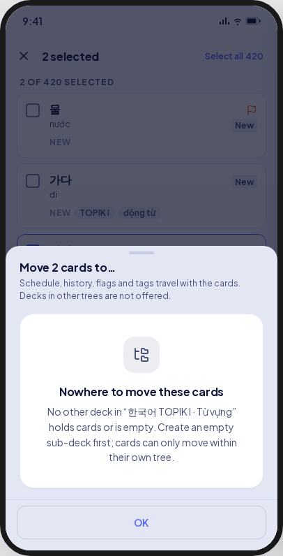 | 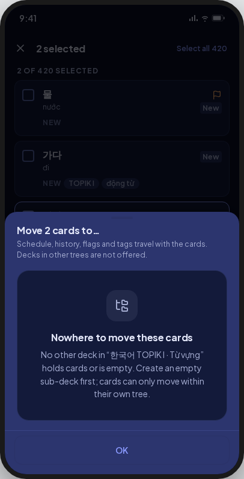 | As drawn. |
| bulkFailed | 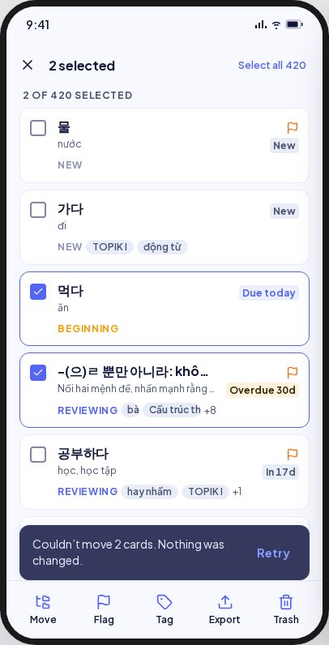 | 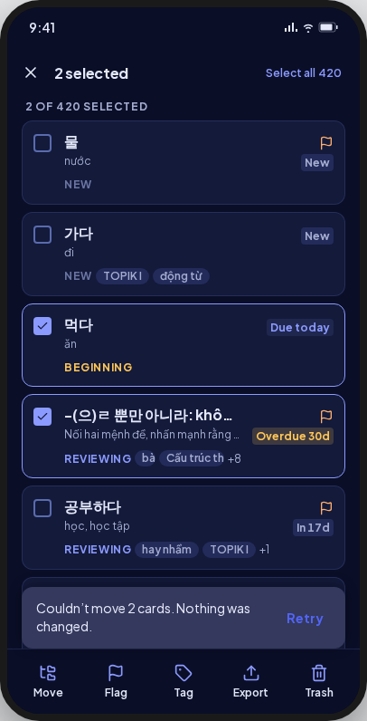 | Flag: an inline banner above the bulk bar (E-L6). Move, Tag and Delete keep their sheet or dialog open and say it there. The selection stays. |
| delCard | 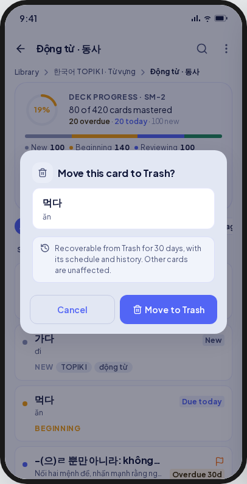 | 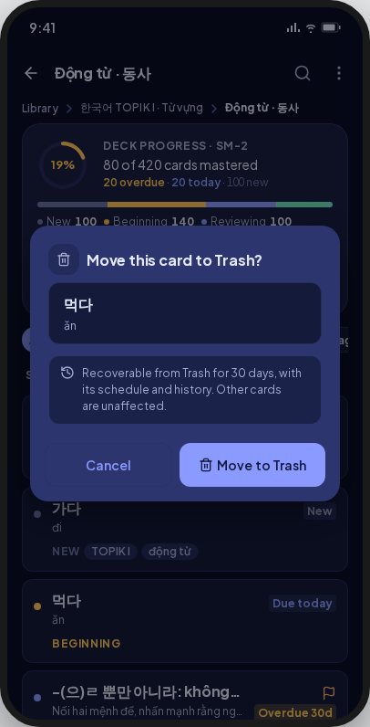 | **Deviation:** permanent delete. |
| delDeck | 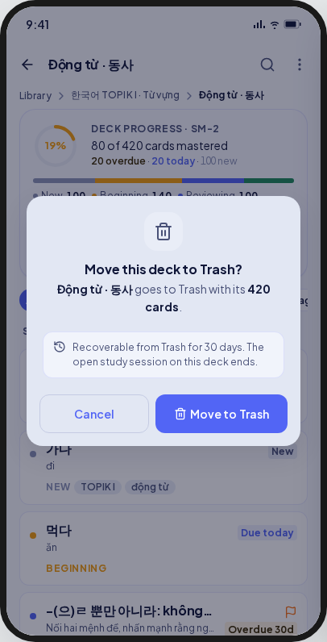 | 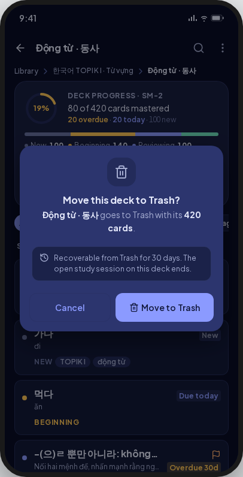 | **Deviation:** permanent delete. |

Not captured: `trashed` (Undo; no Trash in V8.0). `cardActions` gives way to the card
detail: a tap opens it (#35).

## Deviations

| Artifact | V8 | Wins |
|---|---|---|
| Move to Trash with Undo, for cards and for the deck | Permanent delete with a count, no Undo | BR-DECK-022, BR-DECK-023, UC-CARD-002 |
| Tags filter, Import, Export | Hidden; named under Coming soon | Spec A4 (amended) |
| An empty card list | The deck is unset again: screen 01's unset state | BR-DECK-015, ruling E-L1 |
| The flag in the streak colour | The flag in the warning colour; the theme has no streak token | Ruling E-L2 |
| "Select all" as a text link | A compact secondary `MxButton` | Ruling E-L3 |
| The due chip as a bespoke pill | `MxBadge`: overdue warning, today primary, else neutral | Ruling E-L4 |

## Copy

- Summary: "Deck progress · {algorithm}" · "{n} of {total} cards mastered" · "New" · "Beginning" · "Reviewing" · "Mastered" · "Study this deck · {n} due".
- Filters and header: "All" · "Due" · "New" · "Flagged" · "Tags" · "Showing {n} of {total}" · "{n} of {total} selected" · "Newest first".
- Selection: "{n} selected" · "Select all {total}" · "Move" · "Flag" · "Tag" · "Export" · "Delete".
- Empty: "No cards in this deck yet" · "Write your first card, or bring many at once from a spreadsheet or pasted text." · "Import cards (CSV, TSV, XLSX, text)" · "Studying this deck becomes available once it holds at least one card."
- Search empty: "No cards match “{term}”" · "Try a different term, or clear the search to see all {n} cards."
- Error: "Couldn't open this deck" · "Your data is safe on this device. Try again in a moment."
- Move: "Move {n} cards to…" · "Schedule, history, flags and tags travel with the cards. Decks in other trees are not offered." · no target: "Nowhere to move these cards" · "No other deck in “{root}” holds cards or is empty. Create an empty sub-deck first; cards can only move within their own tree."
