<!-- Hand-written screen handoff. Not generated by tools/docs/split_handoff.py. -->

# 08 · Card create

Adding a card to an open `card` deck: `CardEditorScreen.create` →
`CardEditorFormWidget` in create mode (library phase 4a). UC-CARD-001 steps
2–4, A4 (continuous add); BR-CARD-001, BR-CARD-002, BR-CARD-003.

## Layout

| Region | Widget | Design |
|---|---|---|
| App bar | `MxAppBar` (content density) | Close (✕); title "New card"; trailing compact `MxButton` "Save", disabled until valid, spinner in place of the label while saving. |
| Deck path | `DeckContextHeaderWidget` (`MxBreadcrumb` + a destination row), injected by `app/` (ruling P4a-L7) | Library › ancestors › deck › "New card"; merges the kit's separate Breadcrumb and deck-destination pill into one component. Not a picker: the card belongs to the deck it was opened from. |
| Deck-rejects banner | `MxInlineBanner` (warning) | "This deck no longer accepts cards." / "It now holds sub-decks."; shown only once the target deck can no longer hold a card. |
| Required legend | `CardRequiredLegendWidget` | A primary dot and "Required" (overline) above the fields; each required field keeps its own marker. |
| Front | `CardFieldWidget` (`MxTextField`, `MxTextFieldVariant.term`) | Overline "Front · Term", "Required", live "{count} / 60"; inline error once the field is touched (ruling P4a-L2). |
| Back | `CardFieldWidget` (`MxTextFieldVariant.meaning`) | Overline "Back · Meaning", "Required", "{count} / 240"; inline error once touched. |
| Optional details | `CardAddDetailsWidget` disclosure → `CardOptionalFieldsWidget` (3 × `CardFieldWidget`, `MxTextFieldVariant.detail`) | "Add details · example · hint · pronunciation"; opens example, hint, pronunciation, each "· optional", "{count} / 240". |
| Tags | `CardTagEditorWidget` (`CardRemovableTagChipWidget` × n, `MxButton` "Add tag", `MxFieldMessage`) | "Tags · optional · {n} / 10"; removable chips, an inline add input. At 10 tags, Add tag is withdrawn and a warning message shows (BR-TAG-002). |
| Footer | `CardEditorFooterWidget` (`MxFooterBar`) | Caption line; Cancel (`MxButton` outline) + a block primary "Save card" / "Retry save"; a danger `MxInlineBanner` after a failed save. |
| Discard dialog | `CardDiscardDialogWidget` (`MxDialog`, `MxSheetActions`) | "Discard this card?" / "What you typed is not saved."; Keep editing / Discard. Guards leaving a dirty new-card form (ruling P4a-L5). |
| Gone state | `CardGoneWidget` (`MxEmptyState`) | "This deck is no longer here" / "It was moved to Trash or deleted while you were adding cards. This card was not saved."; Back to deck + Open Trash (FE-B1 D11). |

## States

| State | Light | Dark | V8 |
|---|---|---|---|
| emptyForm | 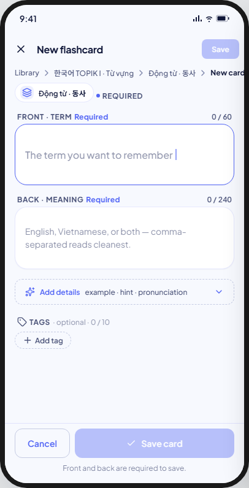 | 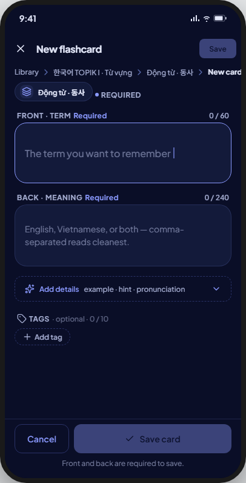 | As drawn: blank fields, Save disabled, caption "Front and back are required to save." |
| valid | 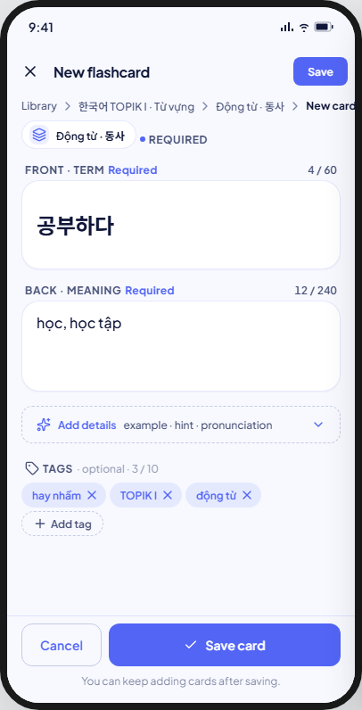 | 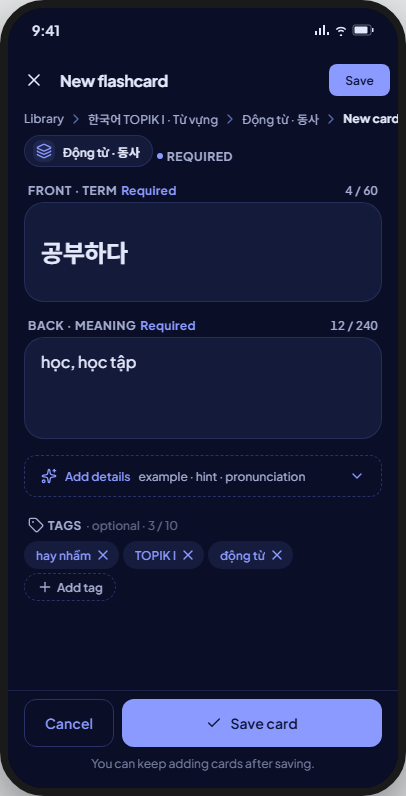 | As drawn. |
| details | 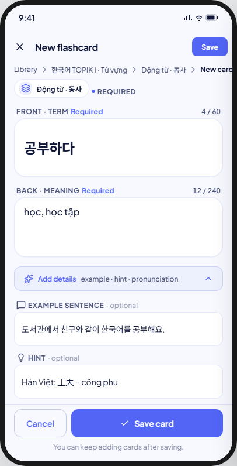 | 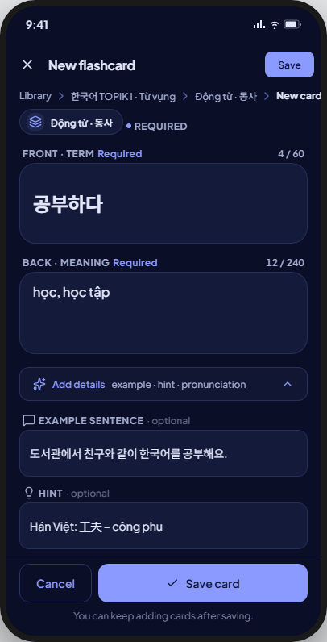 | As drawn, except the opened example/hint/pronunciation are live `MxTextField`s, not the kit's static preview text. |
| validationErr | 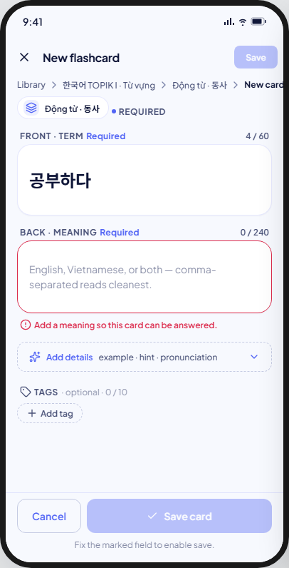 | 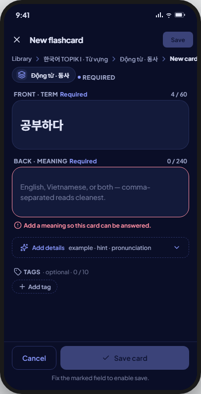 | As drawn, but the message shows only once the back field has been touched (ruling P4a-L2); the kit's mock shows it unconditionally. |
| frontTooLong | 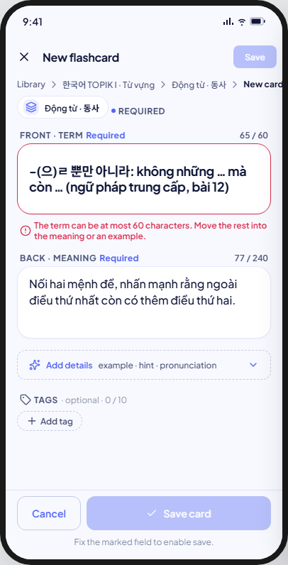 | 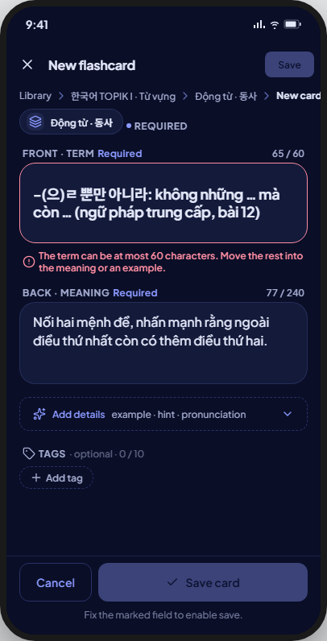 | As drawn, shown once the front field is touched. |
| tagLimit | 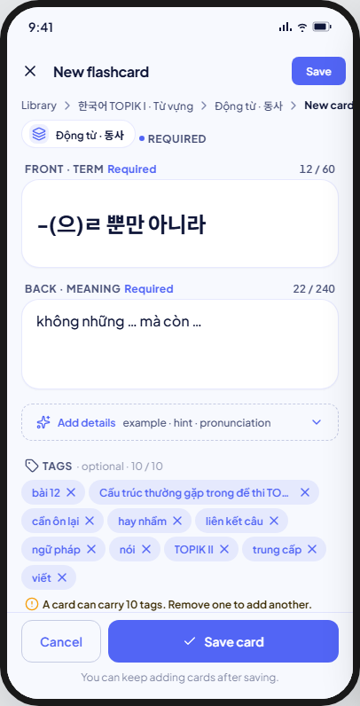 | 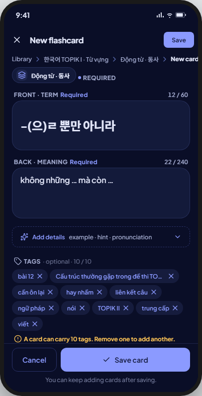 | As drawn. |
| deckRejects | 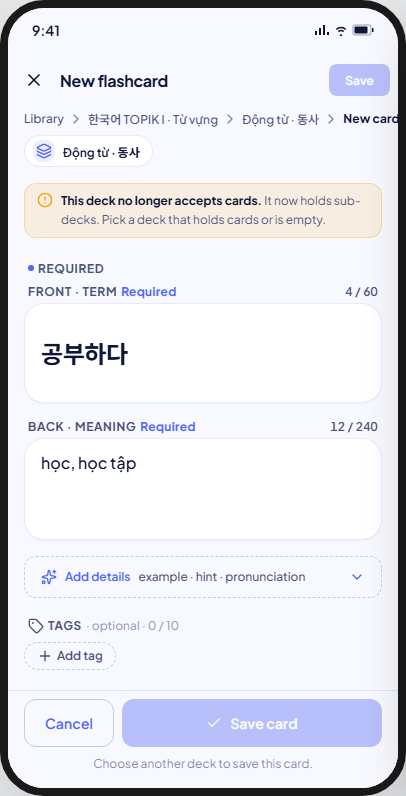 | 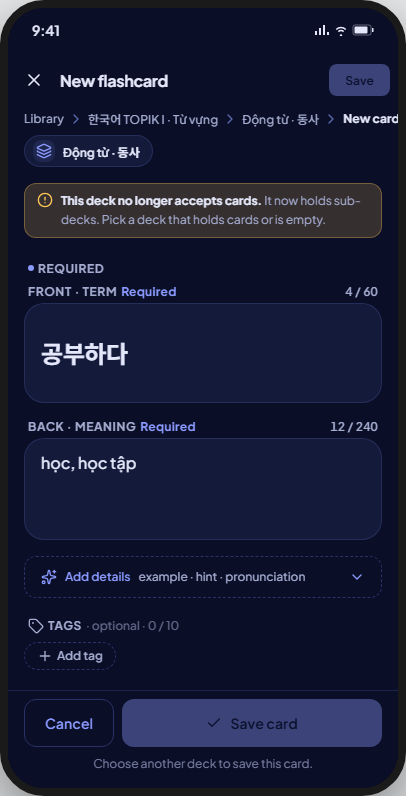 | Caption and banner body differ from the kit — see Deviations; no path exists here to "choose another deck". |
| saving | 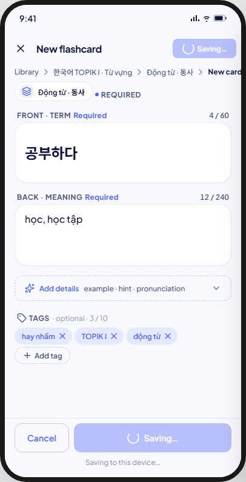 | 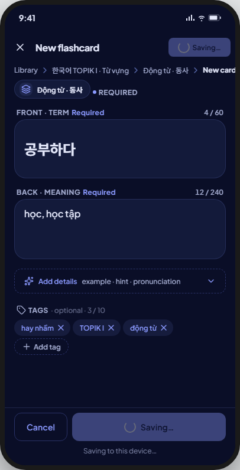 | As drawn, except the button shows only its spinner in place of the label — no "Saving…" text inside the button (see Deviations). |
| saveFailed | 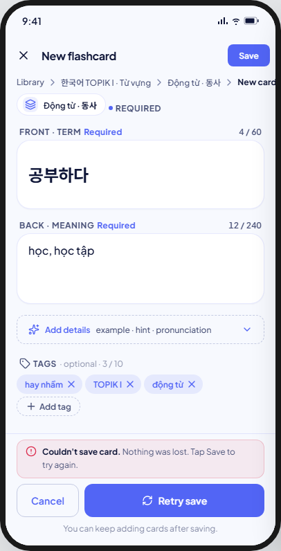 | 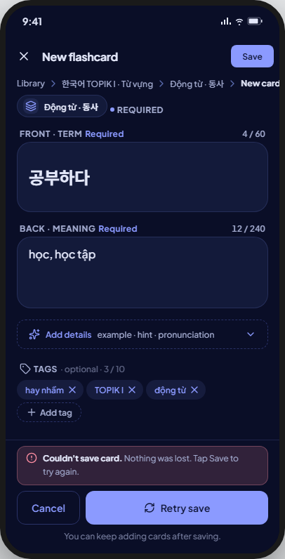 | As drawn. |

Not captured: two states the kit's Create registry does not model, both built as
extensions of ruling P4a-L1…L5 (§9 row 79, "gone state" + discard confirm) from
the edit form to create: a deck-gone state (`CardGoneWidget`, above) when the
target deck disappears mid-add, and a discard-changes confirm ("Discard this
card?") when leaving a dirty new-card form without saving.

## Deviations

| Artifact | V8 | Wins |
|---|---|---|
| Caption "Choose another deck to save this card."; banner "…Pick a deck that holds cards or is empty." | Caption "This deck can't take cards now."; banner "It now holds sub-decks." | §9 row 81 (P4a-L7): the deck chip is not a picker, so no path here lets a person choose another deck |
| "Add details" dashed edge, 42 tall | Solid `outlineVariant` edge, 48 tall (touch floor) | §9 row 101 |
| "Add tag" dashed pill | Outline `MxButton` chip | §9 row 81 (P4a-L8): no dashed-border token |
| The deck path (Breadcrumb + destination pill) sits inside the scroll, above the history strip | `DeckContextHeaderWidget` sits outside the scroll, as a persistent header | §9 row 81: the kit's pill is replaced by a structurally different, app-level component |
| The save button's spinner sits beside "Saving…" text inside the button | `MxButton` swaps the label for the spinner; the words live only in the caption line | §9 row 46 (plan O2): the app-wide `MxButton` loading convention |

## Copy

- App bar: "New card" · "Save" · "Front and back are required to save." · "Fix the marked field to enable save." · "You can keep adding cards after saving." · "Saving to this device…" · "This deck can't take cards now."
- Fields: "Front · Term" · "Back · Meaning" · "Required" · "{count} / {limit}" · "The term you want to remember" · "The meaning; separate several with commas" · "Add details" · "example · hint · pronunciation" · "Optional details" · "· optional" · "Example sentence" · "Hint" · "Pronunciation" · "A sentence using this term" · "A clue that jogs memory without giving the answer" · "Romanisation or a note on how to say it".
- Errors: "Add the term to remember." · "The term can be at most 60 characters. Move the rest into the meaning or an example." · "Add a meaning so this card can be answered." · "The meaning can be at most 240 characters." · "Keep this to 240 characters."
- Deck rejects: "This deck no longer accepts cards." · "It now holds sub-decks."
- Tags: "Tags" · "optional · {count} / {limit}" · "Add tag" · "Remove {tag}" · "A card can carry 10 tags. Remove one to add another."
- Footer: "Cancel" · "Save card" · "Retry save" · "Couldn't save card." · "Nothing was lost. Tap Save to try again."
- Discard: "Discard this card?" · "What you typed is not saved." · "Keep editing" · "Discard".
- Gone: "This deck is no longer here" · "It was moved to Trash or deleted while you were adding cards. This card was not saved." · "Back to deck" · "Open Trash".
- Toast: "Card added".
