<!-- Hand-written screen handoff. Not generated by tools/docs/split_handoff.py. -->

# 09 · Card edit

Editing a card's content: `CardEditorScreen.edit` → `_EditLoader` →
`CardEditorFormWidget` in edit mode (library phase 4a/4b). UC-CARD-001 A1;
BR-CARD-001, BR-CARD-002, BR-CARD-003, BR-CARD-005 (content changes never
touch the study state or history).

## Layout

| Region | Widget | Design |
|---|---|---|
| App bar | `MxAppBar` (content density) | Back; title "Edit card"; a flag `MxIconButton` that toggles here, edit only (ruling P4a-L6, §9 row 80); trailing compact `MxButton` "Save". |
| Deck path | `DeckContextHeaderWidget` | Library › ancestors › deck › "Edit". |
| History summary | `CardEditSummaryWidget` (full-bleed `MxCard`, `MxListRow`, `MxIconTile`) | "{status} · {n} answers · {n} lapses · due {date}"; its chevron opens the card detail, which closes the editor underneath it (ruling P4a-L10, §9 row 82). |
| Front / Back | `CardFieldWidget` | Same fields as create, prefilled from the card. |
| Optional details | `CardOptionalFieldsWidget` (always open, "Optional details" overline, no disclosure) | Example, hint, pronunciation prefilled. |
| Tags | `CardTagEditorWidget` | Prefilled tags; same add/remove/limit behaviour as create. |
| More | `CardTrashSectionWidget` (`MxCard`, `MxButton` outline "Move to Trash") | "Move this card to Trash" / "Leaves this deck and can be restored from Trash for 30 days, schedule and history included."; opens the shared delete dialog (FE-B1 D13). |
| Footer | `CardEditorFooterWidget` | Cancel + "Save changes" / "Retry save"; danger banner after a failed save. |
| Move to Trash dialog | `CardDeleteDialogWidget` (`MxDialog`, `MxNote`, `MxSheetActions`) | "Move this card to Trash?", a front/back preview card, "Recoverable from Trash for 30 days, with its schedule and history. Other cards are unaffected."; the confirm spins while it moves (FE-B1 D15). |
| Discard dialog | `CardDiscardDialogWidget` | "Discard changes?" / "Leaving now keeps the card as it was saved."; Keep editing / Discard (ruling P4a-L5). |
| Gone state | `CardGoneWidget` (`MxEmptyState`) | "This card is no longer here" / "It was moved to Trash while you were editing. Your unsaved changes were not applied; the card can still be restored from Trash."; Back to deck + Open Trash (FE-B1 D11). |

## States

| State | Light | Dark | V8 |
|---|---|---|---|
| loaded | 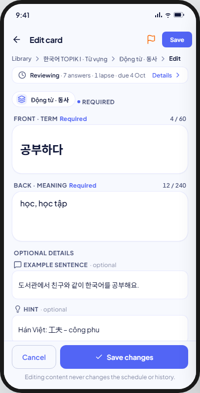 | 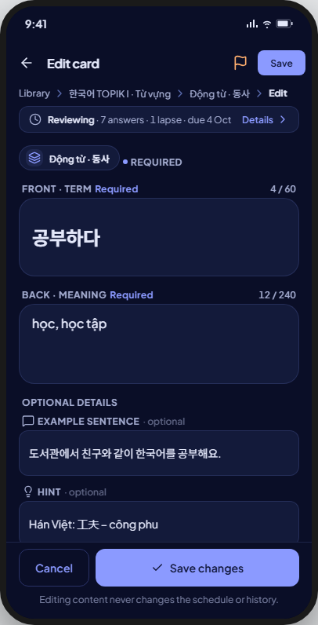 | As drawn. |
| loading | 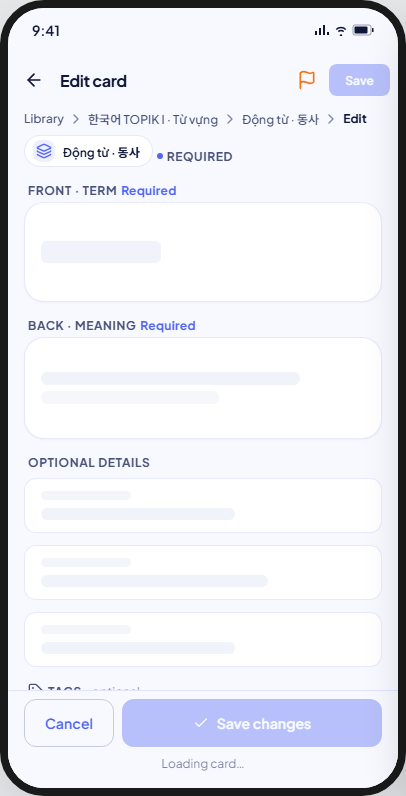 | 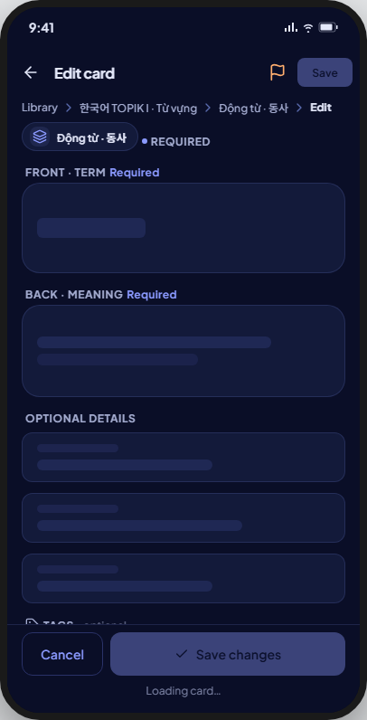 | A single generic `MxSkeletonList` (4 rows) stands in for the whole form; the kit's field-shaped skeletons (front/back boxes, three optional-field shapes, three tag-chip shapes) are not drawn — see Deviations. The flag/Save actions and the deck path also hold off until loaded. |
| loadError | 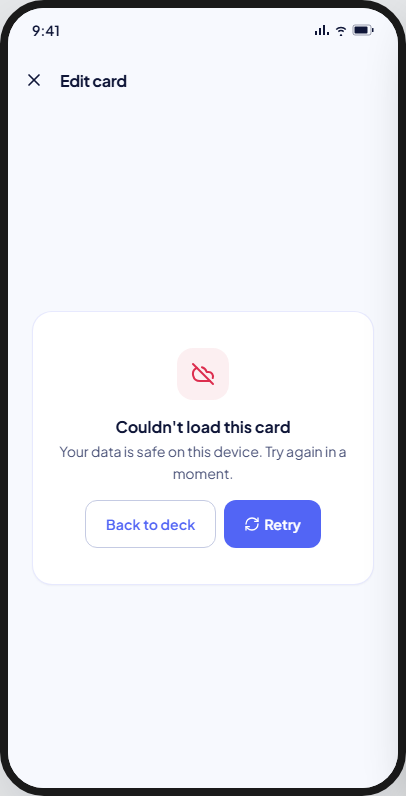 | 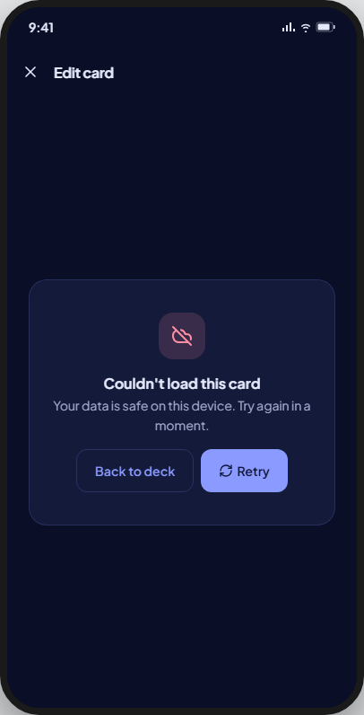 | As drawn: full-screen `MxErrorState`, "Couldn't load this card" — see Deviations for the body wording. |
| notFound | 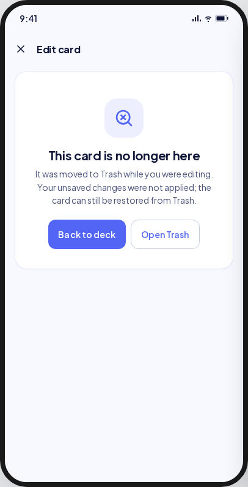 | 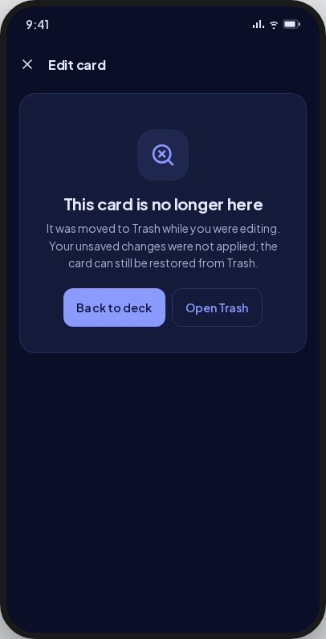 | As drawn (`CardGoneWidget`); both actions are live now that Trash exists (§9 row 87, closed by FE-B1 D11). |
| validationErr | 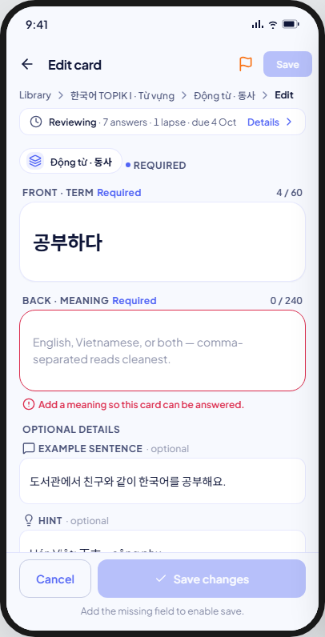 | 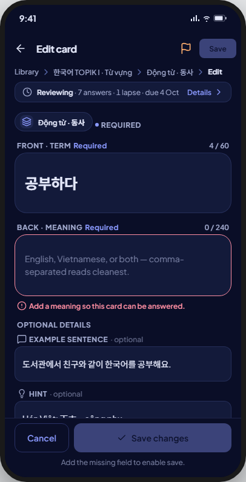 | As drawn, error shown only once the back field is touched (ruling P4a-L2). |
| dirtySaving | 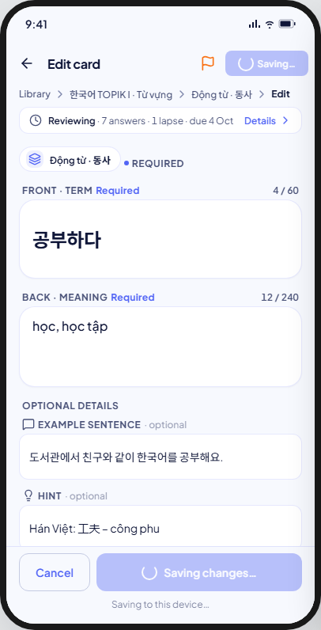 | 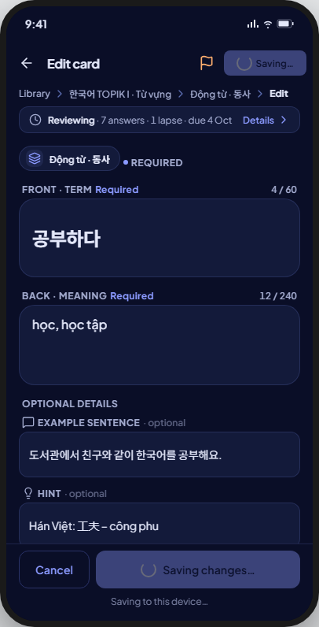 | As drawn, except the button shows only its spinner in place of the label (see Deviations). |
| saveFailed | 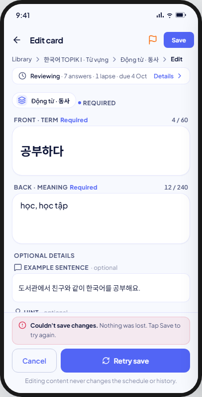 | 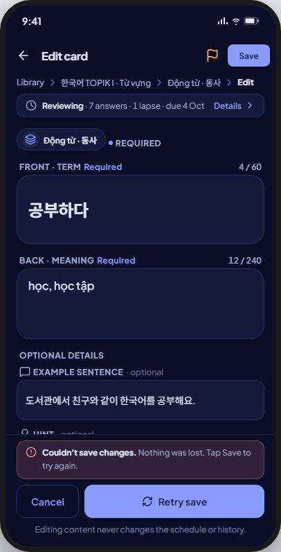 | As drawn. |
| discard | 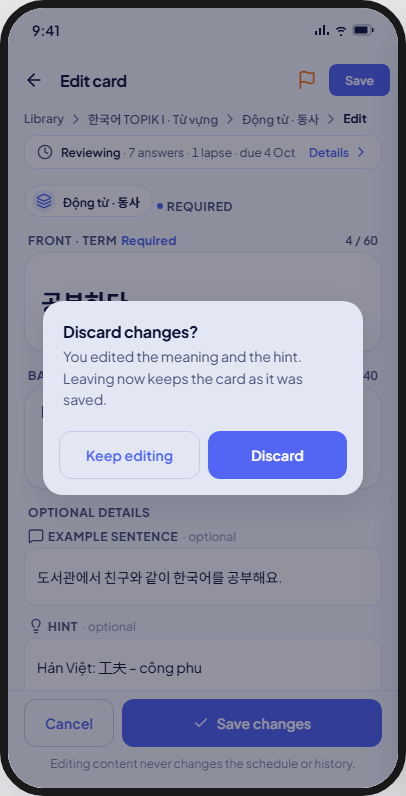 | 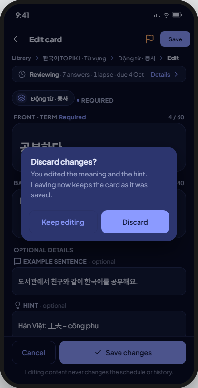 | Body is generic for every edit; it does not name which fields changed as the kit's mock does — see Deviations. |
| delConfirm | 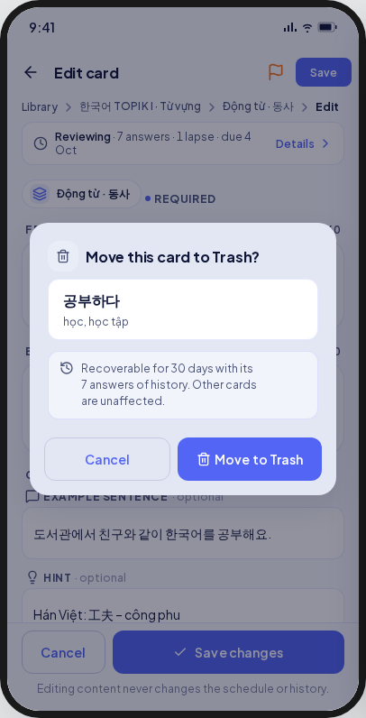 | 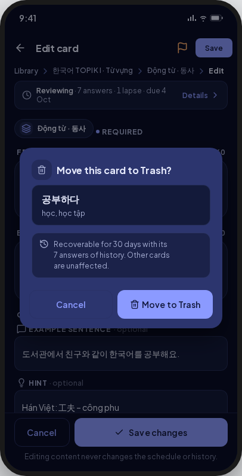 | As drawn, minus the glyph beside the title (§9 row 108) and the answer count in the note (§9 row 110); spins while the move commits (FE-B1 D15). |

Not captured: none — all nine kit states are V8-supported.

## Deviations

| Artifact | V8 | Wins |
|---|---|---|
| A trash glyph beside the Move to Trash dialog's title | No glyph | §9 row 108: `MxDialog` has no glyph slot |
| "Recoverable for 30 days with its 7 answers of history" | "Recoverable from Trash for 30 days, with its schedule and history" | §9 row 110: the dialog cannot read a history count |
| "Leaves Động từ · 동사 and can be restored…" (names the deck) | "Leaves this deck and can be restored…" | §9 row 110: the path above the "More" card already names the deck |
| The flag glyph recolours to the streak tone when set | The glyph swaps (`flag` → `flagged`) but never recolours | §9 row 80 (`Icon(color:)` is banned); no `streak` token exists (§9 row 28, list ruling E-L2) |
| "Add details" dashed edge, 42 tall / "Add tag" dashed pill | Solid edge, 48 tall / outline `MxButton` chip | §9 rows 101, 81 (P4a-L8): no dashed-border token |
| The deck path (history strip + destination pill) sits inside the scroll, strip first | `DeckContextHeaderWidget` sits outside the scroll as a persistent header, above the scrolling history strip | §9 row 81: the kit's pill is replaced by a structurally different, app-level component |
| The save button's spinner sits beside "Saving changes…" text inside the button | `MxButton` swaps the label for the spinner; the words live only in the caption line | §9 row 46 (plan O2) |
| The field-shaped loading skeleton (real card chrome with skeleton text/chips inside) | A single generic `MxSkeletonList` | §9 row 125: the app-wide `MxSkeletonList` loading convention (screens 15, 22, 23, 25, 26 do the same) |
| A shared "Required" legend line (dot + "Required") above the Front field, in addition to each field's own marker | Not built; only the per-field marker shows | Unjustified — to align |
| Discard names the fields that changed ("You edited the meaning and the hint…") | One generic body for every discard | Unjustified — to align |
| Caption "Add the missing field to enable save." | Reuses "Fix the marked field to enable save." (shared with create) | Unjustified — to align (minor; a consequence of the shared form widget) |

## Copy

- App bar: "Edit card" · "Flag this card" · "Remove flag" · "Save".
- History summary: "{status} · {answers}" · "{lapses}" · "due {date}".
- Fields: same labels, hints and errors as 08-card-create, plus "Optional details".
- Footer: "Cancel" · "Save changes" · "Retry save" · "Couldn't save changes." · "Nothing was lost. Tap Save to try again." · "Editing content never changes the schedule or history." · "Fix the marked field to enable save." · "Saving to this device…".
- More: "More" · "Move this card to Trash" · "Leaves this deck and can be restored from Trash for 30 days, schedule and history included." · "Move to Trash".
- Move to Trash dialog: "Move this card to Trash?" · "Recoverable from Trash for 30 days, with its schedule and history. Other cards are unaffected." · "Cancel" · "Move to Trash".
- Discard: "Discard changes?" · "Leaving now keeps the card as it was saved." · "Keep editing" · "Discard".
- Gone: "This card is no longer here" · "It was moved to Trash while you were editing. Your unsaved changes were not applied; the card can still be restored from Trash." · "Back to deck" · "Open Trash".
- Load error: "Couldn't load this card" · "Nothing was lost. Try again in a moment." · "Retry".
