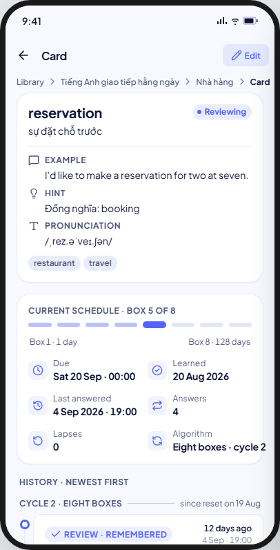
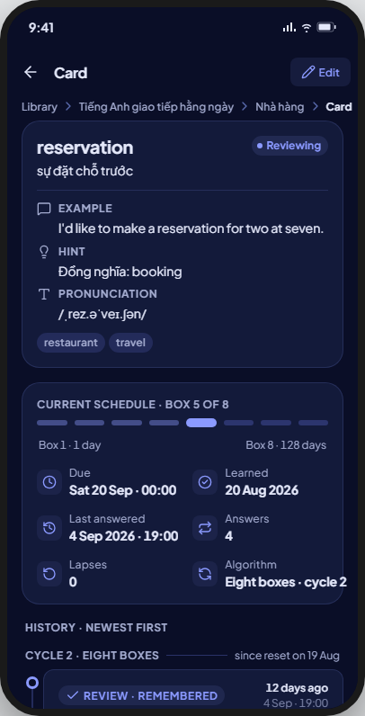
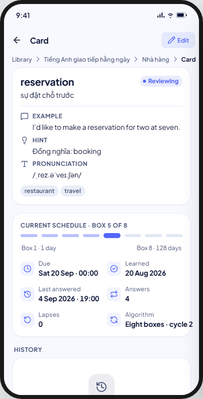
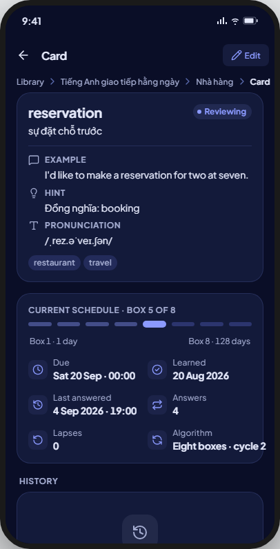
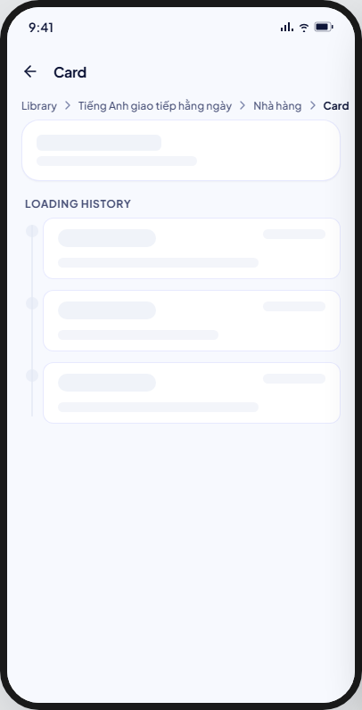
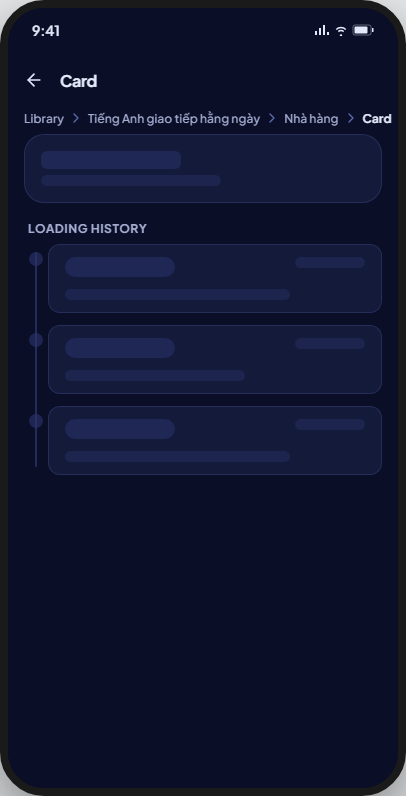
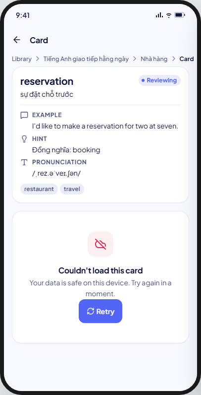
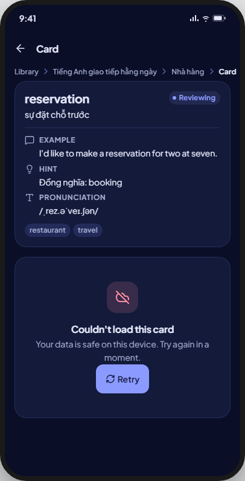
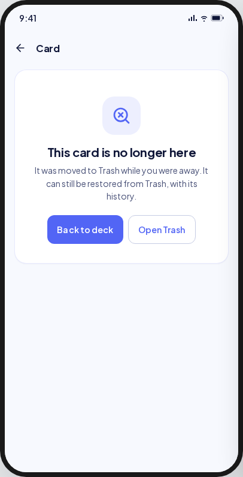
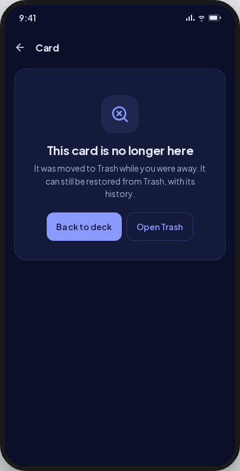

<!-- Hand-written screen handoff. Not generated by tools/docs/split_handoff.py. -->

# 10 · Card detail

A card, read-only, pushed over the card list: `CardDetailScreen` (library
phase 4b). UC-CARD-002; BR-CARD-013 (read-only), BR-CARD-014 (content and
current schedule), BR-CARD-015/017 (paginated, generation-grouped history).

## Layout

| Region | Widget | Design |
|---|---|---|
| App bar | `MxAppBar` (content density) | Back; title "Card"; trailing compact secondary `MxButton` "Edit" (shown only once the card has loaded). |
| Deck path | `DeckContextHeaderWidget` | Library › ancestors › deck › "Card"; shown only once the card (and so its `deckId`) has loaded — see Deviations. |
| Content | `CardDetailContentWidget` (`MxCard`, `MxStatusBadge`, `MxTagChip`) | Status badge + flag glyph in their own row above the front/back (§9 row 89); front, back; only the optional fields that hold a value (BR-CARD-014); tag chips. |
| Schedule | `CardScheduleWidget` (`MxCard`, `MxIconTile` × n) | "Current schedule · Box {n} of 8" + an 8-bar ramp (eight_box), or "Current schedule · SM-2" (sm2, no ramp); fact tiles Due, Learned, Last answered, Answers, Lapses, Algorithm, plus Ease/Interval/Repetitions for SM-2. |
| History header | `MxListSectionHeader` | "History" / "History · newest first". |
| History list | `CardHistoryEventWidget` × n (`MxBadge`, `MxCard`), grouped under a `_CycleHeader` overline | "Cycle {n} · {scheduler}" groups, newest first; each event: kind badge + action text, absolute date/time, mode, box/ease/interval before→after, hint used, timed out, next due — no rail, no dots, no relative time, no free-text note (§9 rows 86, 90). |
| Load more | `MxButton` (secondary, block) or `MxInlineBanner` (danger) on failure | "Load older history" / "Couldn't load older history." with Retry. |
| End of history | Centred caption line | "Beginning of history · card added {date}". |
| Gone state | `CardGoneWidget` (`MxEmptyState`) | "This card is no longer here" / "It was moved to Trash while you were away. It can still be restored from Trash, with its history."; Back to deck + Open Trash (FE-B1 D11). |

## States

| State | Light | Dark | V8 |
|---|---|---|---|
| loaded |  |  | As drawn. |
| loadMore |  |  | As drawn: a secondary block `MxButton` "Load older history" in place of the kit's tinted full-bleed button. |
| loadMoreFailed |  |  | Retry sits under the message, not trailing on the same line as the kit's mock — see Deviations; what loaded stays. |
| empty |  |  | As drawn: `MxEmptyState` (neutral, compact) "Not studied yet"; content and schedule cards still show above it. |
| loading |  |  | A single generic `MxSkeletonList` (4 rows) replaces the whole body; the kit's real content-card shape (skeleton front/back inside real chrome) plus a skeleton timeline are not drawn — see Deviations. |
| error |  |  | As drawn: full-screen `MxErrorState`, "Couldn't load this card" — see Deviations for the body wording. |
| notFound |  |  | As drawn (`CardGoneWidget`, shared with the editor's gone state); both actions live now that Trash exists (§9 row 87, closed by FE-B1 D11). The deck path is hidden here, as in the kit. |

Not captured: none — all seven kit states are V8-supported.

## Deviations

| Artifact | V8 | Wins |
|---|---|---|
| Status badge and flag sit beside the front/back, in a two-column grid | Status badge and flag sit above the front/back, full width | §9 row 89 |
| A vertical rail with dot markers per event; relative time ("12 days ago") beside the absolute date; "Finished learning" / edited notes | A plain `MxCard` per event, no rail or dots, absolute date and time only, no free-text note | §9 row 86 |
| One pill reading "Learning · Remembered" (kind · action together) | `MxBadge` carries the kind only ("Learning"); the action ("Remembered") is text beside it | §9 row 90 |
| Cycle header carries a reset sub-line ("since reset on 19 Aug") and a rule | Cycle header is the overline label only ("Cycle {n} · {scheduler}") | §9 row 86: the reset date is not stored |
| The load-more-failed banner's Retry sits trailing, on the message's line | Retry sits under the message | §9 row 50: `MxInlineBanner` actions always sit under the message |
| The deck path (breadcrumb) shows even while the card is loading, failing, or gone | Shown only once the card has loaded, since its `deckId` is not known before then; hidden on loading/error/notFound | Justified — UC-CARD-002 E1: the detail can open from an id alone (e.g. a stale link), so the deck is not known until the card resolves |
| A full content card (with skeleton front/back inside real chrome) plus a skeleton timeline draws while loading | A single generic `MxSkeletonList` | §9 row 125: the app-wide `MxSkeletonList` loading convention (screens 15, 22, 23, 25, 26 do the same) |
| Content, schedule and history cards at radius 20 | `MxCard` radius 12 everywhere in-flow | §9 row 115 |
| Load error body "Your data is safe on this device. Try again in a moment." | Shared local-first body "Nothing was lost. Try again in a moment." | Justified — the app's one shared error body, already used by 06-trash and 23-settings |

## Copy

- App bar: "Card" · "Edit".
- Content: card front, back, "Example sentence" · "Hint" · "Pronunciation" (each shown only with a value), tag chips.
- Schedule: "Current schedule · Box {box} of {count}" · "Current schedule · SM-2" · "Box 1 · 1 day" · "Box 8 · 128 days" · "Due" · "Learned" · "Last answered" · "Answers" · "Lapses" · "Algorithm" · "{scheduler} · cycle {generation}" · "Ease" · "Interval" · "{count, plural, =1{1 day} other{{count} days}}" · "Repetitions" · "Not yet".
- History: "History" · "History · newest first" · "Cycle {generation} · {scheduler}" · "Not studied yet" · "Every answer in a learning or review session will appear here, newest first." · "Load older history" · "Couldn't load older history." · "What is shown is complete up to here." · "Beginning of history · card added {date}" · "Box {from} → {to}" · "Ease {from} → {to}" · "Interval {from}d → {to}d" · "Hint used" · "Time ran out" · "Next due {date}".
- History kinds/actions: "Learning" · "Review" · "Repeat" · "Remembered" · "Forgot" · "Again" · "Hard" · "Good" · "Easy".
- Error: "Couldn't load this card" · "Nothing was lost. Try again in a moment." · "Retry".
- Gone: "This card is no longer here" · "It was moved to Trash while you were away. It can still be restored from Trash, with its history." · "Back to deck" · "Open Trash".
