<!-- Hand-written screen handoff. Not generated by tools/docs/split_handoff.py. -->

# 12 · Card export

A bottom sheet that hands a deck's cards, or the selected ones, to the system share
sheet as a CSV, TSV or XLSX file. UC-TRANSFER-002; spec
[2026-09-26-card-transfer-design.md](../../../superpowers/specs/2026-09-26-card-transfer-design.md)
§6, §8.

## Entry points

- The open deck's `⋮` sheet, "Export cards": a deck of cards only. An unset deck, a root
  and a deck of decks do not offer it (UC-TRANSFER-002 E5). The deck's cards are
  counted before the sheet opens, so the sheet never loads.
- The card list's bulk bar, "Export": the selected cards. The selection stays after the
  export (A1).

## Layout

| Region | Widget | Design |
|---|---|---|
| Header | `MxBottomSheet` header | "Export all {n} cards" and "Every card in {deck}, whatever filter or search is active."; for a selection, "Export {n} selected cards" and "Only the cards you selected." |
| Problem | `MxInlineBanner` | One banner per problem, above the formats. Danger for a file that could not be prepared, warning otherwise. |
| Formats | `MxListSectionHeader` + `MxOptionRow` × 3 | CSV (default, "Recommended" badge), TSV, XLSX, each with what it is for. Locked while a file is prepared. |
| Content note | `MxNote` (file icon) | The six columns; no schedule, no history. |
| Footer | `MxSheetActions` (sheet form) | Cancel · "Export {n} cards" with the share icon; "Preparing…" spinning while the file is built and shared (A4); "Try again" after a failure it can fix; Close alone when it cannot. |
| Toast | `MxSnackbar` | "Handed {n} cards to the system." once the share sheet took the file. |

The overline, the banner and the note line up with the title (20 dp).

## States

| State | Light | Dark | V8 |
|---|---|---|---|
| wholeDeck | 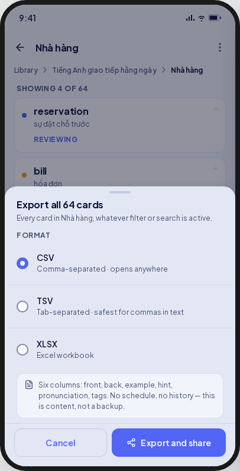 | 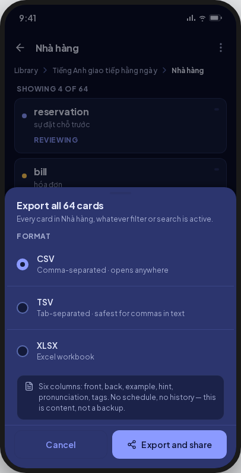 | CSV carries "Recommended"; the action reads "Export {n} cards". |
| selection | 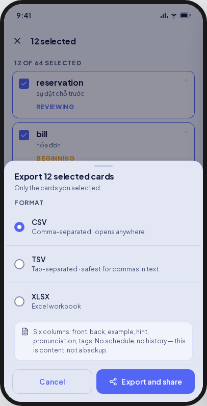 | 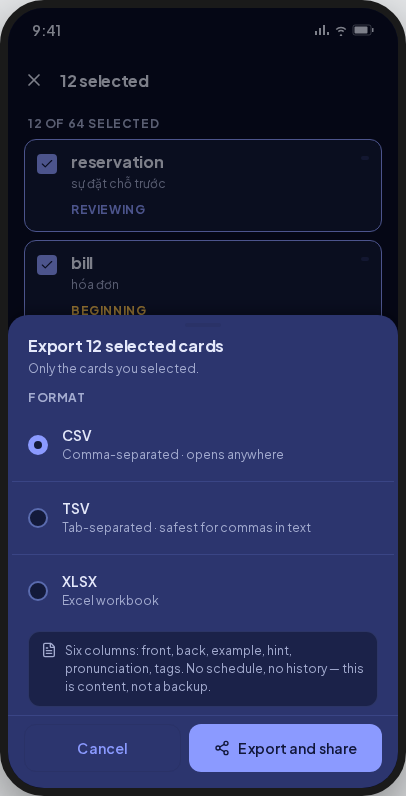 | As wholeDeck. |
| preparing | 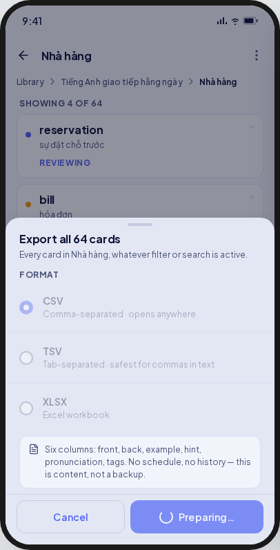 | 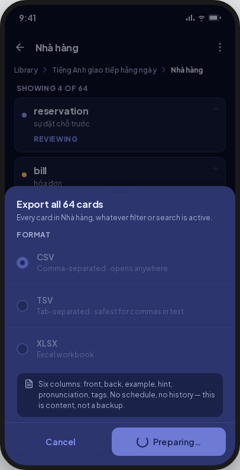 | As drawn; Cancel closes the sheet and nothing is shared. |
| handedOver | 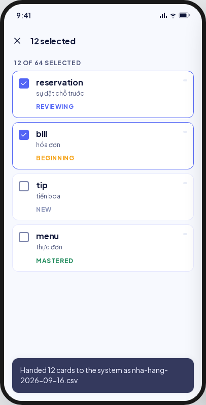 | 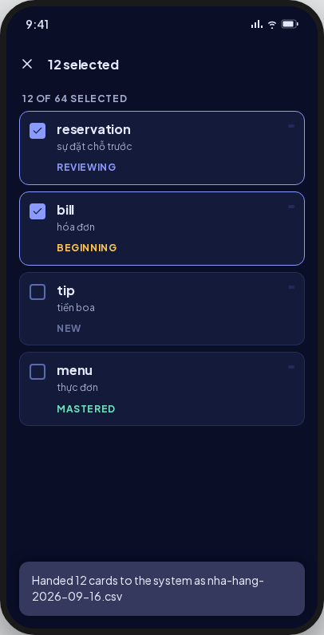 | The toast names no file. |
| shareClosed | 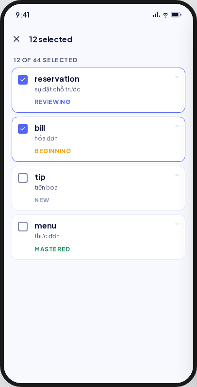 | 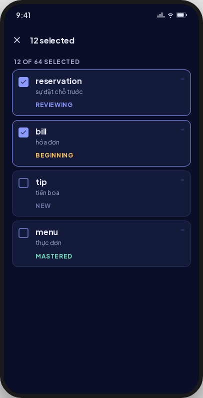 | **Deviation:** the export sheet stays open, as it was. |
| failed | 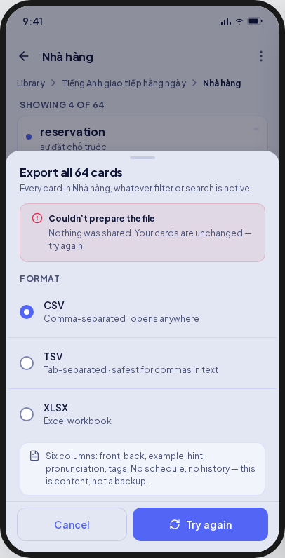 | 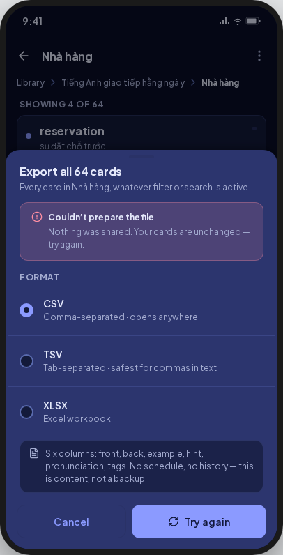 | For a read or encode failure. A share failure has its own copy, also with Try again. |
| noShareTarget | 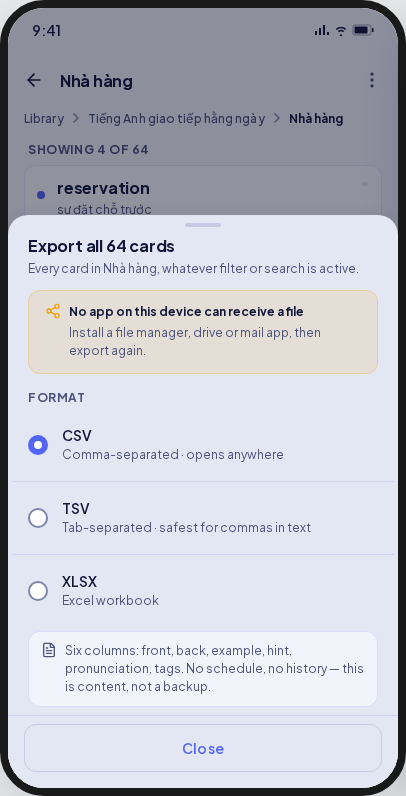 | 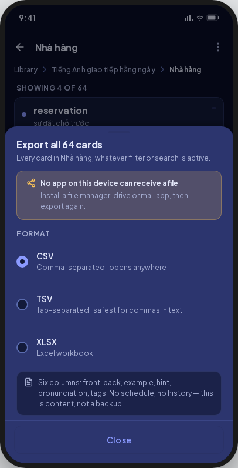 | As drawn; the banner shows the warning glyph. |
| staleSelection | 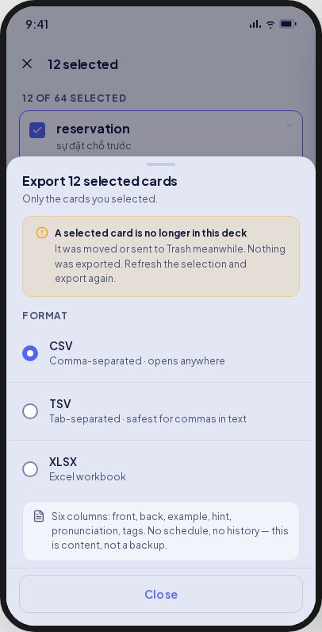 | 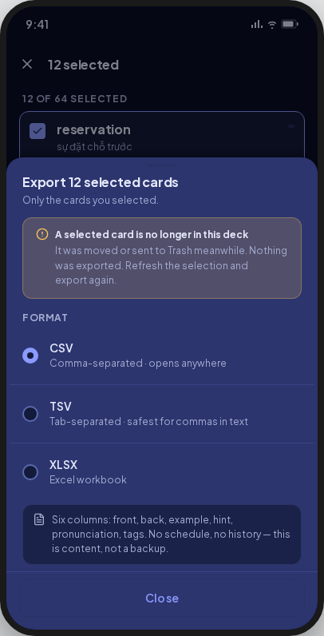 | As drawn (FE-B1 D12 closes X11). |
| nothingToExport | 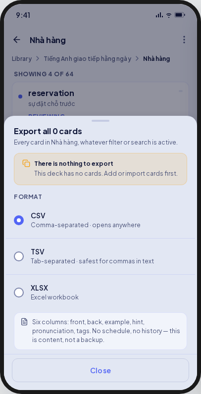 | 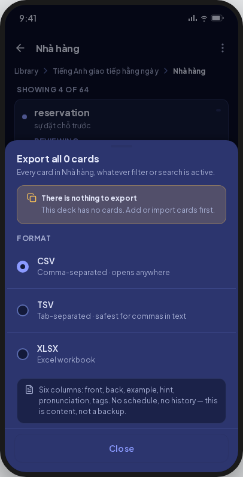 | Reached only by a deck emptied between the count and the export, or by a count of 0. |

Goldens: `test/features/transfer/presentation/goldens/export_{deck,failed,stale}_{light,dark}.png`.

## Deviations

| Artifact | V8 | Wins |
|---|---|---|
| Closing the share sheet closes the export sheet | The export sheet stays open with its scope and format | UC-TRANSFER-002 A3 (ruling E1) |
| "Handed 12 cards to the system as nha-hang-2026-09-16.csv" | "Handed 12 cards to the system." | Spec §7, BR-TRANSFER-014 (ruling E2) |
| CSV without a label | CSV carries a "Recommended" badge | UC-TRANSFER-002 step 2 (ruling E3) |
| One "Couldn't prepare the file" for every failure | Read and encode failures share it; a share failure has its own copy; both offer Try again | UC-TRANSFER-002 E2–E4 (ruling E4) |
| `deckActions` offers "Export all N cards" on every deck | "Export cards" on a deck of cards only; Coming soon no longer lists export | UC-TRANSFER-002 E5 (ruling E5) |
| "Export and share" | "Export {n} cards" | UC-TRANSFER-002 step 3 (owner 2026-09-26) |
| A file name folded to ASCII (`nha-hang-…`) | The deck's own letters (`Nhà-hàng-2026-09-26.csv`) | BR-TRANSFER-013, backend plan C5 |
| A glyph per banner (share, copy) | The banner's tone glyph | `MxInlineBanner` has no glyph slot |

## Copy

- Header: "Export all {n} cards" · "Every card in {deck}, whatever filter or search is active." · "Export {n} selected cards" · "Only the cards you selected."
- Formats: "Format" · "CSV" · "Comma-separated · opens anywhere" · "TSV" · "Tab-separated · safest for commas in text" · "XLSX" · "Excel workbook" · "Recommended".
- Note: "Six columns: front, back, example, hint, pronunciation, tags. No schedule, no history — this is content, not a backup."
- Actions: "Cancel" · "Export {n} cards" · "Preparing…" · "Try again" · "Close".
- Problems: "Couldn’t prepare the file" · "Couldn’t hand the file over" · "No app on this device can receive a file" · "A selected card is no longer in this deck" · "There is nothing to export".
- Toast: "Handed {n} cards to the system."
