<!-- Hand-written screen handoff. Not generated by tools/docs/split_handoff.py. -->

# 13 · Study home

The Study tab's landing screen (FE-A8): `StudyHomeScreen`, the session Resume
card takes up plus every root deck with its whole-tree workload, read as one
snapshot. UC-STUDY-002.

## Layout

| Region | Widget | Design |
|---|---|---|
| App bar | `MxAppBar` (screen density) | "Study". The kit's trailing date ("Tuesday, 16 Sep") is dropped — see Deviations. |
| Resume card | `MxCard` (hero) + `MxIconTile` + new: `MxLinearProgress` | "Continue studying" overline with a live pulse dot; "{deckOrSession name}", "{kind} · {mode} · {done} / {total} cards", a thin progress track, "Resume" (`MxButton`, primary). Shown only when BR-STUDY-075's four read-only conditions all hold. |
| Workload hero | `MxCard` (hero) + `MxWorkloadBreakdownLine` | "Waiting for you", "{n} cards due", then overdue · today · new "across {k} decks" (BR-STUDY-068). Zero workload swaps to a calm `MxEmptyState`-shaped card: "Nothing due right now" (BR-STUDY-008) — not an error, not an achievement. |
| Section header | `MxListSectionHeader` + trailing `MxButton` (compact secondary, ruling E-L3) | "Your decks" · "Library" (opens the Library root, screen 01). |
| Rows | full-bleed `MxCard` of `MxListRow`s | leading `MxIconTile` ("layers"); title = deck name; meta = `MxWorkloadBreakdownLine` (overdue · today · new, always shown even at 0, each led by its glyph; "No cards yet" for a deck with no card — BR-STUDY-076, BR-STUDY-077); trailing `MxBadge` "{n} due" when due > 0, else a chevron. A deck with no card (`canStudy = false`) gets no chevron and no tap target (BR-STUDY-076). Rows are ordered Overdue ↓ Due today ↓ New ↓ name (BR-STUDY-076). |

## States

| State | Light | Dark | V8 |
|---|---|---|---|
| loaded | 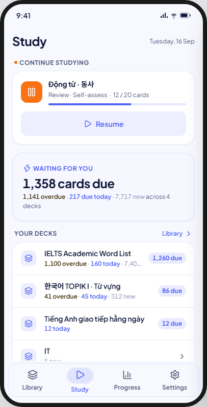 | 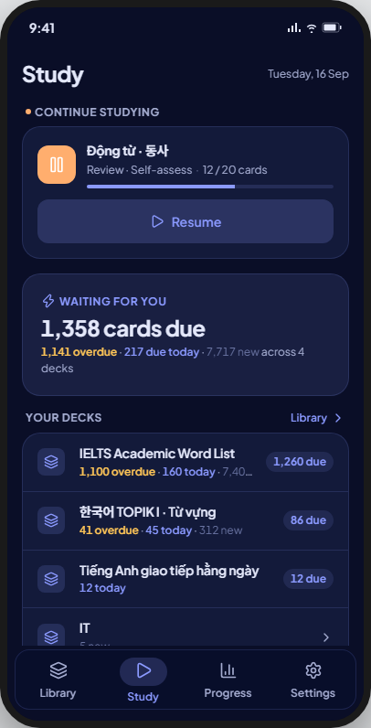 | As drawn, minus the "Scheduled" term and the streak colour — see Deviations. |
| noResume | 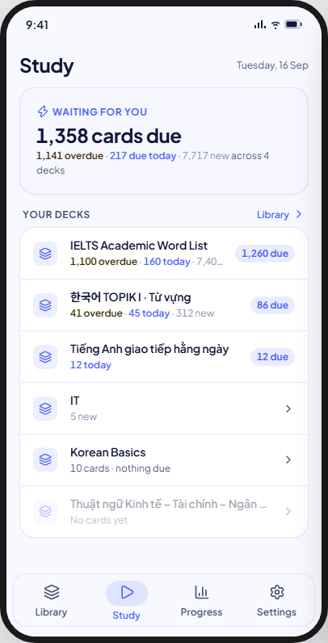 | 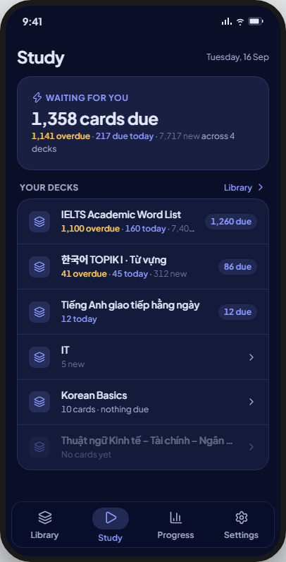 | As drawn: same workload hero and deck list, no Resume card (BR-STUDY-075 A1). |
| zero | 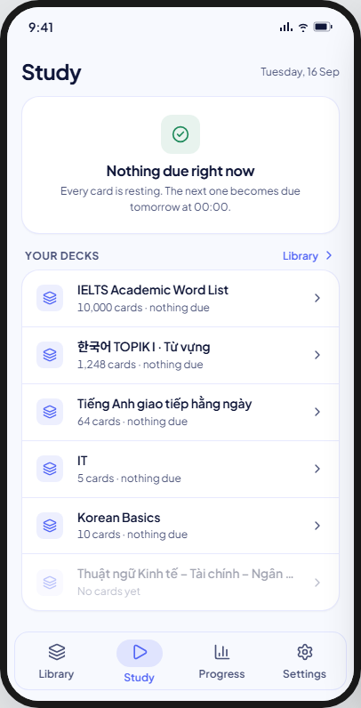 | 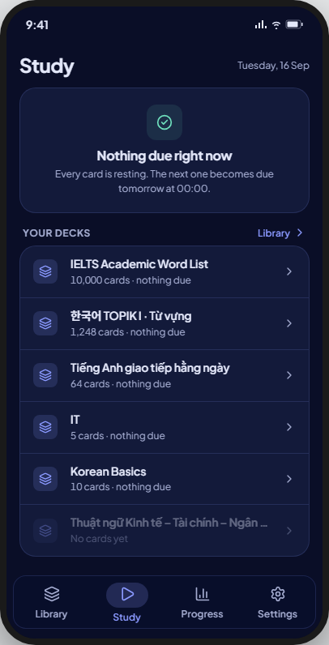 | As drawn: every root deck holds cards but nothing is due; rows still list every deck with 0/0/0 (BR-STUDY-008, BR-STUDY-077). |
| noDecks | 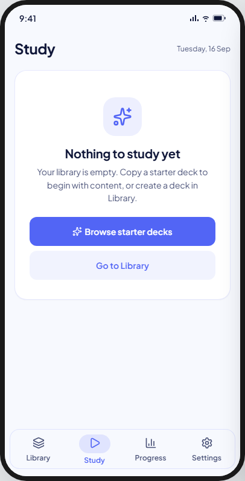 | 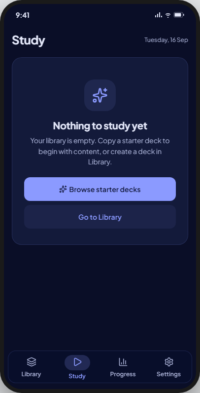 | **Deviation:** "Browse starter decks" is hidden; "Go to Library" is the only action. |
| noCards | 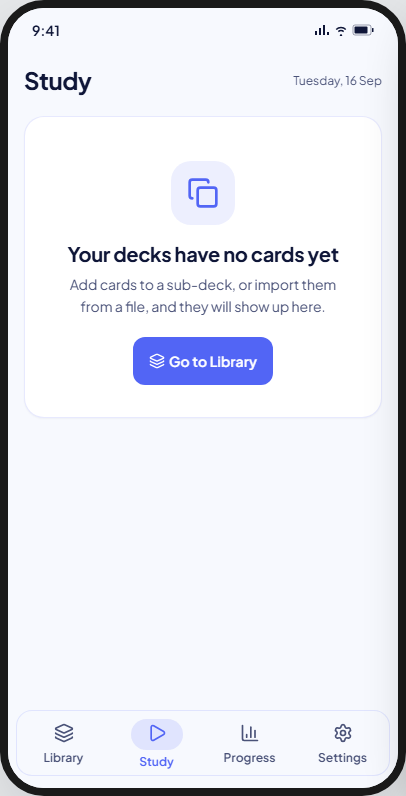 | 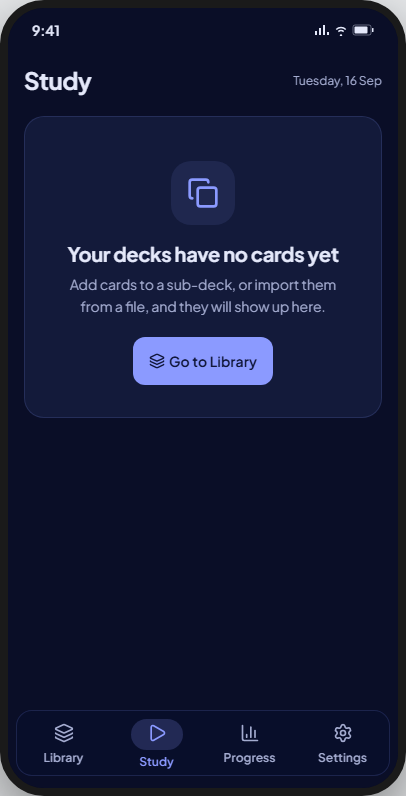 | As drawn: root decks exist, none holds a card, no invented Due number (BR-STUDY-077). |
| loading | 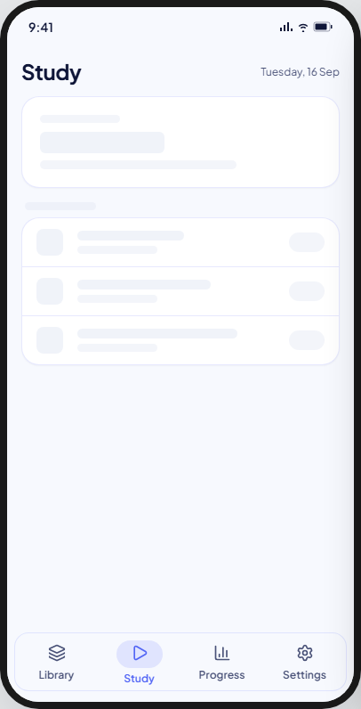 | 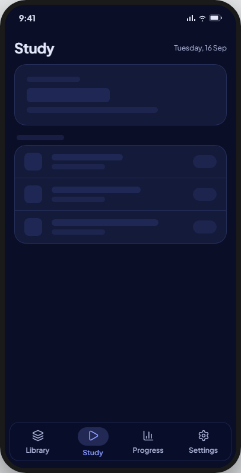 | Skeletons in the hero and row shapes; simplified — see Deviations. |
| error | 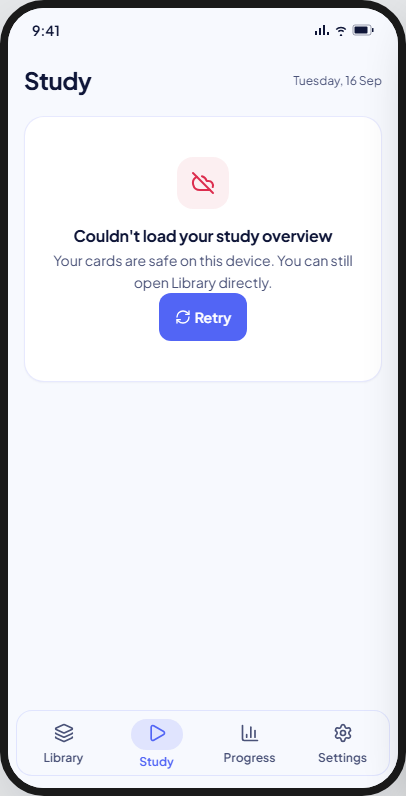 | 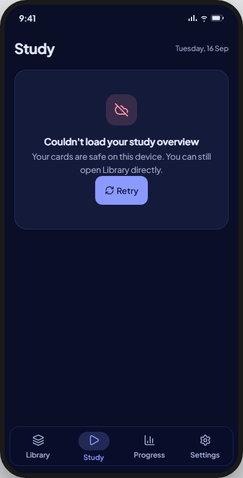 | As drawn (`MxErrorState`, retry; no table/query names — BR-STUDY-077). |

Not captured: none — all seven kit states are V8-supported.

**Built (FE-A8, study roadmap P6):** `StudyHomeScreen` in the Study tab's branch, over
`WatchStudyHomeUseCase`; it writes nothing but Resume (BR-STUDY-075).
- Resume runs `ResumeStudySessionUseCase` and opens the session route. A refusal
  shows the toast "This session can't be continued any more", and a failed write shows
  "Couldn't start the session."; the stream refreshes by itself.
- A deck row opens that deck's Study Entry; "Library" and "Go to Library" open the
  Library root. Both navigate into the Library branch, as the summary's "Study this deck"
  does.
- Goldens:
  `test/features/study/presentation/goldens/study_home_{loaded,no_resume,zero,no_decks,no_cards,loading,error,large_text}_*`.

## Deviations

| Artifact | V8 | Wins |
|---|---|---|
| Hero breakdown shows three disjoint counts (overdue, today, new) | Four: "Scheduled" joins them; `MxWorkloadBreakdownLine` gains a fourth term in FE-A8 | BR-STUDY-068 |
| Resume card's pulse dot and paused-icon tile in the kit's streak colour | Primary colour | Row 28 of the UI-base ruling ledger: `Badge` (and the palette generally) offers no `streak` tone |
| App bar's trailing date "Tuesday, 16 Sep" | Dropped | `MxAppBar.actions` takes buttons only; no BR/UC calls for a date display here |
| noDecks: "Browse starter decks" primary action, pointing at the Starter Library | Hidden; "Go to Library" is the only action | Spec A4 (starter decks wait under Coming soon; screen 03 is out of V8) — same ruling already applied to 01-deck-list's `rootEmpty` |
| Resume card's linear progress track | new shared `MxLinearProgress`, a themed 4-tall track: 13 and 14 both draw it | Two screens use it (no speculative widget) |
| The dot beside "Continue studying" pulses | Static and decorative, as on 14 | FE-A8 ruling S3: one treatment for both resume surfaces; no looping motion |
| The zero-workload body always says "tomorrow at 00:00" | "…tomorrow." on the next local day, "…on {date}." later, "Every card is resting." with no next date | FE-A8 ruling S2; BR-STUDY-074 (the local day) |
| The zero card's check tile in the mastery green | The `success` tone | FE-A6 spec D14: green is mastery's alone |
| Resume in the soft-primary pill | `MxButton` primary, block, with the play glyph | FE-A8 ruling S9: `primary-soft` is PRESERVE_ONLY in the theme binding |
| "Library" as a text link with a chevron | A compact secondary `MxButton` | Ruling E-L3, as the handoff's layout names it |
| The hero's breakdown in one line; a row's breakdown on one fixed ellipsized band | Both wrap, between whole terms only, so "across {n} decks" and every row count are never cut | Kit hero style (`whiteSpace: normal`); BR-STUDY-076 for rows (after P6) |
| Loading: a three-line hero skeleton, a section-header bar and a trailing pill on each row | A two-bar hero skeleton and the standard `MxSkeletonList` rows | UI-base ruling O3: one list skeleton shape app-wide; no BR calls for a bespoke one (Impeccable after P6) |
| A deck row drops a zero term ("2 new"), falls back to "{n} cards · nothing due" when all three are zero, and draws no glyph | A deck with cards always states "0 overdue · 0 today · 2 new", a zero term muted; each term leads with its glyph (history, zap, sparkles) in its ink; a deck with no card still reads "No cards yet" | BR-STUDY-076 (three counts always shown, each with its own icon and label); BR-STUDY-077 (no workload stated for an empty deck). Fixed after P6 (Codex review on #85) |
| The empty states' "Go to Library" carries a layers glyph | No glyph | `MxEmptyState`'s action takes no icon (a shared-widget trait on every screen; Impeccable after P6) |

## Accessibility

- The dot and the glyphs, the workload terms' included, are decorative (no node of their own); the progress track says nothing, as the line beside it states "{done} of {total} cards" (FE-A8 S3, S7).
- A deck with no card is shown dimmed and read as a disabled button (S4); every row is at least 48 tall.
- The hero title, "across {n} decks" and "{n} due" are plurals (S5).
- A row's breakdown wraps between whole terms (glyph, count, word and dot stay together) instead of ellipsizing, so all three counts show at any text size (BR-STUDY-076; replaces S6's one-line ellipsis). The hero's breakdown wraps the same way.

## Copy

- Header: "Study" · "Tuesday, 16 Sep" (dropped).
- Resume: "Continue studying" · "{kind} · {mode}" e.g. "Review · Self-assess" · "{done} / {total} cards" · "Resume".
- Workload: "Waiting for you" · "{n} cards due" · "across {n} decks".
- Workload, zero: "Nothing due right now" · "Every card is resting. The next one becomes due tomorrow." · "…on {date}." · "Every card is resting." (V8, S2; the kit's "tomorrow at 00:00" is not kept).
- Workload hero: "{n} scheduled" joins the breakdown, muted (BR-STUDY-068).
- Resume refused: "This session can't be continued any more".
- Section: "Your decks" · "Library".
- Row: "{n} due".
- No decks: "Nothing to study yet" · "Your library is empty. Copy a starter deck to begin with content, or create a deck in Library." · "Browse starter decks" · "Go to Library". V8 drops the starter line: "Your library is empty. Create a deck in Library to get started."
- No cards: "Your decks have no cards yet" · "Add cards to a sub-deck, or import them from a file, and they will show up here." · "Go to Library".
- Error: "Couldn't load your study overview" · "Your cards are safe on this device. You can still open Library directly."
