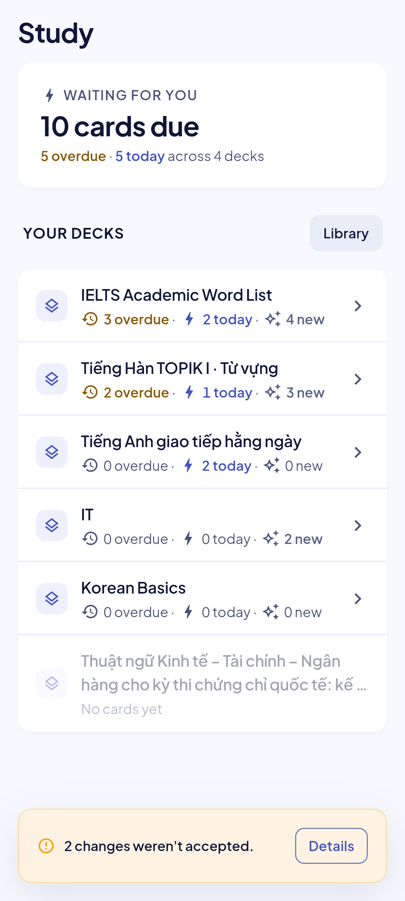
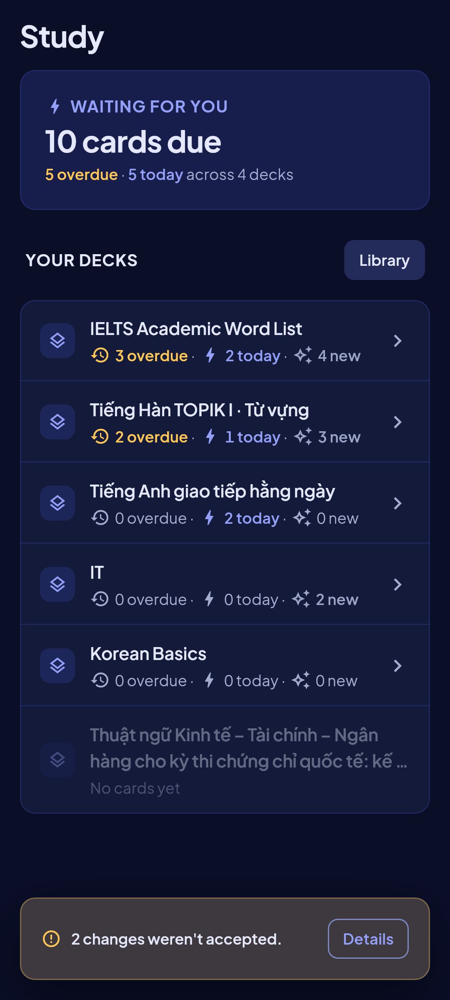
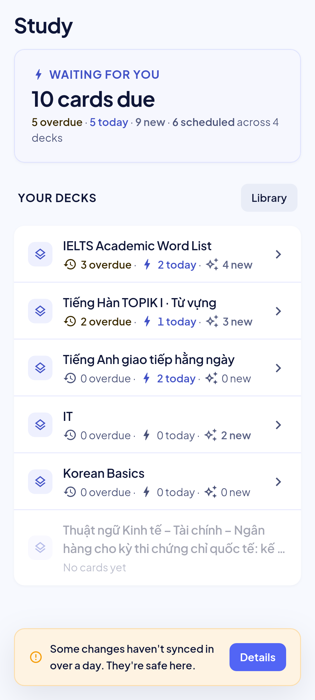
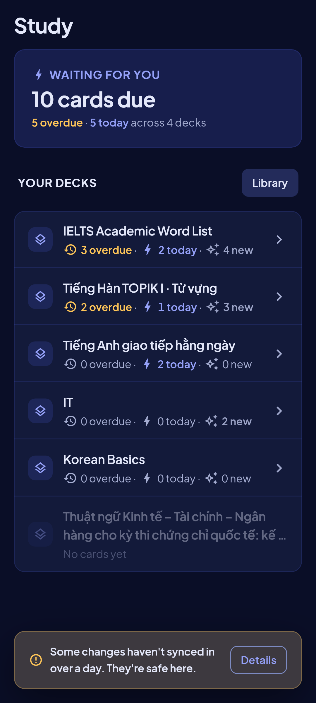

<!-- Hand-written screen record. -->

# 13 · Study home

The Study tab's landing screen (FE-A8): `StudyHomeScreen`, the session Resume
card takes up plus every root deck with its whole-tree workload, read as one
snapshot. UC-STUDY-002.

## Layout

| Region | Widget | Design |
|---|---|---|
| App bar | `MxAppBar` (screen density) | "Study"; no date (see Rulings). |
| Resume card | `MxCard` (hero) + `MxIconTile` + new: `MxLinearProgress` | "Continue studying" overline with a live pulse dot; "{deckOrSession name}", "{kind} · {mode} · {done} / {total} cards", a thin progress track, "Resume" (`MxButton`, primary). Shown only when BR-STUDY-075's four read-only conditions all hold. |
| Workload hero | `MxCard` (hero) + `MxWorkloadBreakdownLine` | "Waiting for you", "{n} cards due", then overdue · today · new "across {k} decks" (BR-STUDY-068). Zero workload swaps to a calm `MxEmptyState`-shaped card: "Nothing due right now" (BR-STUDY-008) — not an error, not an achievement. |
| Section header | `MxListSectionHeader` + trailing `MxButton` (compact secondary, ruling E-L3) | "Your decks" · "Library" (opens the Library root, screen 01). |
| Sync notice | `MxFloatingNotice` in `MxAppShell.notice` + compact `MxButton` | SB-U1: floats over the bottom of the loaded page when a change has waited more than 24 h or the server refused a row (sync status spec R2, §5.3; owner ruling 2026-09-28: short, over the content). "Details" (outline, a link out of a warning, not the screen's decision; critique 2026-09-30 part 1) on the message line opens screen 27. No close button (R7). Hidden without Supabase, while loading, on a read error and when the status stream fails. |
| Rows | full-bleed `MxCard` of `MxListRow`s | leading `MxIconTile` ("layers"); title = deck name; meta = `MxWorkloadBreakdownLine` (overdue · today · new, always shown even at 0, each led by its glyph; "No cards yet" for a deck with no card — BR-STUDY-076, BR-STUDY-077); a chevron on every row that can be studied; the due counts are in the meta line, so there is no due badge (critique 2026-09-30). A deck with no card (`canStudy = false`) gets no chevron and no tap target (BR-STUDY-076). Rows are ordered Overdue ↓ Due today ↓ New ↓ name (BR-STUDY-076). |

## States

| State | Golden (light) | Golden (dark) | App |
|---|---|---|---|
| loaded | `study_home_loaded_light.png` | `study_home_loaded_dark.png` | The hero's due breakdown (overdue · today) and the primary resume dot (see Rulings). |
| noResume | `study_home_no_resume_light.png` | `study_home_no_resume_dark.png` | Same workload hero and deck list, no Resume card (BR-STUDY-075 A1). |
| zero | `study_home_zero_light.png` | `study_home_zero_dark.png` | Every root deck holds cards but nothing is due; rows still list every deck with 0/0/0 (BR-STUDY-008, BR-STUDY-077). |
| noDecks | `study_home_no_decks_light.png` | `study_home_no_decks_dark.png` | "Browse starter decks" opens the Starter Library (screen 03), "Go to Library" the Library root (UC-STUDY-002 A4). |
| noCards | `study_home_no_cards_light.png` | `study_home_no_cards_dark.png` | Root decks exist, none holds a card, no invented Due number (BR-STUDY-077). |
| loading | `study_home_loading_light.png` | `study_home_loading_dark.png` | A two-bar hero skeleton and `MxSkeletonList` rows (see Rulings). |
| error | `study_home_error_light.png` | `study_home_error_dark.png` | `MxErrorState` with Retry; no table or query names (BR-STUDY-077). |
| syncRejected |  |  | (SB-U1) the sync banner, refused rows. Golden `study_home_sync_rejected_*`. |
| syncStale |  |  | (SB-U1) the sync banner, a change waiting over a day. Golden `study_home_sync_stale_*`. |

Every state above is built.

**Built (FE-A8, study roadmap P6):** `StudyHomeScreen` in the Study tab's branch, over
`WatchStudyHomeUseCase`; it writes nothing but Resume (BR-STUDY-075).
- Resume runs `ResumeStudySessionUseCase` and opens the session route. A refusal
  shows the toast "This session can't be continued any more", and a failed write shows
  "Couldn't start the session."; the stream refreshes by itself.
- A deck row opens that deck's Study Entry; "Library" and "Go to Library" open the
  Library root, and "Browse starter decks" the Starter Library. All navigate into the
  Library branch, as the summary's "Study this deck" does.
- Goldens:
  `test/features/study/presentation/goldens/study_home_{loaded,no_resume,zero,no_decks,no_cards,loading,error}_*`.

## Rulings

- **BR-STUDY-068 (owner 2026-09-30):** the hero states "{n} cards due" over its two halves, overdue · today (`MxWorkloadBreakdownLine`); new and scheduled cards are not in the hero, new ones show in each deck row.
- **UI-base row 28:** the resume dot and paused tile use primary; there is no streak tone.
- The app bar carries no date: `MxAppBar.actions` takes buttons only and no BR/UC calls for one.
- **FE-A8 ruling S3:** the dot beside "Continue studying" is static, as on 14; no looping motion. The resume progress is the shared 4-tall `MxLinearProgress`.
- **FE-A8 ruling S2, BR-STUDY-074:** the zero-workload body says "…tomorrow." on the next local day, "…on {date}." later, and "Every card is resting." with no next date.
- **FE-A6 spec D14:** the zero card's check tile uses the `success` tone; green is mastery's alone.
- **FE-A8 ruling S9:** Resume is a primary block `MxButton` with the play glyph; "Go to Library" in noDecks is `MxEmptyState`'s neutral secondary action; `primary-soft` is preserve-only.
- **E-L3:** "Library" is a compact secondary `MxButton`.
- **BR-STUDY-076:** the hero and row breakdowns wrap between whole terms, never cut; a deck with cards always states its three counts, a zero term muted, each led by its glyph (history, zap, sparkles) in its ink; a deck with no card reads "No cards yet".
- **UI-base ruling O3:** loading uses a two-bar hero skeleton and the standard `MxSkeletonList` rows.
- `MxEmptyState` actions carry no glyph.
- **SB-U1 (sync status spec R2, UI-base row 143):** a floating sync notice shows under the sync status rules (ADR-015).

## Accessibility

- The dot and the glyphs, the workload terms' included, are decorative (no node of their own); the progress track says nothing, as the line beside it states "{done} of {total} cards" (FE-A8 S3, S7).
- A deck with no card is shown dimmed and read as a disabled button (S4); every row is at least 48 tall.
- The hero title and "across {n} decks" are plurals (S5).
- A row's breakdown wraps between whole terms (glyph, count, word and dot stay together) instead of ellipsizing, so all three counts show at any text size (BR-STUDY-076; replaces S6's one-line ellipsis). The hero's breakdown wraps the same way.

## Copy

- Header: "Study" · "Tuesday, 16 Sep" (dropped).
- Resume: "Continue studying" · "{kind} · {mode}" e.g. "Review · Self-assess" · "{done} / {total} cards" · "Resume".
- Workload: "Waiting for you" · "{n} cards due" · "across {n} decks".
- Workload, zero: "Nothing due right now" · "Every card is resting. The next one becomes due tomorrow." · "…on {date}." · "Every card is resting." (ruling S2).
- Resume refused: "This session can't be continued any more".
- Section: "Your decks" · "Library".
- No decks: "Nothing to study yet" · "Your library is empty. Copy a starter deck to begin with content, or create a deck in Library." · "Browse starter decks" · "Go to Library" (since the Impeccable audit of 2026-09-28).
- No cards: "Your decks have no cards yet" · "Add cards to a sub-deck, or import them from a file, and they will show up here." · "Go to Library".
- Sync notice (SB-U1): "{n} changes are kept only on this device." · "Some changes haven't synced in over a day. They're safe here." · "Details".
- Error: "Couldn't load your study overview" · "Your cards are safe on this device. You can still open Library directly."
