<!-- Hand-written screen handoff. Not generated by tools/docs/split_handoff.py. -->

# 14 · Study entry

The Study Entry of an open deck (FE-A6, FE-A7): `StudyEntryScreen`, the choice
between Learn and Review before a session opens. UC-STUDY-001, UC-STUDY-003.

## Layout

| Region | Widget | Design |
|---|---|---|
| App bar | `MxAppBar` (content density) | Back, deck name (composed by `app/` from the deck feature, FE-A6 spec D16). The kit's trailing "Study options" icon is hidden — see Deviations. |
| Breadcrumb | `MxBreadcrumb` | Library › ancestors › deck. |
| Hero | `MxCard` (hero) + `MxStatTile` × 2 (FE-A6 spec D17) | "{algorithm} · cards per session {n}" (BR-STUDY-024); two stat tiles, New and Due: Due above zero in primary, New above zero muted, a zero in plain ink (BR-STUDY-047, BR-STUDY-051 — the two sets never merge); "{n} of the due cards are overdue" note, in the warning ink, when any are overdue. |
| Resume banner | `MxCard` | "Session from today" overline with a pulse dot, "{kind} · {mode} · {done} of {total} cards", a line explaining Continue vs. starting fresh, "Continue" (`MxButton`, primary block). Shown only per BR-STUDY-072's in-progress, same-day session. |
| Nothing-due state | `MxEmptyState` (compact, success tone) | "Nothing to do right now" (BR-STUDY-008, BR-STUDY-054). |
| Learn row | full-bleed `MxCard` of one `MxListRow` | "Learn new cards", subtitle "{stage description} · {n} of {n} new · in creation order" (BR-STUDY-056, BR-STUDY-057); trailing compact `MxButton` "Learn" starts a `learning` session directly (BR-STUDY-051), independent of the footer's Review action. |
| Review options | `MxListSectionHeader` (overline) + full-bleed `MxCard` of `MxOptionRow`s + `MxNote` | Eight boxes: Match · Guess · Recall · Fill, each with its own `MxBadge` "{n} cards" or "Not available" plus the unavailable reason as the row's subtitle (BR-STUDY-044, BR-STUDY-045, BR-MODE-009); a single available mode skips this list and opens directly (BR-STUDY-055). SM-2 has one mode, so this list never appears for it — see the Direction sheet. |
| Inline banners | `MxInlineBanner` | `refused` (warning): counts changed since the screen opened. `startFailed` (danger): the write failed; nothing was saved (BR-STUDY-018). |
| Footer | `MxFooterBar` | A caption line plus one block `MxButton` (primary): "Learn {n} new cards" / "Review {n} due cards" / "Continue" / "Start a new review instead" / "Try again"; `MxSpinner` + "Starting…" while a session opens, and the button plus every option lock (BR-STUDY-004). |

## Direction sheet (SM-2 only)

Tapping the footer's Review action on an SM-2 root deck opens `MxBottomSheet`
with a header and three `MxOptionRow`s — Term first (recommended, selected by
default), Meaning first, Mixed — each with a one-line description, an
`MxNote` stating the choice locks once the session starts (BR-MODE-017), and
`MxSheetActions.custom` with a single "Start review" button that locks the
sheet while the session opens (BR-STUDY-004). Closing the sheet without
choosing "Start review" writes nothing (BR-STUDY-020).

## States

| State | Light | Dark | V8 |
|---|---|---|---|
| sm2 | 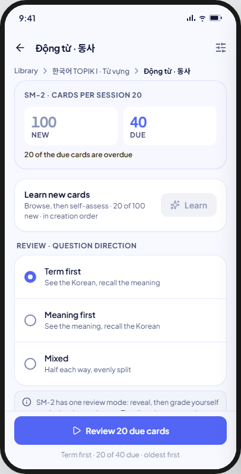 | 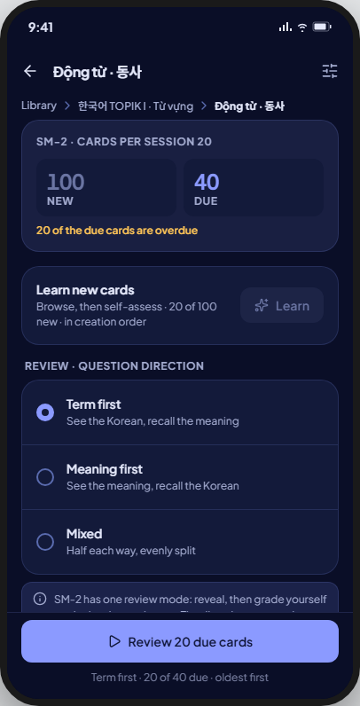 | The hero and counts as drawn; the direction choice moves off this screen into the Direction sheet — see Deviations. |
| eightBox | 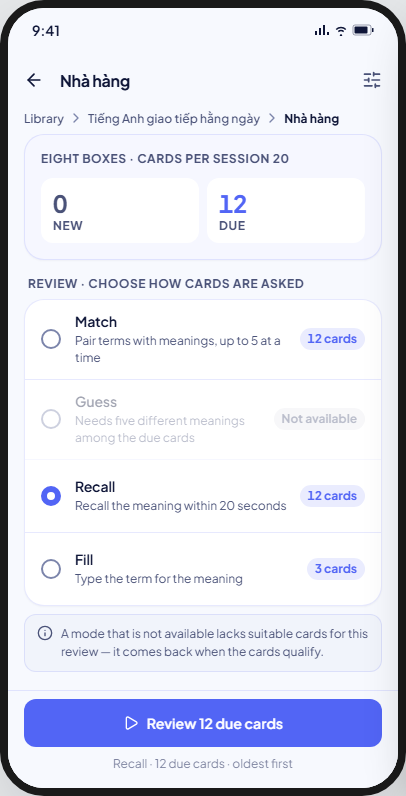 | 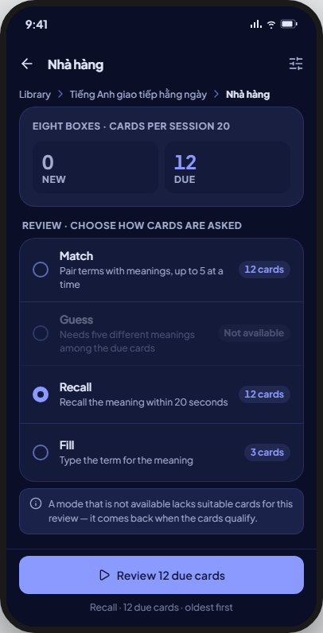 | As drawn: the mode list is inline here (BR-STUDY-055, UC-STUDY-001 step 4). |
| onlyNew | 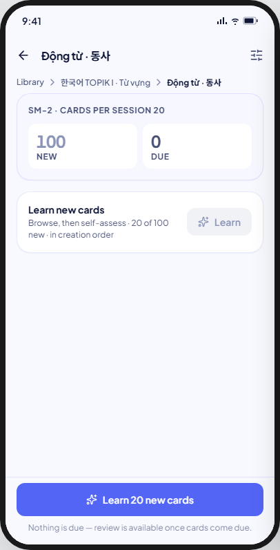 | 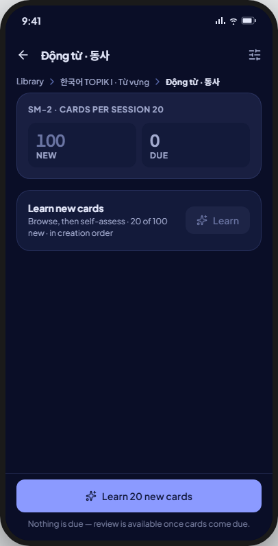 | As drawn: Due = 0, only the Learn row and its footer CTA show. |
| nothing | 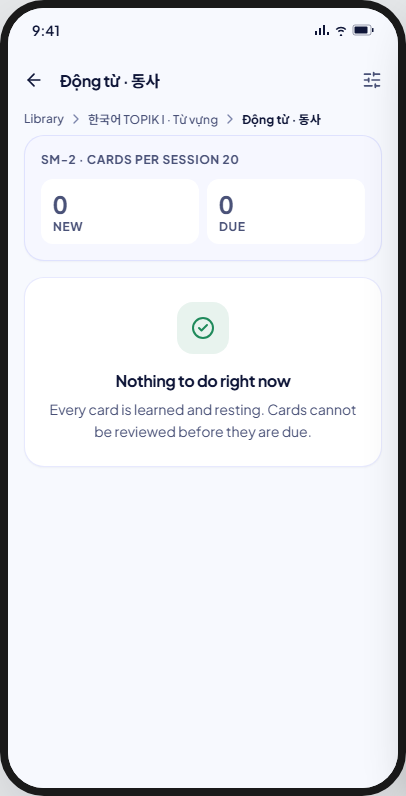 | 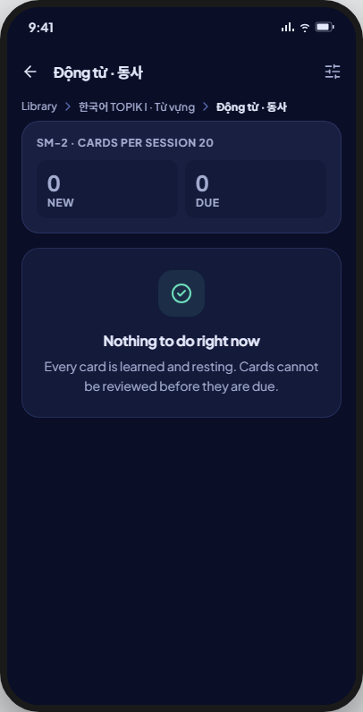 | As drawn: positive empty state, no footer (BR-STUDY-008, BR-STUDY-054). |
| resume | 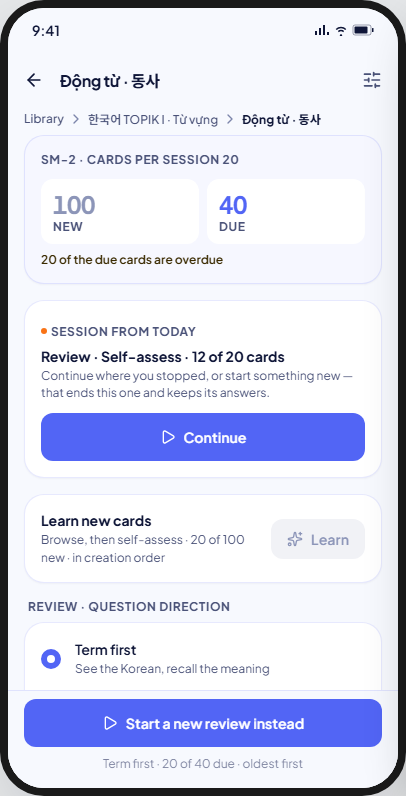 | 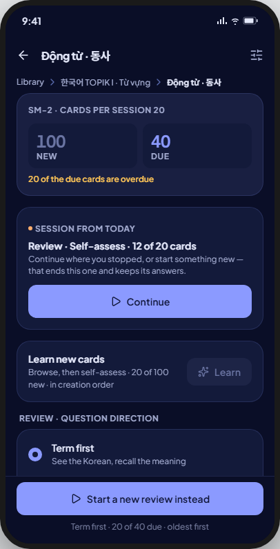 | As drawn, minus the streak colour on the pulse dot — see Deviations. |
| starting | 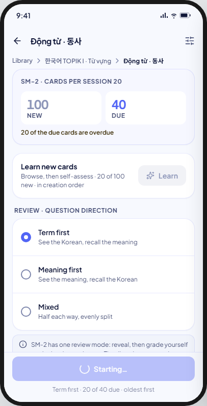 | 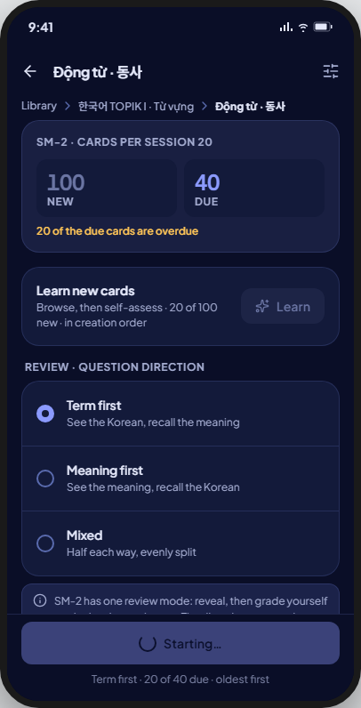 | As drawn: footer shows the spinner, every option locks (BR-STUDY-004). |
| refused | 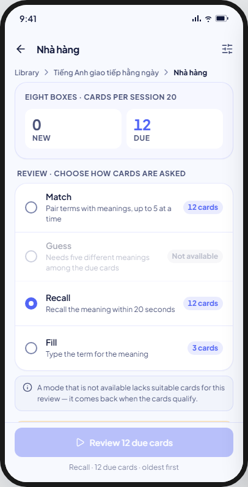 | 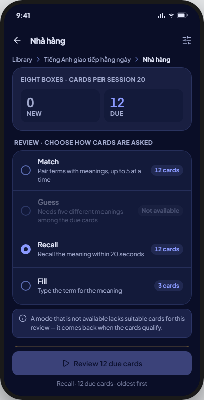 | As drawn: inline warning banner, footer disabled. |
| startFailed | 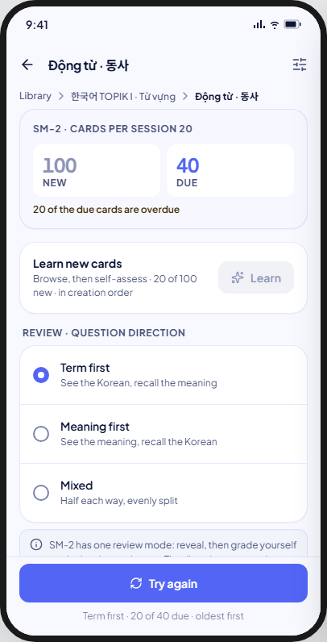 |  | As drawn: inline danger banner, footer offers "Try again". |
| loading | 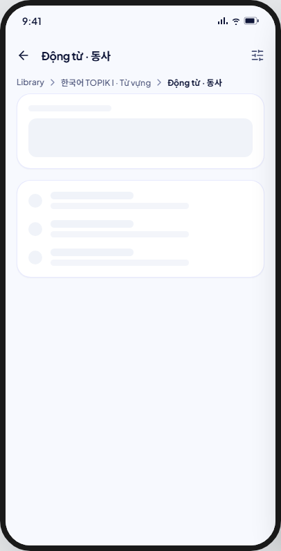 | 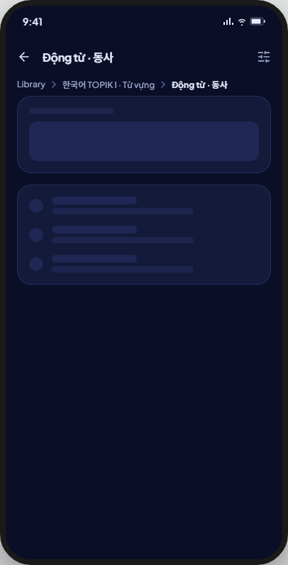 | As drawn (skeletons in the hero and option-list shapes). |

Not captured: none — all nine kit states are V8-supported.

**Built (FE-A6 P2):** all nine kit states on `sm2`. Learn (the row's button
and, with nothing due, the footer) opens a learning session; the footer's Review
opens the Direction sheet, then the review; Continue takes up today's session.
While a session opens, the footer spins with "Starting…" in its caption and the
Learn button and Continue lock (BR-STUDY-004); a refusal shows the warning
banner and a failed write the danger banner, whose footer is "Try again"
(repeating the same start, direction included). `eight_box` reviews in any mode its
cards can run (FE-A6 P3; Recall and Fill since P4): the available rows are a pick, the
first available one picked at first, and the footer reviews the picked mode with the
caption "{mode} · {n} due cards · oldest first". Every mode has its screen since P4, so
Learn is offered whenever new cards exist and nothing says "Coming soon". A deck deleted while its entry is open leaves with
the toast "This deck no longer exists" (UC-STUDY-001 E1). Goldens:
`test/features/study/presentation/goldens/study_entry_{eight_box,sm2,only_new,nothing,loading,resume,starting,refused,start_failed,direction_sheet}_*`.

## Accessibility

- TalkBack reads the app bar, the breadcrumb, the hero (overline, then "New: {n}", "Due: {n}" — each stat tile is one node), the overdue note, then the rows and the footer. The resume banner's pulse dot is decorative.
- Single-line text that ellipsizes keeps line-height 1.5 for stacked marks (UI-base §9 row 102). Touch targets are at least 48 × 48.
- While a session opens, the locked footer and options stay in the reading order and read as disabled.

## Deviations

| Artifact | V8 | Wins |
|---|---|---|
| SM-2's direction choice as inline `MxOptionRow`s on the entry screen itself | A separate `MxBottomSheet` opened by the footer's Review action, with the same three choices and a locked "Start review" action; the space the rows took stays empty above the pinned footer, as the kit's own `onlyNew` frame draws it | UC-STUDY-003 (the documented flow is a sheet, opened after Review, not an inline section) |
| App bar's trailing "Study options" icon | Hidden; named under Coming soon | Spec A4 row 92 (amended 2026-09-25) names "Study options" explicitly; no screen or UC defines its destination yet |
| Resume banner's pulse dot in the kit's streak colour | Primary colour | Row 28 of the UI-base ruling ledger: no `streak` tone exists |
| The resume dot pulses | Static and decorative | FE-A8 ruling S3: one treatment for 13 and 14 |
| The resume banner states its progress as text only | A `MxLinearProgress` track under the line too, as 13's Resume card draws it | FE-A8 H2: the shared track has two callers |
| The `resume` frame draws the SM-2 direction rows inline under the Continue banner | The rows are not drawn; the direction is chosen in the Direction sheet, as in every other state | The sheet deviation above (UC-STUDY-003); FE-A6 spec D19 notes |
| `refused` draws the footer disabled | The footer is rebuilt from the counts, already up to date when the banner shows, and stays usable; the banner stays until the next start | A disabled footer strands the person when the action still exists (FE-A6 P2 plan R5) |
| `starting` shows a spinner and "Starting…" inside the button | The button spins (`MxButton.isLoading`) and "Starting…" is the footer's caption | `MxButton` draws its spinner in place of the label; both the glyph and the words stay (plan R6) |
| "Start review" locks the sheet while the session opens | Start review answers the choice and closes the sheet; the entry's footer shows `starting`, and Try again repeats the review with the same direction | One place owns the starting state (plan R7) |
| SM-2 caption "Term first · 20 of 40 due · oldest first" | "{shown} of {due} due · oldest first" | The direction is chosen in the sheet, after this caption (UC-STUDY-003; plan R8) |
| One refusal copy, "Nothing is due any more." | One title per refusal: nothing due, no new cards, a mode that no longer runs, a session that can no longer be continued | A start can meet each of them (plan R9) |
| The `eightBox` frame pre-selects Recall | The first available mode in kit order is picked at first; the pick is not kept | No BR names a default; default review modes belong to Study options (FE-A3) (FE-A6 P3 ruling C5) |
| The Learn button tinted in the new-status colour | The secondary tone with the sparkles glyph | `MxButton` has no status tone; the Learn row's label names the action |
| The direction descriptions name Korean ("See the Korean, recall the meaning") | "See the term, recall the meaning": no language named; UC-STUDY-003 uses the kit's "Term first" | BR-CARD-002 (FE-A5 ruling) |

## Copy

- Hero: "{algorithm} · cards per session {n}" · "New" · "Due" · "{n} of the due cards are overdue".
- Resume: "Session from today" · "{kind} · {mode} · {n} of {n} cards" · "Continue where you stopped, or start something new — that ends this one and keeps its answers." · "Continue".
- Nothing: "Nothing to do right now" · "Every card is learned and resting. Cards cannot be reviewed before they are due."
- Learn row: "Learn new cards" · "Browse, then self-assess" (SM-2) / "Browse → match → guess → recall → fill" (Eight boxes) · "{n} of {n} new · in creation order" · "Learn".
- Review options, Eight boxes: "Review · choose how cards are asked" · "Match" "Pair terms with meanings, up to 5 at a time" · "Guess" "Pick the meaning out of five" · "Recall" "Recall the meaning within 20 seconds" · "Fill" "Type the term for the meaning" · "{n} cards" · "Not available" · "A mode that is not available lacks suitable cards for this review — it comes back when the cards qualify."
- Direction sheet, SM-2: "Review · question direction" · "Term first" "See the term, recall the meaning" · "Meaning first" "See the meaning, recall the term" · "Mixed" "Half each way, evenly split" · "SM-2 has one review mode: reveal, then grade yourself again · hard · good · easy. The direction cannot change once the session starts." · "Start review".
- Banners: "Nothing is due any more." "The due cards were reviewed from another session or deleted since this screen was opened. Counts are up to date now." · "No new cards left to learn." "They were learned in another session or deleted since this screen was opened. Counts are up to date now." · "This mode can't run on the due cards any more." "The due cards changed since this screen was opened. Counts are up to date now." · "That session can't be continued." "It ended since this screen was opened, and its answers are kept. Start a new one below." · "Couldn't start the session." "Nothing was written. Try again."
- Footer: "Learn {n} new cards" · "Review {n} due cards" · "Starting…" · "Try again" · "Start a new review instead" · captions "Nothing is due — review is available once cards come due." · "{mode} · {n} due cards · oldest first" (Eight boxes) · "{shown} of {due} due · oldest first" (SM-2).
