<!-- Hand-written screen handoff. Not generated by tools/docs/split_handoff.py. -->

# 15 · Study options

A root deck's study options, opened from any deck in its tree: its own cards per session
and new-card order, or the app defaults from Settings. Save writes them for sessions
started afterwards. UC-SETTINGS-001 A1, E4; BR-STUDY-056, BR-SETTINGS-003,
BR-SETTINGS-004; spec
[2026-09-26-settings-ui-design.md](../../../superpowers/specs/2026-09-26-settings-ui-design.md)
§5.5.

## Entry points

- **The deck action sheet (screen 01):** "Study options" / "Cards per session · new-card
  order", below Rename (D3). It left the Coming soon sheet.
- **Screen 14's app bar:** the sliders icon, "Study options" (D3).

Both open `/decks/deck/:deckId/options` on the root navigator, with no bottom bar. On a
sub-deck the screen shows its root's options (BR-STUDY-056).

## Layout

| Region | Widget | Design |
|---|---|---|
| App bar | `MxAppBar` (content) | Back and "Study options". |
| Breadcrumb | `MxBreadcrumb` | Library › the deck's path › the deck › "Study options". |
| Note | `MxNote` (layers) | "These options belong to {root} and every sub-deck in it." |
| Unreadable override | `MxInlineBanner` (warning) | "This deck's options could not be read. Saving replaces them." |
| Toggle | `MxSection` + `MxSettingsRow` + `MxToggle` | "Use app defaults"; on: "Following Settings · {n} cards, {order}", off: "Off · this deck has its own options". |
| Options | `MxSection` | "App defaults (read-only here)" or "This deck"; "Cards per session" / "1 to 200" with an `MxStepper` (−/+, hold, typed entry); "New-card order" and two `MxOptionRow`s: "Creation order" / "Oldest cards first — the order you added or imported them", "Random" / "Shuffled each learning session". Read-only and dimmed while the toggle is on. The note: "Changes apply to sessions started from now on. A session already open keeps the options it started with." |
| Card limit message | `MxFieldMessage` (error) | "Enter a number from 1 to 200", under the stepper (UC E1). |
| Footer | `MxFooterBar` + `MxButton` | "Save", enabled only for a valid change (D9); spinning while it runs; "Retry save" after a failure. The caption: "Saved to this device only.", "Fix the limit to enable save." or "Couldn't save. The deck still uses {n} cards, {order}." |
| Toast | `MxSnackbar` | "Saved · applies to the next session". |

Save runs Use app defaults when the toggle is on and the root had its own options, and
saves the root's options otherwise. A second Save while one runs is ignored (A4).

## States

| State | Light | Dark | V8 |
|---|---|---|---|
| override | 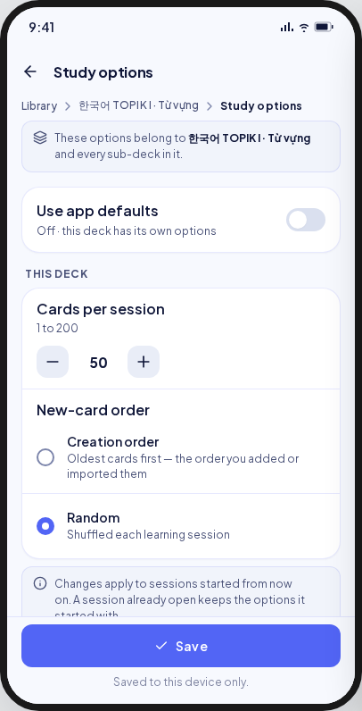 | 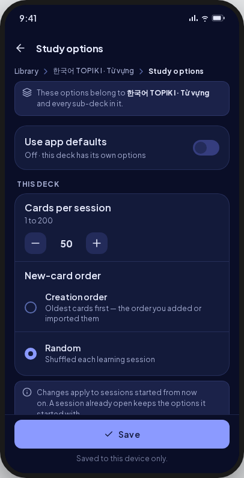 | Save is disabled until something changes (D9). |
| defaults | 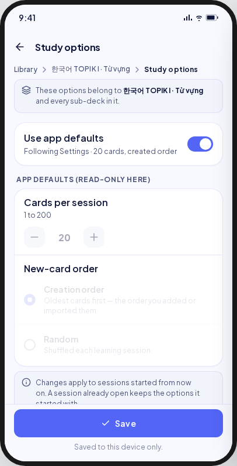 | 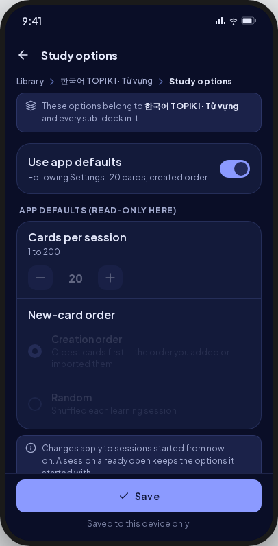 | As drawn; Save disabled. |
| invalid | 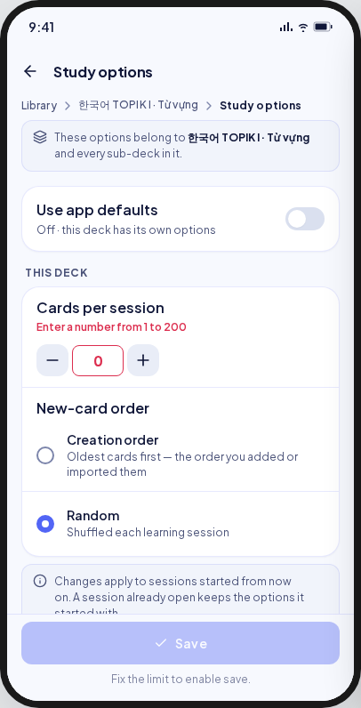 | 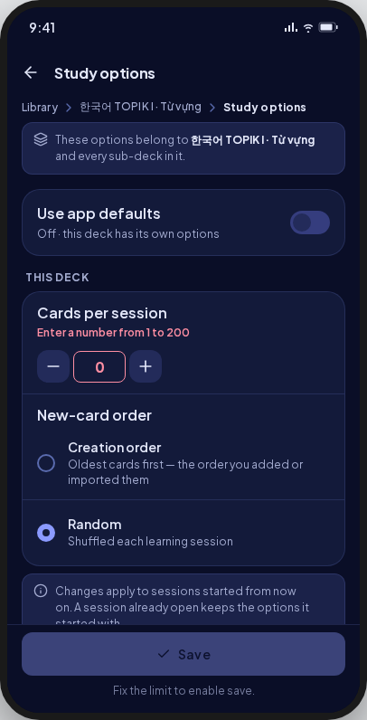 | **Deviation:** the message sits under the stepper and the sub-line stays (UC E1). |
| saving | 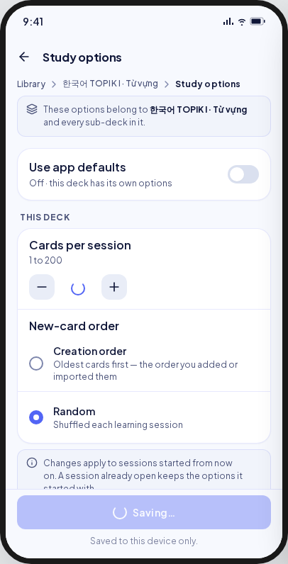 | 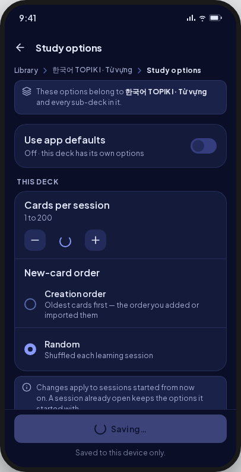 | The stepper and the button spin; the button has no "Saving…" text (`MxButton.isLoading`). |
| saved | 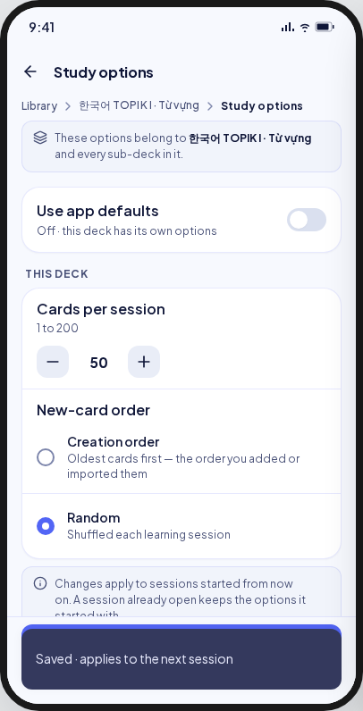 | 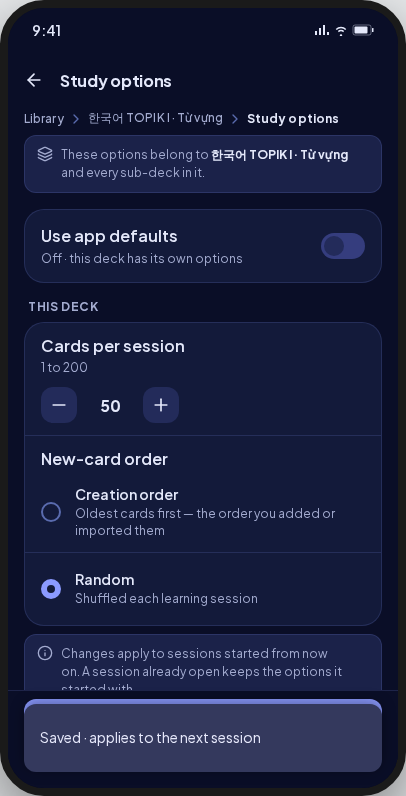 | As drawn. |
| saveFailed |  | 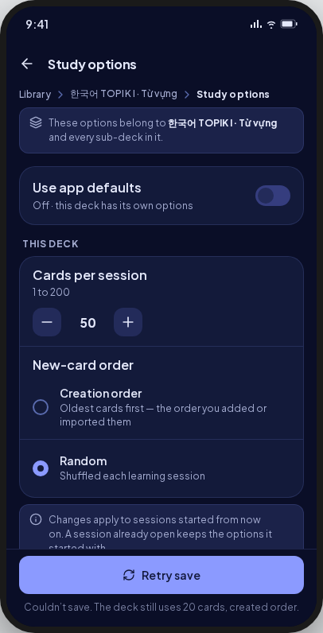 | As drawn. |
| loading | 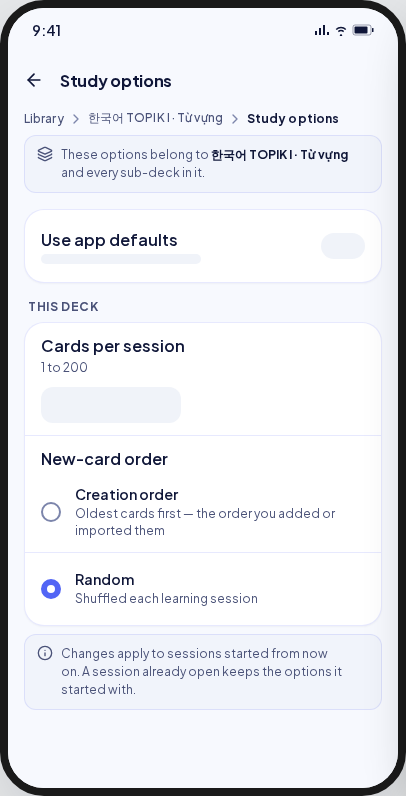 | 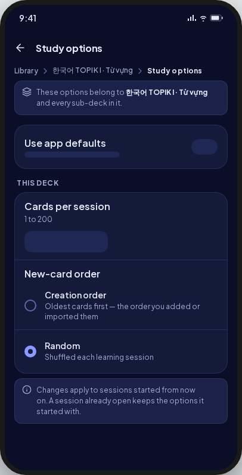 | Skeleton rows, no footer (UI-base row 125). |
| gone | — | — | **V8 addition (spec §6):** a deck gone to the Trash shows "This deck is no longer here" with Back (UI-base row 129). |
| read error | — | — | **V8 addition:** `MxErrorState` with Retry and no invented value. |

Goldens: `test/features/settings/presentation/goldens/study_options_{override,defaults,invalid,saving,saved,save_failed,loading}_{light,dark}.png`.

## Deviations

| Artifact | V8 | Wins |
|---|---|---|
| The root's name in bold inside the note | Plain text | `MxNote` carries one plain string |
| "Enter a number from 1 to 200" in place of the sub-line | Under the stepper, the sub-line kept | UC-SETTINGS-001 E1 |
| Save enabled in override and defaults | Enabled only for a valid change | D9 |
| A spinner and "Saving…" in the button | The button spins | `MxButton.isLoading` |
| No gone state | The Library's gone state with Back | Spec §6; UI-base row 129 |

## Copy

"Study options" · "These options belong to {root} and every sub-deck in it." · "This
deck's options could not be read. Saving replaces them." · "Use app defaults" ·
"Following Settings · {n} cards, {order}" · "created order" · "random order" · "Off · this
deck has its own options" · "App defaults (read-only here)" · "This deck" · "Cards per
session" · "1 to {max}" · "Enter a number from {min} to {max}" · "New-card order" ·
"Creation order" · "Oldest cards first — the order you added or imported them" ·
"Random" · "Shuffled each learning session" · "Changes apply to sessions started from now
on. A session already open keeps the options it started with." · "Save" · "Retry save" ·
"Saved to this device only." · "Fix the limit to enable save." · "Couldn't save. The deck
still uses {n} cards, {order}." · "Saved · applies to the next session" · "Cards per
session · new-card order".
