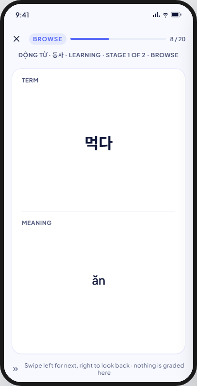
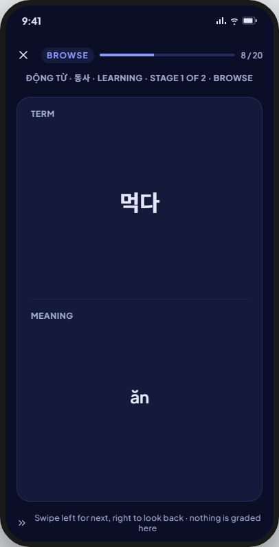

<!-- Hand-written screen handoff. Not generated by tools/docs/split_handoff.py. -->

# 16 · Study · Browse

The first stage of every learning session, for both algorithms (BR-MODE-003,
BR-MODE-004): both faces of the card at once, nothing graded, nothing counted
against the schedule (BR-MODE-005, BR-MODE-006). FE-A6; UC-STUDY-001 (steps
3, 5, 7). `browse` never runs in a review session (BR-STUDY-055).

## Layout

| Region | Widget | Design |
|---|---|---|
| Top bar | `MxStudyTopBar` | See [Shared by the session screens](#shared-by-the-session-screens). |
| Context line | new: `SessionContextLine` (feature-local; kit contract, deliberately not a shared widget) | Centred overline: "{deck} · Learning · stage {n} of {total} · Browse" (BR-MODE-004 orders the stage). |
| Card | `MxCard`, full-bleed, feature-local two-pane layout (kit: `StudyFaceCard` is explicitly a different composition from this one) | Term half on top with its label and pronunciation, a hairline divider, meaning half below with its label and example when the card has one; both halves always visible (BR-MODE-006). |
| Navigation | swipe on the card, no visible control | Left advances, right looks back one card already shown in this round (BR-STUDY-048); looking back does not re-record the card or move `cursor`. |
| Footer hint | new: `SessionFooterHint` (feature-local) | "Swipe left for next, right to look back · nothing is graded here" (BR-MODE-005). |

## Shared by the session screens

Common to Browse, Match, Guess, Recall and Fill (17–20).

- **`MxStudyTopBar`.** Close icon exits the session (see Exit/abandon below).
  Mode badge: the mode name, uppercase, tinted with the bar's accent (primary
  by default; Recall and Fill pass the mastery colour instead — no BR found
  for that choice, ruled below). Progress track and
  counter: for the four round-based modes the fraction is the **round's**
  position and size, never the board's (BR-STUDY-049 says this explicitly for
  Match's boards); for Browse and `self_assess` it is the stage's whole queue,
  since neither uses rounds.
- **Exit / abandon.** The kit's close icon ends the session immediately, no
  confirmation sheet. Every turn already committed stays recorded
  (BR-STUDY-004, BR-STUDY-019); the session becomes `abandoned` with
  `end_reason = user_exit` (BR-STUDY-014).
- **Round behaviour (Match, Guess, Recall, Fill only).** These four run in
  rounds (BR-STUDY-059): round 1 asks every card the stage can ask; each
  later round asks only the round's not-passed set. A card joins that set the
  moment it is answered wrong in the round, even if a later attempt in the
  same round gets it right — Match's stay-on-board retry is exactly this case
  (BR-STUDY-060, BR-STUDY-062). A round-based stage is done once one round
  ends with an empty not-passed set; there is no cap on the number of rounds
  (BR-STUDY-069). Browse and `self_assess` never use rounds; `self_assess`
  instead re-queues a wrong card after at least 3 other cards, up to 3
  `relearning` turns before the card leaves the queue and is flagged
  (BR-STUDY-005, BR-STUDY-073).
- **"Result after commit."** The UI shows a turn's outcome only after its
  write has committed (BR-STUDY-063); a failed write shows an inline error
  and lets the person retry the same answer instead (UC-STUDY-001 E2), and
  never advances or paints an outcome.
- **The unit stays on screen between turns.** The card being answered stays
  visible while the outcome shows and the next turn loads; the body is never
  swapped for a loading state mid-session. Full-body loading is only for a
  session that has no turn yet (BR-STUDY-064). Each mode declares its own
  outcome-display duration.
- **Keyboard / IME.** Only `fill` (20-study-fill.md) takes typed input; every
  other screen here is tap-only and never raises a keyboard.
- **`self_assess`.** The kit has no screen for it: see
  `16a-study-self-assess.md` (shape, FE-A5).
- **Icon colour guard.** The kit inlines a colour on every glyph
  (`check`, `x`, `lightbulb`, `chevrons-right`). V8's `Icon(color:)` guard
  forbids that in feature code; each screen's icons take their colour from
  the shared icon-tinting mechanism instead. Not repeated per screen below.

## Accessibility

- TalkBack reads the top bar (close, mode, "{done} of {total}"), the context line, then the card: term label and term, pronunciation, meaning label and meaning, example. The footer hint is read last.
- Card faces wrap and never ellipsize; Korean and Vietnamese with stacked marks render whole (UI-base §9 row 102). Touch targets are at least 48 × 48.
- Swipes have accessible actions on the card: "Next card" and, when an earlier card exists, "Previous card".
- Edges (FE-A6 spec D20): the hint does not change; a right swipe on the round's first card does nothing; a left swipe on the stage's last card answers it and the session moves on.

## States

| State | Light | Dark | V8 |
|---|---|---|---|
| default |  |  | As drawn. |

Not captured: the swipe-back preview of an earlier card in the round
(BR-STUDY-048) is an interaction inside `default`, not a separate state.

## Deviations

| Artifact | V8 | Wins |
|---|---|---|
| Icons carry an inline colour prop | Colour comes from the shared icon-tinting mechanism | Guard: no `Icon(color:)` in feature code |

Recall and Fill tint `MxStudyTopBar`'s accent with the mastery colour, while
Match and Guess keep primary: the kit's choice stands, since no BR/UC speaks to it
(FE-A5 ruling).

## Copy

- Context line: "{deck} · Learning · stage {n} of {total} · Browse".
- Footer hint: "Swipe left for next, right to look back · nothing is graded here".
