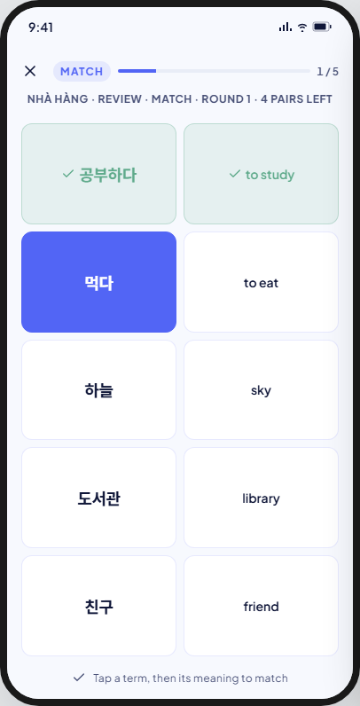
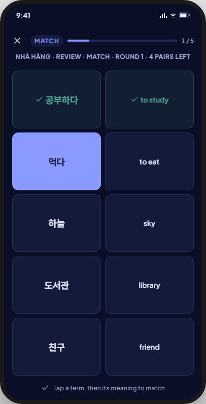

<!-- Hand-written screen handoff. Not generated by tools/docs/split_handoff.py. -->

# 17 · Study · Match

A round-based graded stage: `eight_box` only — `sm2` never runs `match`
(BR-MODE-004). Pair each term tile with its meaning tile, up to five pairs a
board (BR-STUDY-049). FE-A6; UC-STUDY-001 (steps 6–9, A0c). Shared session
chrome and rules (top bar, exit, rounds, result-after-commit, keyboard, the
icon-colour guard): [16-study-browse.md § Shared by the session
screens](16-study-browse.md#shared-by-the-session-screens).

## Layout

| Region | Widget | Design |
|---|---|---|
| Top bar | `MxStudyTopBar` | Primary accent (default); see the shared section. |
| Context line | `SessionContextLine` | "{deck} · {Learning/Review} · Match · round {n} · {n} pairs left". |
| Board | grid, up to 10 tiles (5 pairs); new: `MatchBoardTile` (feature-local; not `MxCard` — a small grid tile, not a padded card) | Term tile (front) and meaning tile (back) per pair; states `idle` / `selected` / `matched`, plus a wrong-pair state V8 adds (see Deviations). A board with an odd remainder may hold one pair (BR-STUDY-049). |
| Footer hint | `SessionFooterHint` | "Tap a term, then its meaning to match". |

## States

| State | Light | Dark | V8 |
|---|---|---|---|
| default |  |  | As drawn. |

Not captured: the tile's `idle`/`selected`/`matched` micro-states and the
wrong-pair flash are interactions inside `default`, not separate screen
states.

## Deviations

| Artifact | V8 | Wins |
|---|---|---|
| Only `idle`/`selected`/`matched` tile states are drawn; no feedback for a wrong pair | V8 adds a brief error-tone flash on both tiles after the write commits, then both settle back to `idle` and stay pending on the board | BR-STUDY-063 (paint an outcome only after commit), BR-STUDY-070 (a non-correct outcome must read as wrong) |
| — | A wrong pair keeps its row `pending` for this board **and** is guaranteed one slot in the next round, even if it is matched correctly later in this same round | BR-STUDY-060, BR-STUDY-062 |

## Copy

- Context line: "{deck} · {Learning/Review} · Match · round {n} · {n} pairs left".
- Footer hint: "Tap a term, then its meaning to match".
