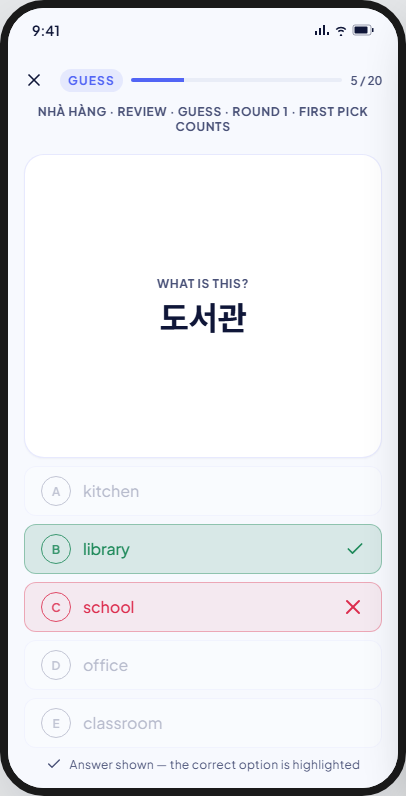
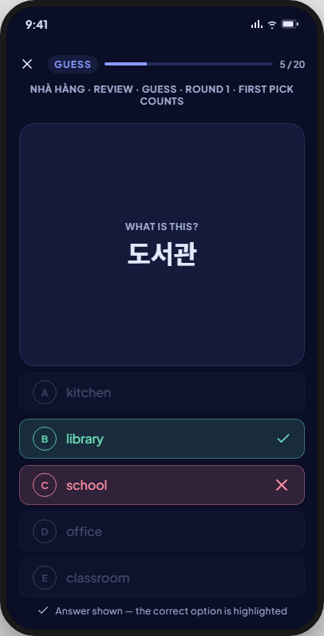

<!-- Hand-written screen handoff. Not generated by tools/docs/split_handoff.py. -->

# 18 · Study · Guess

A round-based graded stage: `eight_box` only (BR-MODE-004). One term, exactly
five meaning options; only the first tap counts (BR-STUDY-037, BR-STUDY-042).
FE-A6; UC-STUDY-001 (steps 6–9, A0c). Shared session chrome and rules (top
bar, exit, rounds, result-after-commit, keyboard, the icon-colour guard):
[16-study-browse.md § Shared by the session
screens](16-study-browse.md#shared-by-the-session-screens).

## Layout

| Region | Widget | Design |
|---|---|---|
| Top bar | `MxStudyTopBar` | Primary accent (default); see the shared section. |
| Context line | `SessionContextLine` | "{deck} · Review · Guess · round {n} · first pick counts". |
| Prompt | new: `StudyFaceCard` (feature-local; `MxCard`-based, never promoted to shared — a session face is meaningless outside a session) | Overline "What is this?" in flow placement, the term below it. |
| Options | 5 rows, new: `GuessOptionRow` (feature-local) | Lettered A–E badge + meaning text. After the first tap: the chosen and the correct row switch to their tone (correct/wrong), the rest fade; matched by card id, never by display string (BR-STUDY-041). |
| Footer hint | `SessionFooterHint` | "Answer shown — the correct option is highlighted" once answered. |

## States

| State | Light | Dark | V8 |
|---|---|---|---|
| default |  |  | As drawn. |

Not captured: the pre-tap idle appearance of the five options is an
interaction inside `default`, not a separate capture.

## Deviations

None found; the kit's five-option layout, tap-to-lock behaviour and
identity-based grading match BR-STUDY-037, BR-STUDY-039, BR-STUDY-041 and
BR-STUDY-042 as drawn.

## Copy

- Context line: "{deck} · Review · Guess · round {n} · first pick counts".
- Prompt overline: "What is this?".
- Footer hint: "Answer shown — the correct option is highlighted".
