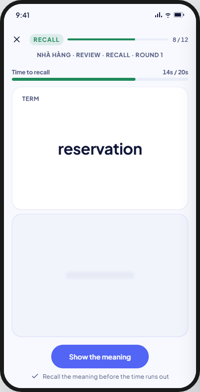
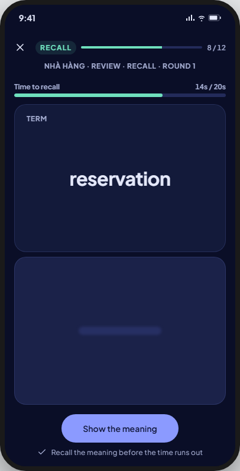
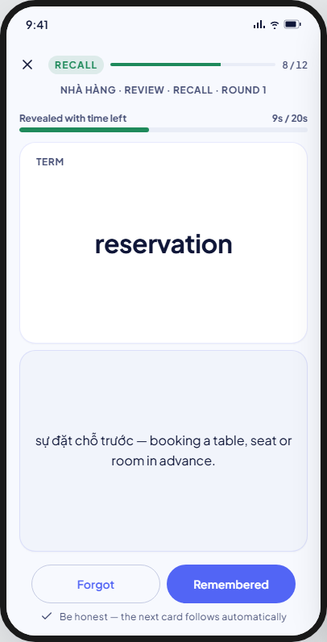
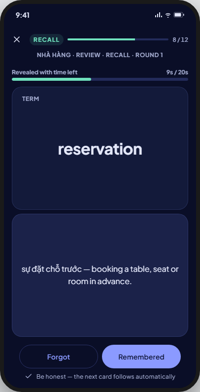
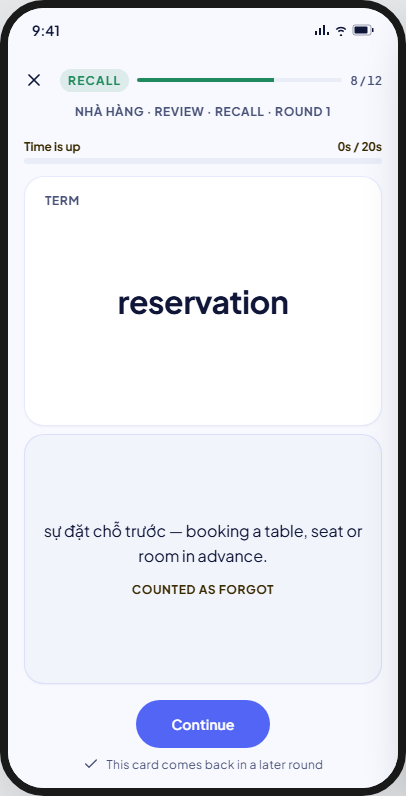
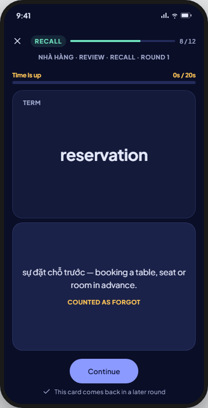

<!-- Hand-written screen handoff. Not generated by tools/docs/split_handoff.py. -->

# 19 · Study · Recall

A round-based graded stage: `eight_box` only (BR-MODE-004). The term is
shown, the meaning hidden behind a 20-second turn clock; revealing is not an
outcome, only the self-check after it is (BR-STUDY-031, BR-STUDY-065).
FE-A6; UC-STUDY-001 (steps 6–9, A0c). Shared session chrome and rules (top
bar, exit, rounds, result-after-commit, keyboard, the icon-colour guard):
[16-study-browse.md § Shared by the session
screens](16-study-browse.md#shared-by-the-session-screens).

## Layout

| Region | Widget | Design |
|---|---|---|
| Top bar | `MxStudyTopBar` | Mastery accent (kit choice; ruled in 16). |
| Context line | `SessionContextLine` | "{deck} · Review · Recall · round {n}". |
| Turn clock | new: `RecallCountdownBar` (feature-local; distinct from `MxStudyTopBar`'s session-wide track — this one measures the current turn, pauses in the background, and stops for good once revealed or timed out, BR-STUDY-031, BR-STUDY-036) | Caption + "{s}s / 20s", a thin fill that drains to 0. |
| Term face | `StudyFaceCard` (label "Term") | The prompt; always visible. |
| Meaning face | `StudyFaceCard` (`role: answer`) | Blurred placeholder before reveal; the meaning once revealed or timed out, with a "Counted as forgot" tag when timed out. |
| CTA row | new: `StudyCtaRow` (feature-local) | `countingDown`: one "Show the meaning" button. `revealed`: "Forgot" (outline) and "Remembered" (filled) — the only recorded input, at most once a turn (BR-STUDY-032, BR-STUDY-065). `timedOut`: one "Continue" button that only advances, records nothing (BR-STUDY-033, BR-STUDY-066). |
| Footer hint | `SessionFooterHint` | Varies by state; see Copy. |

## States

| State | Light | Dark | V8 |
|---|---|---|---|
| countingDown |  |  | As drawn. |
| revealed |  |  | As drawn; clock is stopped, not zeroed (BR-STUDY-036). |
| timedOut |  |  | As drawn; the outcome is already committed (wrong) before this paints (BR-STUDY-063). |

**Built (FE-A6 P4):** `StudyRecallWidget` in the session route's mode switch, over
`RecallCountdownBarWidget` and `StudyCtaRowWidget`. The clock is the widget's own
(spec D12): it stops whenever the app leaves the foreground, saves the time left on
pause and when the turn's screen goes (never per tick), and a resumed turn starts from
the saved time, or opens revealed with its clock stopped (BR-STUDY-036). Show the
meaning stops the clock at once and writes the reveal; Forgot and Remembered answer
and the next card follows; at zero the turn answers timed out and is held until
Continue (spec D5). Goldens:
`test/features/study/presentation/goldens/study_recall_{counting,revealed,timed_out,large_text}_*`.

## Deviations

The two-branch ending (self-check auto-advances, timeout waits for Continue) matches
BR-STUDY-032, BR-STUDY-033 and BR-STUDY-066 as drawn.

| Artifact | V8 | Wins |
|---|---|---|
| The clock's fill and caption in the mastery accent while counting down | A neutral `onSurfaceVariant` fill and caption; `warning`/`warningInk` once timed out. The top bar keeps the mastery accent | FE-A6 spec D14: green is mastery-only; the clock is a turn signal, not mastery (P4 ruling V2) |
| The answer face has no label | "Meaning", as every study face carries its label in flow | 16/16a's `StudyFaceCard` (P2 face-label fix) |

## Accessibility

- The clock is one node: its caption, with "{n} seconds left" as its value. It is never announced per tick (P4 rulings V3, V5).
- A timeout is announced when its write commits: "Time is up. Counted as forgot. The meaning is {meaning}."
- Under Remove animations the clock's fill steps once a second and the meaning appears with no fade; the time runs the same (V9).
- At large text the faces scroll inside and the two self-check buttons stack (C4).
- **Open for the owner:** the 20-second turn (BR-STUDY-031) is the same for TalkBack users, who read the chrome before they can recall. Changing it is a business-rule decision, not a UI one (V3).

## Copy

- Context line: "{deck} · Review · Recall · round {n}".
- Clock caption: "Time to recall" (`countingDown`) · "Revealed with time left" (`revealed`) · "Time is up" (`timedOut`).
- Meaning tag: "Counted as forgot" (`timedOut`).
- CTAs: "Show the meaning" · "Forgot" · "Remembered" · "Continue".
- Footer hint: "Recall the meaning before the time runs out" (`countingDown`) · "Be honest — the next card follows automatically" (`revealed`) · "This card comes back in a later round" (`timedOut`).
