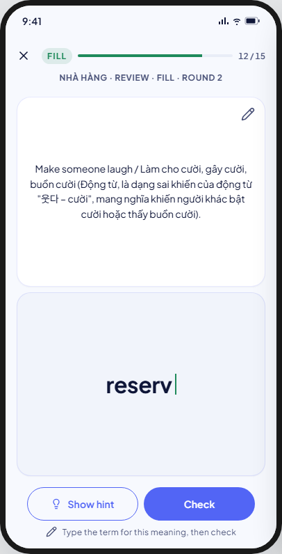
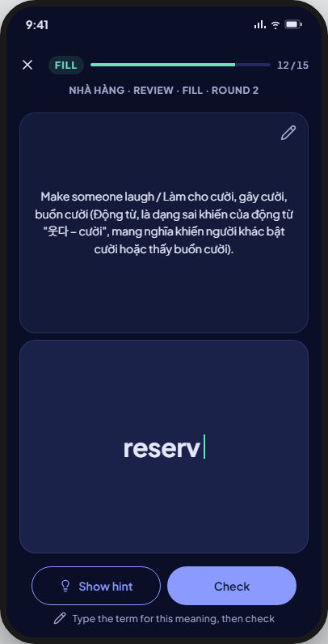
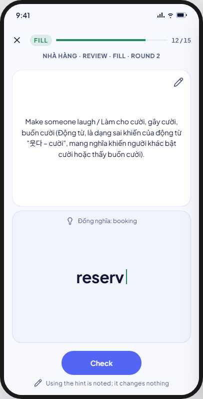
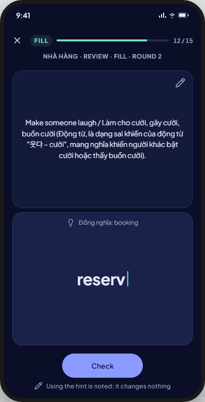
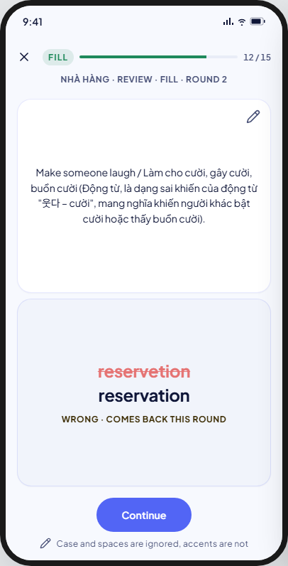
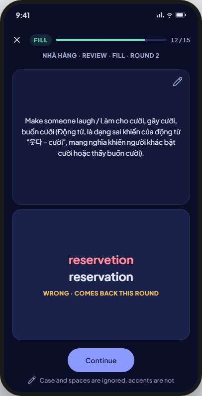

<!-- Hand-written screen handoff. Not generated by tools/docs/split_handoff.py. -->

# 20 · Study · Fill

A round-based graded stage: `eight_box` only (BR-MODE-004), and only for
cards that have an `example` — others sit out this stage without leaving the
deck (BR-STUDY-044, BR-STUDY-071). The meaning is the prompt; the person
types the term. FE-A6; UC-STUDY-001 (steps 6–9, A0c). Shared session chrome
and rules (top bar, exit, rounds, result-after-commit, the icon-colour
guard): [16-study-browse.md § Shared by the session
screens](16-study-browse.md#shared-by-the-session-screens).

## Layout

| Region | Widget | Design |
|---|---|---|
| Top bar | `MxStudyTopBar` | Mastery accent (kit choice; ruled in 16). |
| Context line | `SessionContextLine` | "{deck} · Review · Fill · round {n}". |
| Prompt face | `StudyFaceCard` | The card's meaning. |
| Answer face | `StudyFaceCard` (`role: answer`); the typed text itself: `MxTextField` (borderless, no visible chrome, the study answer text style) — its style comes from `MxTextStyles`, settled in the FE-A6 plan against the no-per-site-text-styling guard | `input`/`hint`: what has been typed so far with a blinking caret. `wrong`: the typed answer struck through, the correct term below it, tagged "Wrong · comes back next round" (V8 copy fix, see Deviations). |
| Hint row | inline row inside the answer face, shown only in `hint` | Lightbulb glyph + the card's own hint text; only offered when the card has one (BR-STUDY-028). |
| CTA row | `StudyCtaRow` | `input`: "Show hint" (only if the card has a hint) + "Check". `hint`: "Check" only. `wrong`: one "Continue" button. |
| Footer hint | `SessionFooterHint` | Varies by state; see Copy. |

## Keyboard / IME

The system keyboard opens for `input`/`hint` and the CTA row sits above it;
`wrong` shows no field and the keyboard closes. Grading folds the typed text
(trim + Unicode-aware lower-case) against `front_folded` but never strips
accents — "cong" must not match "công" (BR-STUDY-026). The typed text itself
is never persisted, only the outcome, the match-policy version and whether a
hint was used (BR-STUDY-027, BR-STUDY-030). An empty answer after trim
submits nothing (BR-STUDY-029).

## States

| State | Light | Dark | V8 |
|---|---|---|---|
| input |  |  | As drawn; no edit (pencil) button — see Deviations. |
| hint |  |  | As drawn; "Show hint" is gone once used, "Check" remains. |
| wrong |  |  | As drawn, with the corrected footer copy. |

Not captured: the correct-answer path has no dedicated visual — the turn
commits and the next one loads immediately (BR-STUDY-063, BR-STUDY-064).

## Deviations

| Artifact | V8 | Wins |
|---|---|---|
| A pencil "edit" button sits on the prompt face | Removed | No BR/UC allows editing a card mid-session, and Recall's own kit comment already states cards are not edited mid-session |
| `wrong` footer says "Wrong · comes back this round" | "Wrong · comes back next round" | BR-STUDY-059, BR-STUDY-069 — a wrong `fill` row leaves the current round and is enrolled exactly once in the next one, never retried within the same round |

## Copy

- Context line: "{deck} · Review · Fill · round {n}".
- CTAs: "Show hint" · "Check" · "Continue".
- Wrong tag: "Wrong · comes back next round" (corrected; see Deviations).
- Footer hint: "Type the term for this meaning, then check" (`input`) · "Using the hint is noted; it changes nothing" (`hint`) · "Case and spaces are ignored, accents are not" (`wrong`).
