<!-- Hand-written screen handoff. Not generated by tools/docs/split_handoff.py. -->

# 21 · Session summary

The terminal screen of a study session: shown once `StudySessionView.status` leaves
`in_progress` and `summary` is set (spec D11; kit `StudyResultScreenV3`, A19).
UC-STUDY-001 (steps 13, A3, E3, E4).

## Layout

| Region | Widget | Design |
|---|---|---|
| App bar | `MxAppBar` (screen density) | Title only, muted ink: "Session summary". No back control, no actions — v1's minimal bar, Share removed. |
| Hero | `MxCard` (hero) + `MxIconTile` (large, tone-coloured) + `MxStatTile` × 3 | Icon and tone by outcome — ok `success`, paused tinted, ended `warning`, error `danger` (FE-A6 spec D14) — a title, one body sentence with the headline count bold, and — where the session has facts — three stats side by side. |
| Facts | `MxListSectionHeader` + `MxCard` (full-bleed) + `MxListRow` × 3 | "This session"; rows: finished (label depends on session kind), cards answered, wrong turns — leading a small tinted `MxIconTile`, trailing the value in tabular numerals, warning ink when wrong > 0. Omitted where the session has no facts (`schedulerChanged`). |
| End note | `MxNote` | One calm info line, only for the states that need it. |
| Footer | `MxFooterBar` + `MxButton` × 2 | Outline "Study this deck" (hidden once the outcome is `ended`/`error`) + primary "Done" (disabled while loading); a caption line under them. |
| Loading | `MxSkeleton` | Hero and fact-row shapes while the summary is read. |

## States

| State | Light | Dark | V8 |
|---|---|---|---|
| loaded | 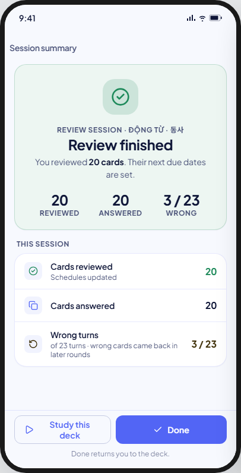 | 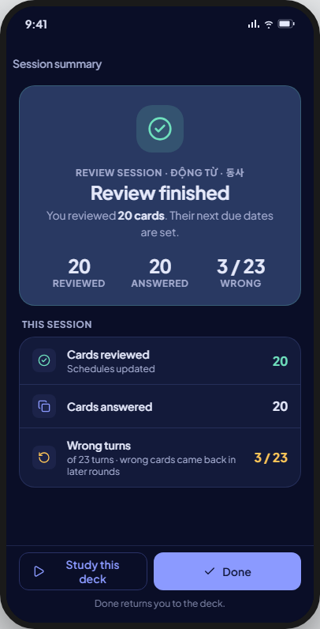 | As drawn: `completed`, a reviewing session (BR-STUDY-013). |
| learning | 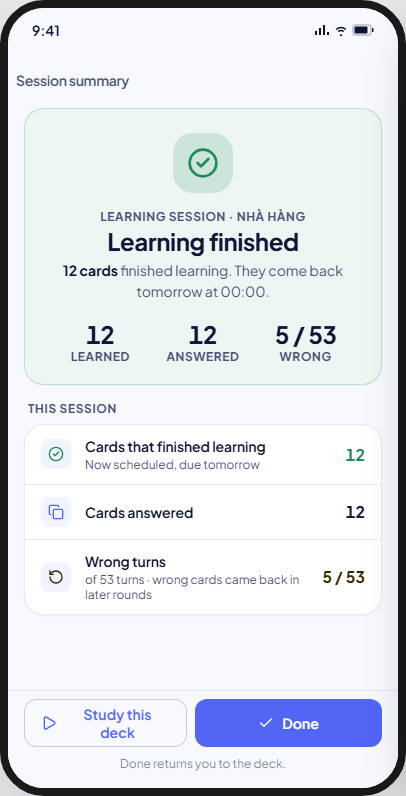 | 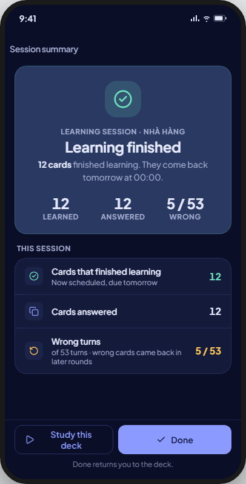 | As drawn: `completed`, a learning session — finishing the stage sequence is the event, not a graded turn (BR-STUDY-053). |
| large | 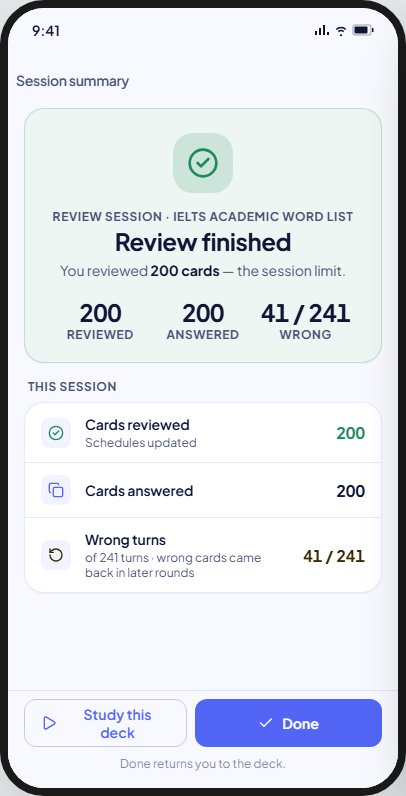 | 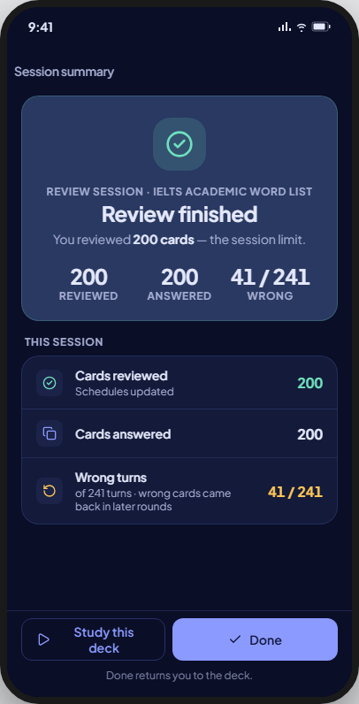 | As drawn: `completed` at the `card_limit` ceiling fixed when the session opened (BR-STUDY-024). |
| leftEarly | 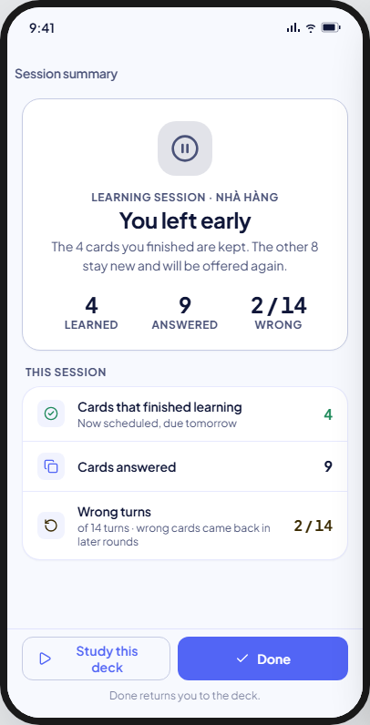 | 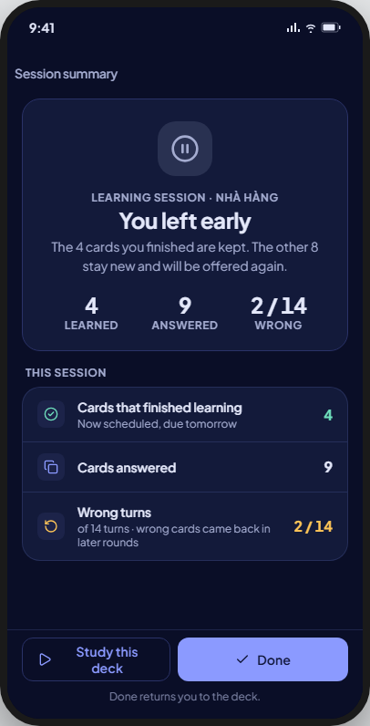 | `abandoned`/`user_exit` (BR-STUDY-014); turns already answered are kept (BR-STUDY-019). |
| interrupted | 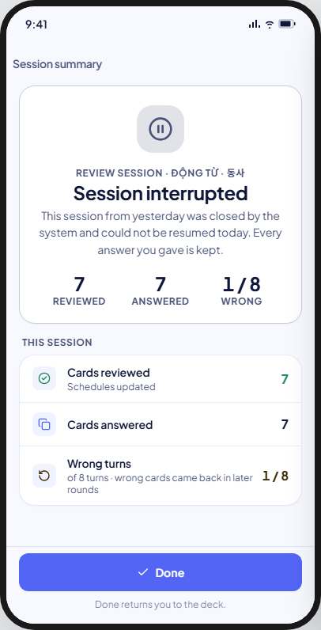 | 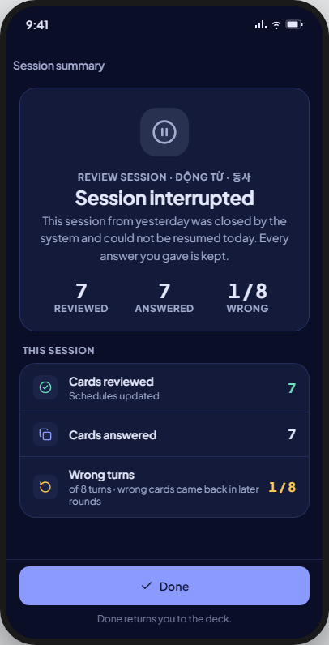 | `abandoned`/`interrupted`: yesterday's session, not resumed today (BR-STUDY-072; UC-STUDY-001 A3b). |
| reset | 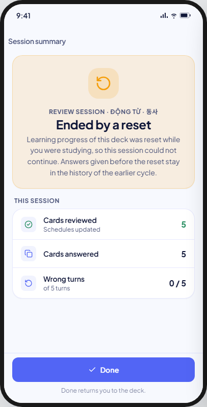 | 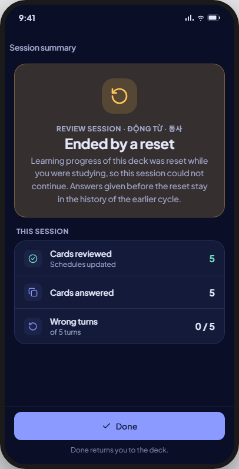 | `invalidated`/`scheduler_reset`: reset while the session was open, reached on returning to it (BR-STUDY-015). |
| schedulerChanged | 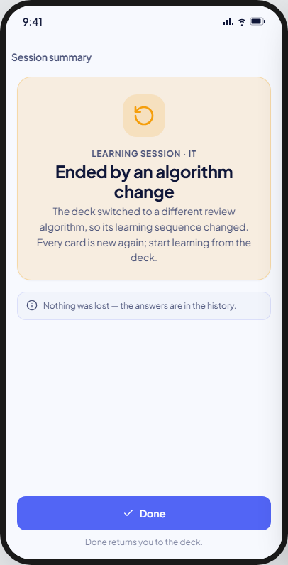 | 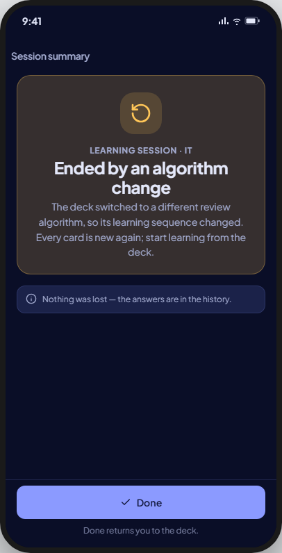 | `invalidated`/`scheduler_changed` (BR-STUDY-016). No Facts card — the kit draws none here either. |
| saveError | 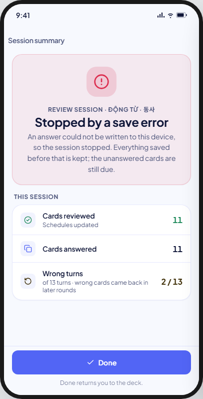 | 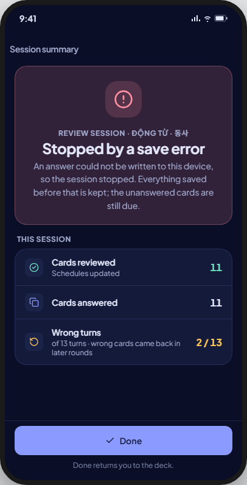 | `failed`/`persistence_error` (BR-STUDY-018); turns saved before the failure are kept (BR-STUDY-019). |
| loading | 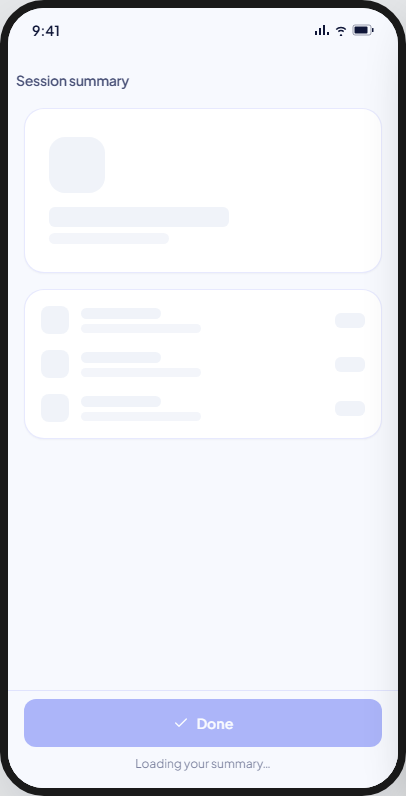 | 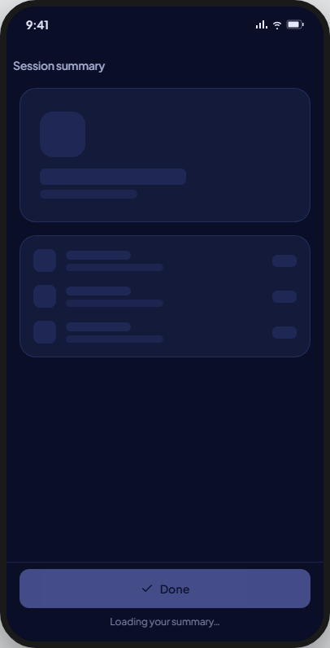 | As drawn. |

Not captured: `contentDeleted` ("Content trashed", `invalidated`/`content_deleted`). `end_reason =
content_deleted` is reserved for content moved to Trash (`docs/features/study/data.md` row 3;
BR-TRASH-004); V8.0 has no Trash, so a permanently deleted card just drops out of the queue and the
session runs to `completed` instead (same file, row 1) — this state cannot occur. The
`SessionEndReason.contentDeleted` code stays in
`lib/features/study/domain/models/session_status_model.dart` for the later Trash sub-project only.

## Accessibility

- TalkBack reads the title, then the hero (title, body, then each stat as one node "{label}: {value}"), the facts, the note and the footer. The hero glyph is decorative.
- Touch targets are at least 48 × 48; the two footer buttons keep 8 between them.

## Nothing answered

A session that ended before its first turn shows the hero without stats and no Facts card, as
`schedulerChanged` does (FE-A6 spec D18).

## Deviations

| Artifact | V8 | Wins |
|---|---|---|
| "Content trashed" state (`content_deleted`) | Not reachable; excluded from the build | BR-TRASH-004; `data.md` (no Trash in V8.0) |
| `SessionFactRows`, marked `SCREEN_LOCAL` in the kit source (deliberately not a shared row) | `MxListRow`: the shape already fits "a content row that is not a setting and not a command" | Guard: no new row widget where a shared one covers the shape |
| Hero's three stats: finished, answered, wrong/total | As drawn: FE-A6 adds "answered" and "total turns" to `SessionSummary`, which has `cardCount`, `learnedCardCount`, `wrongTurnCount` today | The kit; no BR limits the summary |

## Rulings (FE-A5)

- `stale_generation` never reaches this screen: the write is refused, the session closes, and
  the app returns to the deck list (UC-STUDY-001 E4 beats the kit's folding it into `reset`).
  `reset` here is `scheduler_reset` only.
- "Study this deck" opens Study entry (14); both ship in FE-A6.

## Copy

- App bar: "Session summary".
- Hero titles: "Review finished" · "Learning finished" · "You left early" · "Session interrupted" ·
  "Ended by a reset" · "Ended by an algorithm change" · "Stopped by a save error".
- Hero bodies (counts as drawn): "You reviewed {n} cards. Their next due dates are set." ·
  "{n} cards finished learning. They come back tomorrow at 00:00." · "You reviewed {n} cards — the
  session limit." · "The {n} cards you finished are kept. The other {n} stay new and will be offered
  again." · "This session from yesterday was closed by the system and could not be resumed today. Every
  answer you gave is kept." · "Learning progress of this deck was reset while you were studying, so this
  session could not continue. Answers given before the reset stay in the history of the earlier cycle." ·
  "The deck switched to a different review algorithm, so its learning sequence changed. Every card is new
  again; start learning from the deck." · "An answer could not be written to this device, so the session
  stopped. Everything saved before that is kept; the unanswered cards are still due."
- Facts: "This session" · "Cards that finished learning" / "Cards reviewed" · "Now scheduled, due
  tomorrow" / "Schedules updated" · "Cards answered" · "Wrong turns" · "of {total} turns" · "wrong cards
  came back in later rounds".
- End note: "Nothing was lost — the answers are in the history." (`schedulerChanged` only, in V8).
- Footer: "Study this deck" · "Done" · "Done returns you to the deck." · "Loading your summary…".
