<!-- Hand-written screen handoff. Not generated by tools/docs/split_handoff.py. -->

# 22 · Progress

The Progress tab: what was studied today and over the last seven days, the current
streak, and how much each deck was studied over 7 or 30 days, level by level down the
deck tree. It only reads. UC-PROGRESS-001, UC-PROGRESS-002; BR-PROGRESS-001…018; spec
[2026-09-27-progress-ui-design.md](../../../superpowers/specs/2026-09-27-progress-ui-design.md).

## Entry points

- **The bottom navigation:** the Progress tab opens the library level, `/progress`.
- **A deck row:** opens that deck's level, `/progress/:deckId`, under the tab bar (D5).
  Each row pushes one level, and Back climbs one.
- **The breadcrumb of a deck's level:** "Progress" returns to the library level; a deck
  above returns to its level.

## Layout

The library level, top to bottom:

| Region | Widget | Design |
|---|---|---|
| App bar | `MxAppBar` (screen) | "Progress". |
| Today | `MxCard` | The overline "Today", the day's card-days, and "{l} learning · {r} reviewing · a card counts once per day", "No cards studied yet today" or "Nothing studied yet". Below, `MxStackedDayBars`: the last seven days, learning over reviewing, today at full strength, labelled by narrow weekday and "Today", with the legend. |
| Streak | `MxCard` | Two tiles: "Current" (the flame in the `streak` colour, "{n} days", and "includes today", "held from yesterday" or "no study yesterday") and "Today" ("{n} cards", "counted once each" or "nothing yet"). A held streak adds "Study one card today and the streak continues at {n}."; a lost one "The streak ended on {day}. It starts again with the next card you study." When a tile's label or count would break its line (large text, Vietnamese), the tiles stack, one per line. |
| Range | `MxSegmentedTray` (wide) | "Last 7 days" · "Last 30 days", directly above the list (D10). |
| List | `MxListSectionHeader` + `MxCard` + `MxListRow`s | "By deck · last 7 days"; the total row "All decks" (D2), then a row per root deck: the name, "{d} active days · {l} learning · {r} reviewing" (learning in the learning ink, reviewing in the primary ink), and the active cards over "cards". An idle deck reads "No activity in this range", its 0 muted, nothing dimmed (D11). |
| Note | `MxNote` | A quiet range: "Nothing studied in the last 7 days. Switch to Last 30 days to see older study." (at 30 days, the first sentence only). |
| Footer line | text | "Read-only · a card studied several times in a day counts once · resets change nothing here". |

A deck's level: the app bar with Back and the deck's name, the breadcrumb "Progress › …
› {deck}", the range at the top, "Sub-decks · last 7 days", the total row "Whole deck",
a row per direct child, and the footer line. A deck with no children adds "This deck
holds its cards directly, so the total above is all of it."

Switching the range reads nothing (BR-PROGRESS-003). The numbers follow every write and
every local midnight with no skeleton once shown (BR-PROGRESS-018, D8).

## States

| State | Light | Dark | V8 |
|---|---|---|---|
| loaded (Last 7 days) | 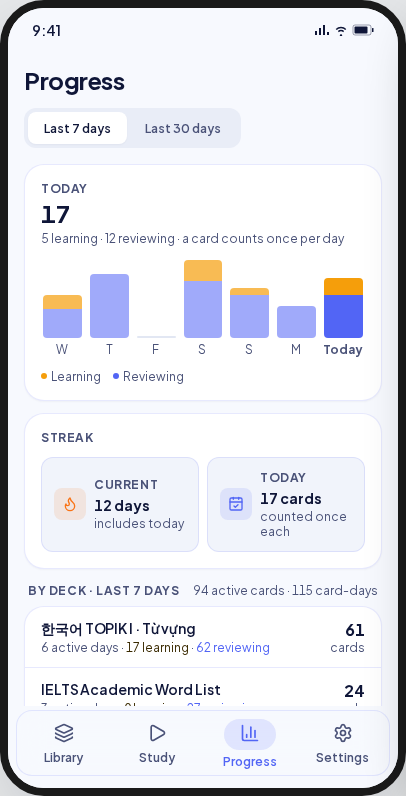 | 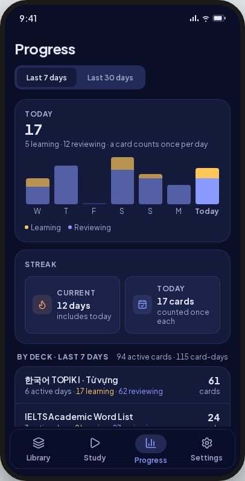 | **Deviation:** the range sits above the list (D10); one total row, no header totals (D2). |
| month (Last 30 days) | 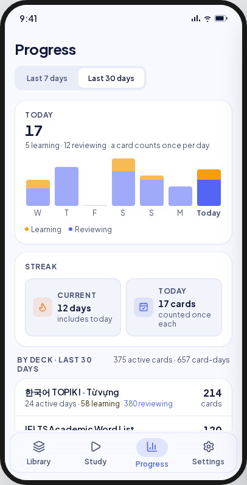 | 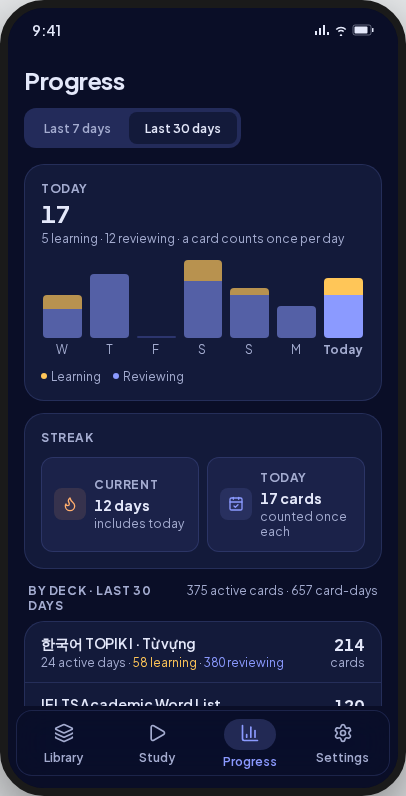 | As loaded. |
| held | 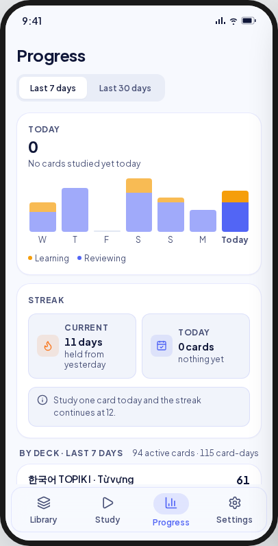 | 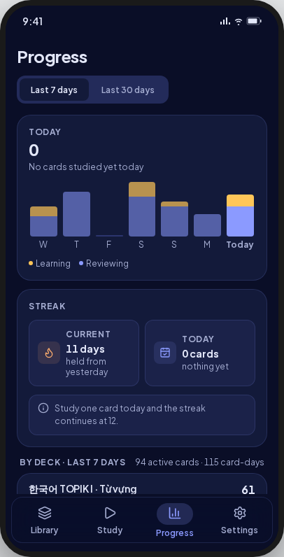 | As drawn. |
| lost | 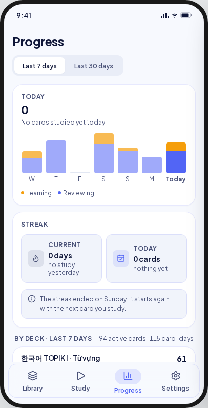 | 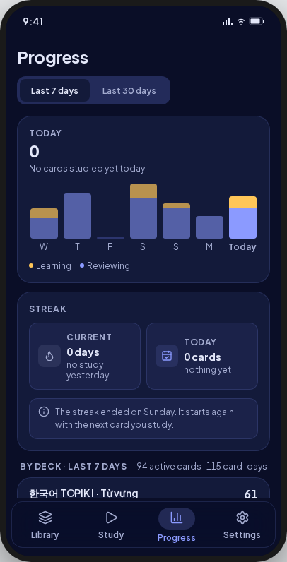 | The note names the weekday within six days, else a short date. |
| deck | 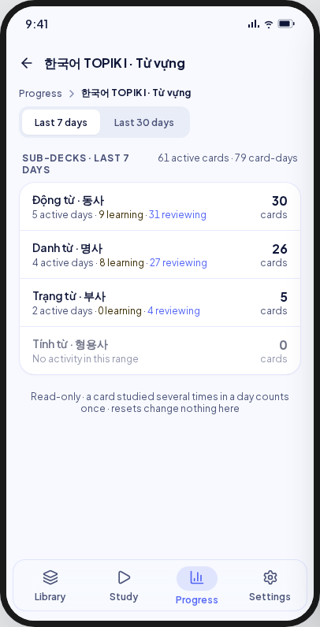 | 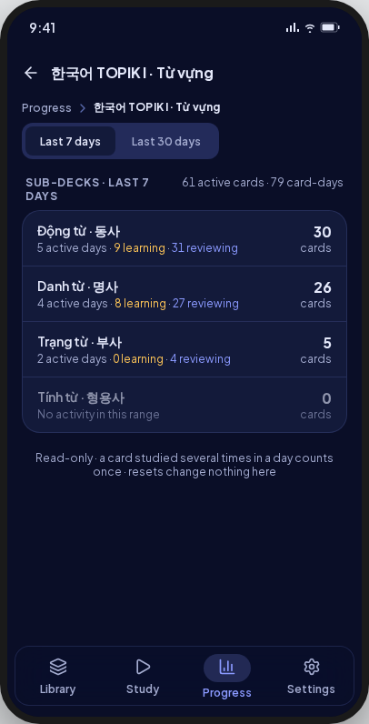 | "Whole deck" total row (D2). |
| never | 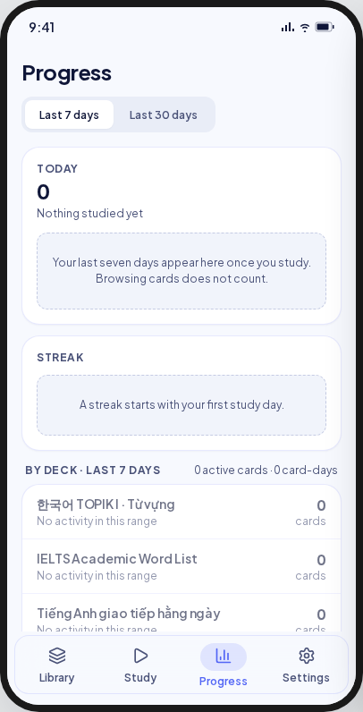 | 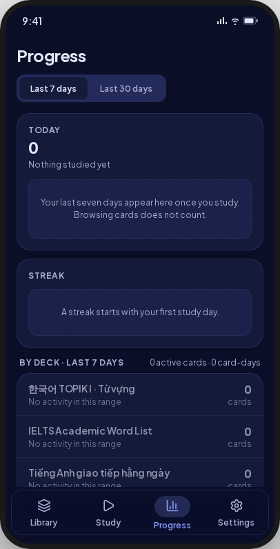 | **Deviation (D1):** "Start studying" under Today's placeholder opens the Study tab (UC-PROGRESS-001 A2). |
| loading | 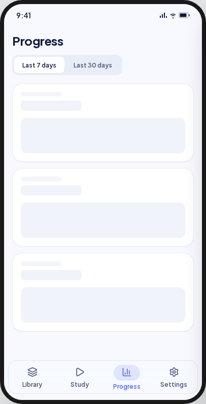 | 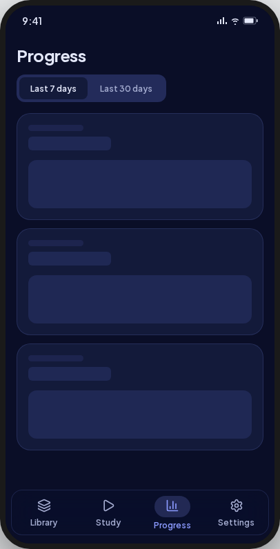 | Skeleton rows (UI-base row 125). |
| error | 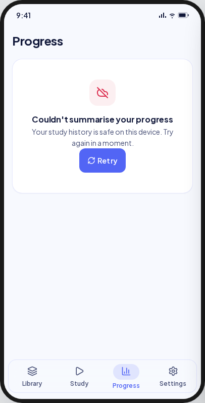 | 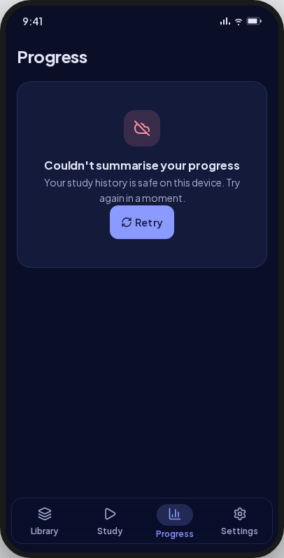 | As drawn, with Retry. |
| quiet range | — | — | **V8 addition (UC-PROGRESS-002 A3):** the note under the list. |
| no decks | — | — | **V8 addition (A2):** only "No decks yet · Create a deck in the Library and its progress appears here". No range, no total, no button. |
| no sub-decks | — | — | **V8 addition (A1):** the total row and its note. |
| deck gone | — | — | **V8 addition (E2):** "This deck is no longer here" with Back, no Retry (UI-base row 129). |

Goldens: `test/features/progress/presentation/goldens/progress_{week,month,held,lost,never,quiet,no_decks,loading,error}_{light,dark}.png` and `deck_progress_{deck,leaf,gone}_{light,dark}.png`.

## Deviations

| Artifact | V8 | Wins |
|---|---|---|
| The range tray at the top of the library level | Directly above the list it changes | UC-PROGRESS-001 step 4, UC-PROGRESS-002 step 1; D10 |
| "{n} active cards · {m} card-days" in the list header | A total row with the four numbers | BR-PROGRESS-001; D2 |
| An idle deck row at 60% opacity | Full contrast, its 0 muted | Contrast (critique P2); D11 |
| Never studied: placeholders only | Plus "Start studying" to the Study tab | UC-PROGRESS-001 A2; D1 |
| A skeleton per card, the tray shown | Skeleton rows | UI-base row 125 |
| No quiet-range, no-deck, leaf or gone state | Built from the UC | UC-PROGRESS-002 A1–A3, E2 |

## Copy

"Progress" · "Today" · "{l} learning · {r} reviewing · a card counts once per day" · "No
cards studied yet today" · "Nothing studied yet" · "Learning" · "Reviewing" · "Streak" ·
"Current" · "{n} days" · "includes today" · "held from yesterday" · "no study yesterday" ·
"{n} cards" · "counted once each" · "nothing yet" · "Study one card today and the streak
continues at {n}." · "The streak ended on {day}. It starts again with the next card you
study." · "Your last seven days appear here once you study. Browsing cards does not
count." · "A streak starts with your first study day." · "Start studying" · "Last 7 days"
· "Last 30 days" · "By deck · last 7 days" · "Sub-decks · last 7 days" · "All decks" ·
"Whole deck" · "{d} active days" · "{l} learning" · "{r} reviewing" · "cards" · "No
activity in this range" · "Nothing studied in the last 7 days. Switch to Last 30 days to
see older study." · "No decks yet" · "Create a deck in the Library and its progress
appears here." · "This deck holds its cards directly, so the total above is all of it." ·
"Read-only · a card studied several times in a day counts once · resets change nothing
here" · "Couldn't summarise your progress" · "Your study history is safe on this device.
Try again in a moment."
