<!-- Hand-written screen handoff. Not generated by tools/docs/split_handoff.py. -->

# 23 · Settings

The Settings tab: the app-wide study defaults, the Theme and Language pages, and Reset
app options. Every value shown is the stored one, or the card limit being changed.
UC-SETTINGS-001; spec
[2026-09-26-settings-ui-design.md](../../../superpowers/specs/2026-09-26-settings-ui-design.md)
§5.2.

## Entry points

- **The Settings tab** of the bottom bar, `/settings`. It replaces the tab's placeholder.
- **Debug builds only:** the app bar's gallery icon opens the component gallery.

The Theme and Language rows open screens 25 and 26 on the root navigator, with no bottom
bar (D2).

## Layout

| Region | Widget | Design |
|---|---|---|
| App bar | `MxAppBar` | "Settings"; the gallery icon in debug builds. |
| Study defaults | `MxSection` + `MxSettingsRow` × 2 | "Cards per session" / "1 to 200 · default 20", with an `MxStepper` under the label: −/+, a hold repeats, a tap on the number types one (D6). "New-card order" / "How new cards enter a learning session", with an `MxSegmentedTray` Created · Random. The note: "Apply to sessions started from now on. A deck with its own study options keeps them." |
| Card limit message | `MxFieldMessage` (error) | "Enter a number from 1 to 200", under the stepper, while a typed value is out of range (E1). |
| App | `MxSection` + `MxSettingsRow` × 2 | "Theme" with the choice ("Follows the system setting", "Light" or "Dark"); "Language" with "System · {language}", "English" or "Tiếng Việt". Both open their page. |
| Reset | `MxSection` + `MxSettingsRow` | "Reset app options" / "Theme, language, study defaults". The note: "Only these app options return to their defaults. Decks, cards, per-deck study options and learning progress are not touched." |
| Reset dialog | `MxDialog` + `MxNote` + `MxSheetActions.custom` | "Reset app options?", "Theme, language, cards per session and new-card order go back to their defaults.", the shield note "Your decks, cards, schedules and study history stay exactly as they are. This is not “Reset learning progress”.", then Cancel (outline) · "Reset options" (primary, spinning while it runs), stacked when a label cannot fit (UI-base row 118). Back and Cancel do nothing while it runs. |
| Toasts | `MxSnackbar` | "Saved"; "Couldn't save cards per session. Still {n}." · Retry; "Couldn't save the new-card order." · Retry; "App options reset to defaults"; "Couldn't reset the app options. Nothing changed." · Retry. |

The card limit is saved once a change settles: 600 ms after the last step, a hold
included, or at once for a typed value. A segment tap saves at once (D1).

## States

| State | Light | Dark | V8 |
|---|---|---|---|
| loaded | 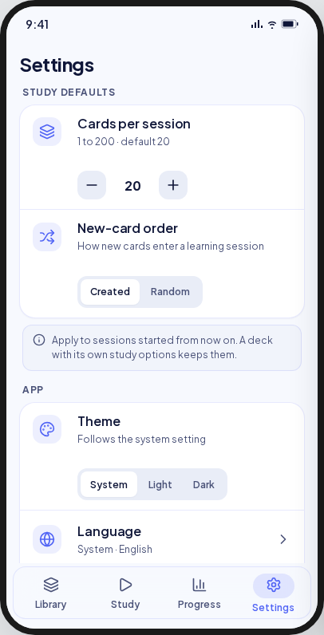 | 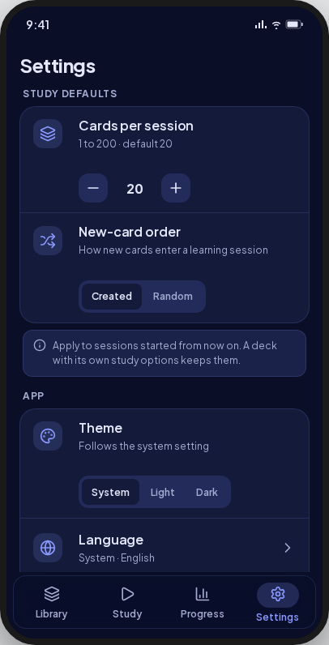 | Theme is a row that opens screen 25 (D2); the Daily reminder row is hidden until FE-B5. |
| loading | 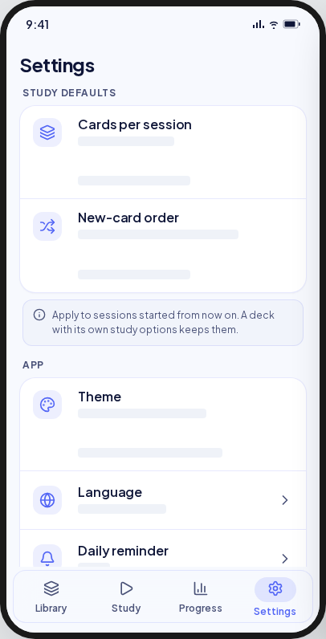 | 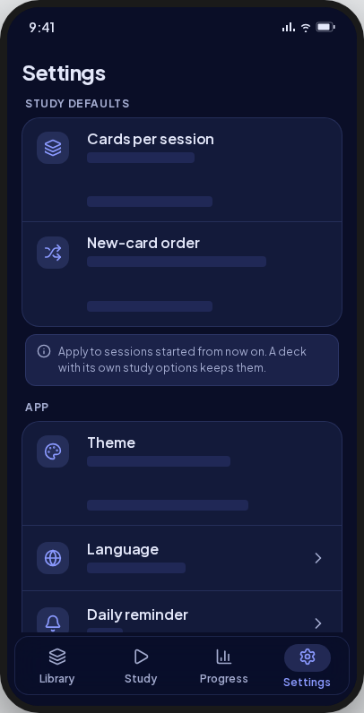 | Skeleton rows (UI-base row 125). |
| saving | 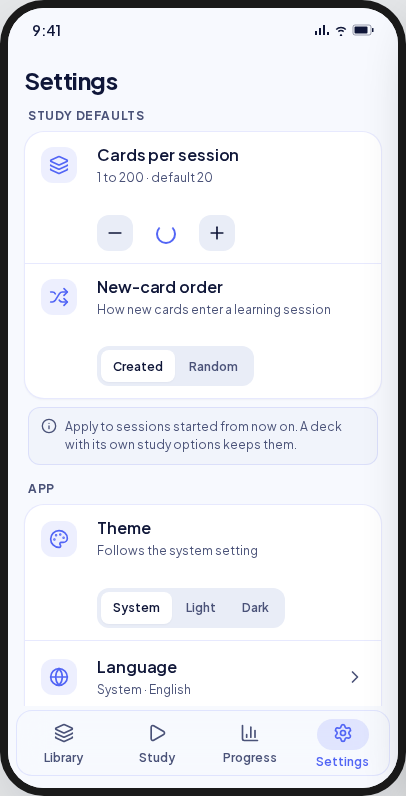 | 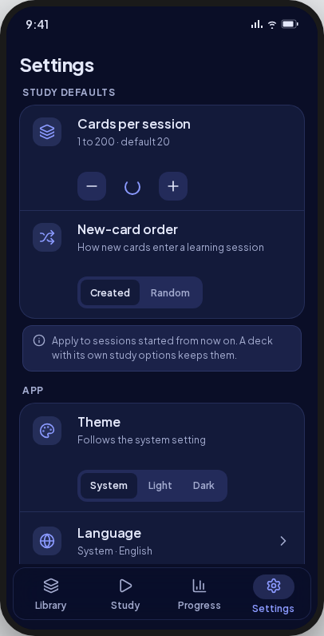 | The stepper's spinner; the other rows stay usable. |
| saved | 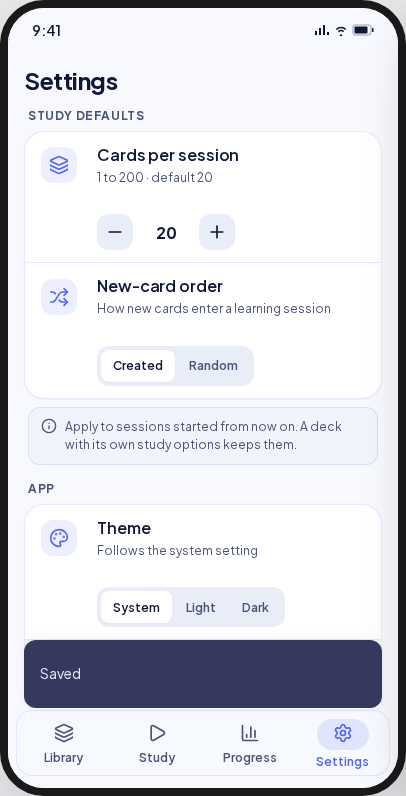 | 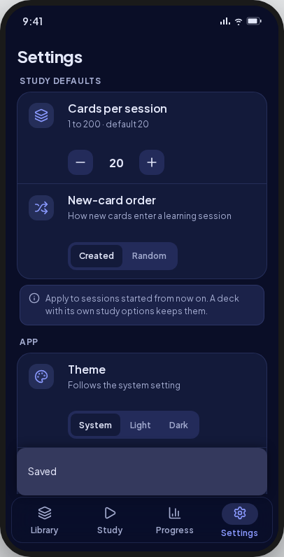 | As drawn. |
| invalidLimit | 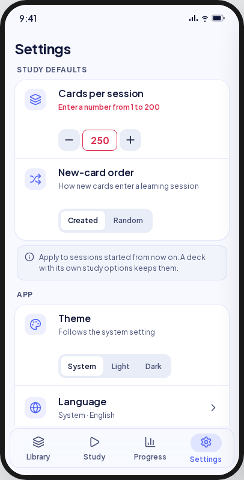 | 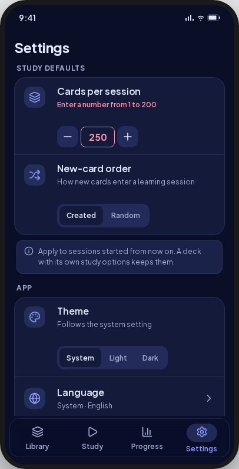 | **Deviation:** the message sits under the stepper and the sub-line stays (UC E1). |
| saveFailed | 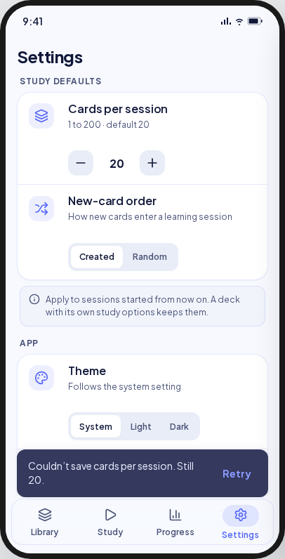 | 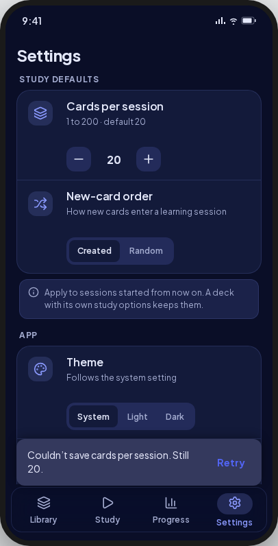 | As drawn; the stepper shows the stored value again. |
| resetConfirm | 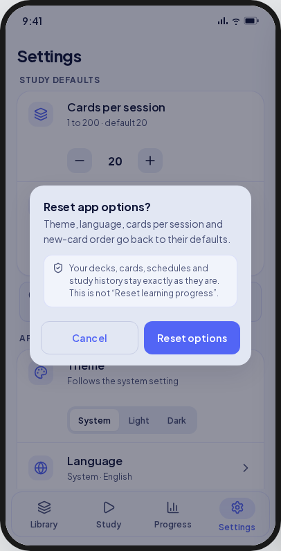 | 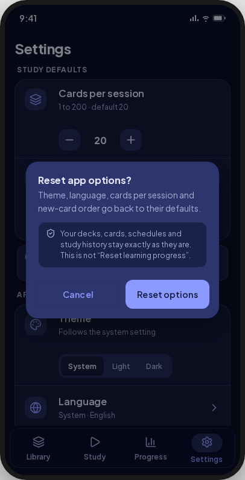 | As drawn. |
| resetDone | 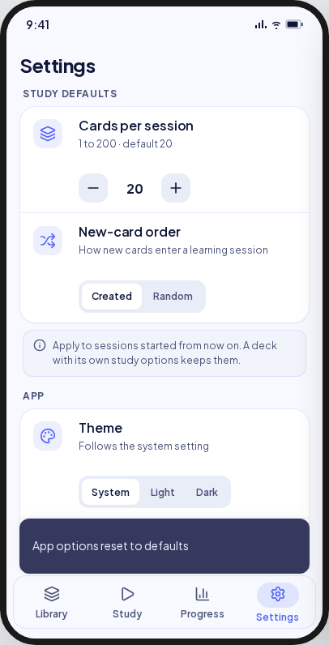 | 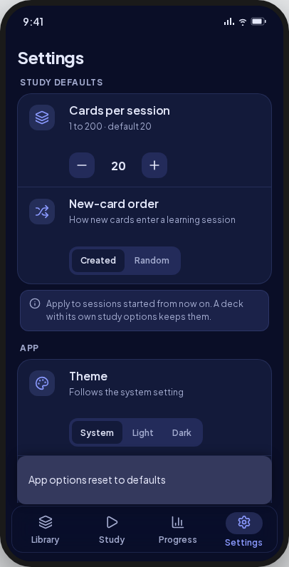 | As drawn. |
| read error | — | — | **V8 addition (UC E3):** `MxErrorState` "Couldn't open Settings" with the local-first body and Retry; no value is shown. |

Goldens: `test/features/settings/presentation/goldens/settings_{loaded,loading,saving,saved,invalid_limit,save_failed,reset_confirm,reset_done}_{light,dark}.png`.

## Deviations

| Artifact | V8 | Wins |
|---|---|---|
| Theme as an inline System · Light · Dark tray | A row naming the choice, opening screen 25 | D2 (owner); UI-base row 124 |
| The Daily reminder row | Hidden until FE-B5 | Spec A4: a control without its feature is hidden |
| "Enter a number from 1 to 200" in place of the sub-line | Under the stepper, the sub-line kept | UC-SETTINGS-001 E1 ("under the field") |
| −/+ by one | −/+, a hold that repeats, and a typed number | D6 (owner); UI-base row 126 |
| Loading as skeleton sub-lines inside the sections | `MxSkeletonList` | UI-base row 125 |
| No read-error state | `MxErrorState` with Retry | UC E3; UI-base row 125 |
| The tray on one line at any size | The options stack when their labels do not fit | UI-base row 127 |
| The tile centred on a row with a wide control | The tile beside the label, as the kit draws it | UI-base row 128 |

## Copy

- Study defaults: "Study defaults" · "Cards per session" · "1 to {max} · default {n}" · "Fewer cards per session" · "More cards per session" · "Enter a number from {min} to {max}" · "New-card order" · "How new cards enter a learning session" · "Created" · "Random" · "Apply to sessions started from now on. A deck with its own study options keeps them."
- App: "App" · "Theme" · "Follows the system setting" · "Light" · "Dark" · "Language" · "System · {language}" · "English" · "Tiếng Việt".
- Reset: "Reset" · "Reset app options" · "Theme, language, study defaults" · "Only these app options return to their defaults. Decks, cards, per-deck study options and learning progress are not touched." · "Reset app options?" · "Theme, language, cards per session and new-card order go back to their defaults." · "Your decks, cards, schedules and study history stay exactly as they are. This is not “Reset learning progress”." · "Cancel" · "Reset options".
- Toasts: "Saved" · "Couldn't save cards per session. Still {n}." · "Couldn't save the new-card order." · "App options reset to defaults" · "Couldn't reset the app options. Nothing changed." · "Retry".
- Error: "Couldn't open Settings" · "Nothing was lost. Try again in a moment." · "Retry".
