<!-- Hand-written screen record. -->

# 23 · Settings

The Settings tab: the app-wide study defaults, the Theme and Language pages, and Reset
app options. Every value shown is the stored one, or the card limit being changed.
UC-SETTINGS-001; spec
[2026-09-26-settings-ui-design.md](../../../superpowers/specs/2026-09-26-settings-ui-design.md)
§5.2.

## Entry points

- **The Settings tab** of the bottom bar, `/settings`. It replaces the tab's placeholder.
- **Debug builds only:** the app bar's gallery icon opens the component gallery.

The Theme and Language rows open screens 25 and 26 on the root navigator, with no bottom
bar (D2).

## Layout

| Region | Widget | Design |
|---|---|---|
| App bar | `MxAppBar` | "Settings"; the gallery icon in debug builds. |
| Account | `MxSection` + `MxSettingsRow` | FE-B9, first: "Account". An anonymous device gets "Sign in" / "Keep your decks if you reinstall or change phones" with the person tile, opening screen 30; while the account cannot link yet (offline) the row is disabled with "Available when you're online". An attached account shows its email / "Your decks sync to this account" with a chevron to screen 32 (FE-B10). An expired sign-in puts a warning `MxInlineBanner` above the section: "Your sign-in expired. Your decks are still on this phone." · "Sign in" → 30 `reauth` (spec §5.5; above the overline, P3b plan ruling 1). `app/` composes it as a slot, like Admin; hidden in a build with no Supabase. |
| Study defaults | `MxSection` + `MxSettingsRow` × 2 | "Cards per session" / "1 to 200 · default 20", with an `MxStepper` under the label: −/+, a hold repeats, a tap on the number types one (D6). "New-card order" / "How new cards enter a learning session", with an `MxSegmentedTray` In order · Random (critique 2026-09-30 part 3a, R2). The note: "Applies to sessions started from now on. A deck with its own study options keeps them." |
| Card limit message | `MxFieldMessage` (error) | "Enter a number from 1 to 200", under the stepper, while a typed value is out of range (E1). |
| App | `MxSection` + `MxSettingsRow` × 3 | "Theme" with the choice ("Follows the system setting", "Light" or "Dark"); "Language" with "System · {language}", "English" or "Tiếng Việt"; "Daily reminder" with "Off" or "On · {HH:mm}" (FE-B5). Each opens its page. |
| Sync | `MxSection` + `MxSettingsRow` | SB-U1: "Sync", one row with the cloud-sync tile; its sub-line is the first that applies of "{n} changes weren't accepted" (critique 2026-09-30 part 3a, R3), "Couldn't sync · no connection" (or "· couldn't sign in", "· server error", "· something went wrong"), "Synced {Today, 14:32}", "Not synced yet" (sync status spec §5.1). Opens screen 27. Hidden when the build has no Supabase. |
| Admin | `MxSection` + `MxSettingsRow` × 3 | FE-B8, FE-B11: "Admin", then "Monitoring" / "Logs of the app and the server" (monitor tile, opens 28), "Users" / "Who can manage the app" (people tile, opens 33), then "Log SQL statements" / "Each statement the app runs is logged, for performance checks. Turn off to keep the log small." with a trailing `MxToggle` on the debug-level tile (SQL log switch spec 2026-10-07; the account's value, synced; the toggle is disabled while its save runs, and a refused save shows "Couldn't change that. The switch is unchanged." with the row unchanged). Settings draws the section from an `adminRows` slot that `app/` fills (users spec U2), only while the session's account is an admin; hidden for everyone else and in a build with no Supabase. |
| Reset | `MxSection` + `MxSettingsRow` (`isAction`: it opens a dialog, so no chevron; critique 2026-09-30 part 1) | "Reset app options" / "Theme, language, study defaults". The note: "Only these app options return to their defaults. Decks, cards, per-deck study options and learning progress are not touched." |
| Reset dialog | `MxDialog` + `MxNote` + `MxSheetActions.custom` | "Reset app options?", "Theme, language, cards per session and new-card order go back to their defaults.", the shield note "Your decks, cards, schedules and study history stay exactly as they are. This is not “Reset learning progress”.", then Cancel (outline) · "Reset" (primary, spinning while it runs), 1 : 1 (DEV-179), stacked when a label cannot fit (UI-base row 118). Back and Cancel do nothing while it runs. |
| Toasts | `MxSnackbar` | "Saved"; "Couldn't save cards per session. Still {n}." · Retry; "Couldn't save the new-card order." · Retry; "App options reset to defaults"; "Couldn't reset the app options. Nothing changed." · Retry. |

The card limit is saved once a change settles: 600 ms after the last step, a hold
included, or at once for a typed value. A segment tap saves at once (D1).

## States

| State | Golden (light) | Golden (dark) | App |
|---|---|---|---|
| loaded | `settings_loaded_light.png` | `settings_loaded_dark.png` | Theme is a row that opens screen 25 (D2); the Daily reminder row reads "Off" or "On · {HH:mm}" and opens screen 24 (FE-B5). |
| loading | `settings_loading_light.png` | `settings_loading_dark.png` | Three section-shaped skeleton cards of `MxSkeletonRow`s (UI-base row 125, part 3d-2). |
| saving | `settings_saving_light.png` | `settings_saving_dark.png` | The stepper's spinner; the other rows stay usable. |
| saved | `settings_saved_light.png` | `settings_saved_dark.png` | — |
| invalidLimit | `settings_invalid_limit_light.png` | `settings_invalid_limit_dark.png` | The message sits under the stepper and the sub-line stays (UC E1). |
| saveFailed | `settings_save_failed_light.png` | `settings_save_failed_dark.png` | The stepper shows the stored value again. |
| resetConfirm | `settings_reset_confirm_light.png` | `settings_reset_confirm_dark.png` | — |
| resetDone | `settings_reset_done_light.png` | `settings_reset_done_dark.png` | — |
| syncSynced | 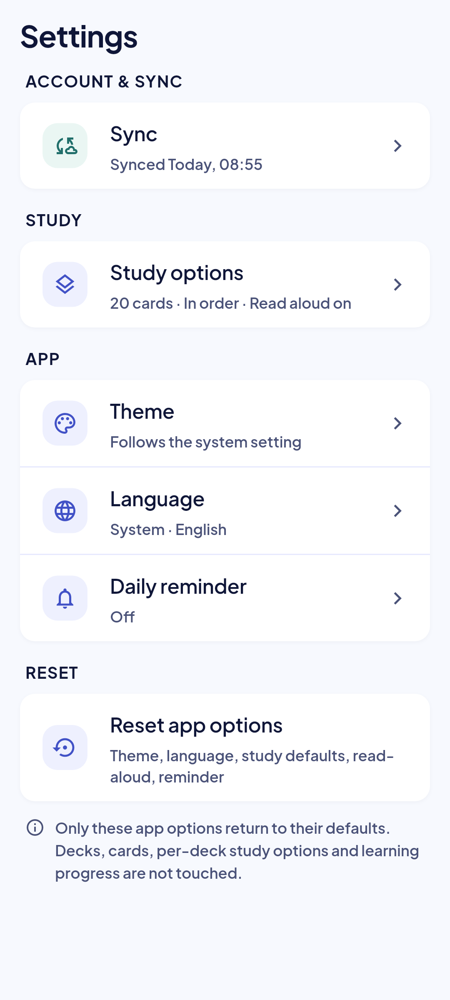 | 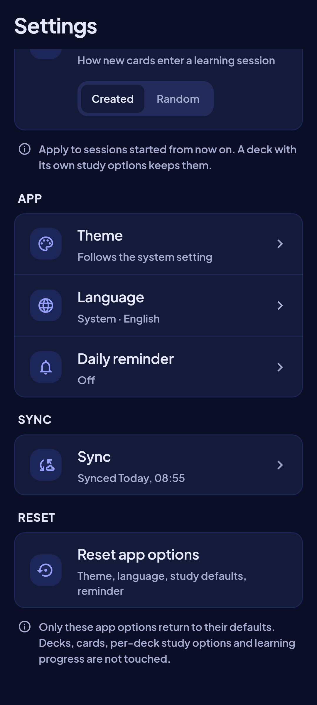 | (SB-U1) the Sync row after a success. |
| syncFailed | 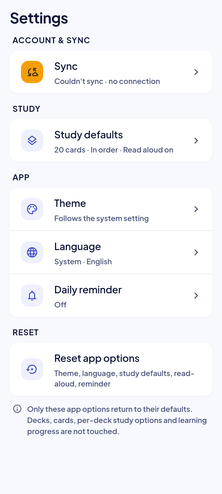 | 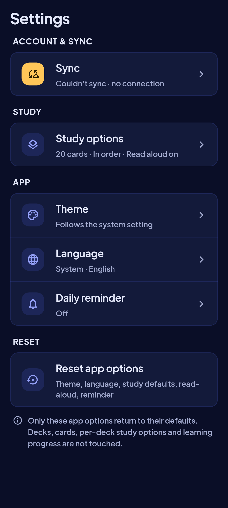 | (SB-U1) the Sync row after a failed run. |
| syncRejected |  | 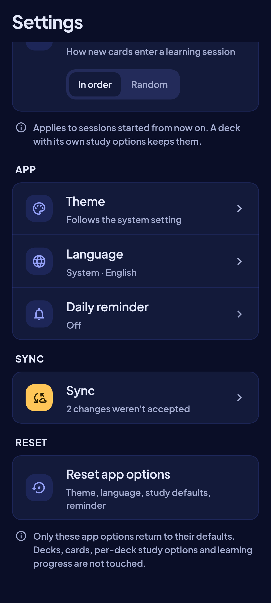 | (SB-U1) the Sync row with refused rows. |
| account | 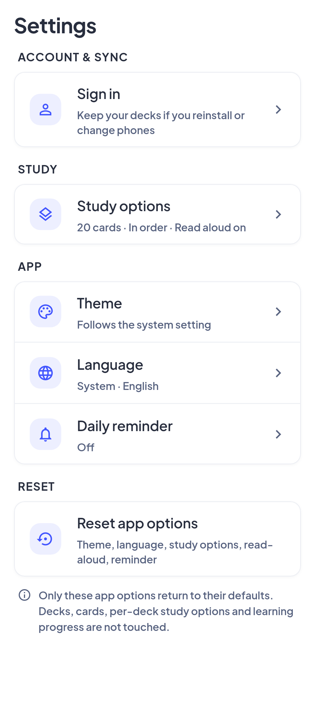 | 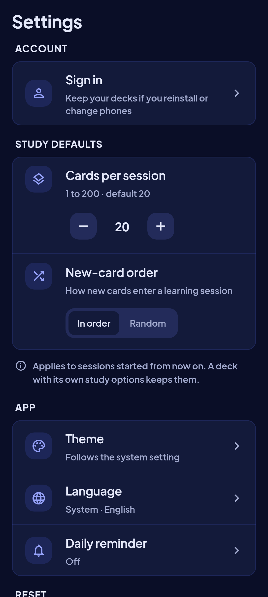 | Golden `settings_account_*` (in the account tests): the Account section first, anonymous. |
| account, signed in | 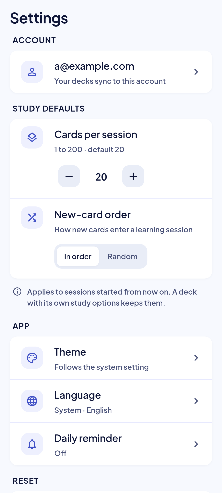 | 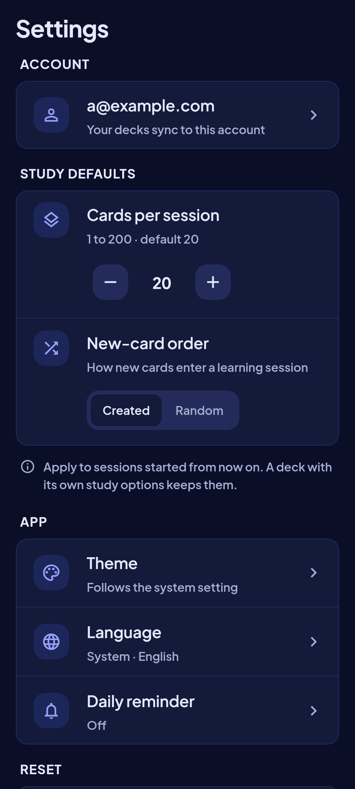 | (FE-B10) Golden `settings_account_signed_in_*`: the account row and its chevron. |
| account, re-auth | 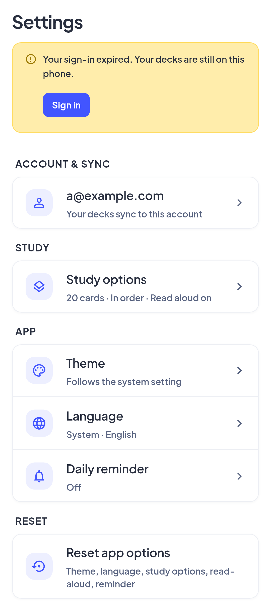 | 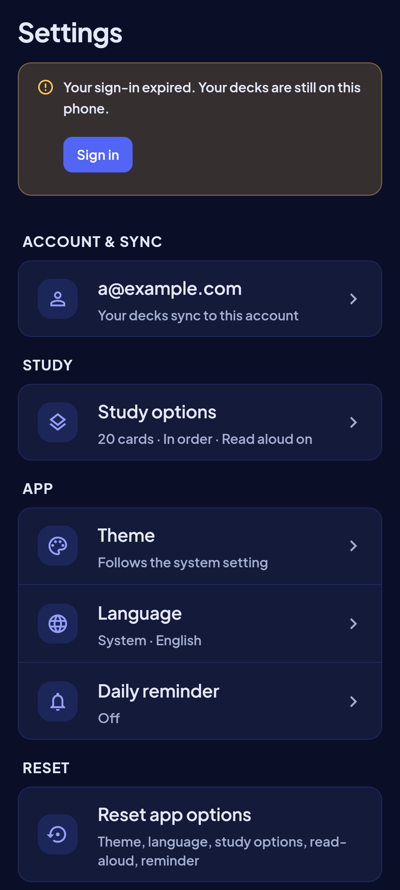 | (FE-B10) Golden `settings_account_reauth_*`: the banner leads the section. |
| admin rows | 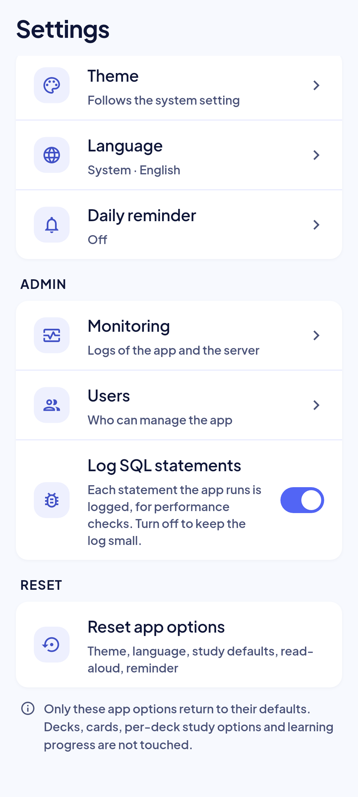 | 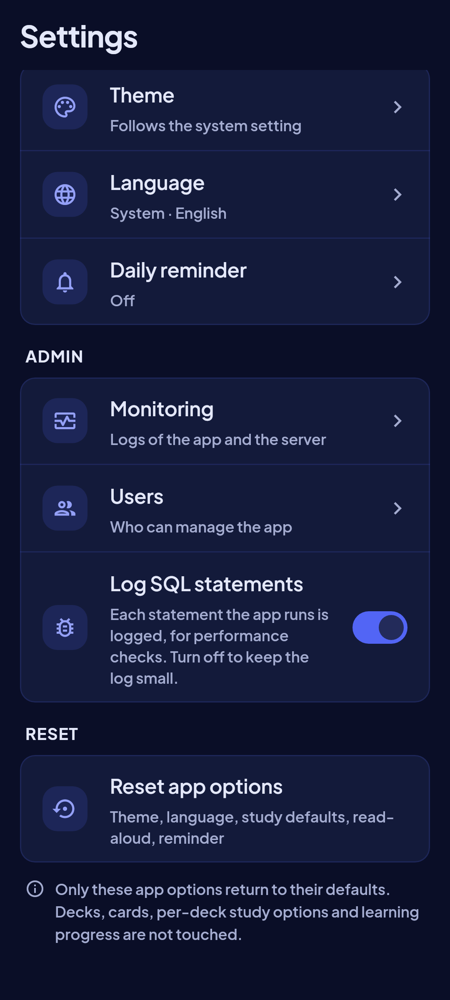 | (FE-B11) Golden `settings_admin_rows_*`: Monitoring then Users. |
| read error | — | — | (UC E3) `MxErrorState` "Couldn't open Settings" with the local-first body and Retry; no value is shown. |

Goldens: `test/features/settings/presentation/goldens/settings_{loaded,loading,saving,saved,invalid_limit,save_failed,reset_confirm,reset_done,sync_synced,sync_failed,sync_rejected}_{light,dark}.png`.

## Rulings

- **D2 (owner), UI-base row 124:** Theme is a row naming the choice and opens screen 25.
- **UC-SETTINGS-001 E1:** "Enter a number from 1 to 200" sits under the stepper and the sub-line stays.
- **D6 (owner), UI-base row 126:** the stepper takes −/+, a hold that repeats, and a typed number.
- **UI-base row 125, UC E3:** loading is three section-shaped skeleton cards (part 3d-2); a read error is `MxErrorState` with Retry.
- **UI-base row 127:** tray options stack when their labels do not fit.
- **ADR-015, SB-U1 (owner rulings R1, R5):** a Sync section with one row opens screen 27.
- **UI-base row 128:** the tile sits beside the label on a row with a wide control.
- **Account UI spec §5.5, R2, P3b plan ruling 1:** the attached account opens screen 32; an expired sign-in's banner leads the Account section, since 23 owns the problem.
- **ADR-018 §8, monitoring spec §3.1, users spec U2:** the Admin section holds Monitoring and Users, drawn by Settings from rows the features supply, only while the account is an admin.
- **Critique 2026-09-30 tone pass, T4:** the Sync row's tile is success when sync is settled; warning when the last run failed or a change was refused (part 3d-1, D5); tinted otherwise.
- **Critique 2026-09-30 part 3d-1 (spec `2026-10-01-critique-fixes-part3d1-design.md`):** the Sync row's icon tile is warning when the last run failed or a change was refused, success when settled, tinted otherwise (D5).
- **Critique 2026-09-30 part 3d-2 (spec `2026-10-01-critique-fixes-part3d2-design.md`):** loading shows section-shaped skeleton cards (three) of `MxSkeletonRow`s, not a generic list.

## Copy

- Study defaults: "Study defaults" · "Cards per session" · "1 to {max} · default {n}" · "Fewer cards per session" · "More cards per session" · "Enter a number from {min} to {max}" · "New-card order" · "How new cards enter a learning session" · "In order" · "Random" · "Applies to sessions started from now on. A deck with its own study options keeps them."
- App: "App" · "Theme" · "Follows the system setting" · "Light" · "Dark" · "Language" · "System · {language}" · "English" · "Tiếng Việt" · "Daily reminder" · "Off" · "On · {time}".
- Reset: "Reset" · "Reset app options" · "Theme, language, study defaults, reminder" · "Only these app options return to their defaults. Decks, cards, per-deck study options and learning progress are not touched." · "Reset app options?" · "Theme, language, cards per session, new-card order and the daily reminder (off, 20:00) go back to their defaults." · "Your decks, cards, schedules and study history stay exactly as they are. This is not “Reset learning progress”." · "Cancel" · "Reset".
- Sync (SB-U1): "Sync" · "{n} changes weren't accepted" · "Couldn't sync · no connection" · "Couldn't sync · couldn't sign in" · "Couldn't sync · server error" · "Couldn't sync · something went wrong" · "Synced {time}" · "Not synced yet"; times "Today, {HH:mm}" · "Yesterday, {HH:mm}" · "{MMM d}, {HH:mm}".
- Admin (FE-B8, FE-B11): "Admin" · "Monitoring" · "Logs of the app and the server" · "Users" · "Who can manage the app" · "Log SQL statements" · "Each statement the app runs is logged, for performance checks. Turn off to keep the log small." · "Couldn't change that. The switch is unchanged." (SQL log switch spec).
- Toasts: "Saved" · "Couldn't save cards per session. Still {n}." · "Couldn't save the new-card order." · "App options reset to defaults" · "Couldn't reset the app options. Nothing changed." · "Retry".
- Error: "Couldn't open Settings" · "Nothing was lost. Try again in a moment." · "Retry".
