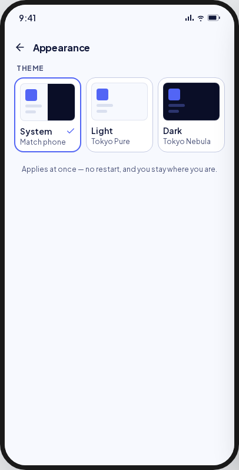
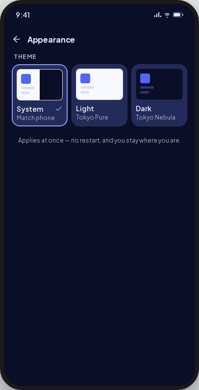
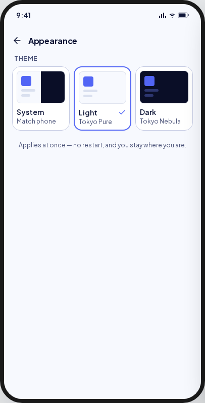
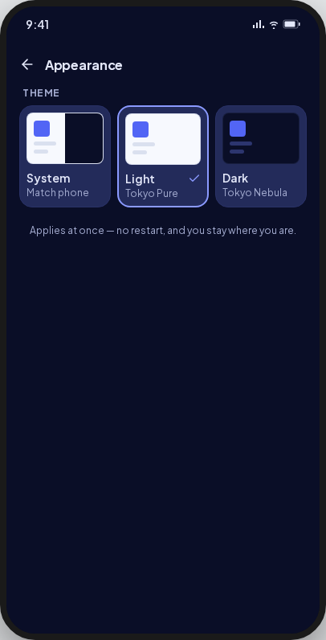
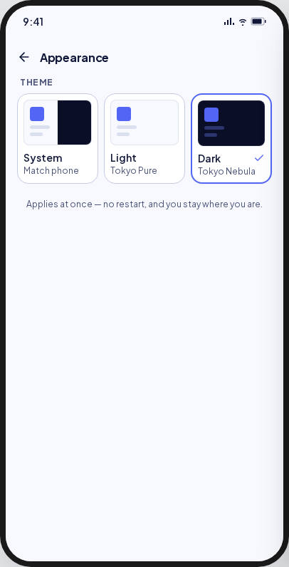
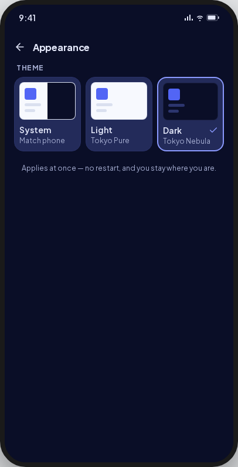

<!-- Hand-written screen handoff. Not generated by tools/docs/split_handoff.py. -->

# 25 · Theme

The app's theme: follow the phone, always light or always dark. A tap applies it at
once, and the page stays open. UC-SETTINGS-001 step 4, BR-SETTINGS-005; spec
[2026-09-26-settings-ui-design.md](../../../superpowers/specs/2026-09-26-settings-ui-design.md)
§5.3.

## Entry points

- **Screen 23's Theme row**, `/settings/theme`, on the root navigator with no bottom bar
  (D2).

## Layout

| Region | Widget | Design |
|---|---|---|
| App bar | `MxAppBar` | Back and "Theme" (D7). |
| Cards | `MxCard` (selected ring) + `MxRowInk` × 3 | A preview, then "System" / "Match phone", "Light" / "Always light", "Dark" / "Always dark", and a check on the chosen card. The preview paints the light and dark themes' own colours; System is split in half. Each card is one TalkBack node, "selected" when chosen. |
| Note | Text | "Applies at once — no restart, and you stay where you are." |
| Toast | `MxSnackbar` | "Couldn't change the theme." · Retry. The stored choice stays selected. |

## States

| State | Light | Dark | V8 |
|---|---|---|---|
| system |  |  | Titled "Theme", with plain descriptors (D7); no "THEME" overline. |
| light |  |  | As system. |
| dark |  |  | As system. |
| read error | — | — | **V8 addition (UC E3):** `MxErrorState` "Couldn't open Settings" with Retry. |

Goldens: `test/features/settings/presentation/goldens/settings_theme_{system,light,dark}_{light,dark}.png`.

## Deviations

| Artifact | V8 | Wins |
|---|---|---|
| "Appearance", and a "THEME" overline | "Theme", with no overline: the title already names it | D7 (owner) |
| "Tokyo Pure", "Tokyo Nebula" | "Always light", "Always dark" | D7 (owner) |
| Three cards side by side at any size | One card per line when a word of a name or hint would not fit its third (large text, Vietnamese) | Build audit 2026-09-26; the tray's rule, UI-base row 123 |

## Copy

"Theme" · "System" · "Match phone" · "Light" · "Always light" · "Dark" · "Always dark" ·
"Applies at once — no restart, and you stay where you are." · "Couldn't change the
theme." · "Retry".
