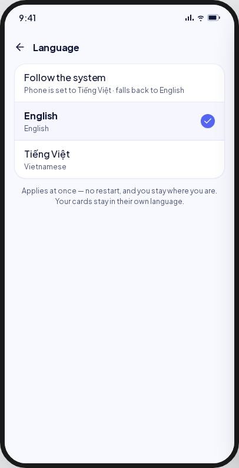
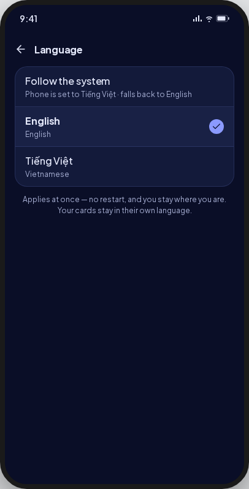
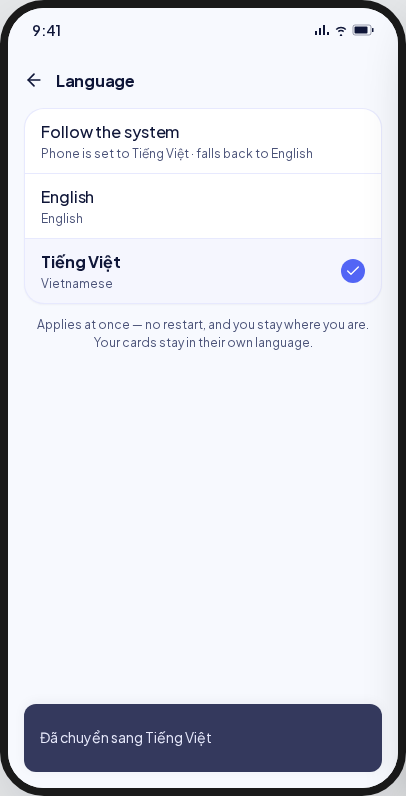
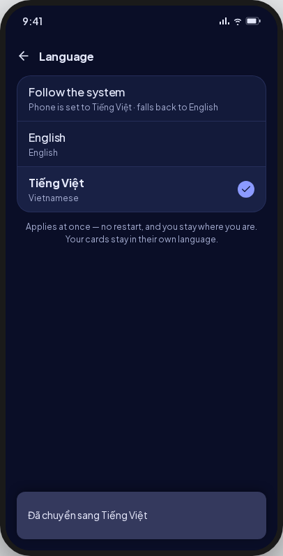
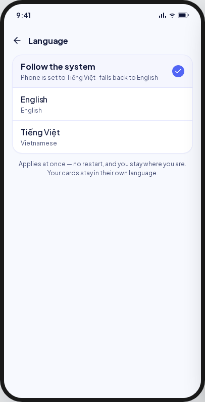
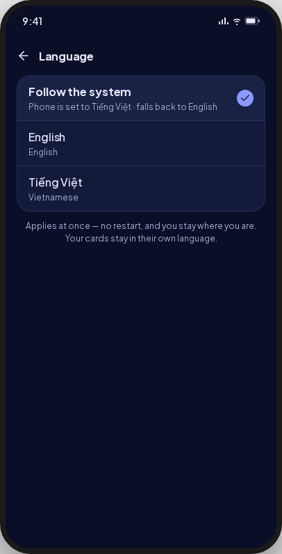

<!-- Hand-written screen handoff. Not generated by tools/docs/split_handoff.py. -->

# 26 · Language

The app's language: follow the phone, English or Tiếng Việt. A tap applies it at once,
and the page stays open. UC-SETTINGS-001 step 5, BR-SETTINGS-006; spec
[2026-09-26-settings-ui-design.md](../../../superpowers/specs/2026-09-26-settings-ui-design.md)
§5.3.

## Entry points

- **Screen 23's Language row**, `/settings/language`, on the root navigator with no bottom
  bar (D2).

## Layout

| Region | Widget | Design |
|---|---|---|
| App bar | `MxAppBar` | Back and "Language". |
| Rows | `MxCard` + `MxOptionRow` × 3 | "Follow the system" with what it resolves to now: "Phone is set to English", "Phone is set to Tiếng Việt", or "Your phone's language isn't available · English" (D8). "English", and "Tiếng Việt" with its name in the current language ("Vietnamese"); a sub-line that repeats the title is left out. |
| Note | Text | "Applies at once — no restart, and you stay where you are. Your cards stay in their own language." |
| Toasts | `MxSnackbar` | After a switch, in the new language: "Switched to English" or "Đã chuyển sang Tiếng Việt". "Couldn't change the language." · Retry; the stored choice stays selected. |

## States

| State | Light | Dark | V8 |
|---|---|---|---|
| english |  |  | Radio rows; English has no sub-line. |
| vietnamese |  |  | The toast reads in Vietnamese. |
| system |  |  | **Deviation:** the line names what `system` resolves to (D8). |
| read error | — | — | **V8 addition (UC E3):** `MxErrorState` "Couldn't open Settings" with Retry. |

Goldens: `test/features/settings/presentation/goldens/settings_language_{english,switched,system}_{light,dark}.png`.

## Deviations

| Artifact | V8 | Wins |
|---|---|---|
| "Phone is set to Tiếng Việt · falls back to English" | "Phone is set to Tiếng Việt"; the fallback line only for a language the app lacks | D8, BR-SETTINGS-006 |
| A tinted selected row with a trailing check | `MxOptionRow` radios, the app's single-choice list | The shared option row |
| English over "English" | No sub-line when it repeats the title | Critique 2026-09-26 (minor) |

## Copy

"Language" · "Follow the system" · "Phone is set to {language}" · "Your phone's language
isn't available · English" · "English" · "Tiếng Việt" · "Vietnamese" · "Applies at once —
no restart, and you stay where you are. Your cards stay in their own language." ·
"Switched to English" · "Đã chuyển sang Tiếng Việt" · "Couldn't change the language." ·
"Retry".
