<!-- Hand-written screen record. -->

# 27 · Sync

What sync did and what waits: the last success, the changes not yet on the server, the
last failed run, and the rows the server refused. Shaped by Impeccable before the plan
(2026-09-28). SB-U1; spec
[2026-09-28-sync-status-design.md](../../../superpowers/specs/2026-09-28-sync-status-design.md)
§5.2.

## Entry points

- Screen 23, Sync section, row "Sync". Route `/settings/sync`, on the root navigator like
  Theme and Language; Back returns to 23.
- Screen 13's sync banner, "Details" (`context.go`, as Study home opens the Library);
  Back lands on Settings.
- Neither exists when the build has no Supabase.

## Layout

| Region | Widget | Design |
|---|---|---|
| App bar | `MxAppBar` (content density) + back `MxIconButton` | "Sync". |
| Notice | `MxFloatingNotice` in `MxAppShell.notice` | Floats over the bottom of the page (owner ruling 2026-09-28; UI-base register row 143). Refused rows win: "{n} changes are kept only on this device", then Keep on this device (outline) · Try again (primary) under it. Otherwise the last failed run's sentence (spec §5.4), local-first, with no code, id or message. None when all is well. |
| Status | `MxSection` + two `MxSettingsRow`s + note | "Last synced" · "{Today, 14:32}" or "Not yet"; "Waiting to sync" · "{n} changes" or "Nothing waiting"; the note "MemoX syncs on its own when you're online. Your study never waits for it." |
| Sync now | `MxButton` (primary, block, cloud-sync glyph) | Spins and is disabled while a run it started is going. |
| Toasts | `MxSnackbar` | "Synced"; "Couldn't sync. Nothing was lost."; "Kept on this device"; "Couldn't change that. Nothing was lost." · Retry. |

Only one of Sync now, Try again and Keep on this device runs at a time; the other two
are disabled meanwhile.

## States

Every state is a V8 addition; the images are the goldens.

| State | Golden (light) | Golden (dark) | App |
|---|---|---|---|
| synced | 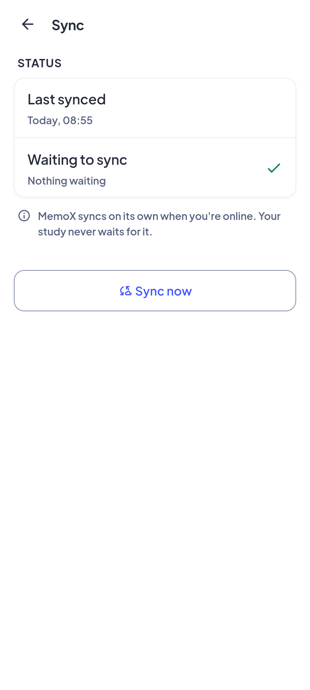 | 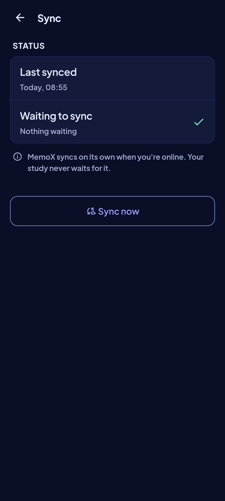 | Golden `sync_synced_*`. |
| neverSynced | 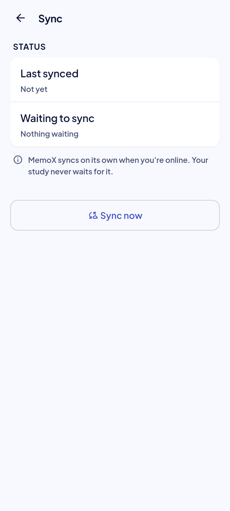 | 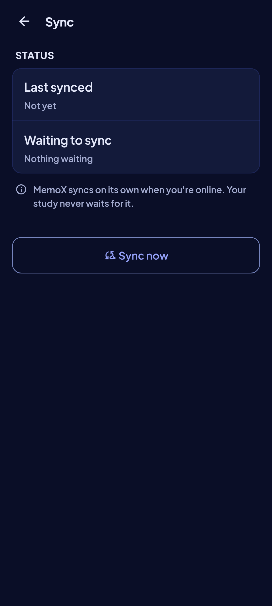 | Golden `sync_never_synced_*`. |
| pending | 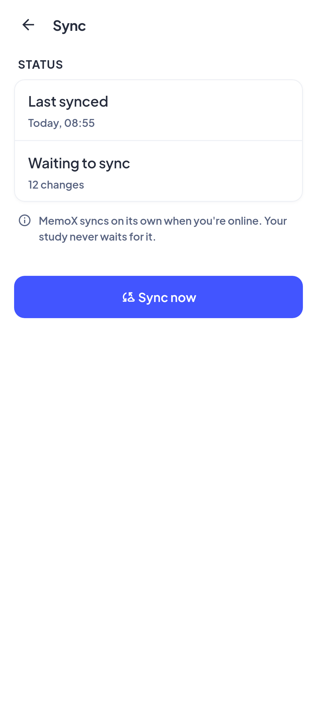 | 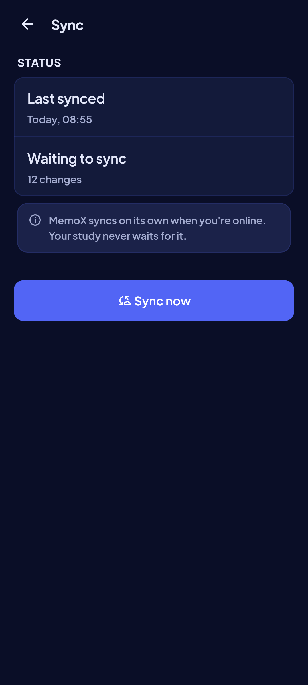 | Golden `sync_pending_*`. |
| failedNetwork | 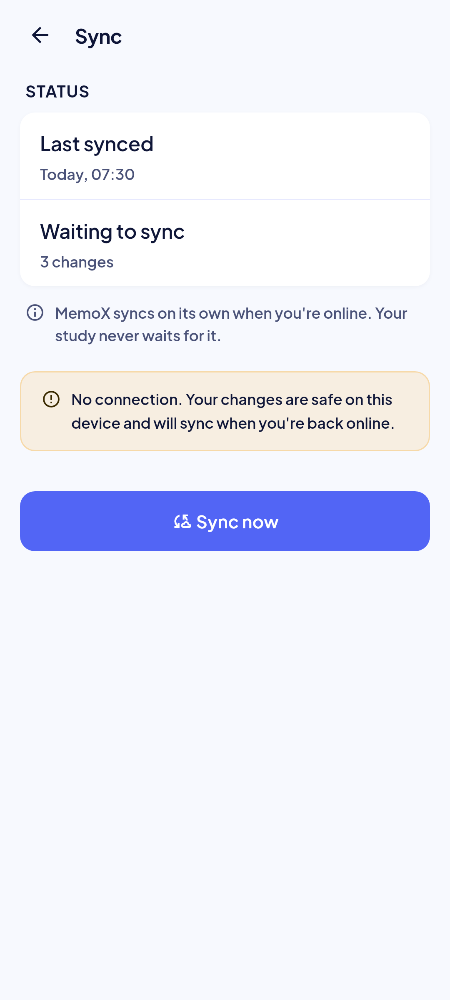 | 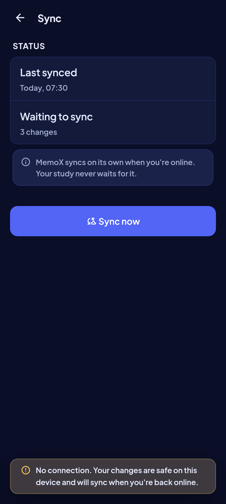 | Golden `sync_failed_network_*`. |
| failedServer | 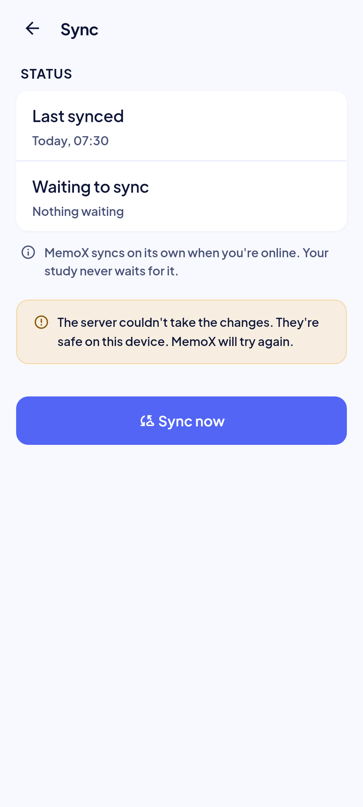 | 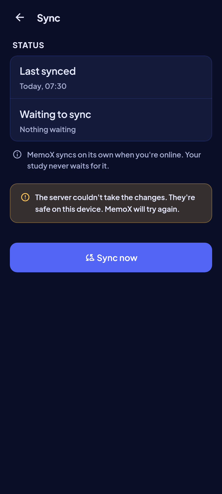 | Golden `sync_failed_server_*`. |
| rejected | 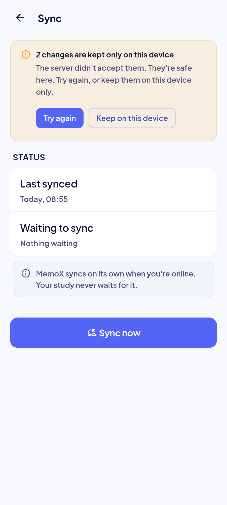 | 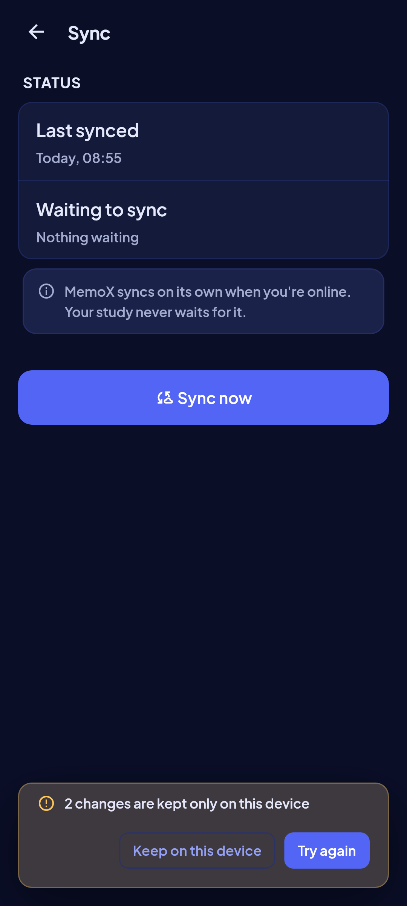 | Golden `sync_rejected_*`. |
| syncing | 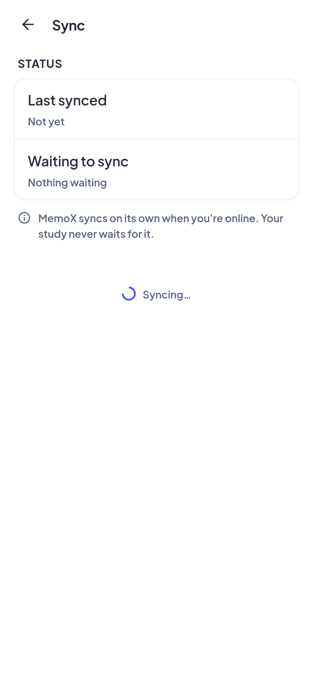 | 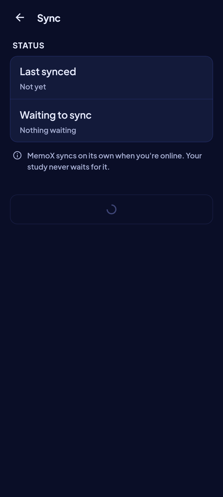 | Golden `sync_syncing_*`. |
| loading | — | — | `MxSkeletonList`, two rows. |
| read error | — | — | `MxErrorState` "Couldn't open Sync" with the local-first body and Retry (spec §6). |

## Rulings

- **ADR-015, SB-U1 owner rulings R1, R3, R5–R7:** sync has its own screen, and its problems reach other screens as a floating notice (register row 143).
- **Spec R6, FE-B5 D9:** times are 24-hour `HH:mm` in every language; dates read "Sep 26" style in English.

## Copy

- App bar: "Sync".
- Refused rows: "{n} changes are kept only on this device" · "Keep on this device" · "Try again".
- Failures: "No connection. Your changes are safe on this device and will sync when you're back online." · "Couldn't sign in to sync. Your changes are safe on this device. MemoX will try again." · "The server couldn't take the changes. They're safe on this device. MemoX will try again." · "Sync stopped with an error. Your changes are safe on this device. MemoX will try again."
- Status: "Status" · "Last synced" · "Not yet" · "Waiting to sync" · "{n} changes" · "Nothing waiting" · "MemoX syncs on its own when you're online. Your study never waits for it." · "Sync now".
- Toasts: "Synced" · "Couldn't sync. Nothing was lost." · "Kept on this device" · "Couldn't change that. Nothing was lost." · "Retry".
- Error: "Couldn't open Sync" · "Nothing was lost. Try again in a moment." · "Retry".
