<!-- Hand-written screen handoff. Not generated by tools/docs/split_handoff.py. -->

# 28 · Monitoring

The admin's window on the app's logs: the server's, and the device's own buffer. It opens
on the open warnings and errors, newest first, and lets the admin filter and search them,
open one whole, and mark it fixed or reopen it. Not in the kit: UI Kit v3 predates the
server and has no admin tooling; the screen was shaped with Impeccable on 2026-09-29.
FE-B8; ADR-018 §6 to §8; spec
[2026-09-29-monitoring-screen-design.md](../../../superpowers/specs/2026-09-29-monitoring-screen-design.md)
§3; plan
[2026-09-29-monitoring-screen.md](../../../superpowers/plans/2026-09-29-monitoring-screen.md).

## Entry points

- Screen 23, Admin section, row "Monitoring". Route `/settings/monitoring`, on the root
  navigator like Sync; Back returns to 23.
- A row opens its detail at `/settings/monitoring/:id` (`?local=1` for a row of the device
  buffer), nested under the list, so Back climbs one page at a time and the list keeps its
  pages and scroll position.
- The row exists only while the session's account has `app_metadata.role = admin`, and not
  at all in a build with no Supabase. A deep link from another account gets "Only an admin
  can see this", the server's `FORBIDDEN`.

## Layout: the list

| Region | Widget | Design |
|---|---|---|
| App bar | `MxAppBar` (content density) + back `MxIconButton` | "Monitoring". |
| Tabs | `MxSegmentedTray` | "Server" · "Not sent ({n})"; n is every row of the device buffer. |
| Search (Server) | `MxSearchField` | "Search event or message"; asks 400 ms after the last keystroke. |
| Filters (Server) | `MxChipTrigger` × 5 in a row that scrolls | Level (default warning + error) · Status (default open) · Category · Time · Device / user. A chip that holds a choice shows it: "Level · 2", "Status · Open", "Time · Last 24 hours". |
| Count | `MxListSectionHeader` | "{n} open" for the default filter, "{n} logs" otherwise; "{n}+" while more pages exist. |
| Rows | `MxListRow` | Leading `MxIconTile` with a glyph per level (debug bug, info circle, warning triangle, error circle) on the tint of its level; title `event`; subtitle the first line of the message, or else of the error message, or else the error type; trailing `HH:mm` today or "Sep 26", and under it an `MxBadge` "Open" / "Fixed" for warnings and errors. TalkBack: "{level}, {event}, {time}, {status}". |
| End | `MxSpinner` / `MxInlineBanner` / caption | The next 100 rows load when the last 10 come into view; a spinner while they do; "Couldn't load more logs." with Retry; "No more logs". |
| Not sent | `MxNote` + one `MxChipTrigger` (Level, default warning + error) + rows | "{n} logs wait on this device. They are sent when MemoX is online." The rows are the device buffer, watched, without a status. |
| Filter sheets | `MxBottomSheet` | Level, Status and Category: a toggle per value (`MxSettingsRow` + `MxToggle`). Time: an `MxOptionRow` per window (last hour, 24 hours, 7 days, 30 days, all time). Device / user: two `MxTextField`s and an `MxNote`. Each has Reset (outline) and Apply. |

Choosing Debug or Info clears the status filter: those rows have no status and it would
hide them. Category rows show the stored code (`db`, `sync`, `network`) and come from
`LogCategory.values`. A pull down on the Server tab, and any filter or search change,
reload from the first page.

## Layout: the detail

| Region | Widget | Design |
|---|---|---|
| App bar | `MxAppBar` + back, action `MxIconButton` | Title: the event. The action copies the whole log as JSON; `MxSnackbar` "Copied". |
| Head | `MxIconTile` + text + `MxBadge` | The level's glyph tile and name, the full time (date and `HH:mm:ss`, local) under it, and "Open" / "Fixed" for a warning or error. |
| Message, Error | `MxListSectionHeader` + `MxCard` | Selectable text. Error: the type on its own line in the row-title weight, then its message. |
| Stack trace, Context | `MxListSectionHeader` + `MxCard`, `code` style | Selectable, long lines wrap; each frame's `#n` in the primary ink; the context is pretty-printed JSON. Hidden when empty. A context can be 256 kB. |
| Details | `MxSection` of label/value rows, last | Fixed by, Fixed at (a fixed log only), Note, Category, Source, Device, App ("8.0.0 (12)"), Platform, User. A short value sits beside its caption label on one 48 row; the note under its label; an id under its label in the `code` style, wrapping between its groups, with its own copy button ("Copy device ID", "Copy user ID"; `MxSnackbar` "Copied"). A row the log does not have is left out. |
| Triage | `MxFooterBar` + `MxButton` (primary, block) | "Mark fixed", or "Reopen" for a fixed one; for a warning or error of the server only. It opens an `MxBottomSheet` with an optional note (`MxTextField`) and the confirm. |
| Toasts | `MxSnackbar` | "Marked fixed"; "Reopened"; "Couldn't change that. Nothing changed." · Retry. |

## States

Every state is a V8 addition; the images are the goldens.

| State | Light | Dark | V8 |
|---|---|---|---|
| list, loaded | 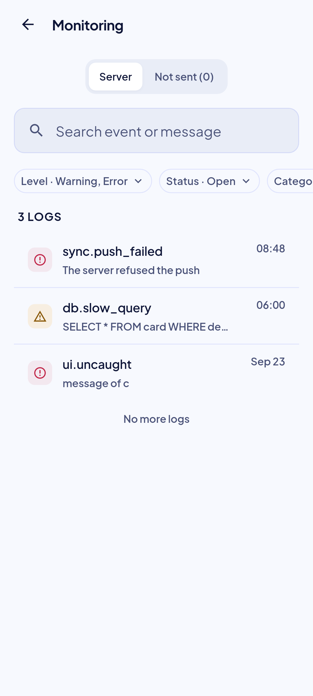 | 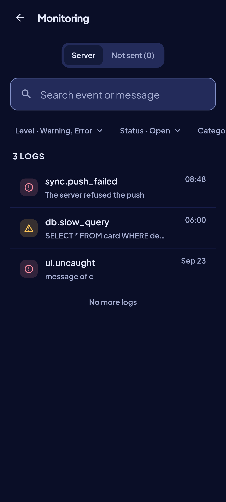 | Golden `monitoring_list_loaded_*`: open warnings and errors. |
| list, every level | 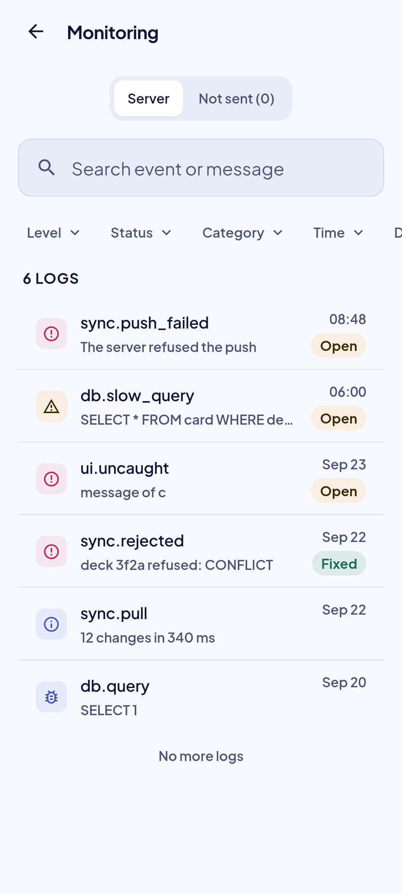 | 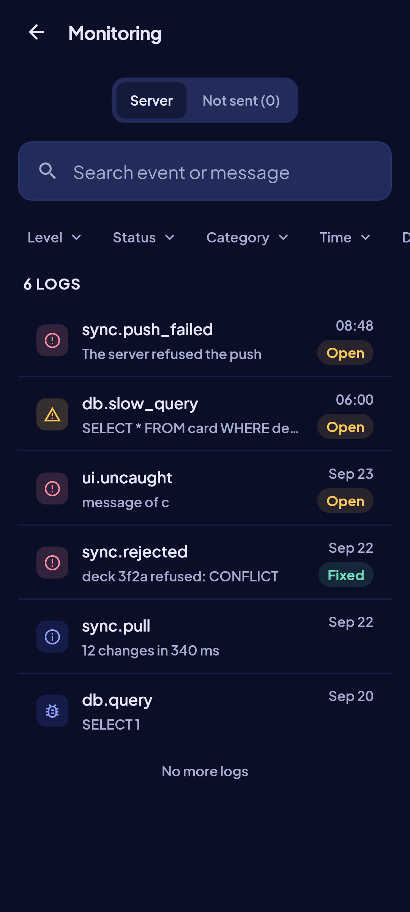 | Golden `monitoring_list_all_levels_*`: the filter widened; four glyphs, both statuses. |
| list, empty | 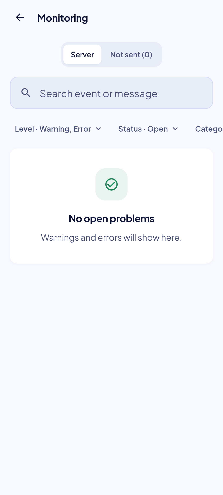 | 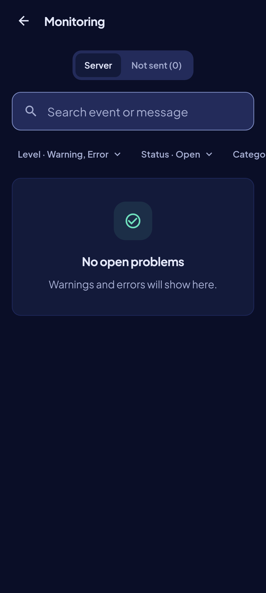 | Golden `monitoring_list_empty_*`. |
| list, offline | 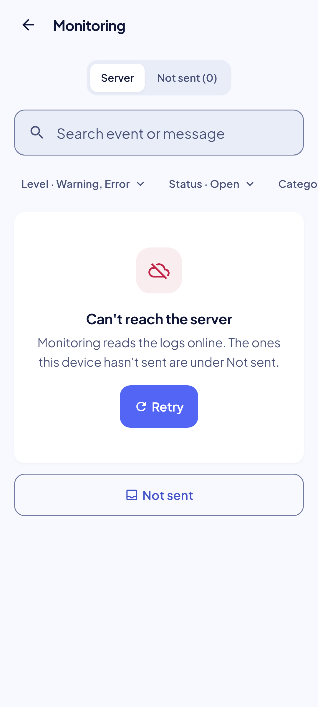 | 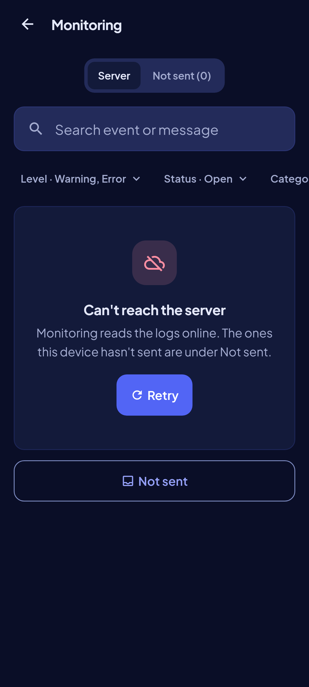 | Golden `monitoring_list_offline_*`. |
| Not sent | 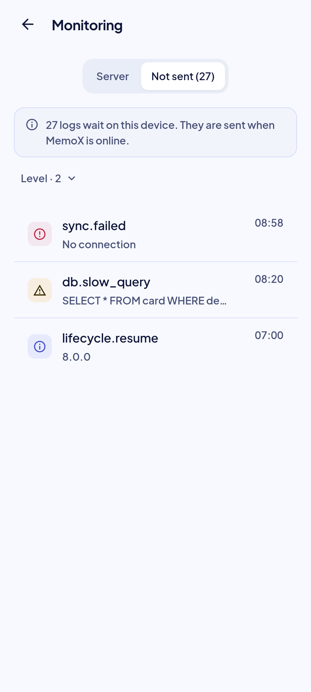 | 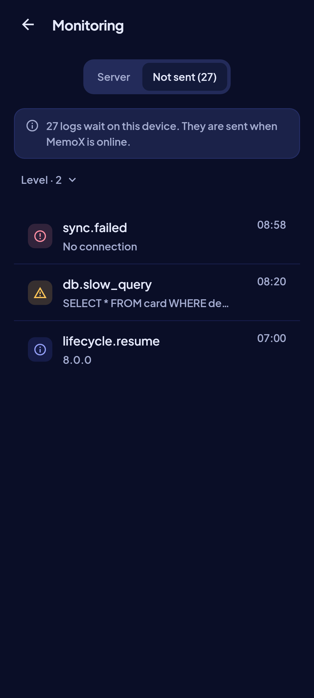 | Golden `monitoring_not_sent_*`. |
| Level sheet | 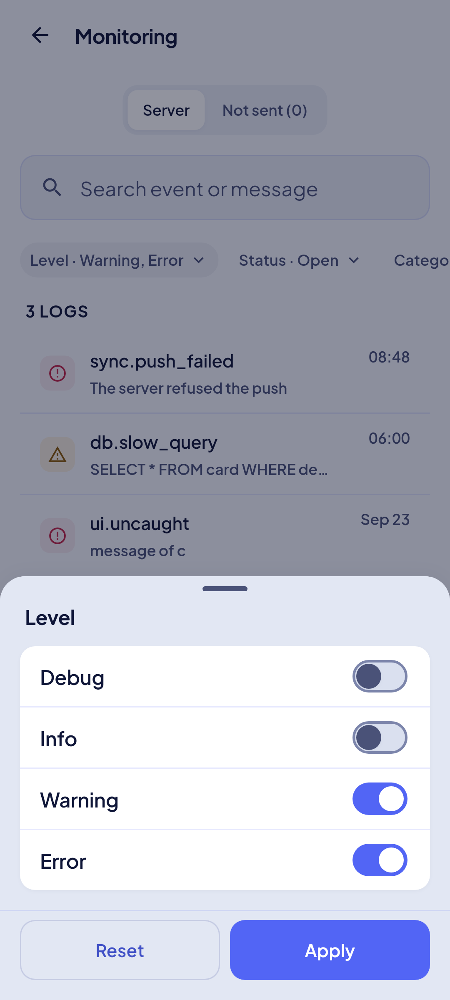 | 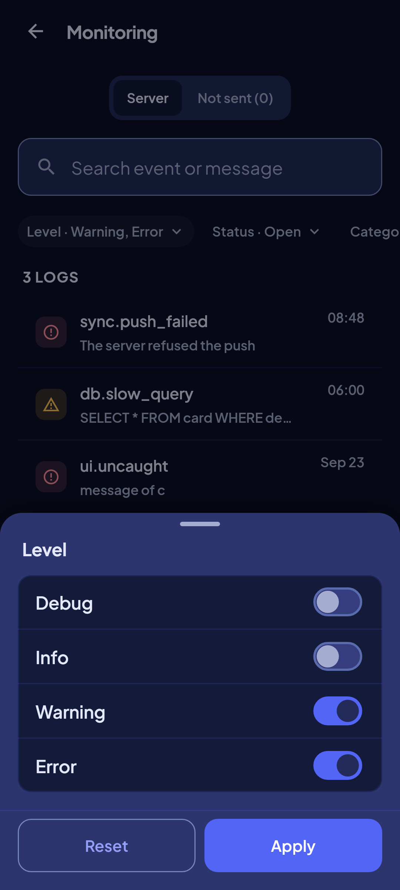 | Golden `monitoring_level_sheet_*`. |
| detail, open error | 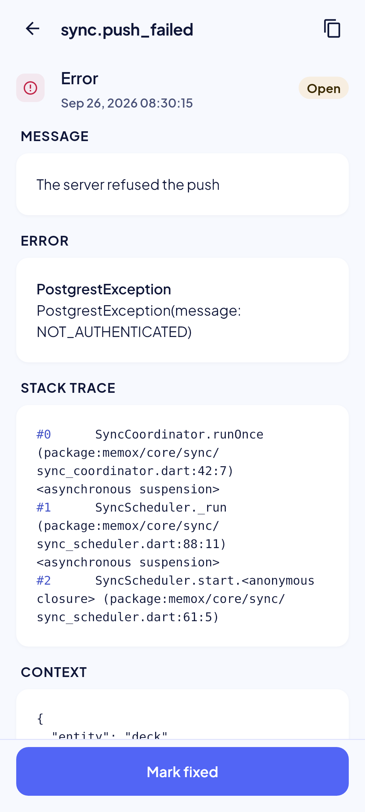 | 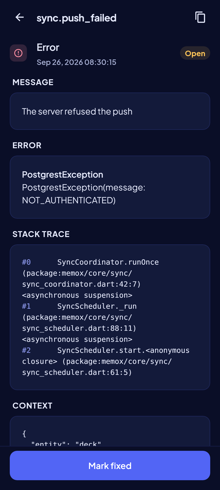 | Golden `monitoring_detail_open_*`. |
| detail, scrolled to the end | 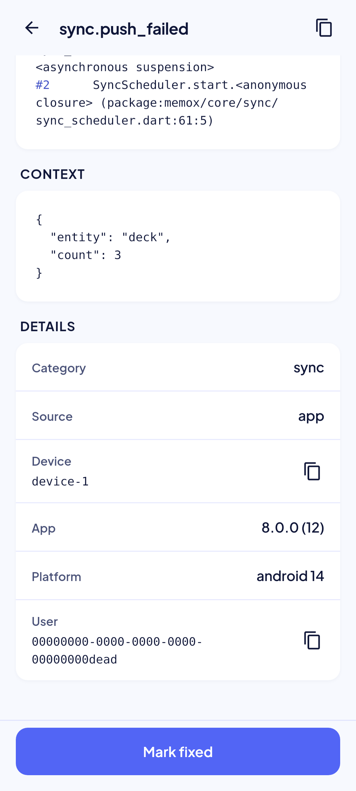 | 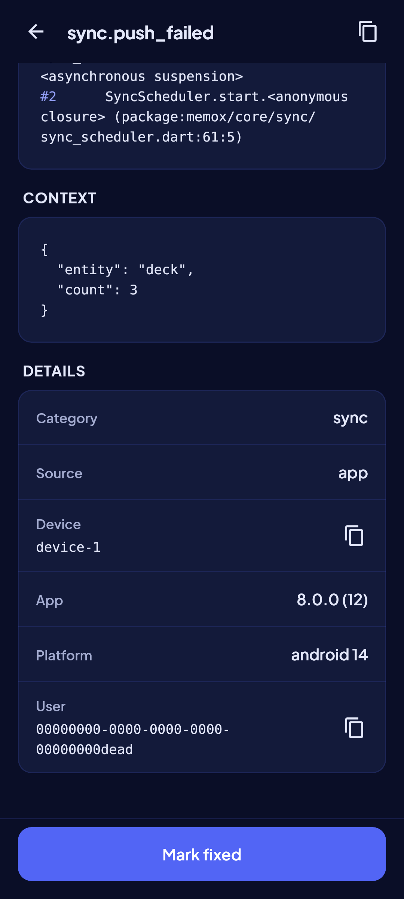 | Golden `monitoring_detail_open_trace_*`: the context in the `code` style and the Details. |
| detail, fixed with a note | 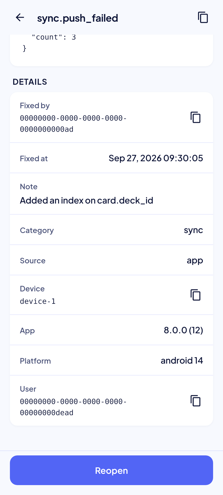 | 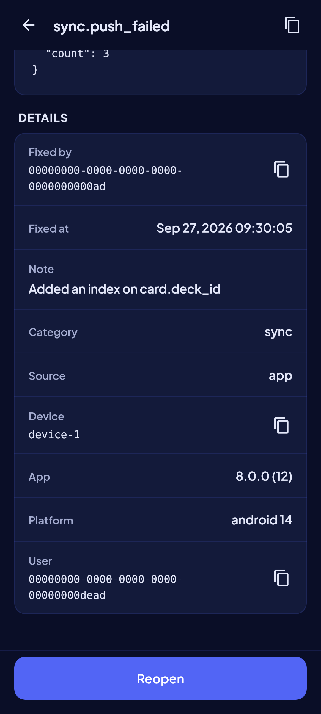 | Golden `monitoring_detail_fixed_*`, scrolled to the Details: Fixed by, Fixed at, the note, Reopen. |
| detail, a row of the buffer | 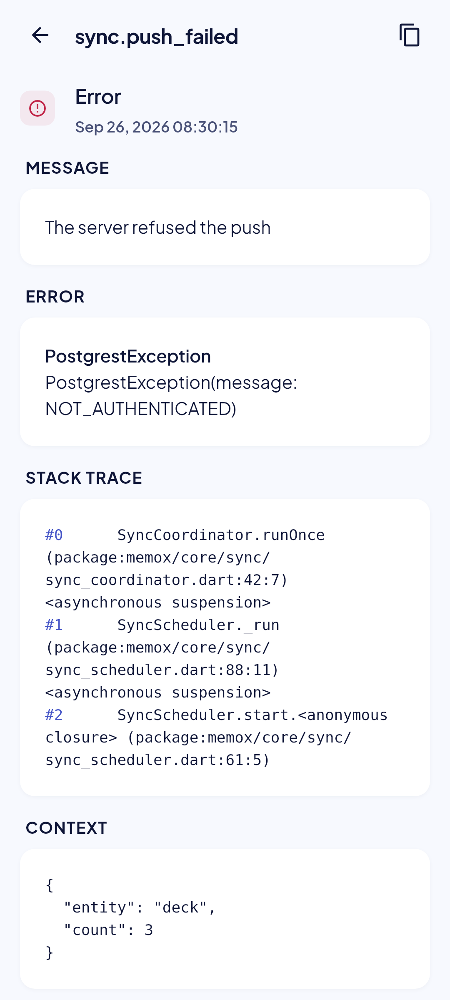 | 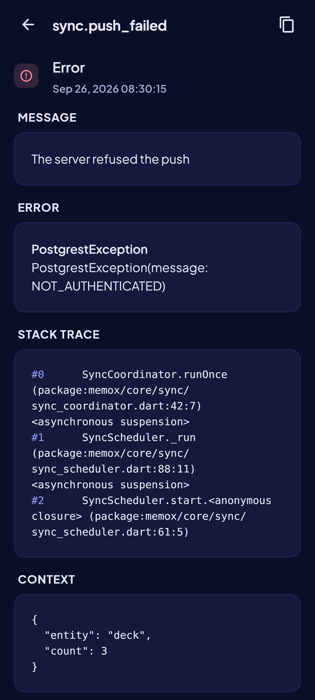 | Golden `monitoring_detail_local_*`: no triage, no user. |
| list, loading | — | — | `MxSkeletonList`, six rows. |
| list, no match | — | — | `MxEmptyState` "Nothing matches" with Clear filters. |
| list, error | — | — | `MxErrorState` "Couldn't load logs" with the local-first body and Retry. |
| list, not an admin | — | — | `MxEmptyState` "Only an admin can see this" (the server's `FORBIDDEN`). |
| detail, loading / error / offline / gone | — | — | Skeleton; `MxErrorState` with Retry; offline with Retry; "This log is gone" / "It may have been cleaned up." |

Goldens: `test/features/monitoring/presentation/goldens/monitoring_{list_loaded,list_all_levels,list_empty,list_offline,not_sent,level_sheet}_{light,dark}.png` and `monitoring_detail_{open,open_trace,fixed,local}_{light,dark}.png`.

## Deviations

| Artifact | V8 | Wins |
|---|---|---|
| No such screen; the kit has no admin tooling | Screen 28, from the kit's widgets | ADR-018 §8; owner rulings of the Impeccable shape 2026-09-29 |
| `MxStatusBadge` for open and fixed | `MxBadge`: open in the warning tone, fixed in the mastery tone, each with its word | `MxStatusBadge` names a card lifecycle (plan ruling 1); UI-base row 147 |
| `MxOptionRow`s with several choices | Toggles for Level, Status and Category; `MxOptionRow` only for the one-choice Time | `MxOptionRow` is a radio and announces one of a group (plan ruling 2) |
| Category by name | The stored code, from `LogCategory.values` | Plan ruling 3 |
| A device / user choice | A sheet of two text fields, a device id and a user id | Plan ruling 4 |
| The offline state's one action, Not sent | Retry above it | Plan ruling 12 |
| A card around the rows | Rows directly in the page's scroll | Plan ruling 13 |
| No monospace in the type scale | `MxTextStyles.code`: the system monospace, `bodySmall` size, tabular figures | Owner 2026-09-29; UI-base row 147 |
| The spec's detail order, summary first, with a key/value `MxSettingsRow` each and an Event row | The level and status first, then the message, error, trace and context, then compact Details without the Event row | Owner 2026-09-29 after the Impeccable audit (F1); spec §3.3 updated; UI-base row 147 |
| Times of the sync screens ("Today, 14:32") | `HH:mm` today, "Sep 26" before, on a row; the full date and `HH:mm:ss` in the detail | Spec §3.2, §3.5 (24-hour in every language, ADR-008 local time) |

## Copy

- App bar and tabs: "Monitoring" · "Server" · "Not sent ({n})".
- Search and chips: "Search event or message" · "Clear search" · "Level" · "Status" · "Category" · "Time" · "Device / user" · "{label} · {value}"; levels "Debug" · "Info" · "Warning" · "Error"; statuses "Open" · "Fixed"; windows "Last hour" · "Last 24 hours" · "Last 7 days" · "Last 30 days" · "All time"; sheets "Reset" · "Apply" · "Device ID" · "User ID" · "Paste an ID from a log's details." · "That isn't a valid user ID."
- List: "{n} open" · "{n}+ open" · "{n} logs" · "{n}+ logs" · "No more logs" · "Couldn't load more logs." · "Retry".
- States: "No open problems" · "Warnings and errors will show here." · "Nothing matches" · "Clear filters" · "Can't reach the server" · "Monitoring reads the logs online. The ones this device hasn't sent are under Not sent." · "Not sent" · "Couldn't load logs" · "Nothing was lost. Try again in a moment." · "Only an admin can see this".
- Not sent: "{n} logs wait on this device. They are sent when MemoX is online." · "Nothing waiting" · "Every log on this device has been sent." · "No logs at these levels" · "Try another level."
- Detail: "Log" · "Copy log" · "Copied" · "Copy device ID" · "Copy user ID" · "Details" · "Fixed by" · "Fixed at" · "Note" · "Category" · "Source" · "Device" · "App" · "Platform" · "User" · "Message" · "Error" · "Stack trace" · "Context".
- Triage: "Mark fixed" · "Reopen" · "Note (optional)" · "What did you do?" · "Marked fixed" · "Reopened" · "Couldn't change that. Nothing changed." · "Retry".
- Detail states: "Couldn't load this log" · "Nothing was lost. Try again when you're online." · "This log is gone" · "It may have been cleaned up."
