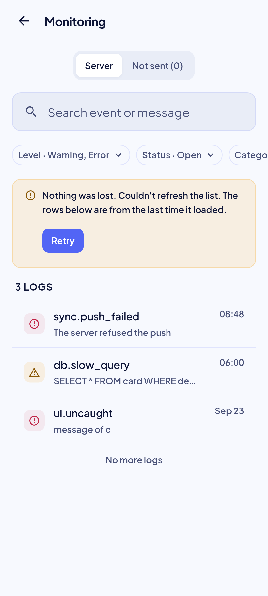
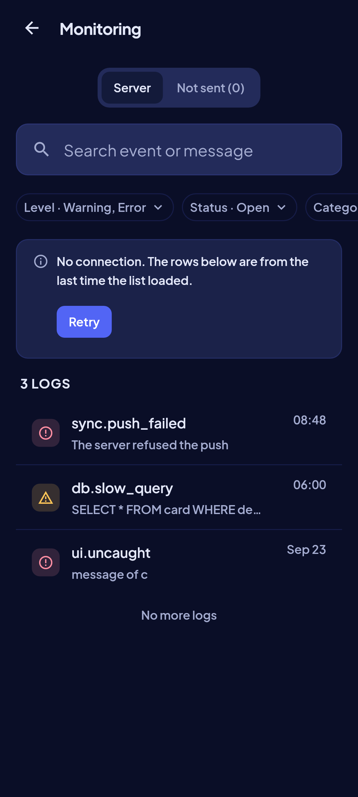

<!-- Hand-written screen record. -->

# 28 · Monitoring

The admin's window on the app's logs: the server's, and the device's own buffer. It opens
on the open warnings and errors, newest first, and lets the admin filter and search them,
open one whole, and mark it fixed or reopen it. Shaped by Impeccable before the plan
(2026-09-29).
FE-B8; ADR-018 §6 to §8; spec
[2026-09-29-monitoring-screen-design.md](../../../superpowers/specs/2026-09-29-monitoring-screen-design.md)
§3; plan
[2026-09-29-monitoring-screen.md](../../../superpowers/plans/2026-09-29-monitoring-screen.md).

## Entry points

- Screen 23, Admin section, row "Monitoring". Route `/settings/monitoring`, on the root
  navigator like Sync; Back returns to 23.
- A row opens its detail at `/settings/monitoring/:id` (`?local=1` for a row of the device
  buffer), nested under the list, so Back climbs one page at a time and the list keeps its
  pages and scroll position.
- The row exists only while the session's account has `app_metadata.role = admin`, and not
  at all in a build with no Supabase. A deep link from any other account, to the list or to
  a log (`?local=1` included), gets "Only an admin can see this" before anything is read:
  the device buffer has no server check behind it. The server still refuses the RPCs with
  `FORBIDDEN`.

## Layout: the list

| Region | Widget | Design |
|---|---|---|
| App bar | `MxAppBar` (content density) + back `MxIconButton` | "Monitoring". |
| Tabs | `MxSegmentedTray` | "Server" · "Not sent ({n})"; n is every row of the device buffer. |
| Search (Server) | `MxSearchField` | "Search event or message"; asks 400 ms after the last keystroke. |
| Filters (Server) | `MxChipTrigger` × 5 in a row that scrolls | Level (default warning + error) · Status (default open) · Category · Time · Device / user. A chip that holds a choice shows it, naming one or two and counting from three: "Level · Warning, Error", "Status · Open", "Time · Last 24 hours", "Level · 3"; Device / user counts a pair, since its choices are ids (critique 2026-09-30 part 3b). |
| Count | `MxListSectionHeader` | "{n} logs" with any filter (the chip names the filter); "{n}+ logs" while more pages exist. |
| Rows | `MxListRow` | Leading `MxIconTile` with a glyph per level (debug bug, info circle, warning triangle, error circle) on the tint of its level; title `event`; subtitle the first line of the message, or else of the error message, or else the error type; trailing `HH:mm` today or "Sep 26", and under it an `MxBadge` "Open" / "Fixed" for warnings and errors, except a row whose status is the one the Status filter holds: the chip and the header say it (critique 2026-09-30 part 3b). TalkBack: "{level}, {event}, {time}, {status}". |
| End | `MxSpinner` / `MxInlineBanner` / caption | The next 100 rows load when the last 10 come into view; a spinner while they do; "Couldn't load more logs." with Retry; "No more logs". A pull to refresh that fails keeps the rows under an `MxInlineBanner` above the count with Retry, which refreshes again and shows its spinner while it runs (the banner stays until the answer lands): `warning`, "Nothing was lost. Couldn't refresh the list. The rows below are from the last time it loaded.", offline or not (SP2b 2.38, audit m7; owner 2026-10-03: offline keeps the warning). A lost admin role, a new filter or search, and an empty list show the full failure page instead. |
| Not sent | `MxNote` + one `MxChipTrigger` (Level, default warning + error) + rows | "These logs wait on this device. They are sent when MemoX is online." (the tab states how many), then the header "{n} at these levels" over the rows shown (critique 2026-09-30 part 3b). The rows are the device buffer, watched, without a status. |
| Filter sheets | `MxBottomSheet` | Level, Status and Category: a toggle per value (`MxSettingsRow` + `MxToggle`). Time: an `MxOptionRow` per window (last hour, 24 hours, 7 days, 30 days, all time). Device / user: two `MxTextField`s and an `MxNote`. Each has Reset (outline) and Apply. |

Choosing Debug or Info, or no level at all (every level), clears the status filter: those rows have no status and it would
hide them. Category rows show the stored code (`db`, `sync`, `network`) and come from
`LogCategory.values`. A pull down on the Server tab, and any filter or search change,
reload from the first page.

## Layout: the detail

| Region | Widget | Design |
|---|---|---|
| App bar | `MxAppBar` + back, action `MxIconButton` | Title: the event. The action copies the whole log as JSON; `MxSnackbar` "Copied". |
| Head | `MxIconTile` + text + `MxBadge` | The level's glyph tile and name, the full time (date and `HH:mm:ss`, local) under it, and "Open" / "Fixed" for a warning or error. |
| Message, Error | `MxListSectionHeader` + `MxCard` | Selectable text. Error: the type on its own line in the row-title weight, then its message. |
| Stack trace, Context | `MxListSectionHeader` + `MxCard`, `code` style | Selectable; one frame per row, its `#n` (primary ink) in a fixed-width cell so a wrapped line hangs under the frame's text; the context is pretty-printed JSON. Hidden when empty. A context can be 256 kB. |
| Details | `MxSection` of label/value rows, last | Fixed by, Fixed at (a fixed log only), Note, Category, Source, Device, App ("8.0.0 (12)"), Platform, User. A short value sits beside its caption label on one 48 row; the note under its label; an id under its label in the `code` style, wrapping between its groups, with its own copy button ("Copy device ID", "Copy user ID"; `MxSnackbar` "Copied"). A row the log does not have is left out. |
| Triage | `MxFooterBar` + `MxButton` (primary, block) | "Mark fixed", or "Reopen" for a fixed one; for a warning or error of the server only. It opens an `MxBottomSheet` with an optional note (`MxTextField`) and the confirm. If the server answers FORBIDDEN (the role was lost), the page becomes "Only an admin can see this" with no footer and no Retry toast (SP2b 2.39). |
| Toasts | `MxSnackbar` | "Marked fixed"; "Reopened"; "Couldn't change that. Nothing changed." · Retry. |

## States

The images are the goldens.

| State | Golden (light) | Golden (dark) | App |
|---|---|---|---|
| list, loaded |  |  | Golden `monitoring_list_loaded_*`: open warnings and errors. |
| list, every level |  |  | Golden `monitoring_list_all_levels_*`: the filter widened; four glyphs, both statuses. |
| list, empty |  |  | Golden `monitoring_list_empty_*`. |
| list, offline |  |  | Golden `monitoring_list_offline_*`. |
| Not sent |  |  | Golden `monitoring_not_sent_*`. |
| Level sheet |  |  | Golden `monitoring_level_sheet_*`. |
| detail, open error |  |  | Golden `monitoring_detail_open_*`. |
| detail, scrolled to the end |  |  | Golden `monitoring_detail_open_trace_*`: the context in the `code` style and the Details. |
| detail, fixed with a note |  |  | Golden `monitoring_detail_fixed_*`, scrolled to the Details: Fixed by, Fixed at, the note, Reopen. |
| detail, a row of the buffer |  |  | Golden `monitoring_detail_local_*`: no triage, no user. |
| list, loading | — | — | `MxSkeletonList`, six rows. |
| list, no match | — | — | `MxEmptyState` "Nothing matches" with Clear filters. |
| list, error | — | — | `MxErrorState` "Couldn't load logs" with the local-first body and Retry. |
| list, refresh failed |  |  | A pull to refresh failed with the rows on screen: they stay under a warning banner with Retry (SP2b 2.38). |
| list, not an admin | — | — | `MxEmptyState` "Only an admin can see this" (the server's `FORBIDDEN`). |
| detail, not an admin | — | — | Mark fixed or Reopen answered `FORBIDDEN`: the page becomes "Only an admin can see this", with no triage footer and no Retry toast (SP2b 2.39). |
| detail, loading / error / offline / gone | — | — | Skeleton; `MxErrorState` with Retry; offline with Retry; "This log is gone" / "It may have been cleaned up." |

Goldens: `test/features/monitoring/presentation/goldens/monitoring_{list_loaded,list_all_levels,list_empty,list_offline,not_sent,level_sheet}_{light,dark}.png` and `monitoring_detail_{open,open_trace,fixed,local}_{light,dark}.png`.

## Rulings

- **ADR-018 §8, Impeccable shape 2026-09-29:** screen 28 is built from the shared widgets.
- **Plan ruling 1, UI-base row 147:** open and fixed are `MxBadge`s, open in the warning tone and fixed in the success tone (tone pass T7; it was mastery), each with its word; `MxStatusBadge` names a card lifecycle.
- **Plan ruling 2:** Level, Status and Category filter with toggles; only the one-choice Time uses `MxOptionRow`.
- **Plan ruling 3:** a category shows its stored code, from `LogCategory.values`.
- **Plan ruling 4:** the device / user filter is a sheet of two text fields, a device id and a user id.
- **Plan ruling 12:** the offline state offers Retry above Not sent.
- **Plan ruling 13:** rows sit directly in the page's scroll, with no card around them.
- **Owner 2026-09-29, UI-base row 147:** code uses `MxTextStyles.code`: the system monospace at `bodySmall` size, tabular figures.
- **Owner 2026-09-29 (Impeccable audit):** the detail shows the level and status first, then the message, error, trace and context, then compact Details without an Event row.
- **Spec §3.2, §3.5 (ADR-008):** a row shows `HH:mm` today and "Sep 26" before; the detail shows the full date and `HH:mm:ss`, 24-hour in every language.
- **Critique 2026-09-30 tone pass, T7:** a Fixed log is success; the empty lists' success state tints with success.
- **Critique 2026-09-30 part 3d-2 (spec `2026-10-01-critique-fixes-part3d2-design.md`):** the list header counts logs with any filter ("{n} logs" / "{n}+ logs"; the filter chip, e.g. "Status · Open", names the filter); a stack trace lays out one frame per row with the `#n` in a fixed-width cell, so wrapped lines hang under the frame's text, and it stays selectable with the `#n` in the primary ink.
- **SP2b 2.38 (spec `2026-10-03-ui-hardening-sp2b-design.md`):** a failed refresh keeps the rows; only `notAdmin`, a new filter or search, and an empty list replace them. Its sentence says first that nothing was lost (DESIGN.md, the local-first voice).
- **SP2b 2.39:** a lost admin role on Mark fixed or Reopen ends the page as "Only an admin can see this" instead of offering a Retry that cannot succeed.

## Copy

- App bar and tabs: "Monitoring" · "Server" · "Not sent ({n})".
- Search and chips: "Search event or message" · "Clear search" · "Level" · "Status" · "Category" · "Time" · "Device / user" · "{label} · {value}"; levels "Debug" · "Info" · "Warning" · "Error"; statuses "Open" · "Fixed"; windows "Last hour" · "Last 24 hours" · "Last 7 days" · "Last 30 days" · "All time"; sheets "Reset" · "Apply" · "Device ID" · "User ID" · "Paste an ID from a log's details." · "That isn't a valid user ID."
- List: "{n} logs" · "{n}+ logs" · "No more logs" · "Couldn't load more logs." · "Retry".
- Refresh: "No connection. The rows below are from the last time the list loaded." (offline) · "Nothing was lost. Couldn't refresh the list. The rows below are from the last time it loaded." · "Retry".
- States: "No open problems" · "Warnings and errors will show here." · "Nothing matches" · "Clear filters" · "Can't reach the server" · "Monitoring reads the logs online. The ones this device hasn't sent are under Not sent." · "Not sent" · "Couldn't load logs" · "Nothing was lost. Try again in a moment." · "Only an admin can see this".
- Not sent: "These logs wait on this device. They are sent when MemoX is online." · "{n} at these levels" · "Nothing waiting" · "Every log on this device has been sent." · "No logs at these levels" · "Try another level."
- Detail: "Log" · "Copy log" · "Copied" · "Copy device ID" · "Copy user ID" · "Details" · "Fixed by" · "Fixed at" · "Note" · "Category" · "Source" · "Device" · "App" · "Platform" · "User" · "Message" · "Error" · "Stack trace" · "Context".
- Triage: "Mark fixed" · "Reopen" · "Note (optional)" · "What did you do?" · "Marked fixed" · "Reopened" · "Couldn't change that. Nothing changed." · "Retry".
- Detail states: "Couldn't load this log" · "Nothing was lost. Try again when you're online." · "This log is gone" · "It may have been cleaned up."
