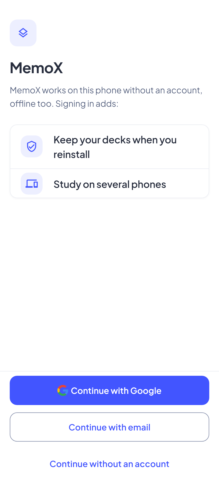
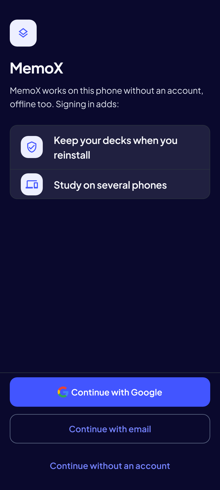
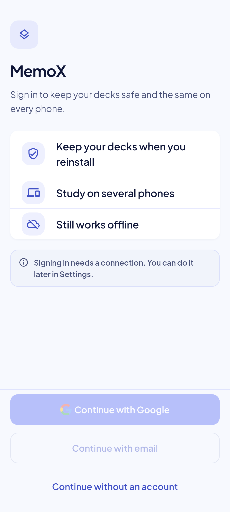
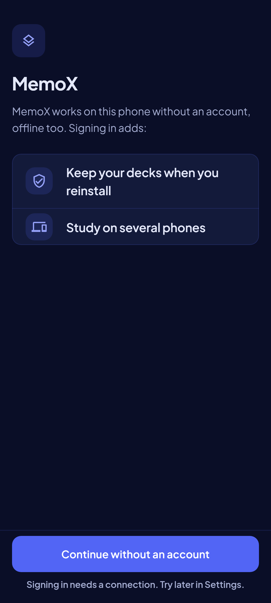

<!-- Hand-written screen record. -->

# 29 · Welcome

The first launch invites an account: the name, one promise, two benefits, and three
ways on in the thumb zone. Shaped by Impeccable before the plan (2026-09-30), redesigned
2026-10-05. SB-A2;
spec [2026-09-30-account-ui-design.md](../../../superpowers/specs/2026-09-30-account-ui-design.md)
§5.1, §6.

## Entry points

- The launch, once per device, on a build that can sign in: `main` reads
  `app_settings.welcome_seen` before the first frame and the router sends any location
  to `/welcome?from=<location>` until Welcome is answered (U1, P3a plan ruling 3).
- No back arrow: Android Back leaves the app, as on any root.

## Layout

| Region | Widget | Design |
|---|---|---|
| Head | `MxIconTile` (large, tinted, deck glyph) | Stands in for the app icon, which is still Flutter's default (U5; UI-base row 149). |
| Name and lead | `screenTitle` + `emptyBody` | "MemoX"; "MemoX works on this phone without an account, offline too. Signing in adds:" |
| Benefits | `MxSection` + `MxSettingsRow` × 2 | Shield "Keep your decks when you reinstall"; devices "Study on several phones". Not tappable. "Still works offline" is gone: the lead says it. |
| Actions, can link | `MxFooterBar` + `MxButton` × 3, 12 apart | "Continue with Google" (primary, the G mark: the one fill); "Continue with email" (outline); "Continue without an account" (text). |
| Actions, cannot link | `MxFooterBar` + `MxButton`, caption | "Continue without an account" (primary, block) alone, and the footer caption "Signing in needs a connection. Try later in Settings." When linking becomes possible the footer returns to the three buttons. There is no mid-page note. |

Every exit answers Welcome first, then goes on: Google and "without" to `from`, email
to Sign-in with Settings under it (P3a plan ruling 4). A Google account that belongs
to another account opens the merge sheet (30) when the phone has decks; its choice also
leaves Welcome. Then, or at once on an empty phone, that Google account signs in to its
account with no second sign-in page (owner 2026-10-08).

## States

The images are the goldens.

| State | Golden (light) | Golden (dark) | App |
|---|---|---|---|
| ready |  |  | Golden `welcome_ready_*`. |
| offline |  |  | Golden `welcome_offline_*`. |

## Rulings

- **U1:** shown once on every device, including one that used the app before the update.
- **U5:** the tile until MemoX has its own icon (UI-base row 149).
- **U6:** Google's G mark on the Google button.
- **P3a plan rulings 3, 4, 6:** only on a build that can sign in; the email exit lands on Sign-in over Settings; sign-in waits, with a note, while the account cannot link yet (now the footer caption, S10).
- **Sign-in redesign 2026-10-05 (spec `2026-10-05-sign-in-flow-redesign-design.md`, S1–S10):** the lead says what works without an account and what signing in adds; the benefits are two; offline the footer shows one usable action, "Continue without an account", as the primary, with the offline note as its caption instead of a note 400 px above two disabled buttons (S10). Welcome asks *which way*, so Google is its fill (S7).

## Copy

- "MemoX" · "MemoX works on this phone without an account, offline too. Signing in adds:"
- "Keep your decks when you reinstall" · "Study on several phones".
- "Continue with Google" · "Continue with email" · "Continue without an account".
- "Signing in needs a connection. Try later in Settings."
- Toast: "Signed in as {email}" (or "Signed in").
