<!-- Hand-written screen record. -->

# 30 · Sign-in, the merge sheet and the transition layer

Attach Google or an email to this device's anonymous user (`link`), or sign in again
after the session was refused (`reauth`, P3b). The same form signs in the
switch's target inside the transition layer, and the merge sheet asks what happens to
this phone's data when the sign-in already has an account. SB-A2; spec
[2026-09-30-account-ui-design.md](../../../superpowers/specs/2026-09-30-account-ui-design.md)
§5.2–§5.4, §6, §9 (B8, B9), §9.1.

## Entry points

- Screen 23, Account section, row "Sign in". Route `/settings/sign-in?mode=link`, on the
  root navigator like Sync; Back returns to 23 (P3a plan ruling 1).
- Screen 29, "Continue with email" (`go`, so Settings sits under it).
- The transition layer, while a switch waits for its target sign-in.
- A device that already holds an account is sent from `mode=link` to screen 32 (P3b B9).
- `reauth`: the re-auth banner's "Sign in" on 23 and 32, and the notice on 13
  (`/settings/sign-in?mode=reauth&from=…`; from 13 it opens under Settings, P3b plan
  ruling 3). A re-auth that succeeds returns to `from`; the link ends on 32 (B9). A
  `from` outside the app (a scheme, a host, `//`) is ignored for Settings, as
  Welcome's is for the Library (P3b minor M1).

## Layout

| Region | Widget | Design |
|---|---|---|
| App bar | `MxAppBar` (content) + back | "Sign in". The layer has no app bar, only "Cancel" (text) at the top. |
| Mode line | `emptyBody` | Link: "Your decks stay on this phone and join the account." Target: "Sign in to the account this phone moves to." |
| Google | `MxButton` (outline, block, G mark) | "Continue with Google". Its failure is a toast; a cancelled pick says nothing. |
| Divider | two hairlines + `footerCaption` | "or". |
| Email | `MxTextField` (form) | "Email address". Checked on send; its problem shows under the field (`MxFieldMessage`). An address the server calls invalid shows the same line, not "try again" (SP2b 2.42). The same address (case and spaces ignored) sent again inside the 60 s resend wait reopens the code step without sending (SP2b 2.41). Text keyboard (UI-base row 150). |
| Send code | `MxButton` (primary, block) | "Send code", the form's one fill; spins while sending and never greys out for a bad address. While it, or Google, runs, Back (the arrow and the system) waits; the spinner shows what runs (SP2b 2.46). |
| Offline note | `MxNote` | "Signing in needs a connection. You can do it later in Settings." while the account cannot link yet (`link` only). |

### Re-auth (`mode=reauth`, P3b)

| Region | Design |
|---|---|
| Mode line | "Sign in again to keep syncing. Your decks are still here." |
| Email | Filled with the last account's email (the usual case signs in again to it). |
| Another account, changes unsent | A dialog "Lose {n} changes?" · "{n} changes on this phone aren't sent and will be lost." · Cancel · "Continue" (destructive), then the same command with the loss confirmed (B8). The same address asks nothing. Cancel forgets the Google account picked, so the next press shows the picker again (final review I1). |
| Continue without an account | `MxButton` (text, block) under the form (P3b plan ruling 10) → "Continue without an account?" · "This phone's decks from {email} are removed. Sign in to {email} later to get them back." With changes unsent, a danger `MxInlineBanner` names them: "{n} changes on this phone aren't sent and will be lost." (final review I2). Cancel · "Continue without an account" (destructive). Then `continueWithoutAccount()`; the layer clears; the flow lands on 23. |
| Code step (31) | A resend to another account names the unsent changes again, in the same dialog: a link may open 31 without passing here (P3b minor M7, which retires plan ruling 8). |

### Merge sheet (auth spec #17)

| Region | Widget | Design |
|---|---|---|
| Title | `compactTitle` | "{email} already has an account" or "This Google account is already in use" (plan ruling 12). |
| Choices | `MxOptionRow` × 2 | "Merge into the account" (selected) · "Your {n} decks and {m} cards join it." (or "This phone's decks and cards join it." when the count failed); "Discard this phone's data" · "They're removed from this phone. The account's decks come down instead." |
| Warning | `MxInlineBanner` (danger) | "This phone's decks and progress go for good." Only while Discard is chosen (plan ruling 14). |
| Footer | `MxSheetActions` | Cancel · "Continue" (primary) or "Discard and continue" (destructive). |

A phone with no live deck skips the sheet and moves at once (R6).

Cancel on the sheet, or a switch that fails to start, forgets the Google account picked for it, so the next press shows the picker again; a started switch keeps it for the target sign-in (SP2b 2.40).

### Transition layer (app root, U4)

Over the whole app while a switch, sign-out, deletion or clear runs. It is not a route:
a host above the router shows it, hides the app from TalkBack, and takes the system Back
with priority over the router (plan ruling 9), so Back only steps from the code to the
form inside it. Its content is centred in the page.

| Condition | Design |
|---|---|
| Running | `MxSpinner` (large), the step in `screenTitle` ("Sending your changes…", "Getting your decks ready…", "Merging…", "Downloading your decks…", "Signing out…", "Deleting your account…") as a live region, "Nothing is lost if you close the app." |
| Network error | `MxInlineBanner` (neutral: offline is never a warning) "No connection. Your data is safe on this phone." + Retry (primary). |
| Other error | "Something went wrong. Your data is safe on this phone." + Retry. |
| Sign-out stopped offline | A neutral banner, "No connection. Nothing has been removed yet." + Retry + "Sign out now and lose {n} changes" (`dangerSoft`) + Cancel (critique 2026-10-02). |
| Target sign-in | The form above in target mode, the address pre-filled; the code step on the layer's own navigator. |
| Stuck | `warning`: "Your decks are kept. This move can't finish on this phone. Close MemoX and report the problem; the log has the details." + "Close MemoX" (outline, closes the app, changes no data) beside Retry, in an `MxActionPair` with Close leading (SP2b R11). |
| Before the target signs in | "Cancel" at the top returns to where the switch started. |

Notices at the app root: toasts "Couldn't merge. Your decks are still on this phone." and
"Couldn't delete the account. Nothing changed." (plan ruling 8), except a deletion refused
for want of a session, or one that timed out after it was sent, which says "Couldn't confirm
the deletion. Sign in again to check." because the server may have taken it (SP2b 2.47,
final fix 8); a refused deletion of the last admin is a dialog on screen 32's record
(P3b B7).

## States

The images are the goldens.

| State | Golden (light) | Golden (dark) | App |
|---|---|---|---|
| link | 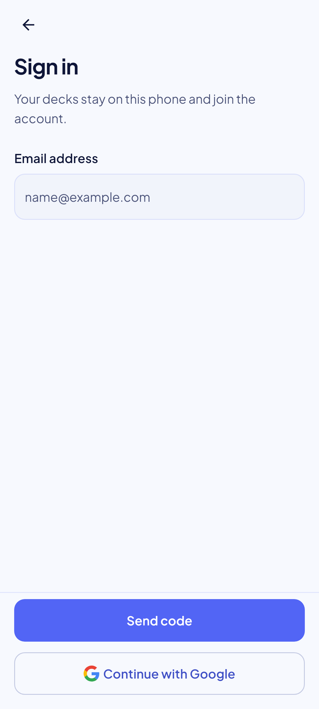 | 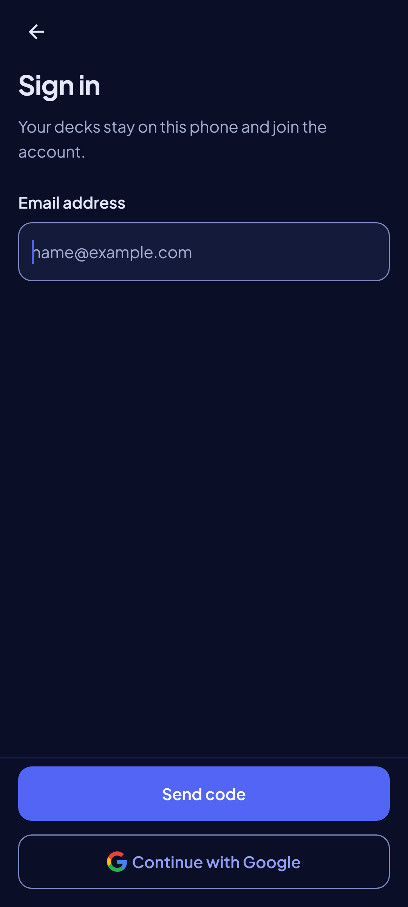 | Golden `sign_in_link_*`. |
| invalid | 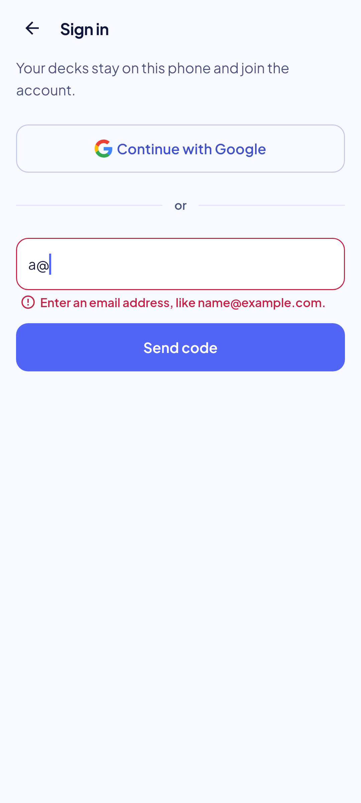 | 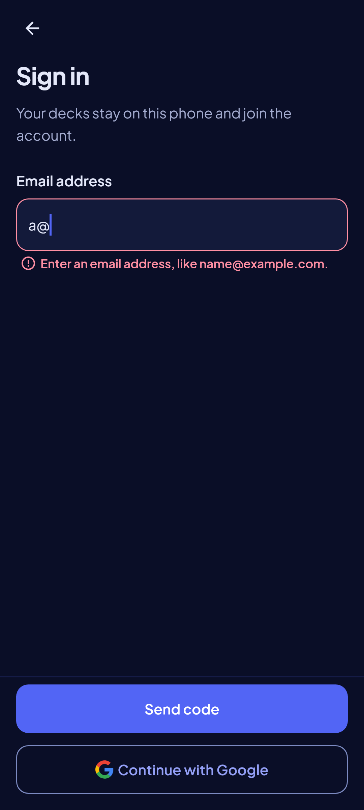 | Golden `sign_in_invalid_*`. |
| merge sheet, merge |  |  | Golden `merge_sheet_merge_*`. |
| merge sheet, discard |  |  | Golden `merge_sheet_discard_*`. |
| layer, sending | 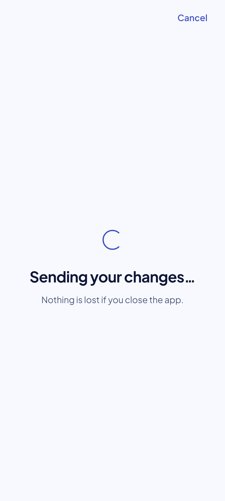 | 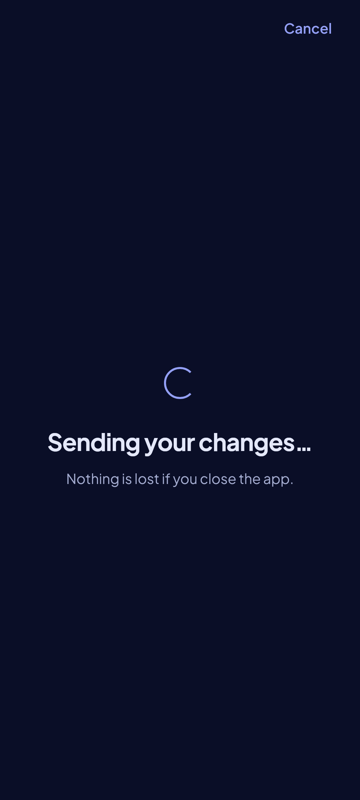 | Golden `layer_sending_*`. |
| layer, merging | 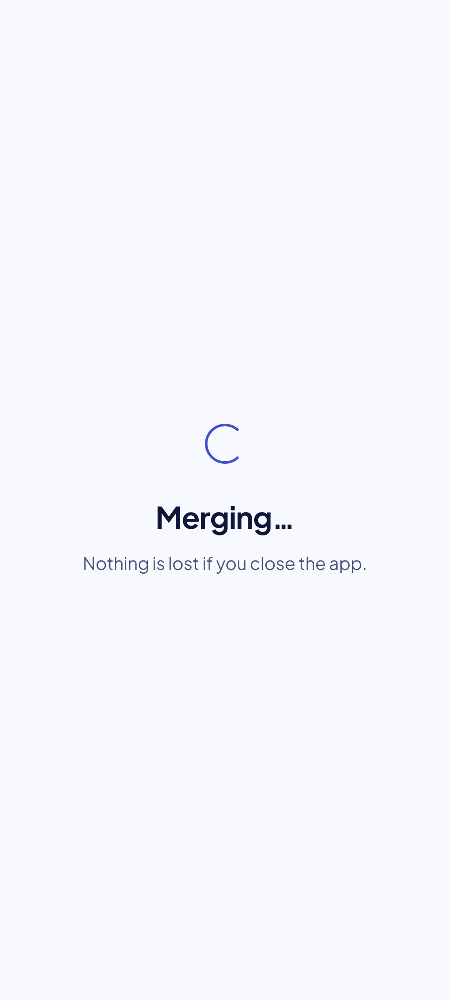 | 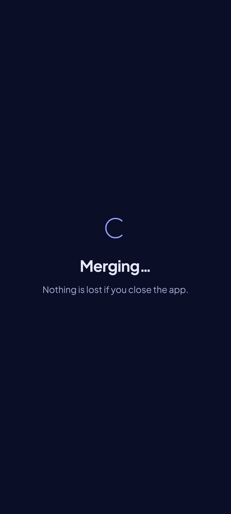 | Golden `layer_merging_*`. |
| layer, offline | 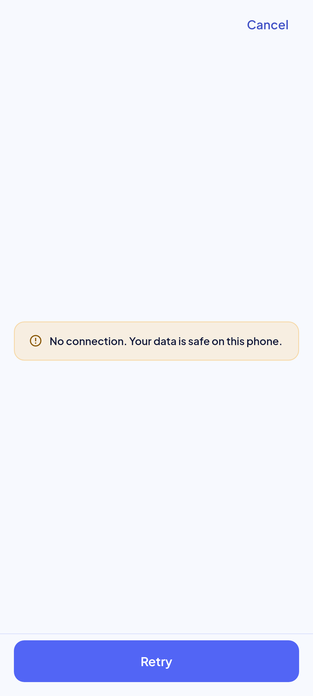 | 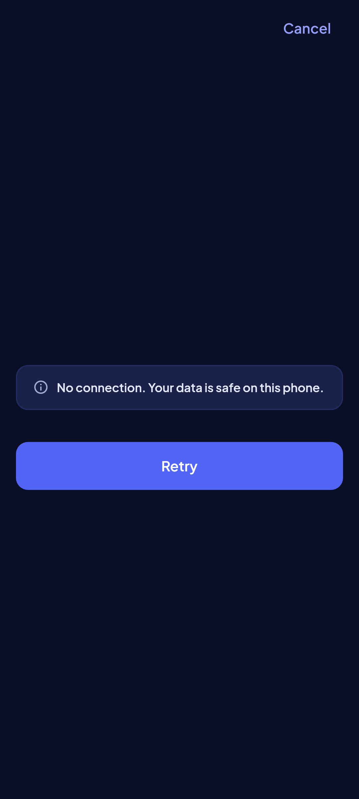 | Golden `layer_offline_*`. |
| layer, target sign-in | 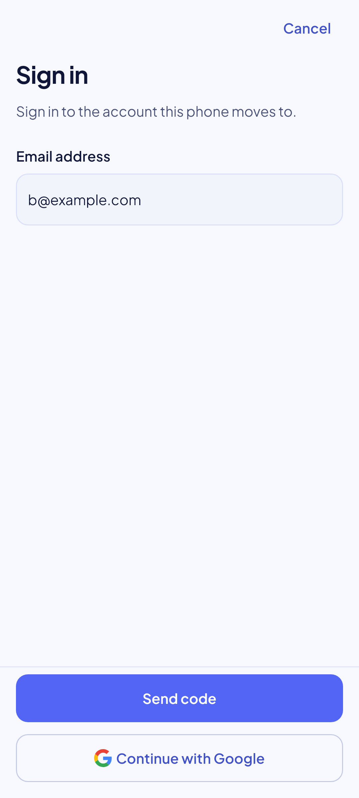 | 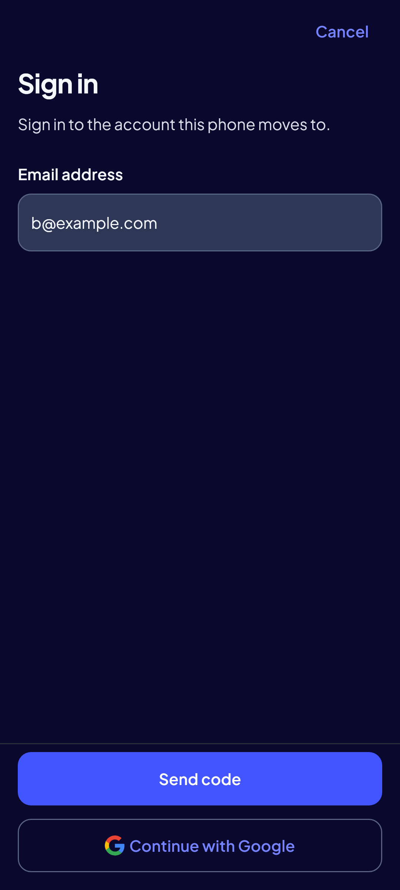 | Golden `layer_target_*`. |
| layer, sign-out offline | 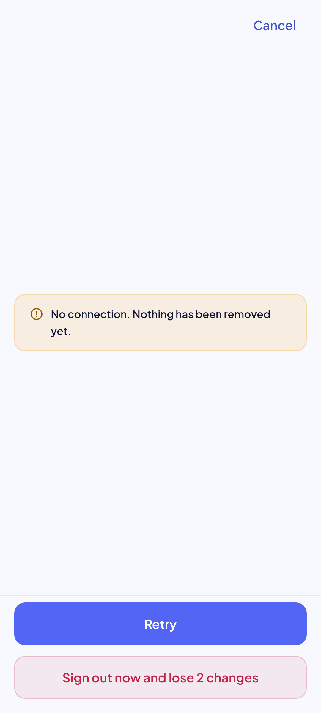 | 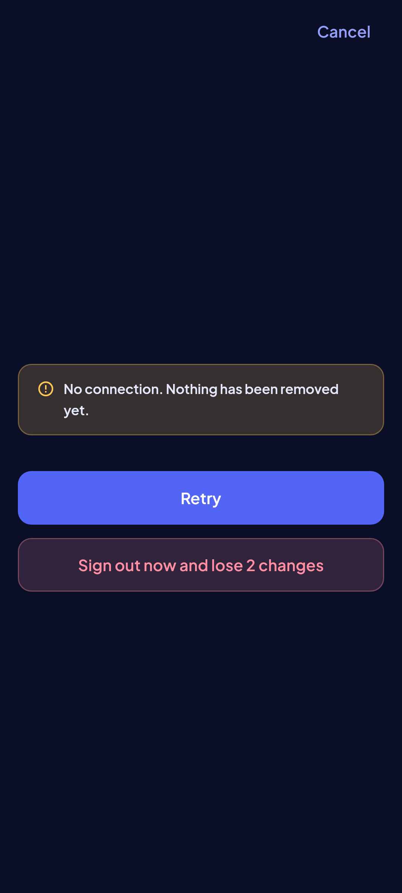 | Golden `layer_sign_out_offline_*`. |
| reauth | 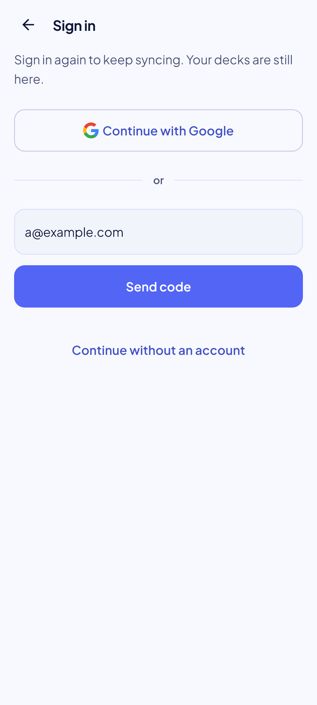 | 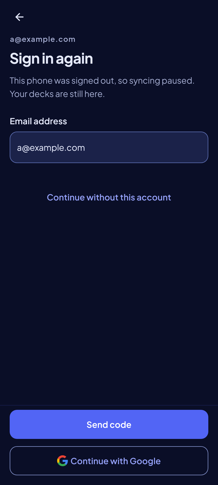 | (P3b) Golden `sign_in_reauth_*`. |
| reauth, unsent loss | 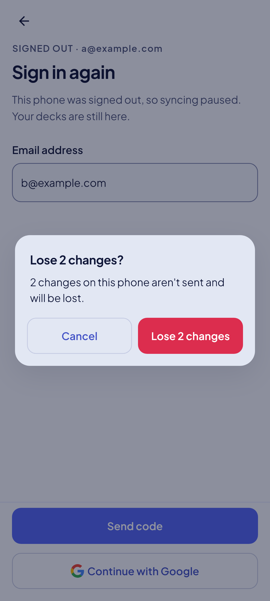 | 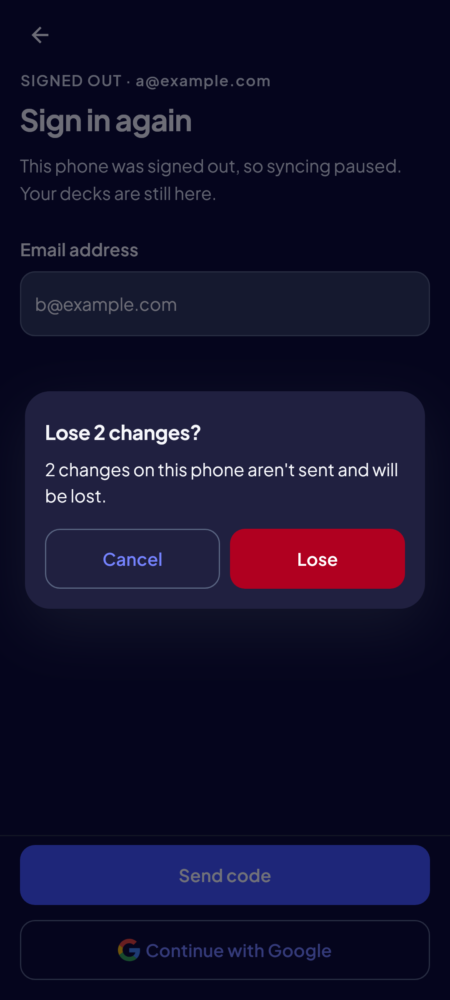 | (P3b B8) Golden `sign_in_unsent_loss_*`. |
| reauth, continue without | 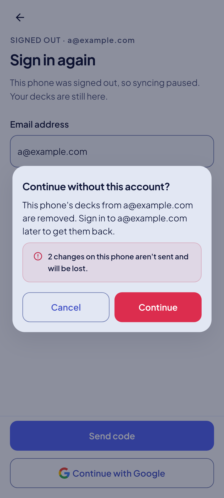 | 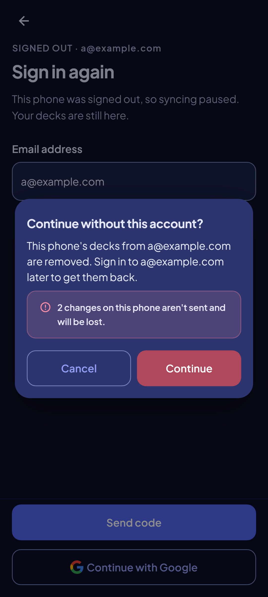 | (P3b B8) Golden `sign_in_continue_without_*`. |
| layer, stuck | 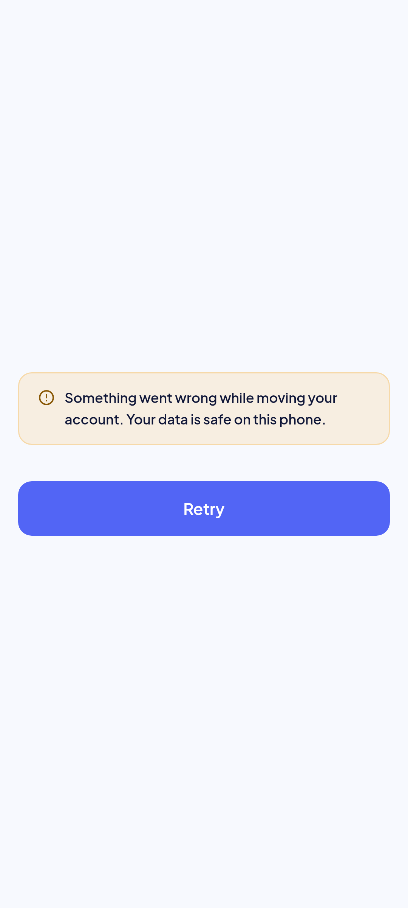 | 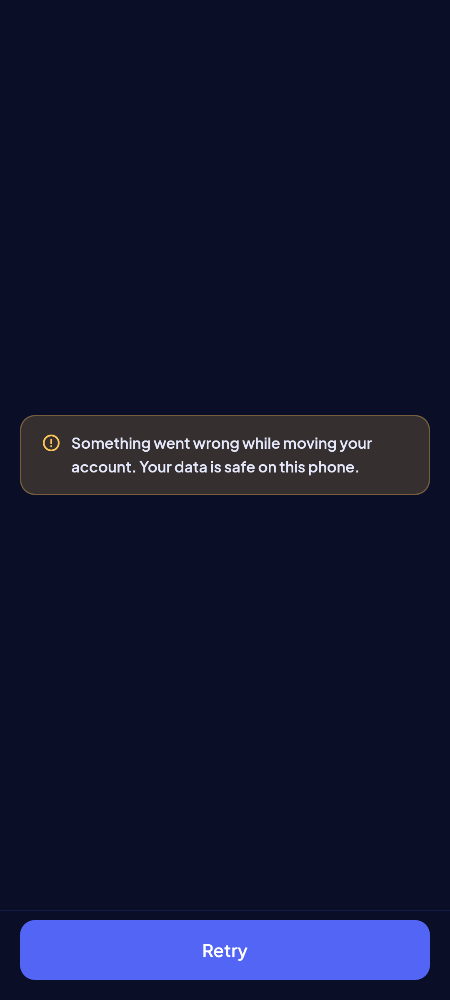 | Golden `layer_stuck_*`. |

## Rulings

- **R1:** no `mode=switch`: "Switch account" (32, P3b) signs in the target inside the layer.
- **R3:** a wrong and an expired code read alike; a rate limit asks to wait a minute.
- **B8, B9 and P3b plan rulings 3, 10:** the re-auth's loss and way out; where flows end; 13 through Settings; the way out under the form. Plan ruling 8 (no loss question on a resend) is retired by P3b minor M7.
- **P3a plan rulings 1, 2, 7–10, 12, 14:** routes under Settings; the flow ended on Settings (now 32, B9); text keyboard; notices as toasts; Back held by the layer; a failed count still asks; Google's title; the danger banner on Discard.
- **SP2b (spec `2026-10-03-ui-hardening-sp2b-design.md` §3.7):** R11 the stuck layer's copy (no promise to resume) and "Close MemoX"; 2.40 a declined sheet forgets the Google pick; 2.41 a code just sent is not sent again; 2.42 an invalid address is the field's problem; 2.46 Back waits while a send or the Google pick runs.
- **Impeccable after the build (F1):** the layer's content is centred, not top-aligned (spec §6).
- **Critique 2026-10-02 (spec `2026-10-02-critique2-fixes-design.md`):** a sign-out stopped offline says "No connection. Nothing has been removed yet." and offers Cancel (top bar) beside Retry and "Sign out now and lose {n} changes"; Cancel keeps the account and every deck (F2; auth spec #39a).

## Copy

- "Sign in" · "Your decks stay on this phone and join the account." · "Continue with Google" · "or" · "Email address" · "Send code".
- Problems: "Enter an email address, like name@example.com." · "Too many tries. Wait a minute, then try again." · "No connection. Nothing changed; try again when you're online." · "Couldn't sign in. Nothing changed; try again."
- Re-auth: "Sign in again to keep syncing. Your decks are still here." · "Continue without an account"; the dialogs as in the table above.
- Toast: "Signed in as {email}" once `me()` confirmed the account, "Signed in" while it is still being checked; none while the account moves, such as a switch that stopped on the way, which the layer speaks for (P3b minor M2).
- Stuck layer: "Your decks are kept. This move can't finish on this phone. Close MemoX and report the problem; the log has the details." · "Close MemoX".
- Merge sheet and layer: as in the tables above.
