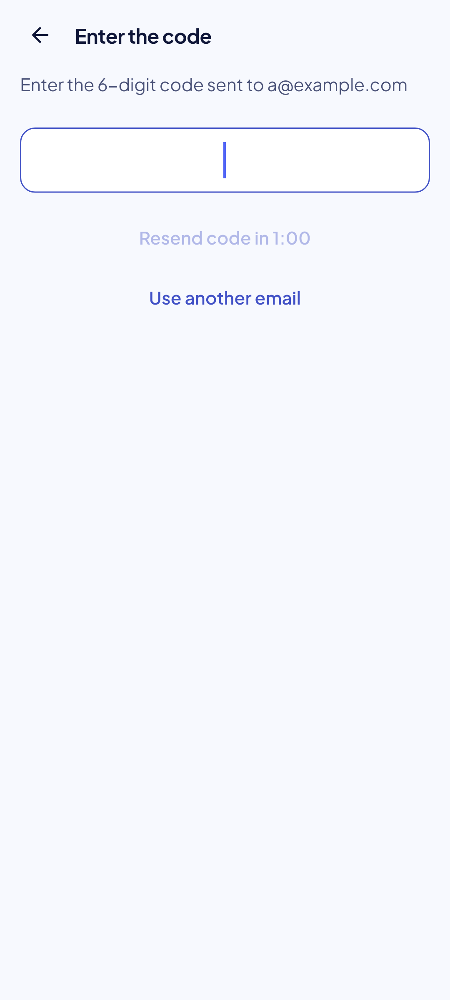
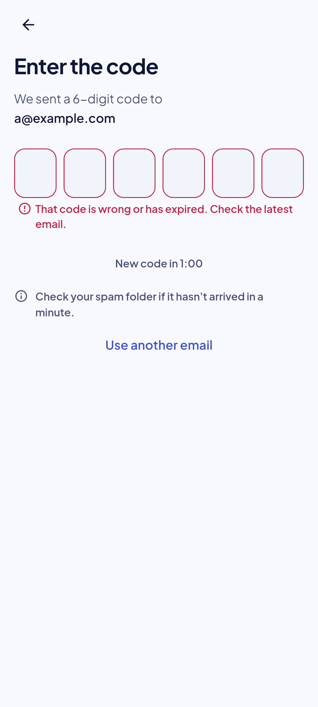

<!-- Hand-written screen record. -->

# 31 · Code

The six digits sent to the address. SB-A2; spec
[2026-09-30-account-ui-design.md](../../../superpowers/specs/2026-09-30-account-ui-design.md)
§5.2, §6.

## Entry points

- Screen 30, "Send code". Route `/settings/sign-in/code?mode=link&email=…`, on the root
  navigator; Back and "Use another email" return to 30.
- The transition layer's target sign-in, on the layer's own navigator.

## Layout

| Region | Widget | Design |
|---|---|---|
| App bar | `MxAppBar` (content) + back | Back only, no title. |
| Title | `screenTitle`, header semantics | "Enter the code". |
| Lead | `emptyBody` | "We sent a 6-digit code to", then the email on its own line in the same style at `on-surface` ink, weight 600 (`emptyBodyStrong`), so a typo shows. |
| Code | `MxTextField` (code), `section` (24) under the lead | Six slots over one hidden field (DESIGN.md Inputs): numeric keyboard, one-time-code autofill, TalkBack "Code, 6 digits". Autofocused when the screen opens. Six digits check at once. A wrong code clears the field (plan ruling 11). |
| Status line | 48 dp minimum, `grouped` (12) under the field | While waiting: "New code in 0:42" as a caption in `on-surface-variant` (no button). When the wait ends: "Resend code" (text button), which toasts "A new code is on its way." and starts the wait again; the button spins while resending. While verifying: `MxSpinner` in this line, so nothing below moves. In a re-auth to another account with changes unsent, the resend first asks in screen 30's loss dialog (an even pair, layout balance L2); Cancel sends nothing (P3b minor M7). |
| Hint | `MxNote.hint` | "Not there yet? Check your spam folder." |
| Another email | `MxButton` (text) | "Use another email". |

No footer: the code verifies on its sixth digit, so there is no commit action.

A right code attaches the account, toasts "Signed in as {email}" and closes the flow on
Settings. While `me()` has not confirmed it yet the toast reads "Signed in"; while the
account moves, such as a re-auth switch that stopped on the way, there is none and the layer
says what happened (P3b minor M2).

## States

The images are the goldens.

| State | Golden (light) | Golden (dark) | App |
|---|---|---|---|
| waiting |  |  | Golden `code_waiting_*`. |
| wrong |  |  | Golden `code_wrong_*`. |
| verifying | — | — | The field read-only, the digits at full ink; `MxSpinner` in the status line. |

## Rulings

- **R3:** "wrong or expired" is one state: GoTrue answers both alike.
- **P3a plan ruling 11:** a wrong code clears the field.
- **Sign-in redesign 2026-10-05 (spec `2026-10-05-sign-in-flow-redesign-design.md`, S1–S10):** the title and the address move into the body; the code is six drawn slots (S5); the wait is a caption in a 48 dp status line instead of a disabled button, and the wrong-code error no longer says to send a new code while the wait runs; a spam hint is added. Batch A (same day): a wrong code keeps the 2 dp next-slot cue in `error`; the code is read-only, not disabled, while it is checked; the spam hint reads "Not there yet? Check your spam folder."; the title names the route for TalkBack.

## Copy

- "Enter the code" · "We sent a 6-digit code to" (then the address) · "Code, 6 digits".
- "That code is wrong or has expired. Check the latest email."
- "New code in {m:ss}" · "Resend code" · "A new code is on its way." · "Use another email".
- "Not there yet? Check your spam folder."
