<!-- Hand-written screen record. -->

# 32 · Account

The account this phone's data belongs to, and what can be done with it: switch, sign out,
delete. FE-B10, SB-A5; spec
[2026-09-30-account-ui-design.md](../../../superpowers/specs/2026-09-30-account-ui-design.md)
§5.6, §9, §9.1.

## Entry points

- Screen 23, the Account section's row once the device holds an account (its chevron).
  Route `/settings/account`, on the root navigator; Back returns to 23.
- The link flow (29, 30, 31) ends here (B9).
- On a plainly anonymous device the route redirects to 23; during a transition it stays
  (P3b plan ruling 4). A finished sign-out, deletion or continue-without lands on 23
  (P3b plan ruling 5).

## Layout

| Region | Widget | Design |
|---|---|---|
| App bar | `MxAppBar` (content) + back | "Account". |
| Re-auth banner | `MxInlineBanner` (warning) | Only in `ReauthRequired`: "Your sign-in expired. Your decks are still on this phone." · "Sign in" (compact primary) → 30 `reauth`, back to 32. |
| Connection note | `MxNote` | Only in `Validating`: "Managing your account needs a connection. Your decks are safe on this phone." |
| Account | `MxSection` "ACCOUNT" + `MxSettingsRow` | The person tile, the email (wraps, P3b plan ruling 2), "Signed in with Google" / "with email" / "with Google and email" from the session's identities (B1). Not tappable. |
| This phone | `MxSection` "THIS PHONE" | "Switch account" · "Move this phone to another account"; "Sign out" · "Removes this phone's data · sign in again to get it back" (critique 2026-10-02). |
| Delete | `MxSection` "DELETE" | "Delete account" · "Your account and its data, for good". A neutral row; the danger colour is only the dialog's confirm (B12). |

The three command rows are disabled before `Ready` (auth spec #39 needs a confirmed
account). One command runs at a time: a tap while one asks or runs is ignored, so no second
dialog opens (P3b minor M3). Every command asks first, in the Reset dialog's form (§9.1, P3b plan ruling 6);
the transition layer shows what follows.

| Dialog | Design |
|---|---|
| Switch | "Switch account?" · "This phone's data is replaced by the other account's after your changes are sent." · shield note "Your changes are sent first." · Cancel · "Switch" (primary; the title names the account, DEV-179). Then `beginSwitch(discard)`; the layer's target sign-in (R1). |
| Sign out | Online, or nothing unsent: "Sign out?" · "Your changes are sent first, then this phone's data is removed. Sign in again to get it back." · "Sign out" (warning, critique 2026-10-02). Offline with n unsent: "Sign out and lose changes?" · "{n} changes aren't sent yet and will be lost." · "Sign out" (destructive), `discardUnsent` (B4). The network is read once as the dialog opens (B2). |
| Delete | "Delete your account?" · "Your account and its decks, cards and progress are deleted from the server, and this phone's data is removed. This can't be undone." · "Delete" (destructive, no icon; the title already names the account, so the confirm is the verb alone and shares the row 1 : 1 with Cancel, owner 2026-10-06, DEV-179). Offline: note "Deleting your account needs a connection." and the confirm disabled (B6). |
| Last admin | "An admin must remain" · "Give another person the admin role first, then delete the account." · OK. Opened by the app root on a refused deletion (B7, P3b plan ruling 7). |

A command refused before anything changed toasts "No connection. Nothing changed; try again
when you're online." or "Couldn't finish that. Nothing changed; try again."

## States

The images are the goldens.

| State | Golden (light) | Golden (dark) | App |
|---|---|---|---|
| ready | 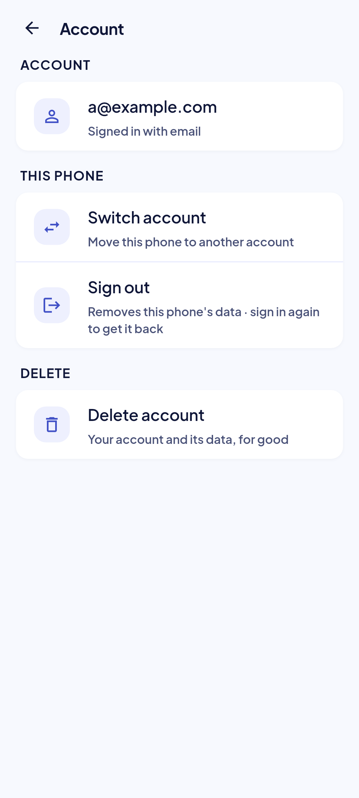 | 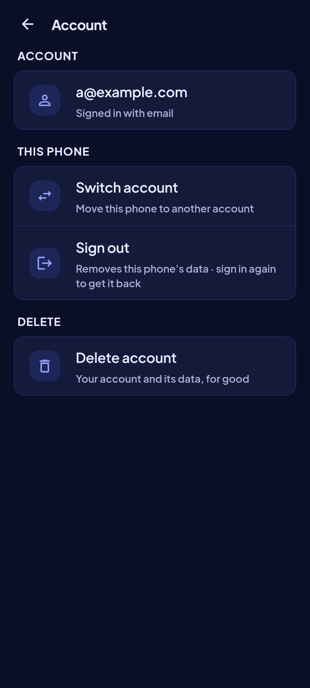 |  Golden `account_ready_*`. |
| validating | 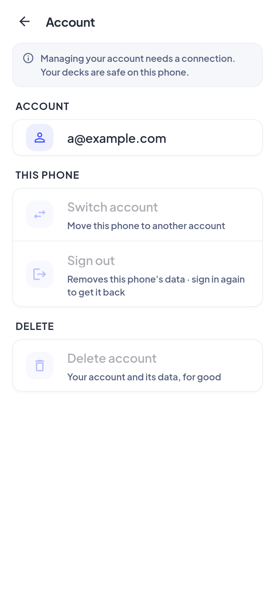 | 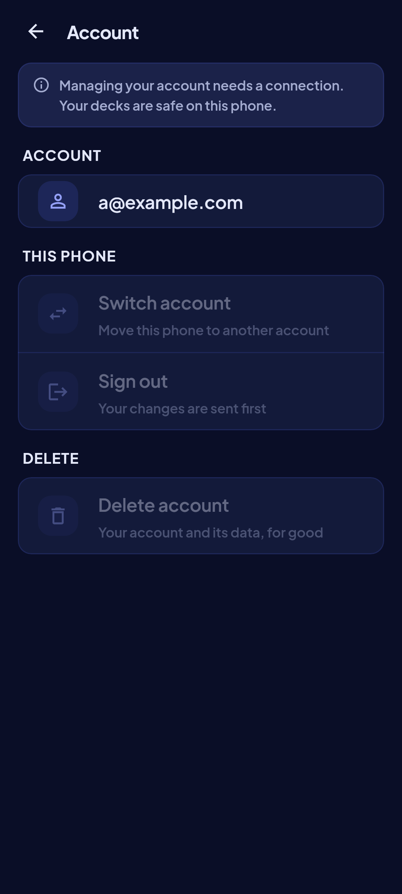 | The commands wait for a connection (B3). Golden `account_validating_*`. |
| reauth | 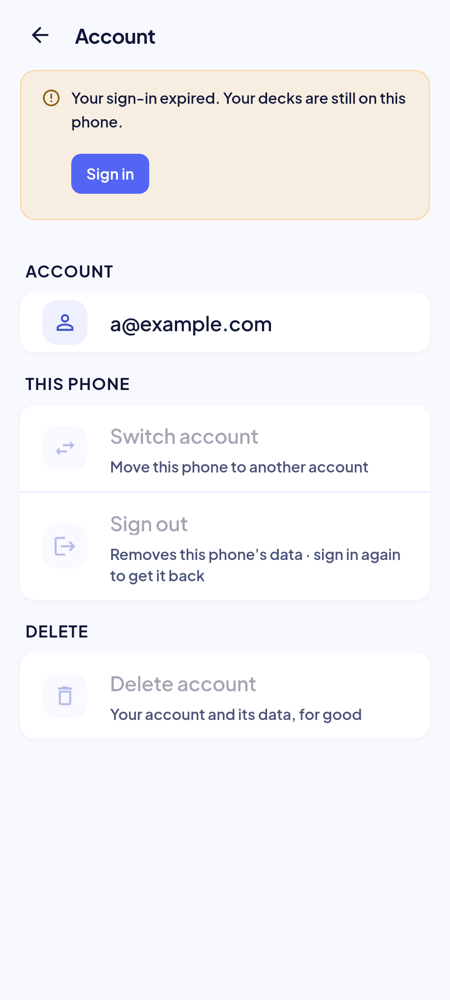 | 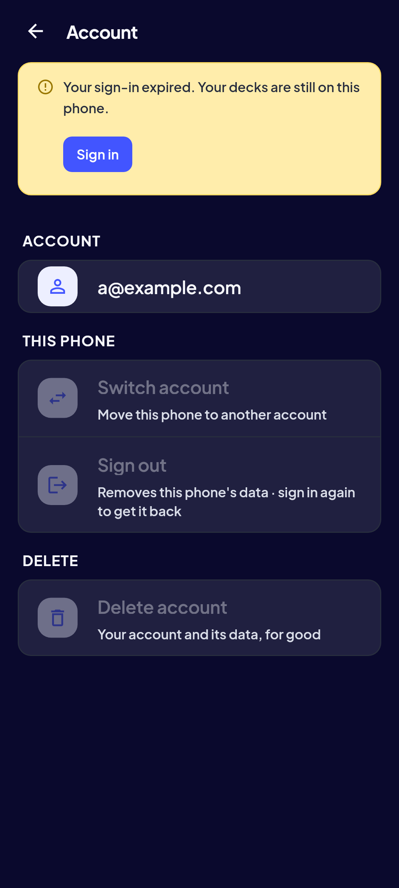 | The banner; the commands wait (B3). No method line: the refused session names none. Golden `account_reauth_*`. |
| switch dialog | 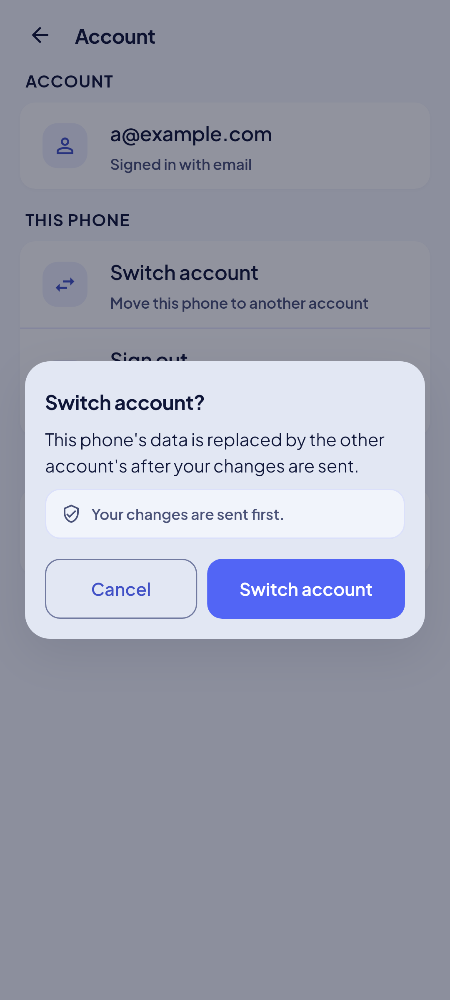 | 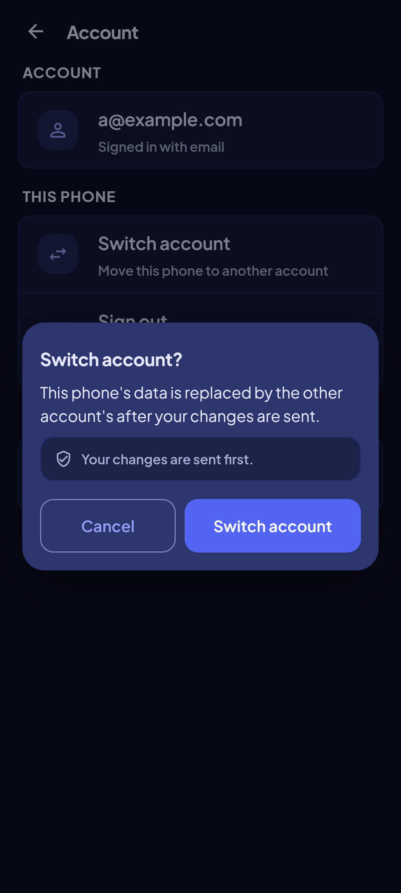 |  Golden `account_switch_confirm_*`. |
| sign-out dialog | 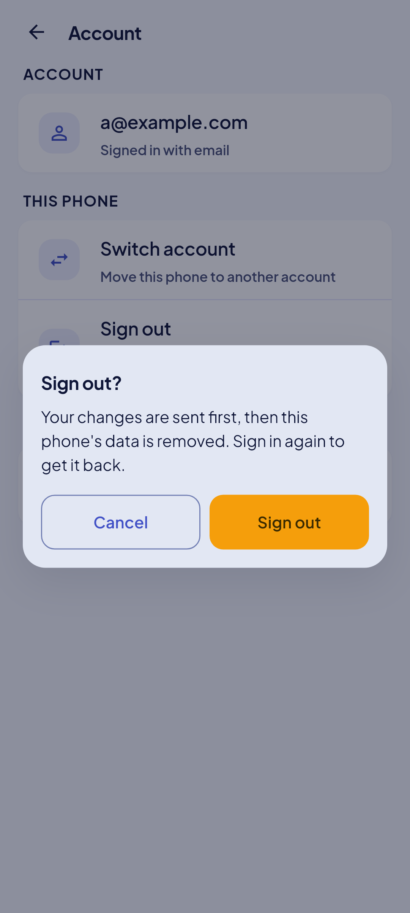 | 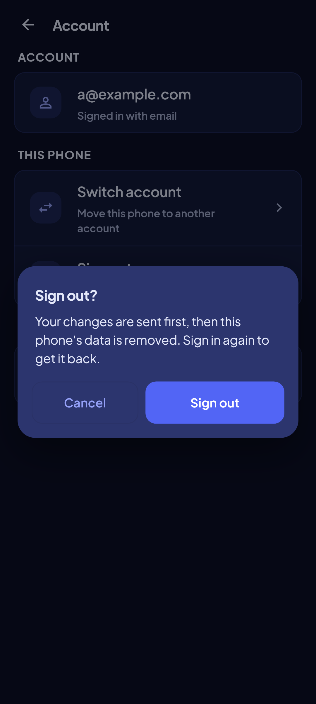 | Online, or nothing unsent. Golden `account_sign_out_confirm_*`. |
| sign-out, loss | 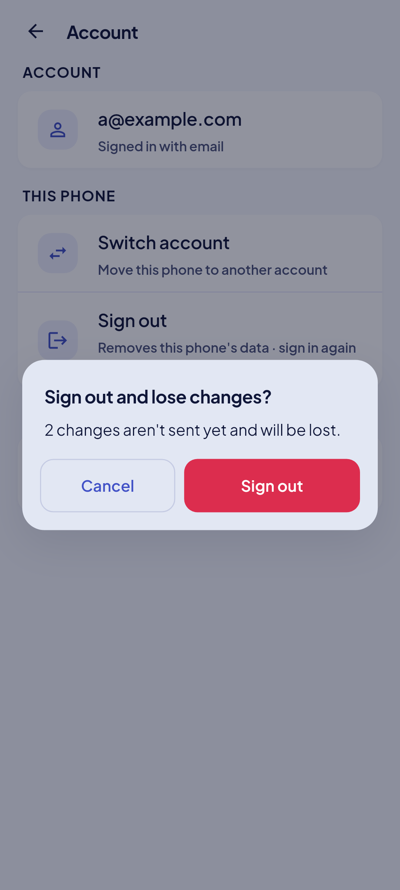 | 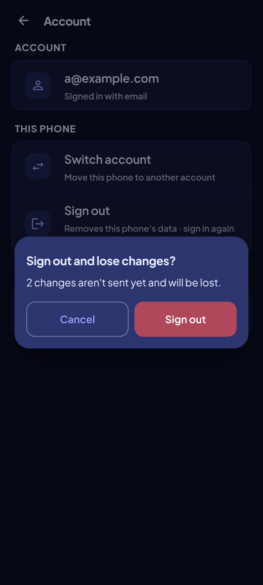 | Offline with changes unsent (B4). Golden `account_sign_out_loss_*`. |
| delete dialog | 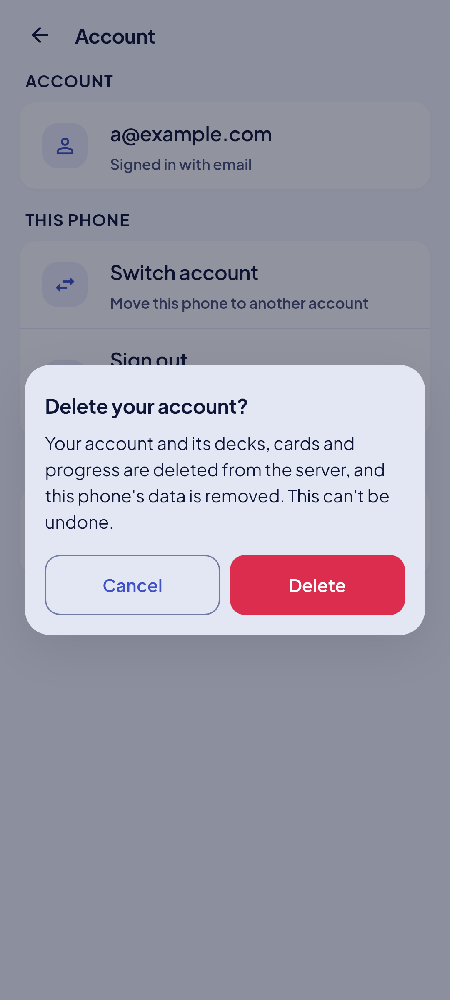 | 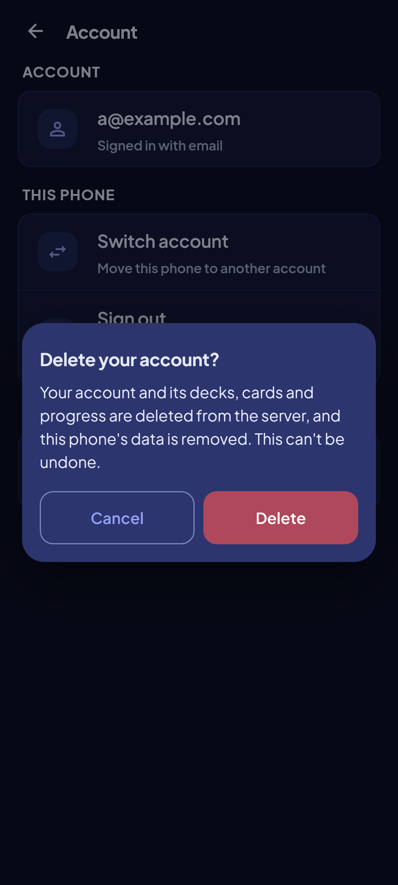 |  Golden `account_delete_confirm_*`. |
| delete, offline | 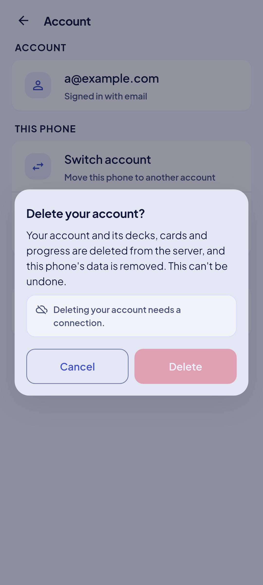 | 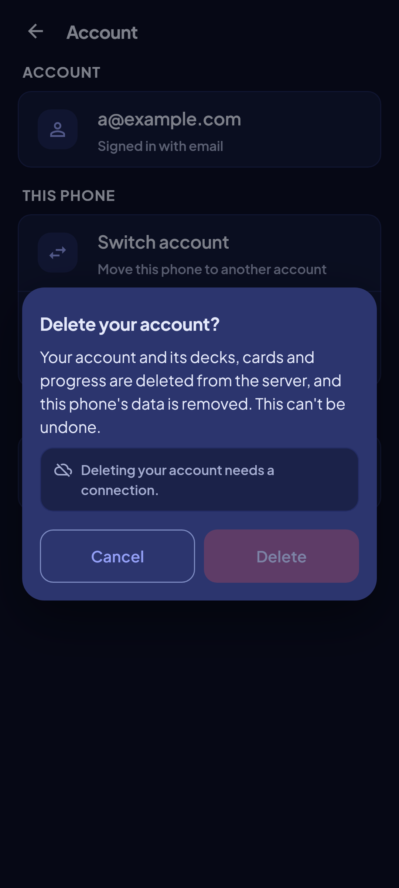 | The confirm disabled (B6). Golden `account_delete_offline_*`. |
| last admin | 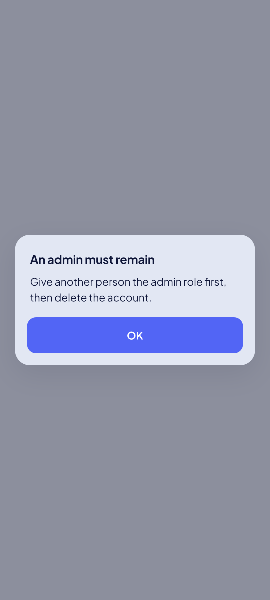 | 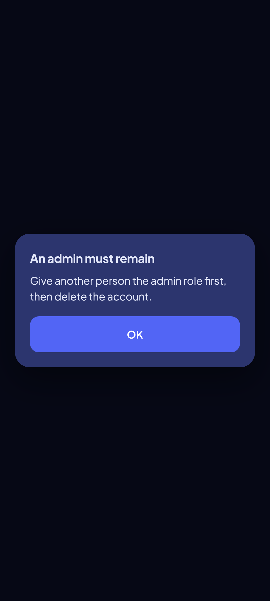 | A refused deletion (B7). Golden `account_last_admin_*`. |

## Rulings

- **B1–B4, B6, B7, B12** (spec §9): the method from the session; one network status; the
  commands wait before `Ready`; the sign-out's loss named offline; delete online only; the
  last admin a dialog; the delete row neutral.
- **P3b plan rulings 1, 2, 4–7, 9:** the banner above the section; the email wraps; the
  redirect reads the coordinator; finished flows land on 23; one confirm dialog; the
  last-admin dialog on the router's navigator; two new icons (`switchAccount`, `signOut`).
- **Critique 2026-10-02 (spec `2026-10-02-critique2-fixes-design.md`):** Switch account, Sign out and Delete account are action rows (no chevron); Sign out's hint reads "Removes this phone's data · sign in again to get it back"; its online confirm is warning, the offline loss confirm destructive (F3).

## Copy

- "Account" · "ACCOUNT" · "THIS PHONE" · "DELETE".
- "Signed in with Google" · "Signed in with email" · "Signed in with Google and email".
- "Switch account" · "Move this phone to another account" · "Sign out" · "Your changes are
  sent first" · "Delete account" · "Your account and its data, for good".
- The dialogs' copy is in the table above.
