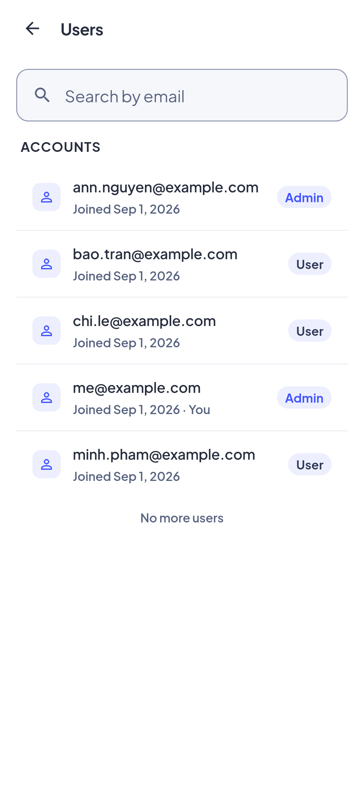
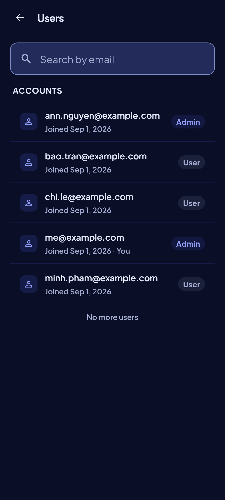
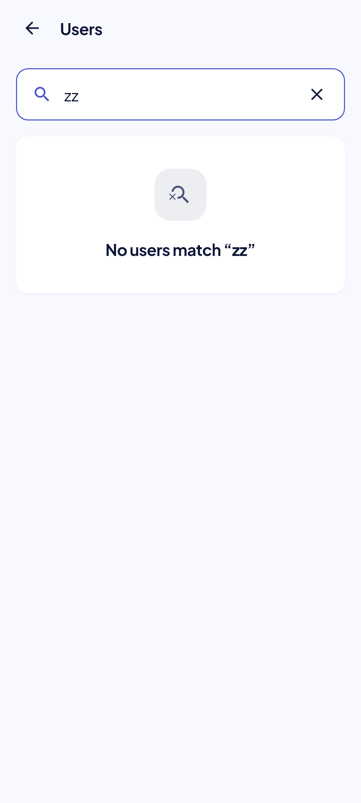
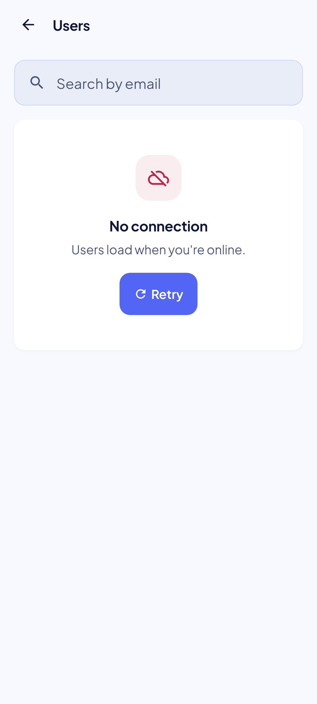
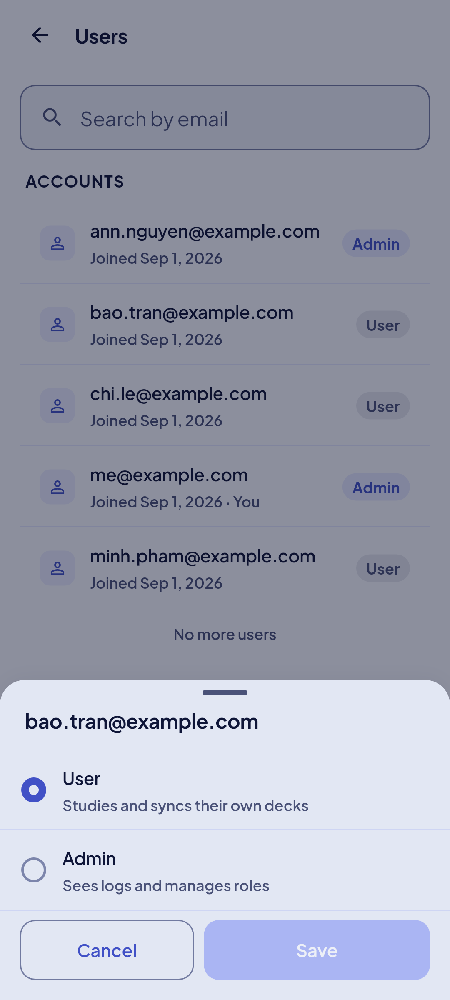
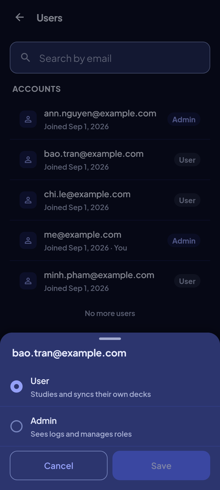
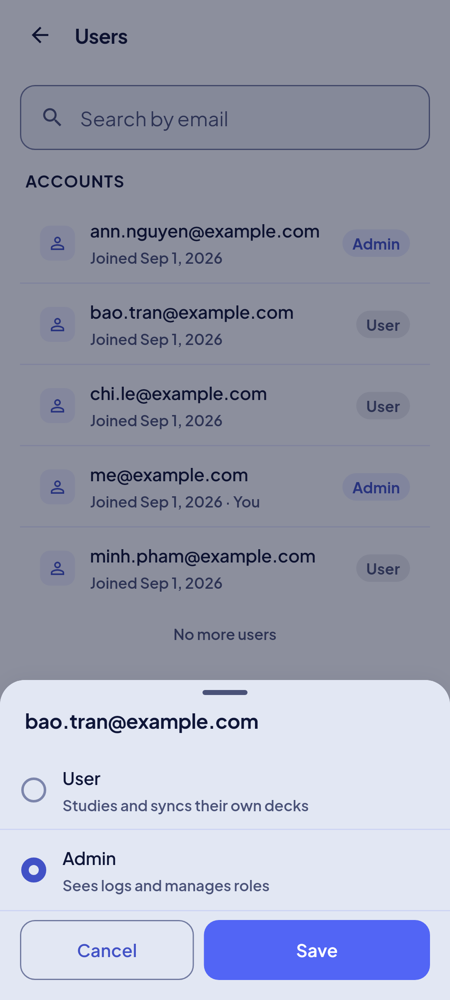
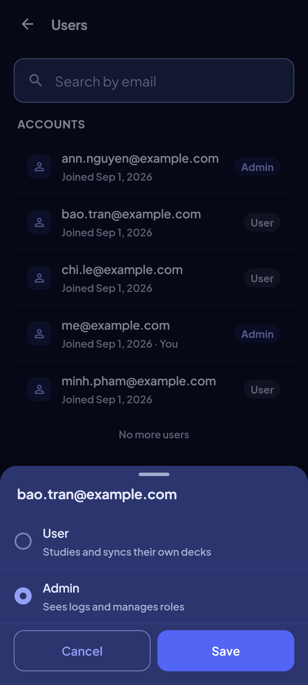

<!-- Hand-written screen record. -->

# 33 · Users (admin)

An admin finds any signed-in account by email and makes it an admin or a user. FE-B11;
auth spec O9; spec
[2026-09-30-users-admin-design.md](../../../superpowers/specs/2026-09-30-users-admin-design.md).

## Entry points

- Screen 23, Admin section, row "Users" · "Who can manage the app" (shown only to an admin).
  Route `/settings/users`, on the root navigator; Back returns to 23.
- A deep link meets the admin gate: a non-admin sees "Only an admin can see this" under
  the app bar "Users" (P4 plan ruling 2).

## Layout

| Region | Widget | Design |
|---|---|---|
| App bar | `MxAppBar` (content) + back | "Users". |
| Search | `MxSearchField` | "Search by email"; asks 400 ms after the last keystroke; hidden on the not-admin state. |
| Overline | `MxListSectionHeader` | "ACCOUNTS" (no count: `role_list` has no total). |
| Rows | `MxListRow` | Person tile (tinted, the same for all), the email, "Joined {date}" (locale medium date), `MxBadge` "Admin" (primary) or "User" (neutral); no chevron. The admin's own row reads "Joined {date} · You" and does not tap (U1); not dimmed. |
| End | as screen 28 | The next page loads near the end; "No more users"; a failed page is a danger `MxInlineBanner` with Retry. |

**Role sheet** (`MxBottomSheet`, the merge sheet's form): the email as title; `MxOptionRow`s
"User" · "Studies and syncs their own decks" and "Admin" · "Sees logs and manages roles", the
current role selected; Cancel · "Save" (primary), enabled only when the choice differs and
spinning while it runs.

| Outcome | Shows |
|---|---|
| saved | the sheet closes, the badge changes in place, toast "{email} is now an admin" / "… a user" |
| last admin | the sheet stays, toast "An admin must remain. Make someone else an admin first." |
| anonymous | toast "This account isn't signed in with an email or Google." |
| gone | the sheet closes, toast "That account no longer exists.", the list reloads |
| not an admin | the sheet closes, the screen shows the not-admin state |
| offline / other | the sheet stays, toast "No connection. Nothing changed." / "Couldn't change the role. Nothing changed." |

## States

The images are the goldens.

| State | Golden (light) | Golden (dark) | App |
|---|---|---|---|
| loaded |  |  | Five accounts, the admin's own row with You. Golden `users_loaded_*`. |
| no match |  |  |  Golden `users_empty_search_*`. |
| offline |  |  |  Golden `users_offline_*`. |
| role sheet |  |  | The current role selected; Save disabled. Golden `users_role_sheet_*`. |
| role sheet, changed |  |  | Admin chosen; Save enabled. Golden `users_role_sheet_changed_*`. |
| loading | — | — | `MxSkeletonList`. |
| no accounts | — | — | "No accounts yet". |
| error | — | — | "Couldn't load users" + Retry. |
| not an admin | — | — | the lock empty state, no search. |

## Rulings

- **U1–U5** (spec §1): the own row is read-only; Settings owns the Admin section; the slice
  lives in `features/account`; the data source follows Monitoring's; the route sits behind
  the admin gate.
- **Spec §6 (shape):** screen 28 is the pattern: pages load at the end of the scroll, no
  "Load more" button; the role lives in the badge alone.
- **P4 plan rulings 1–6:** errors through core's `classifyAuthError`; the gate takes a
  title; dates with `DateFormat.yMMMd`; the sheet runs the change; `isAdminProvider` gates
  the Admin section; the `users` icon.

## Copy

- "Users" · "Search by email" · "ACCOUNTS" · "Joined {date}" · "Joined {date} · You" · "Admin" ·
  "User" · "No more users" · "No users match “{query}”" · "No accounts yet".
- The sheet's and the toasts' copy is in the tables above.
